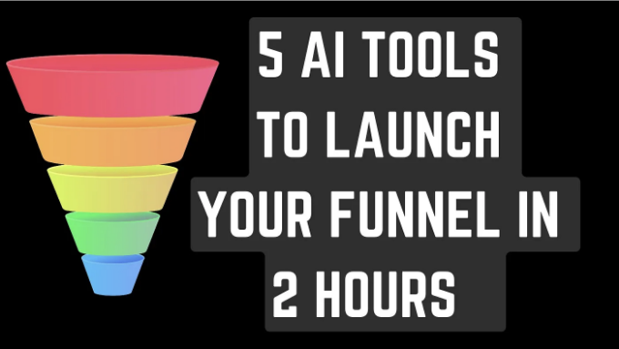
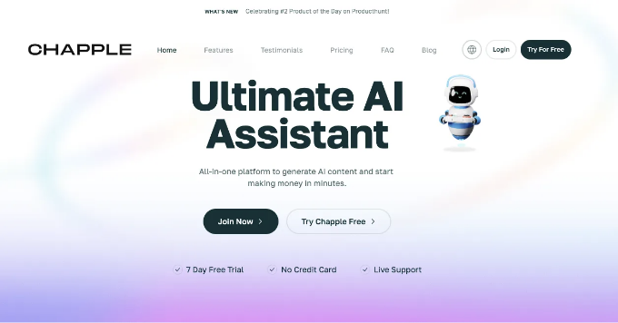
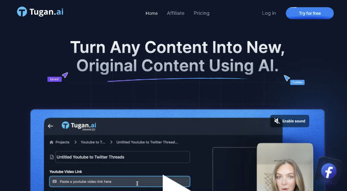
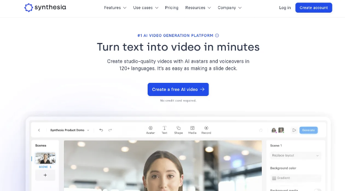

# AI로 서비스를 만든다면 반드시 알아야하는 AI도구 5가지

::: tip 💡이 포스팅을 읽으면

:::

대부분의 마케팅 에이전시들은 이 글을 싫어할 것입니다.

하지만, 이 5가지 AI 도구를 사용하여 2시간 만에 당신의 퍼널을 시작할 수 있습니다.

안녕하세요, 여러분! 여러분의 수익 창출 코치인 Kanika입니다. 오늘은 비즈니스 내에서 AI를 어떻게 조정할 수 있는지 알려드리고 매일 몇 시간을 절약할 수 있는 방법을 가르쳐드릴 거에요.

여전히 많은 사람들이 판매 퍼널이 무엇인지조차 모른다고 느끼는데, 그래서 이 글을 자세히 쓰기로 생각했습니다. 이 글을 읽으면 신입생이라도 어떤 가치를 얻을 수 있을 것입니다!

<!-- ui-log 수평형 -->

<ins class="adsbygoogle"
     style="display:block"
     data-ad-client="ca-pub-4877378276818686"
     data-ad-slot="9743150776"
     data-ad-format="auto"
     data-full-width-responsive="true"></ins>
<component is="script">
(adsbygoogle = window.adsbygoogle || []).push({});
</component>

## 먼저, 판매 퍼널이란 무엇일까요?

판매 퍼널은 마케팅과 판매에서의 기본 개념이지만 종종 오해를 받습니다.

간단히 말해서, 이것은 고객 여정의 시각적 표현입니다. 제품이나 서비스에 대한 초기 인식부터 충성 고객이 되기까지의 과정을 말합니다.

이것을 실제 퍼널처럼 생각해보세요. 맨 위에는 당신이 제공하는 것에 관심이 있을지도 모를 모든 잠재 고객이 있습니다.

퍼널을 통과하면서, 그들은 자격이 부여되고 육성되며, 결국 가장 자격이 있는 리드만이 매출 고객으로 나타납니다.

## 그러나 왜 판매 퍼널이 이렇게 중요한가요?

<!-- ui-log 수평형 -->

<ins class="adsbygoogle"
     style="display:block"
     data-ad-client="ca-pub-4877378276818686"
     data-ad-slot="9743150776"
     data-ad-format="auto"
     data-full-width-responsive="true"></ins>
<component is="script">
(adsbygoogle = window.adsbygoogle || []).push({});
</component>

이것은 리드를 고객으로 변환하는 방법에 대한 명확한 로드맵을 제공합니다. 기본적으로 고객의 여정을 보여주는 것입니다.

그것은 많은 이점도 가지고 있습니다:

- 퍼널의 각 단계에서 가장 효과적인 채널과 전술에 마케팅 노력을 집중할 수 있습니다.
- 퍼널의 각 단계에 메시지와 콘텐츠를 맞춤화하여 잠재 고객에게 더 관련성 있고 가치 있는 경험을 제공할 수 있습니다.
- 퍼널에서 리드가 이탈하는 지점을 이해함으로써 누수를 식별하고 수정할 수 있으며, 결국 더 많은 매출로 이어집니다.

이외에도 많은 이점이 있지만, 이것은 내 비즈니스에서 작동한 것입니다.

판매 퍼널은 또한 5단계로 이루어져 있습니다 — 인식, 관심, 욕망, 행동 및 충성.

각 단계로 하나씩 들어가서 이 AI 도구가 시간을 절약하는 데 어떻게 도움이 되는지 살펴보겠습니다.

## 단계 1 — 인식

<!-- ui-log 수평형 -->

<ins class="adsbygoogle"
     style="display:block"
     data-ad-client="ca-pub-4877378276818686"
     data-ad-slot="9743150776"
     data-ad-format="auto"
     data-full-width-responsive="true"></ins>
<component is="script">
(adsbygoogle = window.adsbygoogle || []).push({});
</component>

"인식 단계"는 좋은 책의 첫 번째 장과 같습니다 — 이 단계는 잠재 고객의 마주치기와 주요 인물을 소개합니다 (이 경우, 당신의 브랜드와 잠재 고객입니다).

당신의 브랜드와 무엇을 제공하는지에 대해 사람들이 처음으로 인식하게 되는 중요한 단계입니다.

모든 사람의 관심을 끌기 전에 누구를 달래려고 하는지 이해해야 합니다.

당신의 이상적인 고객은 누구인가요?

그들이 가진 문제는 무엇인가요?

그들을 흥분시키는 것은 무엇인가요?

당신의 대상 고객을 알아야만 메시지를 공감시킬 수 있습니다.

빈 공원에 레몬에이드 스탠드를 세우는 것을 상상해보세요.

아무도 당신이 존재하지 않는다면 당신의 레몬에이드를 사지 않을 것입니다!

SEO, 소셜 미디어 플랫폼 및 홍보를 활용하여 브랜드를 알려주세요. 관련 대화에 참여하고 다른 비즈니스와 협력하며 대상 고객이 온라인 및 오프라인에서 쉽게 당신을 찾을 수 있도록 하세요.

아이디어 — 제품에 대한

콘텐츠 만들기

<!-- ui-log 수평형 -->

<ins class="adsbygoogle"
     style="display:block"
     data-ad-client="ca-pub-4877378276818686"
     data-ad-slot="9743150776"
     data-ad-format="auto"
     data-full-width-responsive="true"></ins>
<component is="script">
(adsbygoogle = window.adsbygoogle || []).push({});
</component>

## 도구 —

Chapple AI — 콘텐츠 작성

링크- http://chapple.ai — AI 콘텐츠를 생성하기 위한 올인원 플랫폼

## 단계 2 — 관심

관심 단계는 잠재 고객이 수동적인 지나가는 사람에서 관심 있는 관전자로 전환되는 단계입니다. 그들은 인식 단계에서 당신의 브랜드의 매력적인 빛을 알아차렸고 이제 더 많은 정보를 알고 싶어합니다.

가치 있는 콘텐츠가 중요하지만, 사람들은 연결을 원합니다. 정보를 단순히 방송하는 것 이상의 것을 제공하세요. 댓글 섹션에서 대화를 시작하고 문의 사항에 신속하게 답변하며 개인적인 추천을 제공하세요. 이러한 인간적인 접촉은 신뢰를 증진시키고 그들이 가치를 느끼게 만듭니다. 그들은 단지 당신의 퍼널 안의 다른 번호가 아니라 가치를 느끼게 합니다.

내 아이디어 — 뉴스레터로 트래픽 유도하기

뉴스레터 생성 도구 — Tugan AI

링크 — https://tugan.ai/?via=kanika

(이것은 제 이익 링크입니다. 당신에게 비용은 들지 않지만 제 목표 달성에 도움이 될 수 있습니다)

매력적인 뉴스레터 생성.

보너스 — TUGAN AI를 시작하는 방법에 대한 무료 단계별 자습서가 여기 있습니다.

<!-- ui-log 수평형 -->

<ins class="adsbygoogle"
     style="display:block"
     data-ad-client="ca-pub-4877378276818686"
     data-ad-slot="9743150776"
     data-ad-format="auto"
     data-full-width-responsive="true"></ins>
<component is="script">
(adsbygoogle = window.adsbygoogle || []).push({});
</component>

## 단계 3 — 욕망

이 단계에서 개인들은 당신의 브랜드를 인식했을 뿐만 아니라 그것을 그들의 욕망을 해결할 수 있는 잠재적인 열쇠로 인식했습니다.

그들은 당신의 제공을 경쟁 상대와 비교하고 장단점을 고려하여 그들의 욕망을 향한 강한 끌림을 느낍니다. 당신의 일은 이 욕망의 불을 더 크게 지원하는 것입니다.

이 단계에서 약간의 추가적인 밀어붙임은 모든 차이를 만들 수 있습니다. 그들의 욕망에 불을 더 붙이는 리드 매그넷을 제공하세요. 제품이나 서비스에만 중점을 두는 것이 아니라 매력적이고 가치 있는 제안을 만드는 것이 중요합니다.

아이디어 — 리드 매그넷을 배포하기 시작하십시오,

예를 들어 ebook

AI 도구 — Designrr

링크 — https://app.designrr.io

## 단계 4 — 행동

아이디어 — 일관된 이메일 및 회의로 관계 구축하기

AI 도구 — Scheduler AI

링크 — http://scheduler.ai

## 단계 5 — 충성

<!-- ui-log 수평형 -->

<ins class="adsbygoogle"
     style="display:block"
     data-ad-client="ca-pub-4877378276818686"
     data-ad-slot="9743150776"
     data-ad-format="auto"
     data-full-width-responsive="true"></ins>
<component is="script">
(adsbygoogle = window.adsbygoogle || []).push({});
</component>

주요 관심은 새로운 고객을 확보하는 것에서 기존 고객을 유지하고 육성하는 것으로 전환됩니다.

그들을 시트에 있는 숫자가 아닌 소중한 파트너로 취급하세요. 커뮤니케이션을 개인화하고 독점적인 혜택을 제공하고 의미있는 대화에 참여하세요.

그들에게 당신이 그들의 비즈니스에 신경을 쓰는 것뿐만 아니라 그들의 충성을 진심으로 감사하게 생각한다는 것을 보여주세요.

아이디어 — 제품별 비디오를 만들어 고객을 계속해서 유지하세요

도구 — Synthesia AI

