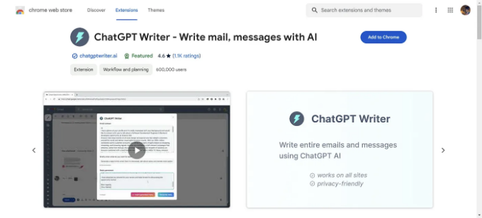

# 당신의 작업속도를 대폭 줄여줄 AI기반 크롬 확장프로그램 10가지

크롬 확장프로그램은 당신의 업무를 효율적으로 처리하는 데 큰 도움이 될 수 있습니다. 특히 AI 기술을 활용한 확장프로그램은 작업 흐름을 최적화하고 생산성을 향상시킬 수 있습니다. 아래에는 당신의 작업속도를 대폭 줄여줄 10가지 AI 기반 크롬 확장프로그램을 소개합니다.

<!-- ui-log 수평형 -->

<ins class="adsbygoogle"
     style="display:block"
     data-ad-client="ca-pub-4877378276818686"
     data-ad-slot="9743150776"
     data-ad-format="auto"
     data-full-width-responsive="true"></ins>
<component is="script">
(adsbygoogle = window.adsbygoogle || []).push({});
</component>

1. **AIPRM For ChatGPT**

   - AIPRM은 ChatGPT를 위한 치트 코드입니다. 채팅GPT에 특별한 프롬프트 템플릿과 고급 기능을 추가합니다.
   - 기능:
     - 팀: 비즈니스 내 모든 사람들과 프롬프트 리스트를 공유합니다. 일관된 ChatGPT 출력은 이메일 이후 가장 중요한 마케팅 기술을 사용할 때 전문적인 사용을 돕습니다.
     - 사용자 정의 프로필: 팀 내에서 자체 회사의 정보를 ChatGPT 출력에 삽입하는 사용자 정의 프로필로 시간을 절약하세요.
     - 고급 프롬프트 검색: 주제, 활동, 사용 방법, 인기도 및 개방 검색을 포함한 다양한 필터를 통해 필요한 프롬프트를 정확하게 찾으세요.
     - 프롬프트 변수: 여러 가지 사용 사례에 대한 더 넓은 범위의 사용을 위해 사용자 정의 프롬프트를 디자인하고 여러 변수를 추가하세요.
     - AIPRM 어디서나: 인터넷에서 연구 자료를 직접 AIPRM과 ChatGPT에 삽입하세요.
     - 커뮤니티 지원: 다른 전문 프롬프트 엔지니어 및 AIPRM 직원들의 지원을 받을 수 있는 무료 커뮤니티 포럼에 무료로 액세스하세요.
     - Omnibox: 브라우저 검색 창에 AIPRM과 프롬프트를 직접 입력하여 웹 사이트와 ChatGPT 간을 이동하는 시간을 절약하세요.
   - 링크: [AIPRM For ChatGPT 다운로드](https://chromewebstore.google.com/detail/aiprm-for-chatgpt/ojnbohmppadfgpejeebfnmnknjdlckgj)

2. **WebChatGPT**

   - 이 확장프로그램은 ChatGPT에 대한 관련 웹 결과를 추가하여 더 정확하고 최신의 대화를 할 수 있도록 돕습니다.
   - 기능:
     - 웹 액세스: 쿼리에 대한 웹 결과를 받습니다.
     - 웹 사이트 텍스트 추출: 모든 URL에서 웹 페이지 텍스트를 추출합니다.
     - 원클릭 프롬프트: 원클릭으로 ChatGPT 프롬프트 라이브러리에 액세스합니다.
     - AI 기반 검색: AI 기반 검색 답변을 검색 결과 옆에 바로 받습니다.
     - 인기 있는 검색 플랫폼과 호환됩니다.
   - 링크: [WebChatGPT 다운로드](https://chromewebstore.google.com/detail/webchatgpt-chatgpt-with-i/lpfemeioodjbpieminkklglpmhlngfcn)

<!-- ui-log 수평형 -->

<ins class="adsbygoogle"
     style="display:block"
     data-ad-client="ca-pub-4877378276818686"
     data-ad-slot="9743150776"
     data-ad-format="auto"
     data-full-width-responsive="true"></ins>
<component is="script">
(adsbygoogle = window.adsbygoogle || []).push({});
</component>

3. **Merlin**

   - GPT-4로 구동되는 All-in-One AI 어시스턴트입니다.
   - 기능:
     - 요약: 블로그, YouTube 비디오, 연구 논문 및 웹 사이트의 요약을 받습니다.
     - AI 작가: 소셜 미디어, 이메일, 미술, 코드 등을 위한 콘텐츠를 생성합니다.
     - 플러그인: 최고의 AI 플러그인을 브라우저에 제공합니다.
   - 링크: [Merlin 다운로드](https://chromewebstore.google.com/detail/merlin-1-click-access-to/camppjleccjaphfdbohjdohecfnoikec)

4. **ChatGPT Writer**

   - ChatGPT AI를 사용하여 이메일, 메시지 등을 작성합니다. 모든 사이트에서 작동합니다.
   - 기능:
     - 이메일 및 메시지 작성: 완벽한 메시지를 쉽게 작성하세요.
     - 문법 수정: 오타와 문법 오류를 쉽게 제거하세요.
     - 다시 말하기: 텍스트를 더 명확하고 효과적으로 만듭니다.
     - 톤 조정: 문서의 분위기를 쉽게 조정하세요.
     - 요약: 긴 텍스트를 몇 초 만에 간결한 요약으로 바꿉니다.
   - 링크: [ChatGPT Writer 다운로드](https://chromewebstore.google.com/detail/chatgpt-writer-write-mail/pdnenlnelpdomajfejgapbdpmjkfpjkp)

5. **Compose AI**
   - AI를 사용하여 어떤 텍스트든 생성합니다. 문장을 입력하는 곳에서 자동으로 완성됩니다.
   - 기능:
     - 텍스트 생성: 어떤 텍스트든 생성할 수 있습니다.
     - 자동 완성: 탭을 눌러 자동 완성을 사용하세요.
     - Compose Now:

<!-- ui-log 수평형 -->

<ins class="adsbygoogle"
     style="display:block"
     data-ad-client="ca-pub-4877378276818686"
     data-ad-slot="9743150776"
     data-ad-format="auto"
     data-full-width-responsive="true"></ins>
<component is="script">
(adsbygoogle = window.adsbygoogle || []).push({});
</component>

메시지 작성을 위한 AI 어시스턴트입니다. - 전자 메일에 대한 자동 응답: 클릭 한 번으로 전자 메일에 응답하세요. - 다시 말하기: 텍스트를 다시 작성할 필요없이 문장의 어구를 바꿀 수 있습니다.

- 링크: [Compose AI 다운로드](https://chromewebstore.google.com/detail/compose-ai-ai-powered-wri/ddlbpiadoechcolndfeaonajmngmhblj)

6. **Perplexity**

   - ChatGPT와 Google의 조화로운 조합입니다.
   - 기능:
     - 즉시 페이지 요약: 한눈에 어떤 기사나 웹 페이지든 이해하세요.
     - 빠른 쿼리: 탭 간 이동이 필요 없이 직접 쿼리를 하세요.
     - 문맥 이해: 현재 페이지나 특정 도메인에 관련된 답변을 받으세요.
     - 공유 가능한 통찰: 클릭 가능한 링크로 발견한 정보를 쉽게 공유하세요.
     - 동적 대화: 더 깊은 이해를 위해 질문을 하세요.
   - 링크: [Perplexity 다운로드](https://chromewebstore.google.com/detail/perplexity-ai-companion/hlgbcneanomplepojfcnclggenpcoldo)

    

<!-- ui-log 수평형 -->

<ins class="adsbygoogle"
     style="display:block"
     data-ad-client="ca-pub-4877378276818686"
     data-ad-slot="9743150776"
     data-ad-format="auto"
     data-full-width-responsive="true"></ins>
<component is="script">
(adsbygoogle = window.adsbygoogle || []).push({});
</component>

7. **Copyleaks**

   - AI 콘텐츠 감지기 브라우저 확장프로그램으로 사람이 작성한 콘텐츠와 AI 챗봇이 작성한 콘텐츠를 구분합니다.
   - 기능:
     - 99.1% 정확도와 0.2% 오진률을 자랑합니다.
     - 여러 언어의 AI 콘텐츠를 감지합니다.
   - 링크: [Copyleaks 다운로드](https://chromewebstore.google.com/detail/ai-content-detector-copyl/gplcmncpklkdjiccbknjjkoidpgkcakd)

    

8. **Monica**

   - GPT-4로 구동되는 AI 동료입니다.
   - 기능:
     - AI와 대화하기: 다양한 LLM 모델과 대화합니다.
     - 다이얼로그 및 요약: PDF 및 이미지와 대화합니다.
     - 검색: 쿼리를 제출하고 다양한 키워드를 사용하여 답을 찾습니다.
   - 링크: [Monica 다운로드](https://chromewebstore.google.com/detail/monica-your-ai-copilot-po/ofpnmcalabcbjgholdjcjblkibolbppb)

<!-- ui-log 수평형 -->

<ins class="adsbygoogle"
     style="display:block"
     data-ad-client="ca-pub-4877378276818686"
     data-ad-slot="9743150776"
     data-ad-format="auto"
     data-full-width-responsive="true"></ins>
<component is="script">
(adsbygoogle = window.adsbygoogle || []).push({});
</component>

9. **Wiseone**

   - 온라인에서 읽는 데 최적화된 궁극적인 AI 도구입니다.
   - 기능:
     - 집중: 복잡한 개념과 단어를 이해합니다.
     - 검색: 다양한 출처의 기사와 비디오를 제공합니다.
     - 요약: 핵심 정보를 제공합니다.
   - 링크: [Wiseone 다운로드](https://chromewebstore.google.com/detail/wiseone-your-ai-powered-r/paodpkkacimmkacaecjmhdncjgjepcai)

    

10. **Engage AI**
    - ChatGPT를 사용하여 LinkedIn 코멘트를 작성합니다. 소셜 세일링을 확장하세요.
    - 기능:
      - 두 번째 뇌: 과거 코멘트를 기록하여 효율적으로 재활용합니다.
      - 고급 네트워킹 기능: 매력적인 코멘트를 작성합니다.
      - 스마트 응답 기능: 다양한 반응 톤을 제공합니다.
    - 링크: [Engage AI 다운로드](https://chromewebstore.google.com/detail/engage-ai-chatgpt-for-lin/nelhhkchoapcbpcgpmmiahfkcdhgecaf)

이제 이 확장프로그램을 사용하여 업무를 더 효율적으로 처리하세요!
