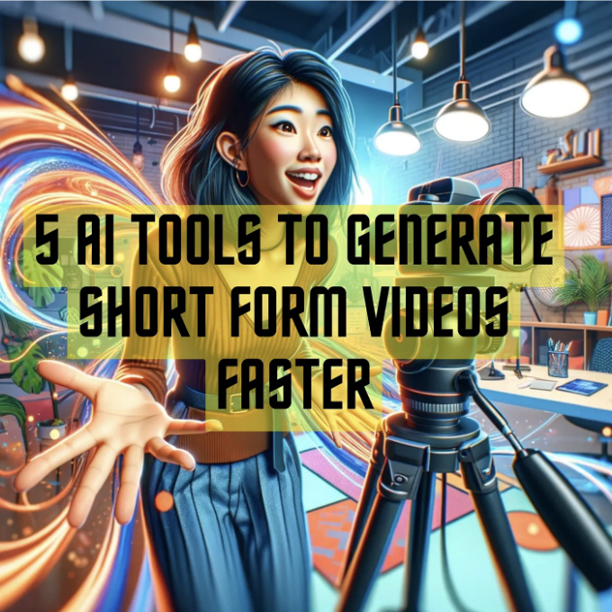
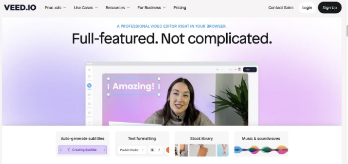
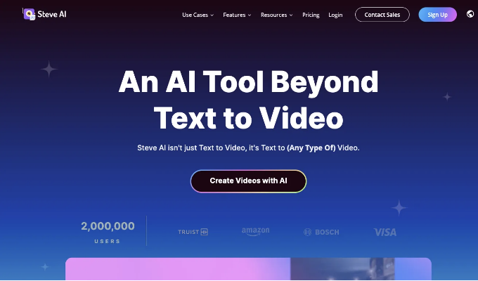

# AI 서비스 5가지로 5분만에 숏폼 비디오 만들기

안녕하세요, 여러분! 오늘은 여러분이 지금까지보다 더 빠르게 숏폼 비디오를 만들 수 있는 5가지 AI 도구를 공유하려고 해요.

## 먼저, 숏폼 비디오를 왜 해야할까?

우리는 모두 정보 과부화의 시대에 있으며, 주의 집중이 몇 초로 측정되고 콘텐츠가 왕이 되는 곳에서 짧은 형식의 비디오라는 새로운 이야기가 등장했다는 것을 알고 있습니다.

이런 작은 조각들로 이루어진 엔터테인먼트, 깨달음, 그리고 영감은 전 세계적으로 관객들을 매료시키며, 우리가 정보를 소비하는 방식, 브랜드와 관련되는 방식, 심지어는 문화를 형성하는 방식을 변화시킵니다.

숏폼 비디오는 전통적인 장형 콘텐츠에 매력적인 대안을 제공합니다.

그것들은 우리의 급박한 삶에 부합하여, 우리의 모바일 중심 세계에 매끄럽게 맞아 떨어지는 소화하기 쉬운 조각으로 인상적인 메시지를 전달합니다.

<!-- ui-log 수평형 -->

<ins class="adsbygoogle"
     style="display:block"
     data-ad-client="ca-pub-4877378276818686"
     data-ad-slot="9743150776"
     data-ad-format="auto"
     data-full-width-responsive="true"></ins>
<component is="script">
(adsbygoogle = window.adsbygoogle || []).push({});
</component>

우리가 자세히 이야기하고 싶어하는 플랫폼에 대해 이야기해봅시다.
소셜 미디어 플랫폼은 숏폼 비디오의 궁극적인 놀이터가 되었습니다.

섬세하게 조정된 알고리즘은 우리의 특정한 관심사를 고려하여 맞춤형 피드를 조성하여 우리가 계속 시청하게 만들며 관련성 있고 매력적인 콘텐츠를 계속해서 쏟아냅니다.

이 맞춤형 미러 컨텐츠의 토끼굴은 강력한 발견의 감각을 창출하며 계속해서 돌아오게 만듭니다.

숫자가 명료하게 이야기하듯, 여기 읽었고 공유하고 싶은 3가지 충격적인 통계가 있어요:

- 73%의 소비자가 제품 연구를 위해 숏폼 비디오를 선호합니다.
- 숏폼 비디오 광고 수익은 2024년에 200억 달러에 이를 것으로 추정됩니다.
- 숏폼 콘텐츠의 무피해 왕인 TikTok은 매월 10억 명이 넘는 활성 사용자를 보유하고 있습니다.

그러면 숏폼 비디오를 빠르게 생성하기 위한 5가지 AI 도구를 소개하겠습니다.

<!-- ui-log 수평형 -->

<ins class="adsbygoogle"
     style="display:block"
     data-ad-client="ca-pub-4877378276818686"
     data-ad-slot="9743150776"
     data-ad-format="auto"
     data-full-width-responsive="true"></ins>
<component is="script">
(adsbygoogle = window.adsbygoogle || []).push({});
</component>

## 1. [Biteable](https://biteable.com/)

짧은 시간 안에 온라인으로 짧은 비디오를 만들 수 있습니다.

## 2. [VEED IO](https://www.veed.io/)

모든 사람에게 비디오 만들기를 쉽고 접근 가능하게 만드는 AI 기반 온라인 비디오 편집 플랫폼입니다.

무료 AI 비디오 편집기와 함께

VEED의 Youtube 채널 링크입니다:

https://www.youtube.com/@VEEDSTUDIO

## 3. [QuickVid](https://www.quickvid.ai/)

QuickVid는 한 번의 클릭으로 긴 비디오를 수십 개의 바이럴 클립으로 자르는 생성적 AI 비디오 도구입니다.

<!-- ui-log 수평형 -->

<ins class="adsbygoogle"
     style="display:block"
     data-ad-client="ca-pub-4877378276818686"
     data-ad-slot="9743150776"
     data-ad-format="auto"
     data-full-width-responsive="true"></ins>
<component is="script">
(adsbygoogle = window.adsbygoogle || []).push({});
</component>

## 4. [OpusClip](https://www.opus.pro/)

OpusClip은 한 번의 클릭으로 긴 토킹 비디오를 숏 형식으로 변환하는 생성적 AI 비디오 도구입니다.

## 5. [Steve AI](https://www.steve.ai/)

Steve AI의 최고의 기능은 다음과 같습니다.

— AI 텍스트에서 비디오로 변환

— AI를 사용하여 블로그를 비디오로 재활용

— AI 음성에서 비디오 생성기

숏폼은 무조건 양산하기 보다는 자신의 아이디어를 넣어서 만들어야 하는데요.
요즘 너무 홍수같이 쏟아져 나오는 정보들이 많기 때문에 오히려 아이디어를 신경써야하는 시기가 되었습니다.
