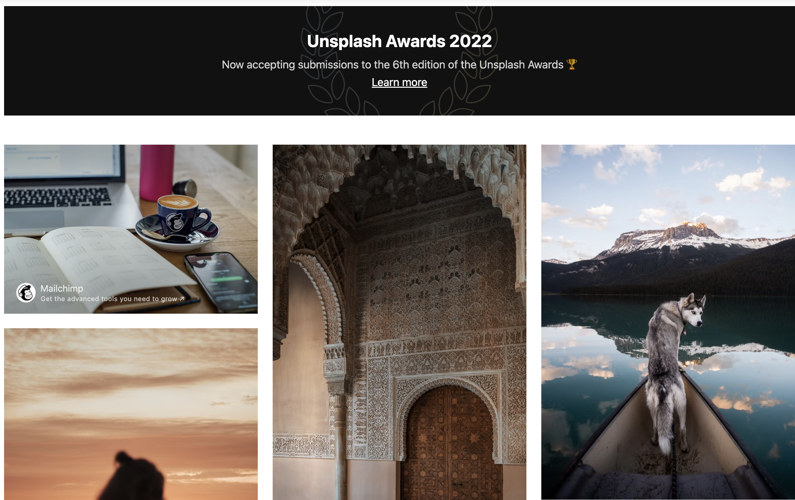
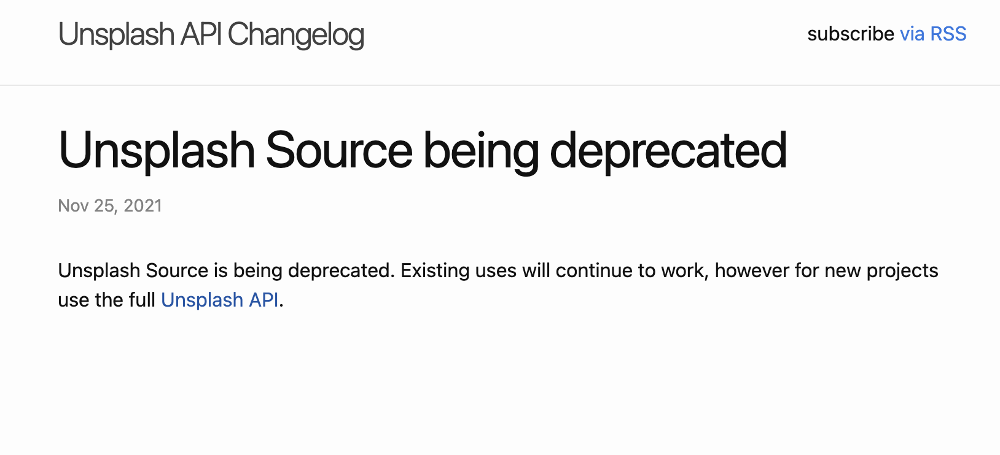
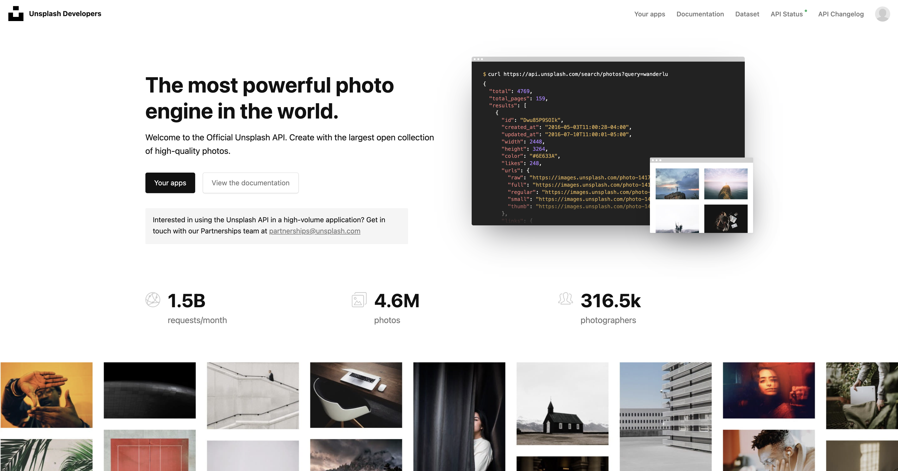
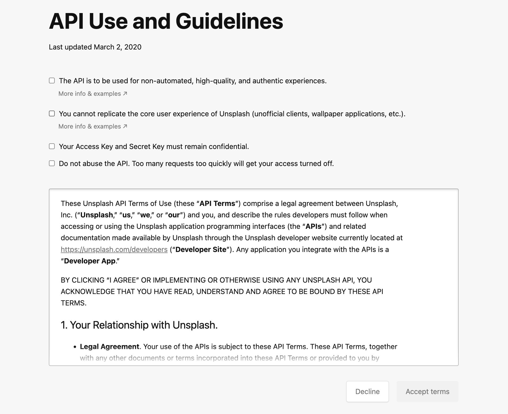
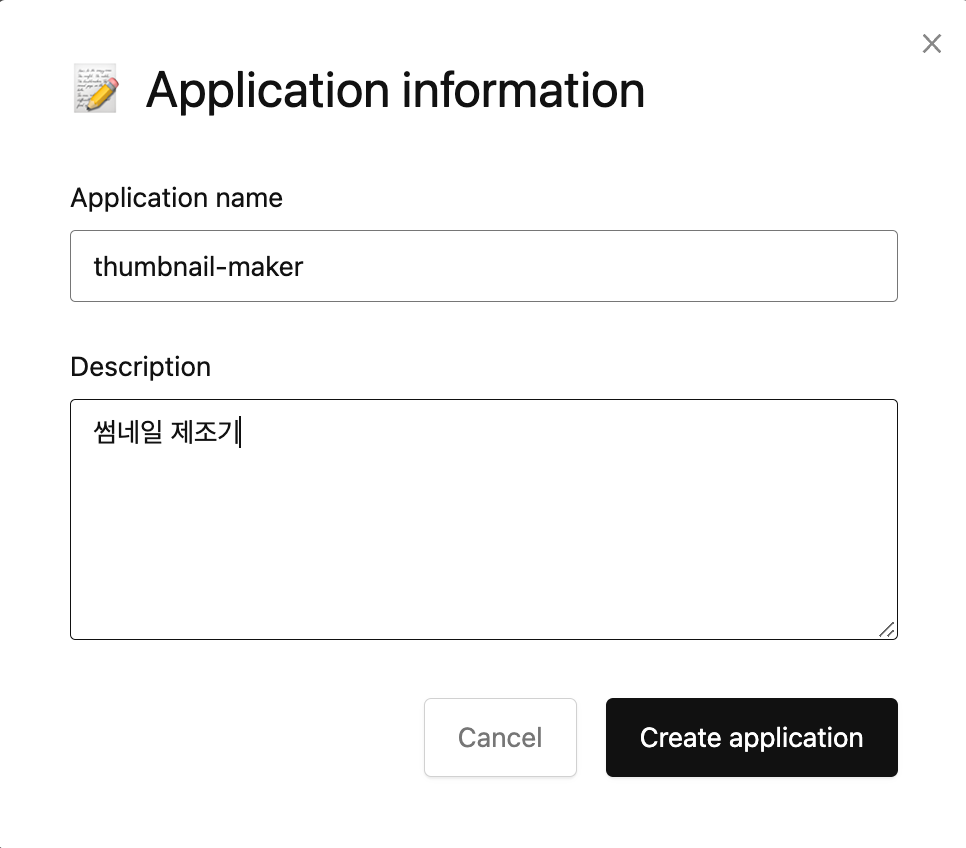
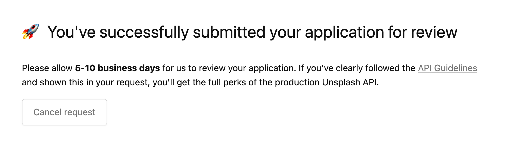

# unsplash API 사용해서 랜덤 사진 불러오기

unsplash를 사용하면 아래처럼 멋진 사진들을 사용할 수 있습니다.



<component is="script" src="https://pagead2.googlesyndication.com/pagead/js/adsbygoogle.js?client=ca-pub-4877378276818686" crossorigin="anonymous" async></component>

<!-- ui-log 수평형 -->

<ins class="adsbygoogle"
     style="display:block"
     data-ad-client="ca-pub-4877378276818686"
     data-ad-slot="9743150776"
     data-ad-format="auto"
     data-full-width-responsive="true"></ins>
<component is="script">
(adsbygoogle = window.adsbygoogle || []).push({});
</component>

### unsplash source API

unsplash에는 **source API가 존재했는데 현재는 deprecated 된 상태입니다.**



아래 url을 통해 get 요청을 하게 되면 현재도 사용을 할 수 는 있습니다.
`?code` 는 사진의 키워드로 원하는 키워드를 넣어주면 됩니다.

### API

```bash
https://source.unsplash.com/500x500/?code
```

위 방법은 공식 문서에는 deprecated되었다고 나와있기 때문에 언제 중지될지 모릅니다.

사진 관련된 서비스를 사용하려면 정식 API를 사용하시는 것을 추천드립니다.

### unsplash New API (2022년 최신)

unsplash의 API를 사용하기 위해 **아래 사이트로 방문해서 회원 가입을 진행해줍니다.**

[https://unsplash.com/developers](https://unsplash.com/developers)

<component is="script" src="https://pagead2.googlesyndication.com/pagead/js/adsbygoogle.js?client=ca-pub-4877378276818686" crossorigin="anonymous" async></component>

<!-- ui-log 수평형 -->

<ins class="adsbygoogle"
     style="display:block"
     data-ad-client="ca-pub-4877378276818686"
     data-ad-slot="9743150776"
     data-ad-format="auto"
     data-full-width-responsive="true"></ins>
<component is="script">
(adsbygoogle = window.adsbygoogle || []).push({});
</component>



### 3. 앱 생성

앱 생성을 눌러줍니다.



앱 이름을 입력해줍니다.



앱 생성을 해주면 앱 사용 여부를 검토해준다는 메세지를 확인할 수 있습니다.
**5일에서 10일정도 소요된다고 하니 기다려주시면 될 것 같습니다.**



<component is="script" src="https://pagead2.googlesyndication.com/pagead/js/adsbygoogle.js?client=ca-pub-4877378276818686" crossorigin="anonymous" async></component>

<!-- ui-log 수평형 -->

<ins class="adsbygoogle"
     style="display:block"
     data-ad-client="ca-pub-4877378276818686"
     data-ad-slot="9743150776"
     data-ad-format="auto"
     data-full-width-responsive="true"></ins>
<component is="script">
(adsbygoogle = window.adsbygoogle || []).push({});
</component>

현재 저도 심사를 받는 중이라 심사 완료되면 업데이트 하도록 하겠습니다(22/11/24)

심사를 받기 전에는 1시간에 50번의 호출만 가능하기 때문에 개발용으로 사용하기도 부족해보이네요.

source API는 deprecated되었으니 안전한 API 사용하셔서 개발하시면 될 것 같습니다.
