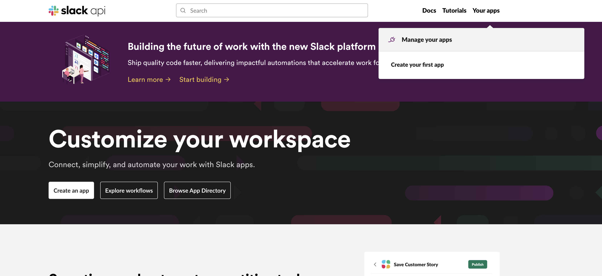
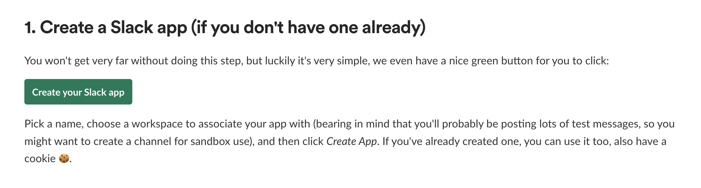
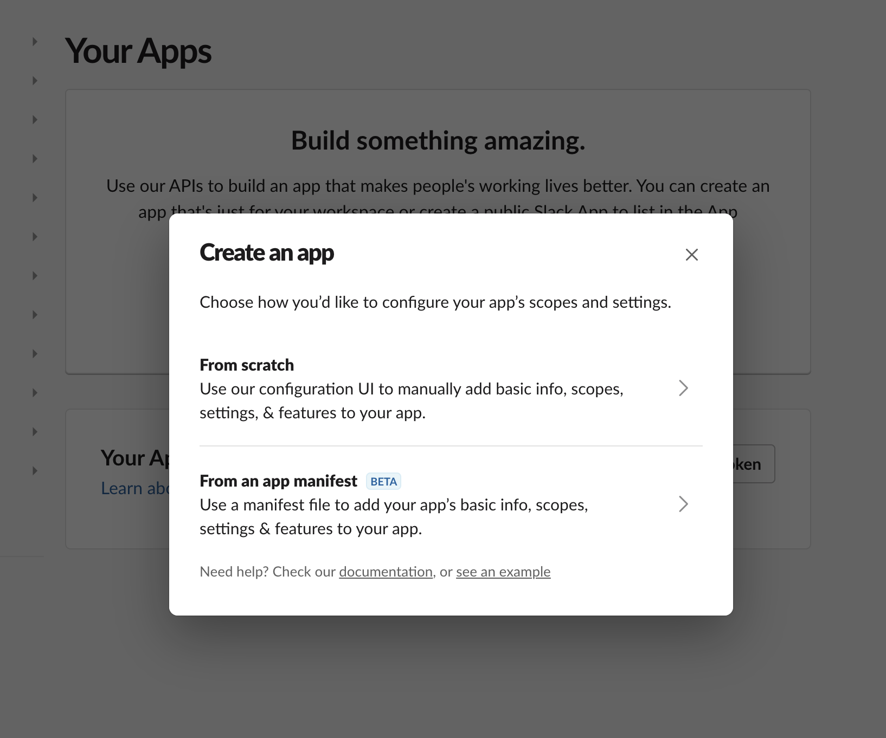
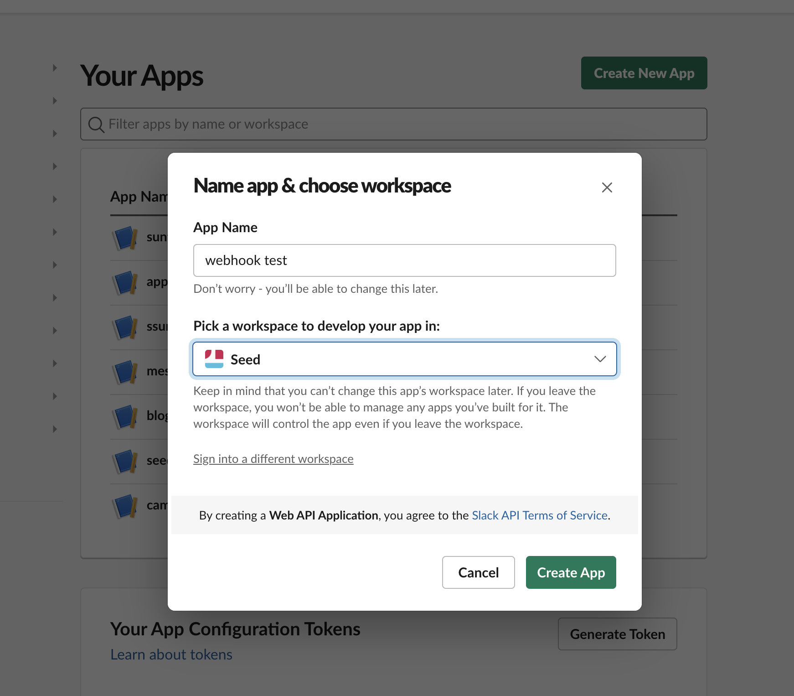
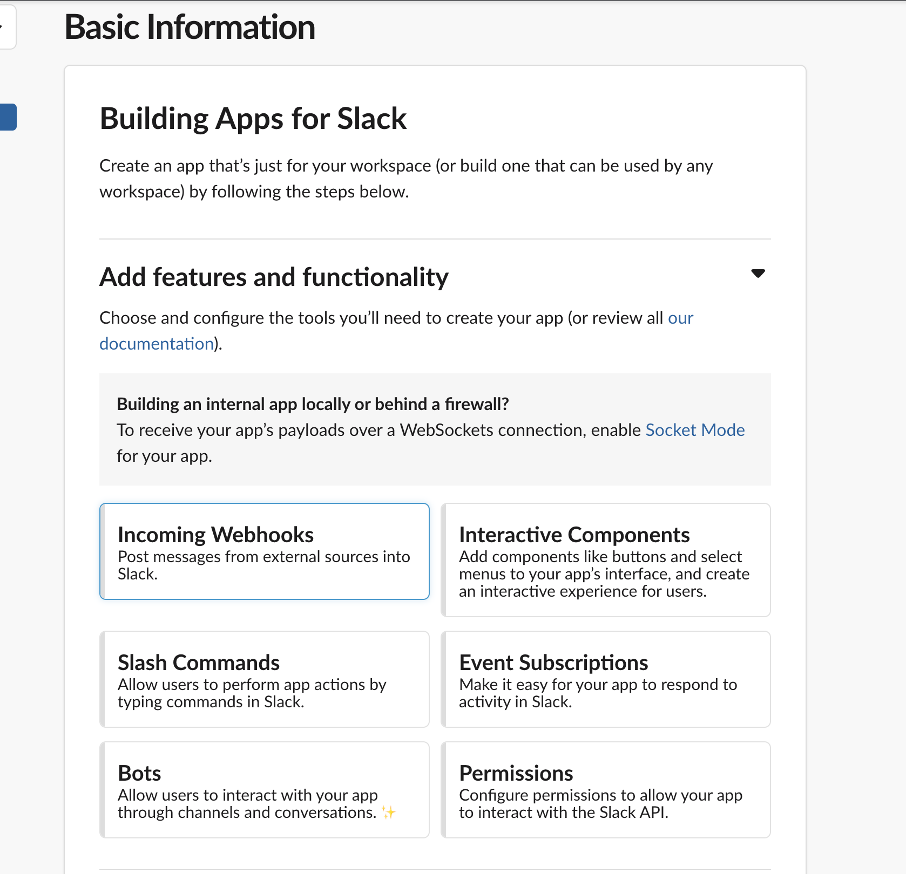
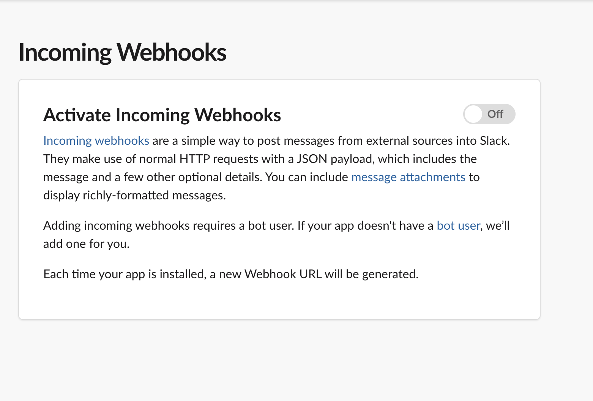
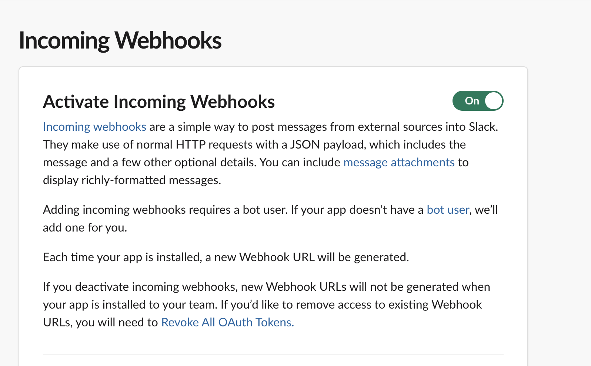
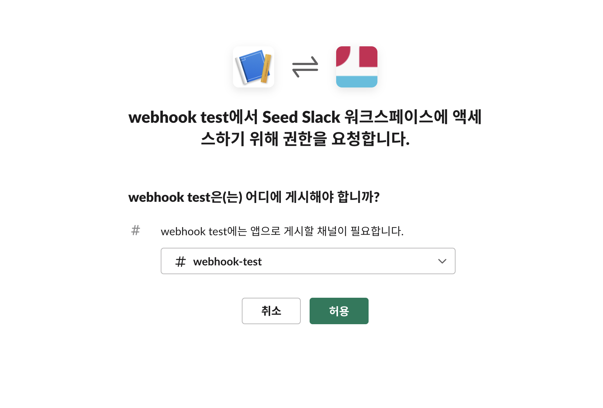
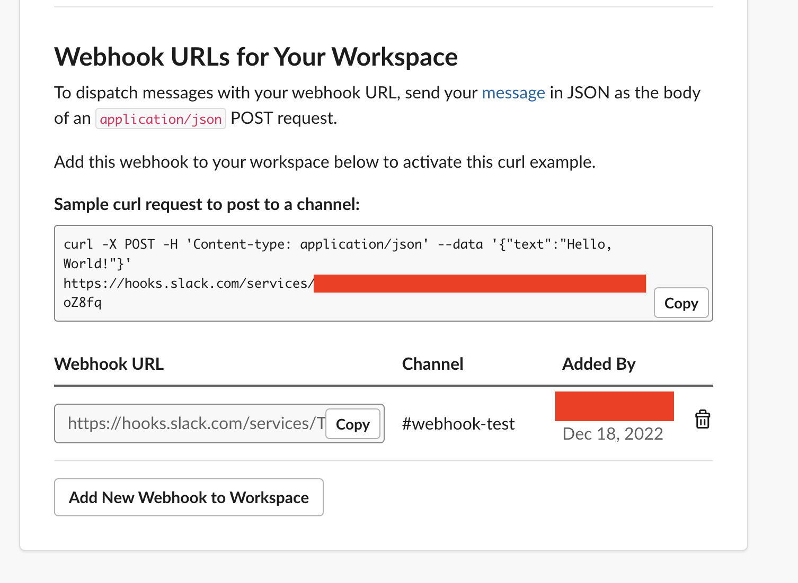
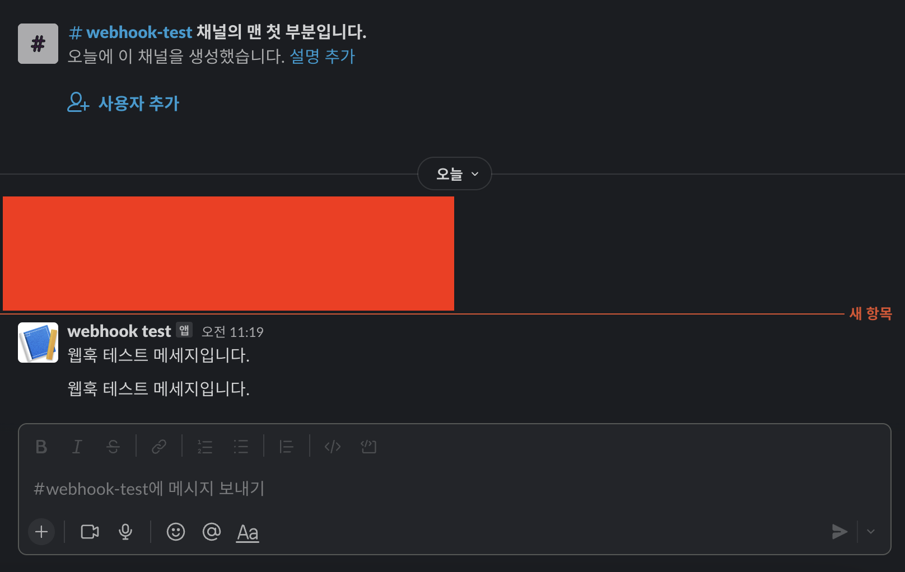

# Slack API - incoming webhooks 사용해서 메세지 보내는 방법 (2022년 12월 최신)

::: tip 💡이 포스팅을 읽으면
Slack API를 활용해 메세지를 보낼 수 있습니다.
:::

slack은 API를 이용해서 채널 ID를 가져와서 채널에 메세지를 보낼 수 있지만
[incoming webhooks](https://api.slack.com/messaging/webhooks)을 사용하면 매우 쉽게 메세지를 보낼 수 있습니다.

## 1. 슬랙 앱 만들기

가장 먼저 슬랙 앱을 만들어주어야합니다.

slack api 사이트에 접속해주신 후에 우측 상단의 Your apps를 눌러줍니다.
**create your first app을 눌러줍니다.**

<component is="script" src="https://pagead2.googlesyndication.com/pagead/js/adsbygoogle.js?client=ca-pub-4877378276818686" crossorigin="anonymous" async></component>

<!-- ui-log 수평형 -->

<ins class="adsbygoogle"
     style="display:block"
     data-ad-client="ca-pub-4877378276818686"
     data-ad-slot="9743150776"
     data-ad-format="auto"
     data-full-width-responsive="true"></ins>
<component is="script">
(adsbygoogle = window.adsbygoogle || []).push({});
</component>





from scratch를 눌러서 앱을 생성해줍니다.

<component is="script" src="https://pagead2.googlesyndication.com/pagead/js/adsbygoogle.js?client=ca-pub-4877378276818686" crossorigin="anonymous" async></component>

<!-- ui-log 수평형 -->

<ins class="adsbygoogle"
     style="display:block"
     data-ad-client="ca-pub-4877378276818686"
     data-ad-slot="9743150776"
     data-ad-format="auto"
     data-full-width-responsive="true"></ins>
<component is="script">
(adsbygoogle = window.adsbygoogle || []).push({});
</component>



이름과 workspace를 선택해야되는 창이 나오는데, **앱을 사용할 워크스페이스를 지정해줍니다.**



아래와 같은 화면이 나오면 incoming webhooks를 눌러줍니다.



activate incoming webhooks 를 눌러 웹훅 사용을 활성화시킵니다.





이제 앱을 사용할 채널을 지정해줍니다. 슬랙의 경우 api를 사용할 때 앱을 채널에 설치해서
그 채널에서 앱을 통한 api를 사용할 수 있도록 하고 있습니다.



앱을 지정해주면 아래와 같이 샘플 코드가 나오는데요. 이 코드를 활용해서 슬랙 메세지를 보낼 수 있습니다.



저는 아래처럼 **sendMessage라는 함수를 만들어서 슬랙 메세지를 채널에 보내도록 작성했습니다.**

<component is="script" src="https://pagead2.googlesyndication.com/pagead/js/adsbygoogle.js?client=ca-pub-4877378276818686" crossorigin="anonymous" async></component>

<!-- ui-log 수평형 -->

<ins class="adsbygoogle"
     style="display:block"
     data-ad-client="ca-pub-4877378276818686"
     data-ad-slot="9743150776"
     data-ad-format="auto"
     data-full-width-responsive="true"></ins>
<component is="script">
(adsbygoogle = window.adsbygoogle || []).push({});
</component>

```js
const axios = require("axios");

const headers = {
  "Content-Type": "application/json",
};

const WEBHOOK_SLACK_KEY = "XXXXXX";

// 문의 사항 슬랙으로 메세지 보내는 함수
const sendMessage = async ({ text, title }) => {
  try {
    const { data } = await axios({
      method: "post",
      url: `https://hooks.slack.com/services/${WEBHOOK_SLACK_KEY}`,
      headers,
      data: {
        text: title,
        blocks: [
          {
            type: "section",
            text: {
              type: "mrkdwn",
              text,
            },
          },
        ],
      },
    });
    return data;
  } catch (error) {
    console.error(error);
  }
};

exports.sendMessage = sendMessage;
```

## 결과

위 함수를 호출하면 아래와 같이 지정한 webhook-test 채널에 메세지가 오는 것을 확인할 수 있습니다.


