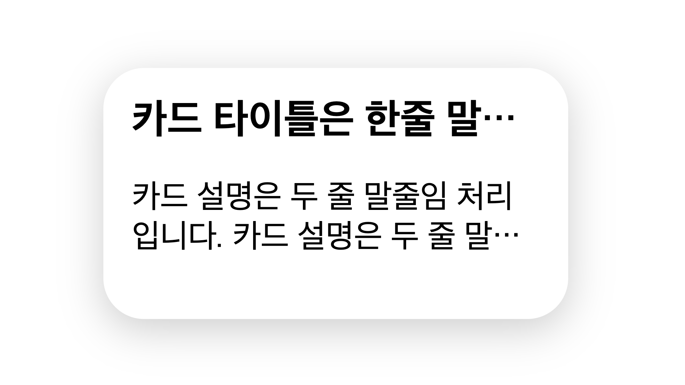
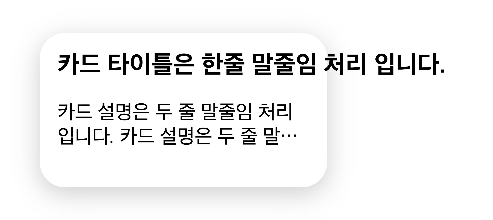
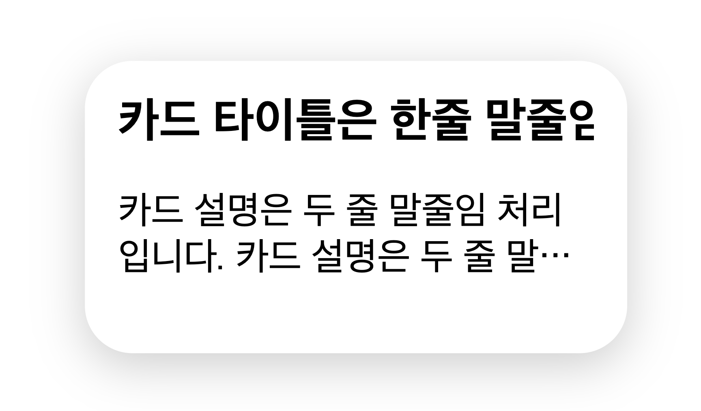
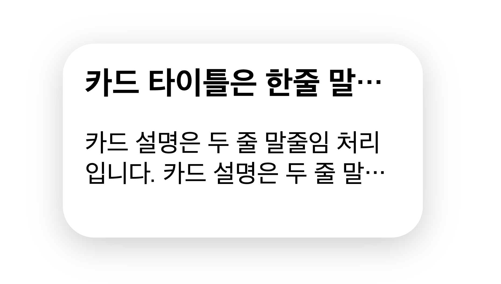
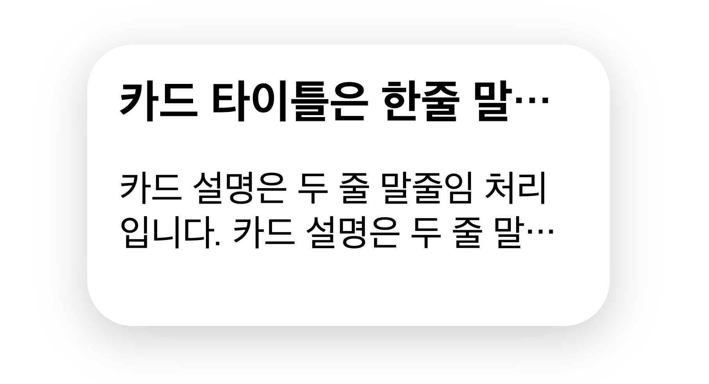

# CSS 말줄임 처리 방법

::: tip 목표
아래 처럼 한줄 말줄임 혹은 여러줄 말줄임을 처리할 수 있습니다.
:::



<component is="script" src="https://pagead2.googlesyndication.com/pagead/js/adsbygoogle.js?client=ca-pub-4877378276818686" crossorigin="anonymous" async></component>

<!-- ui-log 수평형 -->

<ins class="adsbygoogle"
     style="display:block"
     data-ad-client="ca-pub-4877378276818686"
     data-ad-slot="9743150776"
     data-ad-format="auto"
     data-full-width-responsive="true"></ins>
<component is="script">
(adsbygoogle = window.adsbygoogle || []).push({});
</component>

## 1. 한 줄 말줄임

말줄임 처리는 한 줄과 여러줄 말줄임 처리 방식으로 나뉩니다.
**한줄 말줄임 처리는 아래 css로 해결할 수 있습니다.**

```css
.ellipsis {
  display: block;
  overflow: hidden;
  white-space: nowrap;
  text-overflow: ellipsis;
}
```

### 1-1. 한 줄 말줄임 처리 순서

1. `white-space: nowrap;` : 텍스트가 부모 요소의 너비를 초과할 경우 기본적으로 개행되는데 **nowrap으로 지정하면 개행되지 않고 한줄로 표시됩니다**. <br> 

2. `overflow: hidden` : 한줄로 노출되는 텍스트를 카드 영역을 넘치지 않도록 추가해줍니다. <br> 

3. `text-overflow` : 텍스트가 넘칠 때 어떻게 처리할 것인가에 대한 속성으로 ellipsis를 추가해주면 한 줄 말줄임 처리가 완성됩니다. <br> 

<component is="script" src="https://pagead2.googlesyndication.com/pagead/js/adsbygoogle.js?client=ca-pub-4877378276818686" crossorigin="anonymous" async></component>

<!-- ui-log 수평형 -->

<ins class="adsbygoogle"
     style="display:block"
     data-ad-client="ca-pub-4877378276818686"
     data-ad-slot="9743150776"
     data-ad-format="auto"
     data-full-width-responsive="true"></ins>
<component is="script">
(adsbygoogle = window.adsbygoogle || []).push({});
</component>

## 2. 여러줄 말줄임

여러줄 말줄임 처리는 아래 css로 적용할 수 있습니다.

```css
display: -webkit-box;
overflow: hidden;
text-overflow: ellipsis;
-webkit-line-clamp: 2; /* 말줄임 줄 수 */
-webkit-box-orient: vertical;
```

<component is="script" src="https://pagead2.googlesyndication.com/pagead/js/adsbygoogle.js?client=ca-pub-4877378276818686" crossorigin="anonymous" async></component>

<!-- ui-log 수평형 -->

<ins class="adsbygoogle"
     style="display:block"
     data-ad-client="ca-pub-4877378276818686"
     data-ad-slot="9743150776"
     data-ad-format="auto"
     data-full-width-responsive="true"></ins>
<component is="script">
(adsbygoogle = window.adsbygoogle || []).push({});
</component>

### 2-1. 여러줄 말줄임 처리 순서

1. `-webkit-line-clamp: 2;` : 웹킷 박스의 말줄임 줄 수를 정하는 속성입니다. <br> 

2. `overflow: hidden` : 카드 영역을 넘치지 않도록 추가해줍니다. <br> 

## 마무리

위 속성을 아래처럼 믹스인으로 만들어서 사용하면 더 편리합니다.

```scss
@mixin ellipsis {
  display: block;
  overflow: hidden;
  white-space: nowrap;
  text-overflow: ellipsis;
}

@mixin multiEllipsis($line) {
  display: -webkit-box;
  overflow: hidden;
  text-overflow: ellipsis;
  -webkit-line-clamp: $line;
  -webkit-box-orient: vertical;
}
```
