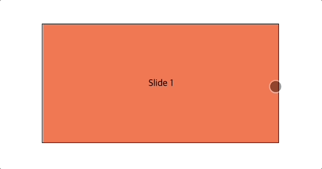
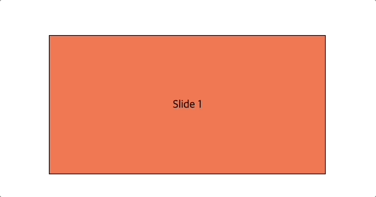

# HTML CSS로 자동 슬라이드 캐러셀 만들기(Embla Carousel)

::: tip 이 글을 읽으면
HTML CSS로 자동으로 슬라이드 되는 캐러셀을 만들 수 있습니다.
:::



<component is="script" src="https://pagead2.googlesyndication.com/pagead/js/adsbygoogle.js?client=ca-pub-4877378276818686" crossorigin="anonymous" async></component>

<!-- ui-log 수평형 -->

<ins class="adsbygoogle"
     style="display:block"
     data-ad-client="ca-pub-4877378276818686"
     data-ad-slot="9743150776"
     data-ad-format="auto"
     data-full-width-responsive="true"></ins>
<component is="script">
(adsbygoogle = window.adsbygoogle || []).push({});
</component>

프로젝트를 진행하다보면 위와 같은 캐러셀을 필요로하는 경우가 많은데,
**Embla Carousel 라이브러리를 사용해 손쉽게 추가할 수 있는 방법에 대해 정리했습니다.**

## 1. HTML 추가

html은 아래와 같은 구조로 작성합니다.

```html
<div class="embla">
  <div class="embla__container">
    <div class="embla__slide">Slide 1</div>
    <div class="embla__slide">Slide 2</div>
    <div class="embla__slide">Slide 3</div>
  </div>
</div>
```

## 2. CDN 추가

아래 코드의 추가 부분의 script를 추가해줍니다.
CDN을 사용해서 손쉽게 라이브러리를 적용할 수 있습니다.

<component is="script" src="https://pagead2.googlesyndication.com/pagead/js/adsbygoogle.js?client=ca-pub-4877378276818686" crossorigin="anonymous" async></component>

<!-- ui-log 수평형 -->

<ins class="adsbygoogle"
     style="display:block"
     data-ad-client="ca-pub-4877378276818686"
     data-ad-slot="9743150776"
     data-ad-format="auto"
     data-full-width-responsive="true"></ins>
<component is="script">
(adsbygoogle = window.adsbygoogle || []).push({});
</component>

```html
<!DOCTYPE html>
<html lang="en">
  <head>
    <meta charset="UTF-8" />
    <meta http-equiv="X-UA-Compatible" content="IE=edge" />
    <meta name="viewport" content="width=device-width, initial-scale=1.0" />
    <link rel="stylesheet" href="./main.css" />
    <!-- 추가 -->
    <script src="https://unpkg.com/embla-carousel/embla-carousel.umd.js"></script>
    <title>Document</title>
  </head>
  <body>
    <div class="embla">
      <div class="embla__container">
        <div class="embla__slide">Slide 1</div>
        <div class="embla__slide">Slide 2</div>
        <div class="embla__slide">Slide 3</div>
      </div>
    </div>
  </body>
</html>
```

## 3. css 추가

커스텀이 필요할 경우 각 클래스명을 이용해 스타일을 커스텀할 수 있습니다.
저는 확인을 위해 각 슬라이드에 색상을 다르게 적용했습니다.

```scss
.embla {
  overflow: hidden;
  width: 400px;
  border: 1px solid #000;
}
.embla__container {
  display: flex;
}
.embla__slide {
  flex: 0 0 100%;
  height: 200px;
  display: flex;
  align-items: center;
  justify-content: center;

  &:nth-child(1) {
    background-color: coral;
  }

  &:nth-child(2) {
    background-color: skyblue;
  }

  &:nth-child(3) {
    background-color: gold;
  }
}
```

<component is="script" src="https://pagead2.googlesyndication.com/pagead/js/adsbygoogle.js?client=ca-pub-4877378276818686" crossorigin="anonymous" async></component>

<!-- ui-log 수평형 -->

<ins class="adsbygoogle"
     style="display:block"
     data-ad-client="ca-pub-4877378276818686"
     data-ad-slot="9743150776"
     data-ad-format="auto"
     data-full-width-responsive="true"></ins>
<component is="script">
(adsbygoogle = window.adsbygoogle || []).push({});
</component>

## 4. 스크립트 추가

**html의 body 태그가 끝나기 전에 아래 스크립트를 추가해줍니다.**

```html
<script type="text/javascript">
  var emblaNode = document.querySelector(".embla");
  var options = { loop: false };

  var embla = EmblaCarousel(emblaNode, options);
</script>
```

그러면 아래와 같이 마우스로 동작가능한 캐러셀이 완성됩니다.


## 5. 플러그인 추가

자동으로 넘어가는 캐러셀을 만들기 위해서는 플러그인을 사용해야하는데
아래처럼 embla-carousel-autoplay CDN을 추가해줍니다.

```html
<!DOCTYPE html>
<html lang="en">
  <head>
    <meta charset="UTF-8" />
    <meta http-equiv="X-UA-Compatible" content="IE=edge" />
    <meta name="viewport" content="width=device-width, initial-scale=1.0" />
    <link rel="stylesheet" href="./main.css" />
    <script src="https://unpkg.com/embla-carousel/embla-carousel.umd.js"></script>
    <!-- 추가 -->
    <script src="https://unpkg.com/embla-carousel-autoplay/embla-carousel-autoplay.umd.js"></script>
    <title>Document</title>
  </head>
  <body>
    <div class="embla">
      <div class="embla__container">
        <div class="embla__slide">Slide 1</div>
        <div class="embla__slide">Slide 2</div>
        <div class="embla__slide">Slide 3</div>
      </div>
    </div>
    <script type="text/javascript">
      var emblaNode = document.querySelector(".embla");
      var options = { loop: false };
      var plugins = [EmblaCarouselAutoplay()]; // Plugins

      var embla = EmblaCarousel(emblaNode, options, plugins);
    </script>
  </body>
</html>
```

그리고 아래 스크립트 부분에 `EmblaCarouselAutoplay()`를 EmblaCarousel의 3번째 인자에 넣어주면 아래처럼 자동으로 넘어가는 캐러셀을 만들 수 있습니다.


