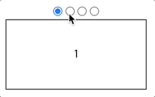
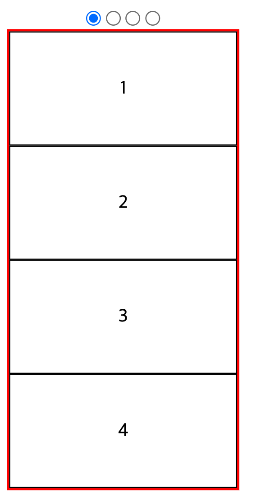
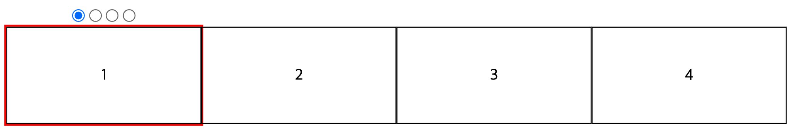
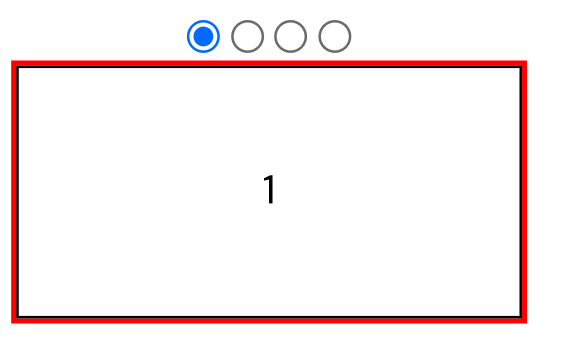

# HTML CSS만 사용해서 슬라이더 만드는 방법

::: tip 목표
자바스크립트 없이 HTML CSS만 사용해서 아래와 같은 슬라이더 캐러셀을 만들 수 있습니다.
:::



## 만드는 방법

**스크립트 없이 HTML CSS만으로 슬라이더를 만드는 방법은 input태그의 라디오버튼을 이용해 만들 수 있습니다.**

라디오버튼은 label요소를 통해 체크를 할 수 있고 이 체크 여부 또한 css의 `:checked`를 통해서 판단할 수 있습니다.

라디오버튼을 클릭하면 몇번째 라디오버튼을 클릭했는지에 따라 리스트를 좌우로 움직이는 방식으로 만들 수 있습니다.

바로 코드부터 공유하고 어떻게 만드는지 알아보도록 하겠습니다.

## html

HTML은 아래와 같이 작성할 수 있습니다.

<component is="script" src="https://pagead2.googlesyndication.com/pagead/js/adsbygoogle.js?client=ca-pub-4877378276818686" crossorigin="anonymous" async></component>

<!-- ui-log 수평형 -->

<ins class="adsbygoogle"
     style="display:block"
     data-ad-client="ca-pub-4877378276818686"
     data-ad-slot="9743150776"
     data-ad-format="auto"
     data-full-width-responsive="true"></ins>
<component is="script">
(adsbygoogle = window.adsbygoogle || []).push({});
</component>

```html
<!DOCTYPE html>
<html lang="en">
  <head>
    <meta charset="UTF-8" />
    <meta http-equiv="X-UA-Compatible" content="IE=edge" />
    <meta name="viewport" content="width=device-width, initial-scale=1.0" />
    <link rel="stylesheet" href="./main.css " />
    <title>html-css-slider</title>
  </head>
  <body>
    <div class="wrap">
      <input type="radio" class="radio_button" id="radio_1" name="slider" checked />
      <input type="radio" class="radio_button" id="radio_2" name="slider" />
      <input type="radio" class="radio_button" id="radio_3" name="slider" />
      <input type="radio" class="radio_button" id="radio_4" name="slider" />
      <ul class="slide">
        <li class="slide_item">1</li>
        <li class="slide_item">2</li>
        <li class="slide_item">3</li>
        <li class="slide_item">4</li>
      </ul>
      <div class="bullet_area">
        <label class="slide_button" for="radio_1"></label>
        <label class="slide_button" for="radio_2"></label>
        <label class="slide_button" for="radio_3"></label>
        <label class="slide_button" for="radio_4"></label>
      </div>
    </div>
  </body>
</html>
```

<component is="script" src="https://pagead2.googlesyndication.com/pagead/js/adsbygoogle.js?client=ca-pub-4877378276818686" crossorigin="anonymous" async></component>

<!-- ui-log 수평형 -->

<ins class="adsbygoogle"
     style="display:block"
     data-ad-client="ca-pub-4877378276818686"
     data-ad-slot="9743150776"
     data-ad-format="auto"
     data-full-width-responsive="true"></ins>
<component is="script">
(adsbygoogle = window.adsbygoogle || []).push({});
</component>

## CSS

**CSS는 아래와 같이 작성할 수 있습니다.**

<component is="script" src="https://pagead2.googlesyndication.com/pagead/js/adsbygoogle.js?client=ca-pub-4877378276818686" crossorigin="anonymous" async></component>

<!-- ui-log 수평형 -->

<ins class="adsbygoogle"
     style="display:block"
     data-ad-client="ca-pub-4877378276818686"
     data-ad-slot="9743150776"
     data-ad-format="auto"
     data-full-width-responsive="true"></ins>
<component is="script">
(adsbygoogle = window.adsbygoogle || []).push({});
</component>

```css
.wrap {
  position: relative;

  width: 200px;
  text-align: center;
}

.radio_area {
  position: absolute;
  bottom: 0;
  left: 0;
  right: 0;
  text-align: center;
}

ul {
  padding: 0;
  margin: 0;
}

li {
  list-style: none;
  padding: 0;
  margin: 0;
}

.slide {
  display: flex;
  overflow: hidden;
}

.slide_item {
  box-sizing: border-box;
  flex-shrink: 0;
  width: 200px;
  height: 100px;
  border: 1px solid #000;
  display: flex;
  align-items: center;
  justify-content: center;
  transition: 0.2s ease-in-out;
}

.radio_button {
  margin: 0;

  @for $i from 1 to 5 {
    &:nth-child(#{$i}):checked ~ .slide .slide_item {
      transform: translateX(($i - 1) * -100%);
    }
  }
}
```

<component is="script" src="https://pagead2.googlesyndication.com/pagead/js/adsbygoogle.js?client=ca-pub-4877378276818686" crossorigin="anonymous" async></component>

<!-- ui-log 수평형 -->

<ins class="adsbygoogle"
     style="display:block"
     data-ad-client="ca-pub-4877378276818686"
     data-ad-slot="9743150776"
     data-ad-format="auto"
     data-full-width-responsive="true"></ins>
<component is="script">
(adsbygoogle = window.adsbygoogle || []).push({});
</component>

## 만드는 과정

html과 css에서 주의해서 보셔야할 부분 몇가지만 정리해드리겠습니다.

나머지 부분들은 단순 스타일을 위한 코드이니 별다른 설명 없이도 이해하실 수 있습니다.

### 1. input요소의 위치

```html
<input type="radio" class="radio_button" id="radio_1" name="slider" checked />
<input type="radio" class="radio_button" id="radio_2" name="slider" />
<input type="radio" class="radio_button" id="radio_3" name="slider" />
<input type="radio" class="radio_button" id="radio_4" name="slider" />
<ul class="slide">
  <li class="slide_item">1</li>
  <li class="slide_item">2</li>
  <li class="slide_item">3</li>
  <li class="slide_item">4</li>
</ul>
```

위 코드를 보면 input요소가 .slide 보다 앞에 위치한 것을 보실 수 있는데요. 이렇게 작성한 이유는 아래와 같이 CSS의 `~` 셀렉터를 이용해야하기 때문입니다.

```scss
.radio_button {
  @for $i from 1 to 5 {
    &:nth-child(#{$i}):checked ~ .slide .slide_item {
      transform: translateX(($i - 1) * -100%);
    }
  }
}
```

### 2. `A ~ B` 셀렉터

`A ~ B` 셀렉터는 A 요소 보다 뒤에 위치한 B 요소를 선택하는 셀렉터입니다.

우리가 해야하는 작업은 체크박스가 선택되었을 때 몇번째 체크박스인지에 따라서 리스트를 좌우로 움직여야하는데요.

이 부분을 아래와 같이 작성할 수도 있겠지만

```css
.radio_button:nth-child(1):checked ~ .slide .slide_item {
  transform: translateX(0%);
}
.radio_button:nth-child(2):checked ~ .slide .slide_item {
  transform: translateX(-100%);
}
.radio_button:nth-child(3):checked ~ .slide .slide_item {
  transform: translateX(-200%);
}
.radio_button:nth-child(4):checked ~ .slide .slide_item {
  transform: translateX(-300%);
}
```

scss의 @for문을 이용하면 아래와 같이 작성할 수 있습니다.

```scss
.radio_button {
  @for $i from 1 to 5 {
    &:nth-child(#{$i}):checked ~ .slide .slide_item {
      transform: translateX(($i - 1) * -100%);
    }
  }
}
```

### 3. 아이템 배치

아래와 같이 작성한 이유는

```css
.slide {
  border: 2px solid #f00;
  margin: -2px;
  overflow: hidden;
}
```

#### 박스 네개 만들기

```css
.slide {
  border: 2px solid #f00;
  margin: -2px;
}
```



#### 가로 배치

```css
.slide {
  display: flex; /* 가로 배치 */
  border: 2px solid #f00;
  margin: -2px;
}
```



#### 넘치는 부분 가리기

```css
.slide {
  display: flex; /* 가로 배치 */
  border: 2px solid #f00;
  margin: -2px;
  overflow: hidden; /* 넘치는 부분 가리기 */
}
```



이렇게 하면 클릭이벤트 같은 자바스크립트 코드 없이 HTML CSS만으로 슬라이더를 만들 수 있습니다.
