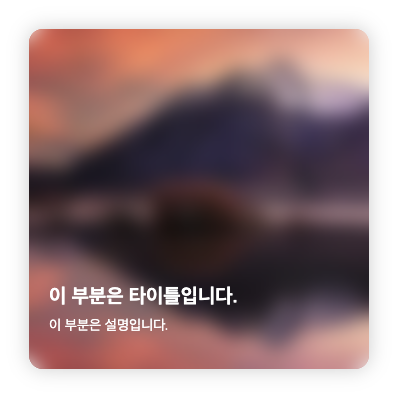
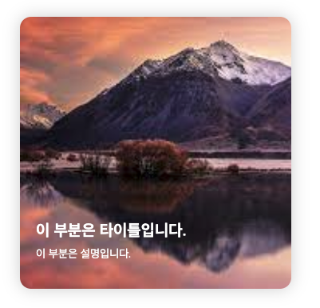
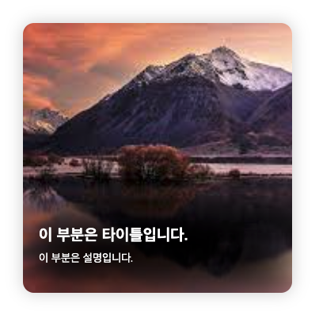

# backdrop-filter 속성으로 배경 이미지 블러처리하기(IE대응)

::: tip 💡이 포스팅을 읽으면
backdrop-filter 속성으로 배경 이미지에 블러처리를 줄 수 있어요
:::



<component is="script" src="https://pagead2.googlesyndication.com/pagead/js/adsbygoogle.js?client=ca-pub-4877378276818686" crossorigin="anonymous" async></component>

<!-- ui-log 수평형 -->

<ins class="adsbygoogle"
     style="display:block"
     data-ad-client="ca-pub-4877378276818686"
     data-ad-slot="9743150776"
     data-ad-format="auto"
     data-full-width-responsive="true"></ins>
<component is="script">
(adsbygoogle = window.adsbygoogle || []).push({});
</component>

```html
<!DOCTYPE html>
<html lang="en">
  <head>
    <meta charset="UTF-8" />
    <meta http-equiv="X-UA-Compatible" content="IE=edge" />
    <meta name="viewport" content="width=device-width, initial-scale=1.0" />
    <link rel="stylesheet" href="./main.css" />
    <title>Document</title>
  </head>
  <body>
    <div class="card">
      <div class="textarea">
        <strong class="title">이 부분은 타이틀입니다.</strong>
        <p class="desc">이 부분은 설명입니다.</p>
      </div>
    </div>
  </body>
</html>
```

```scss
.card {
  position: relative;
  box-shadow: 0 0 20px rgba(0, 0, 0, 0.2);
  border-radius: 14px;
  padding: 20px;
  width: 300px;
  height: 300px;
  background: no-repeat url("./img/1.jpeg") 0 0 / cover;
  overflow: hidden;
}

.textarea {
  position: absolute;
  bottom: 20px;
  left: 20px;
  color: #fff;
}

.title {
  font-size: 20px;
  line-height: 24px;
}

.desc {
  font-size: 14px;
  line-height: 18px;
  margin-top: 8px;
}
```

위와 같이 작성하면 아래 처럼 나옵니다.

이미지는 아무거나 사용하시면 됩니다.



## 블러처리하기

블러처리는 아래 .card 클래스 부분에 before 가상요소를 추가해주면 됩니다. **card 요소 자체에 블러처리를 하는 것이 아니라 이미지 위를 덮는 가상 요소를 만들고 그 가상요소를 블러처리하는 방식이죠.**

<component is="script" src="https://pagead2.googlesyndication.com/pagead/js/adsbygoogle.js?client=ca-pub-4877378276818686" crossorigin="anonymous" async></component>

<!-- ui-log 수평형 -->

<ins class="adsbygoogle"
     style="display:block"
     data-ad-client="ca-pub-4877378276818686"
     data-ad-slot="9743150776"
     data-ad-format="auto"
     data-full-width-responsive="true"></ins>
<component is="script">
(adsbygoogle = window.adsbygoogle || []).push({});
</component>

```scss
.card {
  position: relative;
  box-shadow: 0 0 20px rgba(0, 0, 0, 0.2);
  border-radius: 14px;
  padding: 20px;
  width: 300px;
  height: 300px;
  background: no-repeat url("./img/1.jpeg") 0 0 / cover;
  overflow: hidden;

  &::before {
    content: "";
    position: absolute;
    top: 0;
    right: 0;
    bottom: 0;
    left: 0;
    backdrop-filter: blur(10px);
  }
}
```


## IE 대응

IE에서는 backdrop-filter 속성을 지원하지 않고 있기 때문에 이런 경우에도 블러처리와 비슷한 스펙을 적용해주어야합니다.

IE가 종료되면서 미지원하는 서비스들이 많긴 하지만 아직은 과도기이기 때문에 이런 부분도 필요할 것으로 보여집니다.

scss에는 `@supports` 문법이 존재하는데 **`@supports not (속성)` 속성을 지원하지 않는 브라우저에서는 어떤 속성을 사용할 것 인지 지정할 수 있습니다.**

아래와 같이 작성해서 사용할 수 있습니다.

<component is="script" src="https://pagead2.googlesyndication.com/pagead/js/adsbygoogle.js?client=ca-pub-4877378276818686" crossorigin="anonymous" async></component>

<!-- ui-log 수평형 -->

<ins class="adsbygoogle"
     style="display:block"
     data-ad-client="ca-pub-4877378276818686"
     data-ad-slot="9743150776"
     data-ad-format="auto"
     data-full-width-responsive="true"></ins>
<component is="script">
(adsbygoogle = window.adsbygoogle || []).push({});
</component>

```scss
@supports not (backdrop-filter: blur($amount)) {
  background-image: linear-gradient(135deg, #2a2a31, #322e46 60%, #4b336f);
}
```

## 텍스트 영역만 블러처리

이렇게 통 이미지를 전체 블러처리할 때는 backdrop-filter를 사용하지만 아래 이미지처럼 특정 영역(e.g. 텍스트 영역)만 블러처리를 하고 싶은 경우도 있습니다.



이런 경우에는 .card 스타일을 아래와 같이 수정해주면 됩니다.

```scss
.card {
  position: relative;
  box-shadow: 0 0 20px rgba(0, 0, 0, 0.2);
  border-radius: 14px;
  padding: 20px;
  width: 300px;
  height: 300px;
  background: no-repeat url("./img/1.jpeg") 0 0 / cover;
  overflow: hidden;

  &::before {
    content: "";
    position: absolute;
    right: 0;
    bottom: 0;
    left: 0;
    height: 100px;
    background-image: linear-gradient(90deg, rgb(0, 0, 0) 0%, rgb(0, 0, 0) 100%);
    filter: blur(30px);
    -webkit-filter: blur(30px);
  }
}
```
