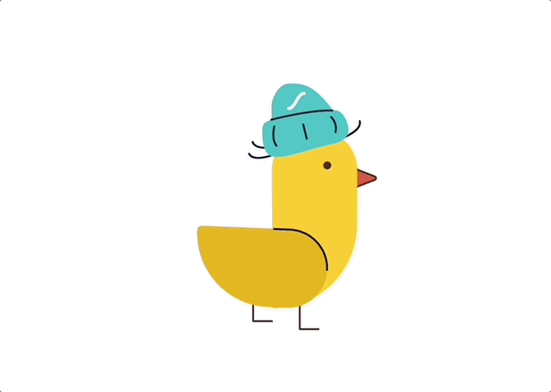

# lottie-react-web 사용해서 로띠 애니메이션 적용하기

::: tip 💡이 포스팅을 읽으면
리액트 프로젝트에 lottie-react-web를 이용해 아래와 같은 로띠 애니메이션을 쉽게 적용할 수 있습니다.
:::

<component is="script" src="https://pagead2.googlesyndication.com/pagead/js/adsbygoogle.js?client=ca-pub-4877378276818686" crossorigin="anonymous" async></component>

<!-- ui-log 수평형 -->

<ins class="adsbygoogle"
     style="display:block"
     data-ad-client="ca-pub-4877378276818686"
     data-ad-slot="9743150776"
     data-ad-format="auto"
     data-full-width-responsive="true"></ins>
<component is="script">
(adsbygoogle = window.adsbygoogle || []).push({});
</component>



## 로띠(lottie)란?

**웹 개발을 할 때 애니메이션을 적용하는 방식에는 여러가지가 있는데요.**

1. 동영상
2. gif
3. svg
4. lottie

그 중에서 성능면에서도 좋고 요즘 많이 사용하고 있는 로띠를 이용해 애니메이션을 적용해보려고 합니다.

리액트 프로젝트에 손쉽게 적용할 수 있답니다.

## 1. lottie-react-web 설치

<component is="script" src="https://pagead2.googlesyndication.com/pagead/js/adsbygoogle.js?client=ca-pub-4877378276818686" crossorigin="anonymous" async></component>

<!-- ui-log 수평형 -->

<ins class="adsbygoogle"
     style="display:block"
     data-ad-client="ca-pub-4877378276818686"
     data-ad-slot="9743150776"
     data-ad-format="auto"
     data-full-width-responsive="true"></ins>
<component is="script">
(adsbygoogle = window.adsbygoogle || []).push({});
</component>

먼저 lottie-react-web를 설치해줍니다.

```bash
yarn add lottie-react-web
```

## 2. lottie-react-web 적용

적용하는 방법은 굉장히 간단합니다.

<component is="script" src="https://pagead2.googlesyndication.com/pagead/js/adsbygoogle.js?client=ca-pub-4877378276818686" crossorigin="anonymous" async></component>

<!-- ui-log 수평형 -->

<ins class="adsbygoogle"
     style="display:block"
     data-ad-client="ca-pub-4877378276818686"
     data-ad-slot="9743150776"
     data-ad-format="auto"
     data-full-width-responsive="true"></ins>
<component is="script">
(adsbygoogle = window.adsbygoogle || []).push({});
</component>

```tsx
{... 중략}

import Lottie from "lottie-react-web";
import IconChick from "./assets/chick.json";

const lottieOptions = {
  loop: true, // 반복재생
  autoplay: false, // 자동재생
  animationData: IconChick, // 로띠 파일
  rendererSettings: {
    preserveAspectRatio: "xMidYMid slice",
  },
};

const Lottie = () => {
  return <Lottie options={lottieOptions} width={200} height={200} isStopped={false} ariaLabel={""} ariaRole={"img"} />;
};
```

**위와 같이 작성하면 이렇게 모이를 쪼는 병아리 애니메이션을 적용할 수 있습니다.**


위 코드처럼 lottieOptions를 따로 만들어서 반복되게 할 것인가 브라우저 접근시 자동 재생되게 할 것인가를 지정할 수 있습니다.

또한 `<Lottie />` 컴포넌트를 통해 width, height를 지정할 수 있는데요. 로띠의 장점은 svg처럼 사이즈를 키우더라도 깨지지 않는다는 장점이 있습니다.

로띠 파일은 디자이너가 제작해서 주는 경우가 많기 때문에 연습용으로 테스트를 해보고 싶으시다면 테스트용 파일을 받을 수 있는 [LottieFiles](https://lottiefiles.com/kr) 에서 다운로드 받아서 사용해보시면 됩니다.
