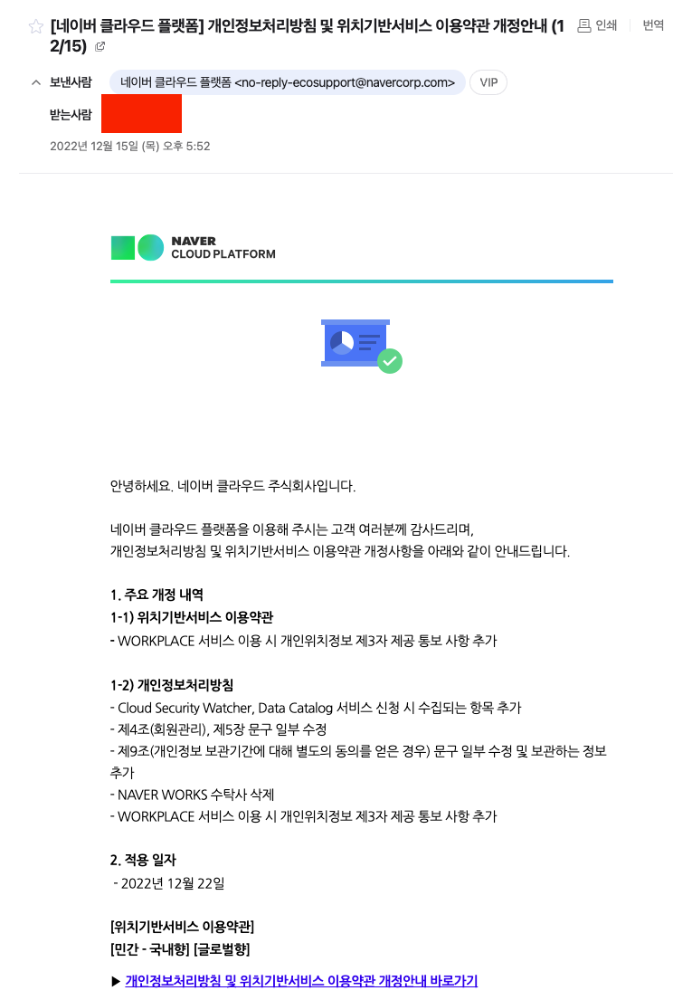
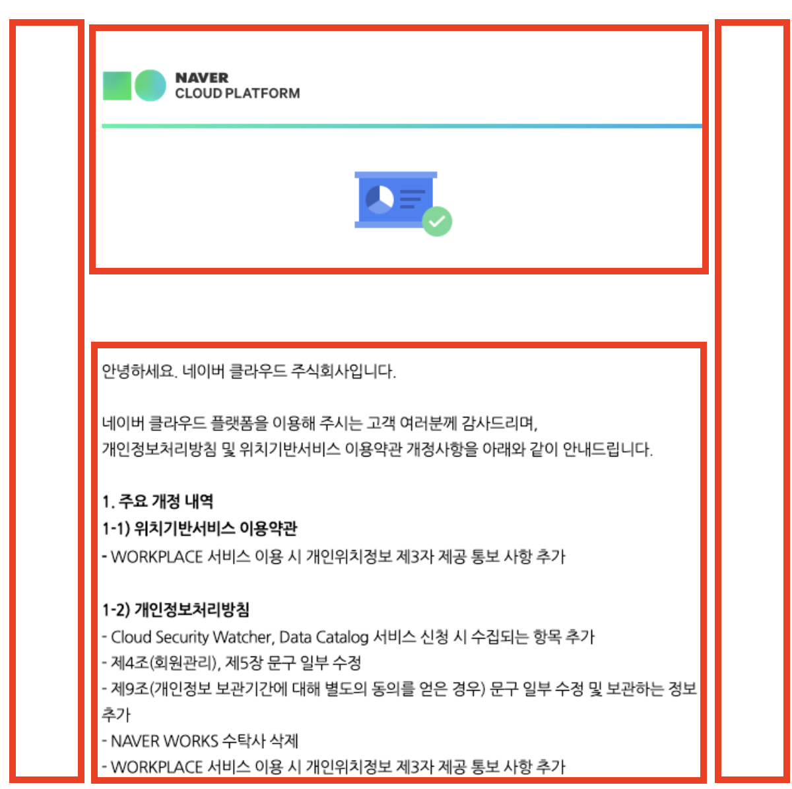
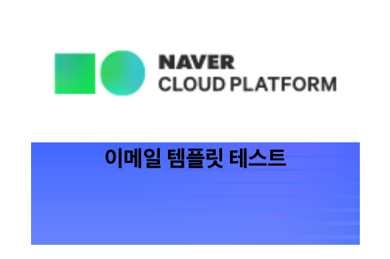
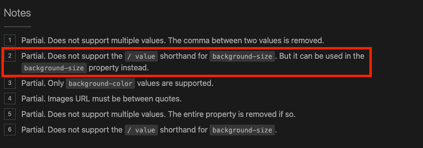

# HTML 이메일 템플릿 마크업하는 방법

::: tip 💡이 포스팅을 읽으면
이메일 템플릿을 HTML로 직접 만들 수 있습니다.
:::

서비스회사에서 일을 하다보면 자연스럽게 이메일 마크업을 필요로 하는 경우가 생기는데요.
회원가입, 인증 번호, 결제 내역 등등 많은 프로세스에서 메일을 필요로 하고 있습니다.

하지만 요즘 받는 메일들을 보면 모두 텍스트로만 되어있지 않고
아래와 같이 이미지 및 레이아웃이 있는 구조로 되어있는데요.



<component is="script" src="https://pagead2.googlesyndication.com/pagead/js/adsbygoogle.js?client=ca-pub-4877378276818686" crossorigin="anonymous" async></component>

<!-- ui-log 수평형 -->

<ins class="adsbygoogle"
     style="display:block"
     data-ad-client="ca-pub-4877378276818686"
     data-ad-slot="9743150776"
     data-ad-format="auto"
     data-full-width-responsive="true"></ins>
<component is="script">
(adsbygoogle = window.adsbygoogle || []).push({});
</component>

메일 템플릿을 만드는 방법과 주의해야할 점에 대해서 알아봅니다.

## 1. 이메일 템플릿 마크업 방법

이메일 템플릿에서는 기본적으로 table구조로 모든 것을 만든다고 보시면 됩니다.



### 큰 table 만들기

가장 먼저 큰 table을 만들어줍니다.
이메일 마크업은 모든 css를 인라인 스타일로 넣어주어야합니다.
table에 사용되는 기본적인 csse들을 넣어줍니다.

```html
<table align="center" style="width: 596px; table-layout: fixed; max-width: 596px" cellspacing="0" cellpadding="0">
  <tbody>
    <tr></tr>
  </tbody>
</table>
```

### 간격 지정하기

간격을 사용할 때도 아래와 같이 td를 사용합니다.
빈 td 태그를 사용해서 좌우 여백 20px를 구현합니다.

그냥 웹사이트를 마크업 했다면 `padding: 0 20px`와 같은 쉬운 방식으로 했을텐데 매우 복잡하죠?
그래서 이메일 마크업을 하는 것이 번거롭고 안되는 것들이 많은거랍니다.

<!-- ui-log 수평형 -->

<ins class="adsbygoogle"
     style="display:block"
     data-ad-client="ca-pub-4877378276818686"
     data-ad-slot="9743150776"
     data-ad-format="auto"
     data-full-width-responsive="true"></ins>
<component is="script">
(adsbygoogle = window.adsbygoogle || []).push({});
</component>

```html
<table align="center" style="width: 596px; table-layout: fixed; max-width: 596px" cellspacing="0" cellpadding="0">
  <tbody>
    <tr>
      <td style="width: 20px"></td>
      <td></td>
      <td style="width: 20px"></td>
    </tr>
  </tbody>
</table>
```

### 이미지 사용하기

이미지를 사용할 때는 td 태그 안에 img 태그를 이용해서 작업할 수 있습니다.
모바일 PC에 따른 반응형으로 작업하고 싶다면 `style="max-width: 100%"` 를 넣어주어서 모바일 기기에서도 깨지지 않게 작업해줍니다.

<component is="script" src="https://pagead2.googlesyndication.com/pagead/js/adsbygoogle.js?client=ca-pub-4877378276818686" crossorigin="anonymous" async></component>

<!-- ui-log 수평형 -->

<ins class="adsbygoogle"
     style="display:block"
     data-ad-client="ca-pub-4877378276818686"
     data-ad-slot="9743150776"
     data-ad-format="auto"
     data-full-width-responsive="true"></ins>
<component is="script">
(adsbygoogle = window.adsbygoogle || []).push({});
</component>

```html
<table align="center" style="width: 596px; table-layout: fixed; max-width: 596px" cellspacing="0" cellpadding="0">
  <tbody>
    <tr>
      <td style="width: 20px"></td>
      <td>
        
      </td>
      <td style="width: 20px"></td>
    </tr>
  </tbody>
</table>
```


### 배경 이미지 사용하기

배경 이미지를 사용할 때는 table요소에 직접 배경을 주는 방식으로 적용하셔야합니다.
td 요소에 `position: absolute`를 줘서 background를 지정하는 등 다른 방식은 문제가 발생합니다.

**이메일 플랫폼에서는 `position: absolute`를 사용할 경우 코드를 블락시키기 때문에 배경이 제대로 노출되지 않을 수 있습니다.**
[caniemail](https://www.caniemail.com/features/css-position/)사이트를 참고하면 이메일에 사용가능한 css 속성이 무엇이 있는지 확인할 수 있습니다.

<component is="script" src="https://pagead2.googlesyndication.com/pagead/js/adsbygoogle.js?client=ca-pub-4877378276818686" crossorigin="anonymous" async></component>

<!-- ui-log 수평형 -->

<ins class="adsbygoogle"
     style="display:block"
     data-ad-client="ca-pub-4877378276818686"
     data-ad-slot="9743150776"
     data-ad-format="auto"
     data-full-width-responsive="true"></ins>
<component is="script">
(adsbygoogle = window.adsbygoogle || []).push({});
</component>

```html
<table align="center" style="width: 596px; table-layout: fixed; max-width: 596px" cellspacing="0" cellpadding="0">
  <tbody>
    <tr>
      <td style="width: 20px"></td>
      <td>
        <table
          style="
                position: relative;
                border-collapse: collapse;
                width: 100%;
                -webkit-text-size-adjust: 100%;
                background-image: url('');
                background-repeat: no-repeat;
                background-position: 0 0;
                background-size: 100% 600px;
              "
        ></table>
      </td>
      <td style="width: 20px"></td>
    </tr>
  </tbody>
</table>
```

<!-- ui-log 수평형 -->

<ins class="adsbygoogle"
     style="display:block"
     data-ad-client="ca-pub-4877378276818686"
     data-ad-slot="9743150776"
     data-ad-format="auto"
     data-full-width-responsive="true"></ins>
<component is="script">
(adsbygoogle = window.adsbygoogle || []).push({});
</component>



추가로, background 속성을 사용할 때는 축약형을 사용하면 제대로 적용이 되지 않습니다. [참고 사이트](https://www.caniemail.com/search/?s=background)



### 텍스트 사용하기

텍스트를 사용할 때는 아래와 같이 td태그에 font에 대한 속성들을 전부 넣어주어야합니다.
table태그에서 font 값을 지정하면 하위에서 다 적용되지 않아? 라고 생각하실 수 있지만
이메일에서는 그렇게 되지 않아서 번거롭지만 폰트사이즈, 색상, 폰트 스타일 등 다양한 속성들을 직접 적용해야합니다.

```html
<table align="center" style="width: 596px; table-layout: fixed; max-width: 596px" cellspacing="0" cellpadding="0">
  <tbody>
    <tr>
      <td style="width: 20px"></td>
      <td
        style="padding-bottom: 80px; line-height: 35px; font-family: -apple-system, BlinkMacSystemFont, Helvetica, Arial, Dotum, sans-serif; font-weight: 700; font-size: 25px; color: #000; text-align: center"
      >
        제목
      </td>
      <td style="width: 20px"></td>
    </tr>
    <tr>
      <td style="width: 20px"></td>
      <td
        style="padding-bottom: 80px; line-height: 35px; font-family: -apple-system, BlinkMacSystemFont, Helvetica, Arial, Dotum, sans-serif; font-weight: 700; font-size: 25px; color: #000; text-align: center"
      >
        소제목
      </td>
      <td style="width: 20px"></td>
    </tr>
  </tbody>
</table>
```

<!-- ui-log 수평형 -->

<ins class="adsbygoogle"
     style="display:block"
     data-ad-client="ca-pub-4877378276818686"
     data-ad-slot="9743150776"
     data-ad-format="auto"
     data-full-width-responsive="true"></ins>
<component is="script">
(adsbygoogle = window.adsbygoogle || []).push({});
</component>

## 마무리

table 요소로 구조를 잡아야된다는 점과 속성을 맘껏 사용하지 못한다는 점
게다가 inline style로 스타일을 작성해야한다는 점 등 이메일 템플릿 작성하는데에는 까다로운 점이 많은데요.

하지만, 위 와 같이 이미지, 배경 이미지, 텍스트 만 적용할 수 있어도 웬만한 메일 템플릿 마크업은 할 수 있답니다.
까다로운 만큼 디자인 가이드가 어렵게 나오지는 않기 때문에 table 속성을 사용해야한다는 점 유의해서
작업하면 큰 문제 없을 것으로 보여집니다.
