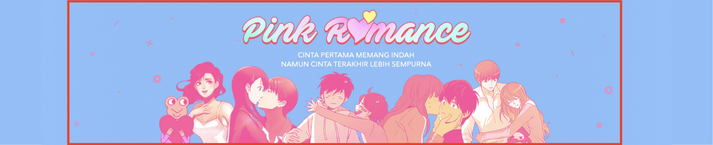
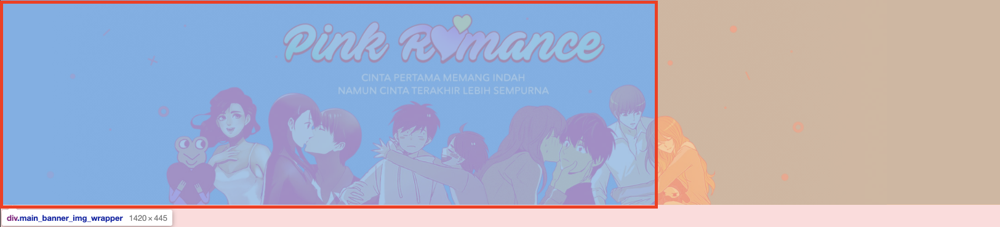
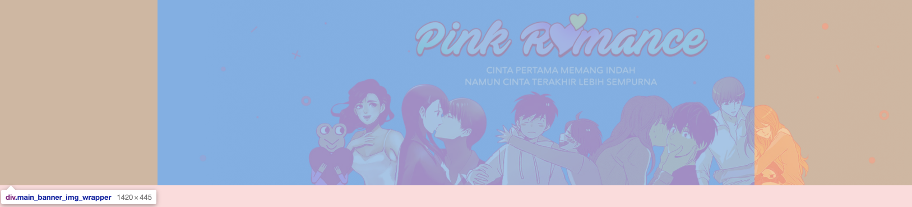
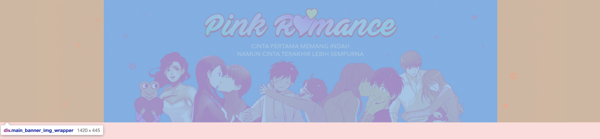
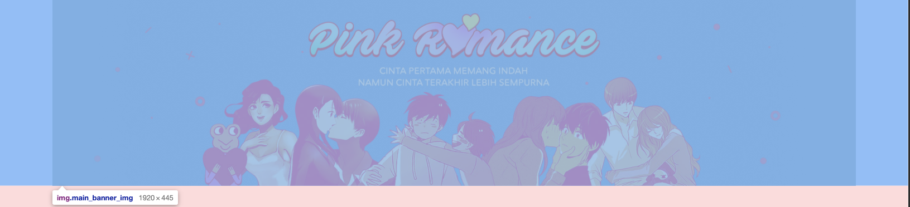
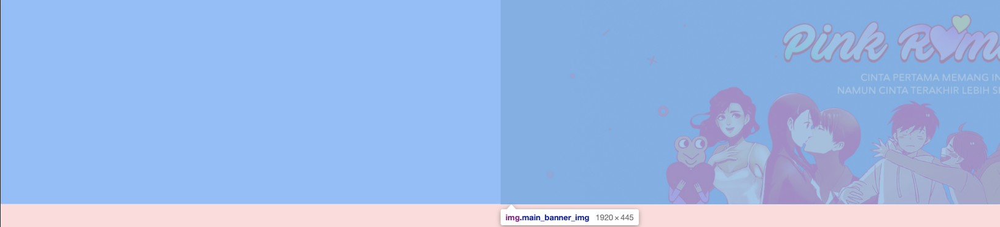
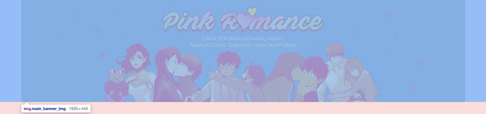

# html css로 이미지 수평 중앙 정렬하는 방법

::: tip 💡이 포스팅을 읽으면
브라우저 사이즈에 상관 없이 이미지를 수평 중앙 정렬할 수 있습니다.
:::

이미지 수평 정렬하는 케이스는 여러가지가 있는데요. <br>
**브라우저 사이즈에 상관없이 이미지를 화면의 수평 중앙 정렬 시키는 방법**에 대해 알아보겠습니다.



수평 정렬이면 그냥 `margin: auto` 쓰면 되는거 아냐? 라고 생각하실 수 있지만<br>
이미지보다 너비가 작은 레이아웃에서도 이미지를 중앙 정렬 시킬 때는 `margin: auto` 속성만으로는 동작이 안됩니다.

이미지 수평 정렬의 경우 이미지를 감싸고 있는 요소의 상태에 따라서 나눠서 생각해볼 수 있는데요.
아래와 같이 두 가지 케이스로 나누어서 정리해보겠습니다.

1. 전체 레이아웃이 고정 너비를 가지는 경우
2. 전체 레이아웃의 너비와 상관 없는 정렬방법

### 1. 전체 레이아웃이 고정 너비를 가지는 경우

이미지가 전체 레이아웃의 너비보다 큰 경우가 있을 수 있는데요.
이런 경우에도 이미지를 중앙 정렬 시킬 수 있습니다. <br>
예를 들어 이미지의 너비는 1920, wrapper의 최소 너비는 1420으로 고정이 되어있을 경우에 아래와 같이 중앙정렬 시킬 수 있습니다.

#### 1.1 wrapper의 최소 width 값을 갖는 태그로 이미지 감싸기

1920사이즈의 이미지를 고정 레이아웃 너비인 1420px 인 div로 감싸줍니다.

```html
<div class="banner">
  <div class="banner_img_wrapper">
    
  </div>
</div>
```

```css
.banner {
  display: block;
  background-color: #8abefa;
}

.banner_img_wrapper {
  width: 1420px;
}
```



#### 1.2 `banner_img_wrapper`중앙정렬

```css
.banner_img_wrapper {
  width: 1420px;
  margin: 0 auto;
}
```



이렇게 이미지를 감싸는 요소에 추가하면 `banner_img_wrapper`가 항상 화면 중앙에 위치하게됩니다. <br>
하지만 실제 이미지의 위치 값은 `banner_img_wrapper`를 기준으로 시작하기 때문에 우측으로 치우치게 됩니다. <br>
1920사이즈의 이미지는 1420 요소에 넣게 되면 500px이 넘치게 되므로 이것의 절반만큼 이동시켜준다면 이미지 또한 화면의 중앙에 올 수 있습니다.

#### 1-3 이미지 위치 보정

```css
.banner_img {
  margin-left: -250px;
}
```





이미지가 중앙 정렬된 모습을 확인하실 수 있습니다. <br>
이런 방법은 레이아웃도 1420px로 고정되어있고 이미지도 1920px로 고정되어있는 경우에만 사용할 수 있다는 제약이 있습니다. <br>
요즘 서비스의 경우 이렇게 고정 너비를 사용하는 서비스가 많지 않기 때문에 이렇게 해결할 수 있는 경우는 드물 것이라고 생각되네요.

### 2. wrapper의 사이즈에 상관 없는 정렬방법

그럼 이제 고정 레이아웃이 아닌 레이아웃의 너비에 상관 없이
이미지를 수평 중앙 정렬할 수 있는 방법에 대해서 정리해봅니다.

```html
<div class="banner">
  
</div>
```

```css
.banner {
  display: block;
  background-color: #8abefa;
}

.banner_img {
  position: relative;
  left: 50%;
}
```

이번에는 이미지를 감싸는 요소는 없이 작업이 가능합니다.

1. 이미지를 화면의 절만만큼 오른쪽으로 이동
2. 이미지를 이미지의 절반만큼 왼쪽으로 이동

위와 같은 방식으로 이미지 위치를 이동시키면 **레이아웃의 너비에 상관 없이 항상 이미지는 중앙에 위치**할 수 있습니다.

#### 2.1 이미지를 화면의 절만만큼 오른쪽으로 이동

left:50% 속성을 통해서 현재 레이아웃에 50% 지점에서 이미지가 위치할 수 있도록 작성해줍니다.

```css
.banner_img {
  position: relative;
  left: 50%;
}
```



#### 2.2 이미지를 이미지의 절반만큼 왼쪽으로 이동

그 다음에는 이미지를 왼쪽으로 이미지 사이즈의 절반만큼 이동시켜야합니다.

```css
.banner_img {
  position: relative;
  left: 50%;
  margin-left: -960px;
}
```

이미지 사이즈의 절반인 960만큼 margin-left의 - 값으로 이동시켰는데요. <br>
이렇게 이미지의 사이즈가 고정적인 경우에는 css에 값을 넣어두는 방식으로 작성할 수 있지만
이미지의 값이 유동적일 경우 이렇게 값을 지정해둘 수 없는데요.

그럴 경우에는 아래와 같이 transform속성을 통해서 작성할 수 있습니다.

```css
.banner_img {
  position: relative;
  left: 50%;
  transform: translateX(-50%);
}
```



#### 2.3 스크롤 블락

이런 방식으로 이미지를 중앙에 위치시키게 되면
이미지 사이즈가 브라우저 사이즈보다 크게 되기 때문에
스크롤이 발생하기 때문에 이미지를 감싸는 태그에 `overflow:hidden`을 줘야합니다.

```css
.banner {
  display: block;
  overflow: hidden;
}
```

이런식으로 이미지를 수평 중앙 정렬하는 방법에 대해서 정리해보았습니다.
다음은 이미지를 수직 정렬하는 방법에 대해서 정리해보도록 하겠습니다.
