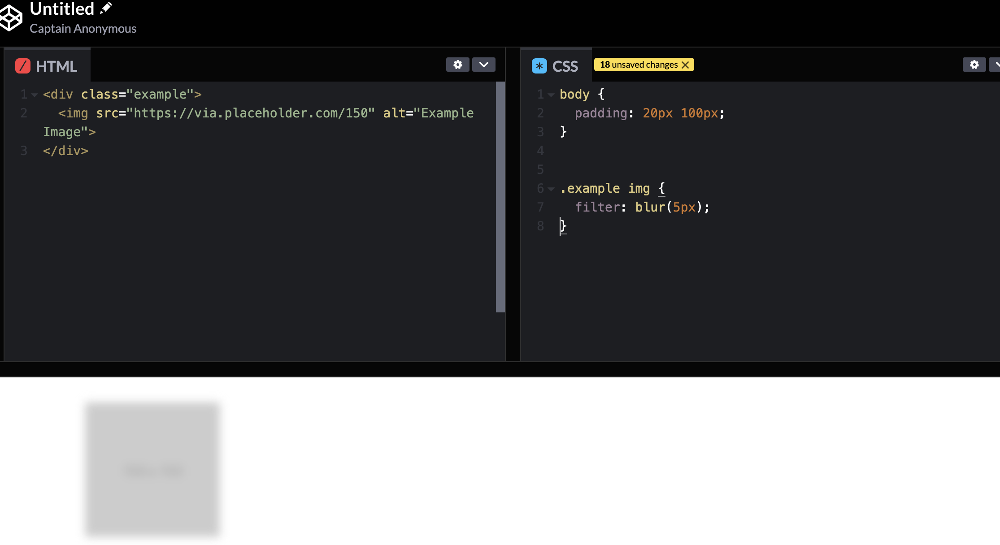
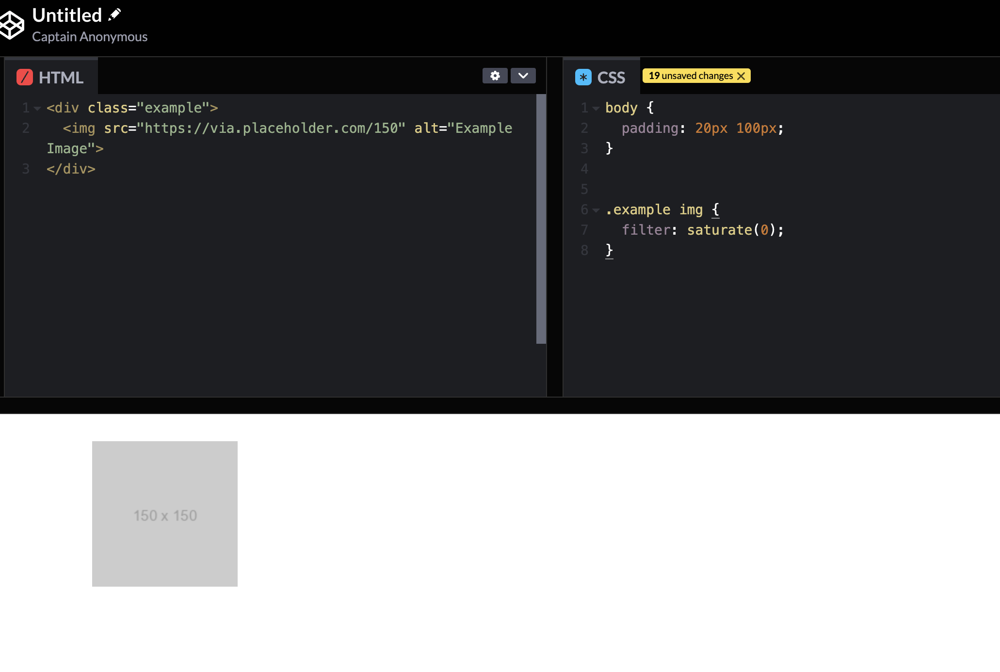
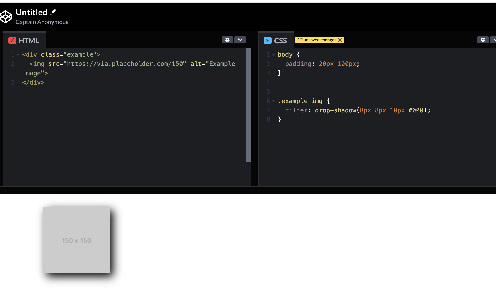
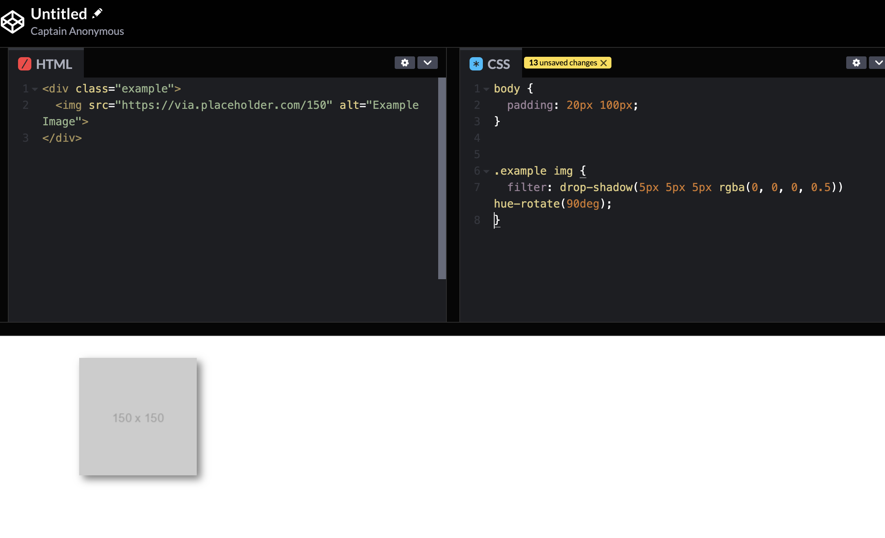
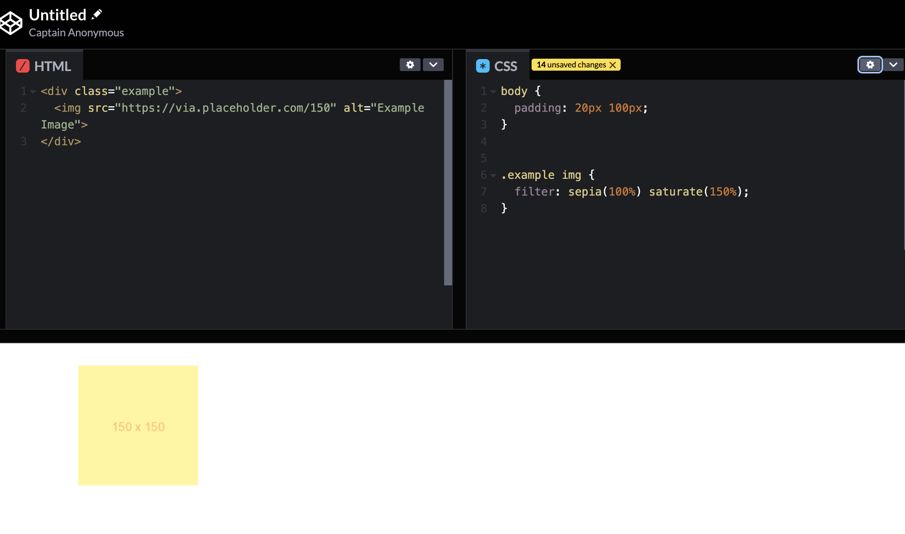
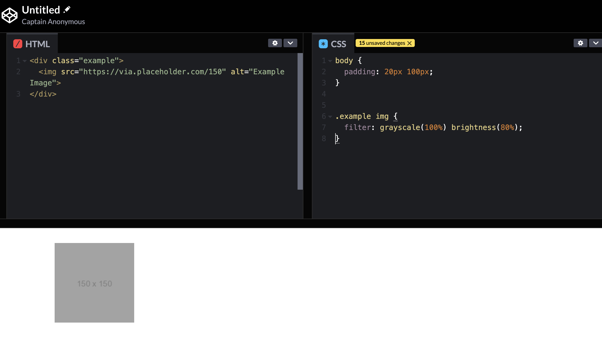
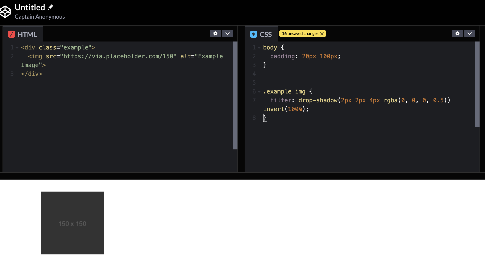

# CSS Filter로 다양한 효과 주는 방법 (블러,흑백,반전)

::: tip 💡이 포스팅을 읽으면

:::

## CSS 필터: 웹 요소에 시각적 효과 추가하기

CSS 필터는 웹 개발자들이 이미지와 그래픽 요소에 다양한 시각적 효과를 적용할 수 있게 해주는 강력한 도구입니다. 이를 통해 그림자, 흐림, 색상 변형 등 다양한 효과를 손쉽게 적용할 수 있습니다.

## 필터 속성

CSS 필터는 filter 속성을 통해 적용됩니다. 이 속성에는 다양한 필터 함수가 존재하며, 각 함수는 특정한 시각적 효과를 나타냅니다. 주요 필터 함수에 대한 설명은 다음과 같습니다:

- blur(): 요소에 블러 효과를 적용합니다. 이 함수는 blur() 함수의 매개변수로 흐리게 하고자 하는 정도를 지정합니다.
- brightness(): 요소의 밝기를 조절합니다. brightness() 함수의 매개변수는 0부터 1 사이의 값으로 지정하며, 1보다 큰 값으로 밝기를 높일 수 있습니다.
- contrast(): 요소의 대비를 조절합니다. contrast() 함수의 매개변수는 대비를 조절하는 비율을 나타냅니다.
- drop-shadow(): 요소에 그림자 효과를 추가합니다. 이 함수는 그림자의 위치, 흐림 정도, 색상 등을 설정할 수 있습니다.
- grayscale(): 요소를 흑백으로 변환합니다. grayscale() 함수의 매개변수는 흑백으로 변환할 정도를 나타냅니다.
- hue-rotate(): 요소의 색상을 회전시킵니다. hue-rotate() 함수의 매개변수는 각도로 지정되며, 색상을 회전시킴으로써 다양한 색상 효과를 만들 수 있습니다.
- invert(): 요소의 색상을 반전시킵니다. invert() 함수의 매개변수는 반전시킬 정도를 나타냅니다.
- opacity(): 요소의 투명도를 조절합니다. opacity() 함수의 매개변수는 0부터 1 사이의 값으로 지정하며, 요소의 투명도를 조절합니다.
- saturate(): 요소의 채도를 조절합니다. saturate() 함수의 매개변수는 채도를 조절하는 비율을 나타냅니다.
- sepia(): 요소에 세피아 효과를 적용합니다. sepia() 함수의 매개변수는 세피아 효과를 적용하는 정도를 나타냅니다.

```css
/* 이미지에 블러 효과 적용 */
.blur {
  filter: blur(5px);
}
```



```css
/* 이미지의 채도를 감소시킴 */
.desaturate {
  filter: saturate(0);
}
```



```css
/* 그림자 효과 추가 */
.shadow {
  filter: drop-shadow(8px 8px 10px #000);
}
```



```css
/* 이미지에 그림자와 회전 효과를 적용 */
.image-effect {
  filter: drop-shadow(5px 5px 5px rgba(0, 0, 0, 0.5)) hue-rotate(90deg);
}
```



```css
/* 이미지에 세피아 효과와 채도 조절 효과를 적용 */
.sepia-effect {
  filter: sepia(100%) saturate(150%);
}
```



```css
/* 배경 이미지에 흑백 필터와 밝기 조절 효과를 적용 */
.background-effect {
  filter: grayscale(100%) brightness(80%);
}
```



```css
/* 텍스트에 그림자와 색상 반전 효과를 적용 */
.text-effect {
  filter: drop-shadow(2px 2px 4px rgba(0, 0, 0, 0.5)) invert(100%);
}
```



## 브라우저 호환성

대부분의 최신 브라우저에서 CSS 필터가 지원되지만, 모든 필터가 모든 브라우저에서 완벽하게 작동하지는 않을 수 있습니다. 특히 오래된 브라우저나 모바일 기기에서는 일부 필터가 제대로 지원되지 않을 수 있으니 이 점을 유의해야 합니다.
