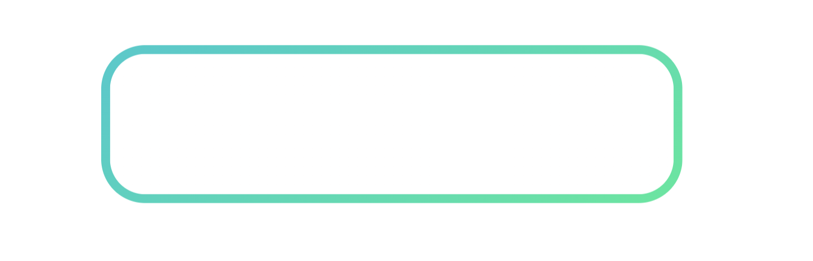
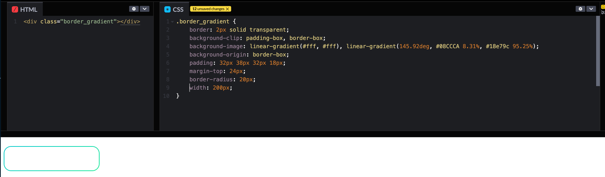
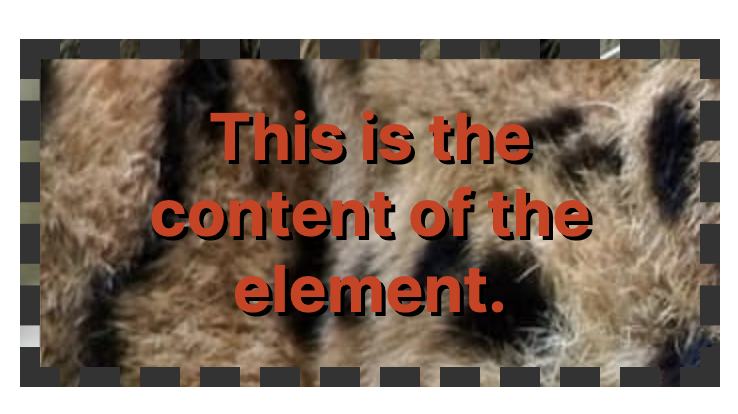
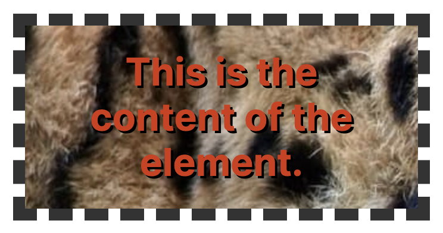
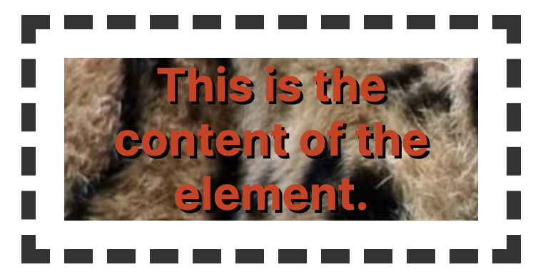

# css로 border 그라데이션 적용하는 방법



::: tip 💡이 포스팅을 읽으면

:::

디자인도 발전하면서 border에 단색보다는 그라데이션을 넣는 경우들이 많이 있는데요.
css를 사용해서 border에 그라데이션 넣는 방법에 대해서 정리해보려고 합니다.

바쁘신 분들은 아래 코드를 그대로 사용하시면 됩니다.

## 결과 코드



<!-- ui-log 수평형 -->

<ins class="adsbygoogle"
     style="display:block"
     data-ad-client="ca-pub-4877378276818686"
     data-ad-slot="9743150776"
     data-ad-format="auto"
     data-full-width-responsive="true"></ins>
<component is="script">
(adsbygoogle = window.adsbygoogle || []).push({});
</component>

```css
.border_gradient {
  border: 2px solid transparent;
  background-clip: padding-box, border-box;
  background-image: linear-gradient(#fff, #fff), linear-gradient(145.92deg, $color-MT01 8.31%, #18e79c 95.25%);
  background-origin: border-box;
  padding: 32px 38px 32px 18px;
  margin-top: 24px;
  border-radius: 20px;
  width: 200px;
}
```

## background-clip

어떻게 그라데이션 border를 적용했는지 알아보려면 background-clip에 대해서 알아야 합니다.

`background-clip`은 CSS 속성 중 하나로, 배경 이미지 또는 색상이 요소의 테두리 상자, 패딩 상자 또는 콘텐츠 상자에만 보이도록 지정하는 데 사용됩니다. 이것은 일반적으로 다른 요소들과 겹쳐지거나 잘린 부분을 조절하는 데 유용합니다.

`background-clip` 속성에는 세 가지 값이 있습니다:

1. `border-box`: 배경이 요소의 테두리 상자에만 표시됩니다.
2. `padding-box`: 배경이 요소의 패딩 상자에만 표시됩니다. 이는 테두리가 있는 경우 테두리를 넘어가지 않고 패딩 안에 배경을 제한하는 데 사용됩니다.
3. `content-box`: 배경이 요소의 콘텐츠 상자에만 표시됩니다. 이는 테두리와 패딩을 무시하고 배경을 콘텐츠 영역에만 표시하는 데 사용됩니다.

이제 각 값에 대한 데모 코드를 작성해 보겠습니다.

### `border-box` 데모



```html
<!DOCTYPE html>
<html lang="en">
  <head>
    <meta charset="UTF-8" />
    <meta name="viewport" content="width=device-width, initial-scale=1.0" />
    <title>background-clip Demo</title>
    <style>
      .box {
        width: 200px;
        height: 100px;
        background-image: linear-gradient(to right, red, yellow);
        border: 10px solid blue;
        background-clip: border-box;
      }
    </style>
  </head>
  <body>
    <div class="box"></div>
  </body>
</html>
```

<!-- ui-log 수평형 -->

<ins class="adsbygoogle"
     style="display:block"
     data-ad-client="ca-pub-4877378276818686"
     data-ad-slot="9743150776"
     data-ad-format="auto"
     data-full-width-responsive="true"></ins>
<component is="script">
(adsbygoogle = window.adsbygoogle || []).push({});
</component>

### `padding-box` 데모



```html
<!DOCTYPE html>
<html lang="en">
  <head>
    <meta charset="UTF-8" />
    <meta name="viewport" content="width=device-width, initial-scale=1.0" />
    <title>background-clip Demo</title>
    <style>
      .box {
        width: 200px;
        height: 100px;
        background-image: linear-gradient(to right, red, yellow);
        border: 10px solid blue;
        padding: 20px;
        background-clip: padding-box;
      }
    </style>
  </head>
  <body>
    <div class="box"></div>
  </body>
</html>
```

### `content-box` 데모

<!-- ui-log 수평형 -->

<ins class="adsbygoogle"
     style="display:block"
     data-ad-client="ca-pub-4877378276818686"
     data-ad-slot="9743150776"
     data-ad-format="auto"
     data-full-width-responsive="true"></ins>
<component is="script">
(adsbygoogle = window.adsbygoogle || []).push({});
</component>



```html
<!DOCTYPE html>
<html lang="en">
  <head>
    <meta charset="UTF-8" />
    <meta name="viewport" content="width=device-width, initial-scale=1.0" />
    <title>background-clip Demo</title>
    <style>
      .box {
        width: 200px;
        height: 100px;
        background-image: linear-gradient(to right, red, yellow);
        border: 10px solid blue;
        padding: 20px;
        background-clip: content-box;
      }
    </style>
  </head>
  <body>
    <div class="box"></div>
  </body>
</html>
```

이 데모 코드는 각 값에 따라 배경이 어떻게 표시되는지를 시각적으로 보여줍니다.

## background-origin

`background-origin`은 CSS 속성 중 하나로, 배경 이미지의 위치를 지정하는 데 사용됩니다. 이 속성을 사용하여 배경 이미지가 요소 내에서 어디에서 시작해야 하는지를 결정할 수 있습니다. `background-origin` 속성에는 세 가지 값이 있습니다:

1. `padding-box`: 배경이 요소의 패딩 상자에 맞춰집니다. 따라서 배경 이미지는 테두리 상자를 빼고 패딩 상자 내부에서 시작합니다.
2. `border-box`: 배경이 요소의 테두리 상자에 맞춰집니다. 따라서 배경 이미지는 테두리를 포함한 요소의 전체 영역에서 시작합니다.
3. `content-box`: 배경이 요소의 콘텐츠 상자에 맞춰집니다. 따라서 배경 이미지는 요소의 내부 콘텐츠 영역에서 시작합니다.

이제 각 값에 대한 데모 코드를 작성해 보겠습니다.

### `padding-box` 데모

```html
<!DOCTYPE html>
<html lang="en">
  <head>
    <meta charset="UTF-8" />
    <meta name="viewport" content="width=device-width, initial-scale=1.0" />
    <title>background-origin Demo</title>
    <style>
      .box {
        width: 200px;
        height: 100px;
        background-image: linear-gradient(to right, red, yellow);
        border: 10px solid blue;
        padding: 20px;
        background-origin: padding-box;
      }
    </style>
  </head>
  <body>
    <div class="box"></div>
  </body>
</html>
```

### `border-box` 데모

```html
<!DOCTYPE html>
<html lang="en">
  <head>
    <meta charset="UTF-8" />
    <meta name="viewport" content="width=device-width, initial-scale=1.0" />
    <title>background-origin Demo</title>
    <style>
      .box {
        width: 200px;
        height: 100px;
        background-image: linear-gradient(to right, red, yellow);
        border: 10px solid blue;
        padding: 20px;
        background-origin: border-box;
      }
    </style>
  </head>
  <body>
    <div class="box"></div>
  </body>
</html>
```

### `content-box` 데모

```html
<!DOCTYPE html>
<html lang="en">
  <head>
    <meta charset="UTF-8" />
    <meta name="viewport" content="width=device-width, initial-scale=1.0" />
    <title>background-origin Demo</title>
    <style>
      .box {
        width: 200px;
        height: 100px;
        background-image: linear-gradient(to right, red, yellow);
        border: 10px solid blue;
        padding: 20px;
        background-origin: content-box;
      }
    </style>
  </head>
  <body>
    <div class="box"></div>
  </body>
</html>
```

<!-- ui-log 수평형 -->

<ins class="adsbygoogle"
     style="display:block"
     data-ad-client="ca-pub-4877378276818686"
     data-ad-slot="9743150776"
     data-ad-format="auto"
     data-full-width-responsive="true"></ins>
<component is="script">
(adsbygoogle = window.adsbygoogle || []).push({});
</component>

이 데모 코드는 각 값에 따라 배경이 요소 내에서 어떻게 시작되는지를 시각적으로 보여줍니다.

이렇게 background-clip과 background-origin 속성을 이용해서 배경이 어떻게 어디서부터 어디까지 보일지 결정을 한 후에
투명 border를 설정해줍니다. 그런 다음 background-image를 통해서 원하는 그라데이션을 넣어주게 되면 투명 테두리에만 배경이 적용되어서 저희가 원하는 border 그라디언트를 적용할 수 있습니다.

border에 그라데이션을 적용하는 방법은 다른 방법도 있지만 border-radius를 같이 적용하기 위해서는 꼭 background-clip과 background-origin 속성을 같이 사용하여야 한다는 점을 알아두어야 합니다.
