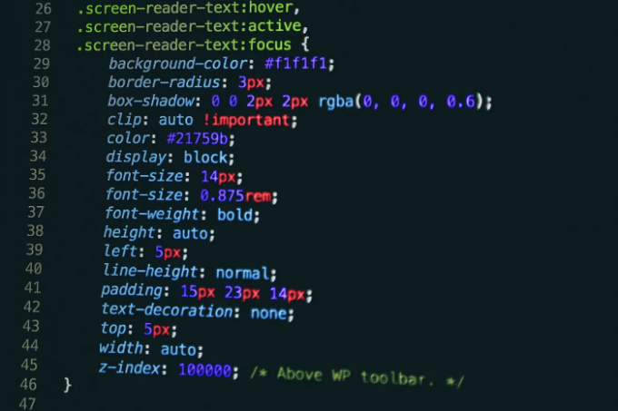

# HTML CSS로 레이아웃 잡는 방법 10가지

10가지 한 줄들로 HTML CSS로 레이아웃을 잡는데 도움이 되는 속성들에 대해서 소개하려고 합니다.



<!-- ui-log 수평형 -->

<ins class="adsbygoogle"
     style="display:block"
     data-ad-client="ca-pub-4877378276818686"
     data-ad-slot="9743150776"
     data-ad-format="auto"
     data-full-width-responsive="true"></ins>
<component is="script">
(adsbygoogle = window.adsbygoogle || []).push({});
</component>

## 목차

- Flexbox 가운데 정렬
- Grid 가운데 정렬
- 전체 페이지 이미지 배경
- 반응형 정사각형
- 고정 푸터
- 동일한 너비의 열
- 원형 요소
- 유동적인 타이포그래피
- 다중 열 텍스트
- 반응형 정사각형 그리드

<!-- ui-log 수평형 -->

<ins class="adsbygoogle"
     style="display:block"
     data-ad-client="ca-pub-4877378276818686"
     data-ad-slot="9743150776"
     data-ad-format="auto"
     data-full-width-responsive="true"></ins>
<component is="script">
(adsbygoogle = window.adsbygoogle || []).push({});
</component>

## 1) Flexbox 가운데 정렬:

예시:

```css
.container {
  display: flex;
  justify-content: center;
  align-items: center;
}
```

## 2) Grid 가운데 정렬:

예시:

```css
.container {
  display: grid;
  place-items: center;
}
```

## 3) 전체 페이지 이미지 배경:

예시:

```css
body {
  background: url("image.jpg") center/cover no-repeat;
}
```

<!-- ui-log 수평형 -->

<ins class="adsbygoogle"
     style="display:block"
     data-ad-client="ca-pub-4877378276818686"
     data-ad-slot="9743150776"
     data-ad-format="auto"
     data-full-width-responsive="true"></ins>
<component is="script">
(adsbygoogle = window.adsbygoogle || []).push({});
</component>

## 4) 반응형 정사각형:

예시:

```css
.square {
  aspect-ratio: 1/1;
}
```

## 5) 고정 푸터:

예시:

```css
body {
  display: flex;
  flex-direction: column;
  min-height: 100vh;
}

.content {
  flex: 1;
}
```

<!-- ui-log 수평형 -->

<ins class="adsbygoogle"
     style="display:block"
     data-ad-client="ca-pub-4877378276818686"
     data-ad-slot="9743150776"
     data-ad-format="auto"
     data-full-width-responsive="true"></ins>
<component is="script">
(adsbygoogle = window.adsbygoogle || []).push({});
</component>

## 6) 동일한 너비의 열:

예시:

```css
.column {
  flex: 1;
}
```

## 7) 원형 요소:

예시:

```css
.circle {
  border-radius: 50%;
}
```

## 8) 너비에 따라 변하는 폰트 사이즈:

예시:

```css
body {
  font-size: calc(1rem + 1vw);
}
```

<!-- ui-log 수평형 -->

<ins class="adsbygoogle"
     style="display:block"
     data-ad-client="ca-pub-4877378276818686"
     data-ad-slot="9743150776"
     data-ad-format="auto"
     data-full-width-responsive="true"></ins>
<component is="script">
(adsbygoogle = window.adsbygoogle || []).push({});
</component>

## 9) 다중 열 텍스트:

예시:

```css
.text {
  column-count: 3;
  column-gap: 1rem;
}
```

## 10) 반응형 정사각형 그리드:

예시:

```css
.grid {
  display: grid;
  grid-template-columns: repeat(auto-fit, minmax(100px, 1fr));
  gap: 1rem;
}
```

# 결론:

CSS 레이아웃 기술을 마스터하는 것은 현대적이고 반응형 웹 디자인을 만드는 데 필수적입니다.
간단한 속성들이지만 실제 프론트엔드 개발할 때 사용하시면 많이 도움이 되실거에요!
