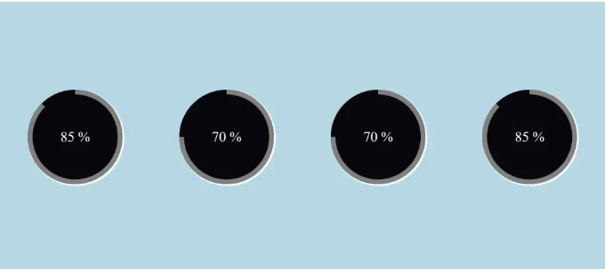

# HTML CSS로 원형 프로그레스바 만드는 방법

오늘은 HTML과 CSS를 사용하여 원형 프로그레스바를 만들어 보겠습니다. 애플리케이션에서 프로세스의 진행 상황은 프로그레스 바를 통해 표시됩니다. 완료된 프로세스의 양과 아직 남아 있는 양은 프로그레스 바로 표시됩니다. 우리는 HTML을 사용하여 프로그레스 바의 다양한 부분을 설계하고, CSS 속성을 사용하여 프로그레스 바를 사용자 정의할 수 있습니다.



<!-- ui-log 수평형 -->

<ins class="adsbygoogle"
     style="display:block"
     data-ad-client="ca-pub-4877378276818686"
     data-ad-slot="9743150776"
     data-ad-format="auto"
     data-full-width-responsive="true"></ins>
<component is="script">
(adsbygoogle = window.adsbygoogle || []).push({});
</component>

이 애니메이션은 페이지를 로드할 때 0부터 지정된 값을 변경합니다. 텍스트의 일부가 애니메이션되지만 이 텍스트는 애니메이션되지 않습니다.

이 튜토리얼은 원형 프로그레스 바를 만드는 각 단계를 안내합니다. 원형 프로그레스 바를 만들려면 기본적인 HTML 및 CSS 개념에 익숙해야 합니다.

# Step1: 기본 구조와 스타일링 추가

먼저, 원형 프로그레스 바의 컨테이너를 추가해야 합니다. 원형 프로그레스 바의 컨테이너는 div 태그를 사용하여 만들 것입니다.

```html
<div class="container"></div>
```

<!-- ui-log 수평형 -->

<ins class="adsbygoogle"
     style="display:block"
     data-ad-client="ca-pub-4877378276818686"
     data-ad-slot="9743150776"
     data-ad-format="auto"
     data-full-width-responsive="true"></ins>
<component is="script">
(adsbygoogle = window.adsbygoogle || []).push({});
</component>

이제 우리의 원형 프로그레스 바에는 컨테이너가 있습니다.

모든 요소에 대해 universal selector를 사용하여 스타일을 추가할 것입니다. box-sizing 속성을 "border-box"로 설정할 것입니다. padding과 margin은 모두 "0"의 값을 갖습니다.

```css
* {
  box-sizing: border-box;
  padding: 0;
  margin: 0;
}
```

```css
.container {
  display: flex;
  justify-content: space-around;
  flex-wrap: wrap;
  background-color: lightblue;
  height: 100vh;
  align-items: center;
}
```

<!-- ui-log 수평형 -->

<ins class="adsbygoogle"
     style="display:block"
     data-ad-client="ca-pub-4877378276818686"
     data-ad-slot="9743150776"
     data-ad-format="auto"
     data-full-width-responsive="true"></ins>
<component is="script">
(adsbygoogle = window.adsbygoogle || []).push({});
</component>

클래스 선택자를 사용하여 (.container). display는 "flex"로 설정되었고, justify-content 속성을 사용하여 각 프로그레스 바 주위에 공간을 지정했습니다. background-color 속성을 사용하여 프로젝트에 연한 파란색 배경색을 지정할 것입니다.


# Step2: 원형 추가

원형 프로그레스 바를 만들기 위해 HTML과 CSS를 사용합니다. 우리의 컨테이너 내부에 새로운 div를 만들고 클래스(progress)를 사용할 것입니다. 우리의 CSS에서 클래스 선택기를 사용하여 프로젝트에 원을 얻을 것입니다.

```html
<div class="container">
  <div class="progress"></div>
</div>
```

```html
  </div>
</div>
```

```css
.progress {
  width: 200px;
  height: 200px;
  font-size: 30px;
  color: #fff;
  border-radius: 50%;
  overflow: hidden;
  position: relative;
  background: #07070c;
  text-align: center;
  line-height: 200px;
  margin: 20px;
  box-shadow: 2px 2px 2px 2px white;
}
```

```css
.progress::after {
  content: "";
}
```

<!-- ui-log 수평형 -->

<ins class="adsbygoogle"
     style="display:block"
     data-ad-client="ca-pub-4877378276818686"
     data-ad-slot="9743150776"
     data-ad-format="auto"
     data-full-width-responsive="true"></ins>
<component is="script">
(adsbygoogle = window.adsbygoogle || []).push({});
</component>

클래스 선택자를 사용합니다 (.progress). 너비와 높이는 모두 200px로 설정됩니다. font-size 속성을 사용하여 글꼴 크기를 30px로 설정할 것입니다. 원 모양을 주기 위해 border-radius 기능을 활용할 것입니다. 원의 외관을 만들기 위해 그의 border-radius를 50%로 설정할 것입니다. 현재 사용하는 원은 검은 배경을 가지고 있습니다. 우리는 또한 원에 3D 모양을 주기 위해 box-shadow를 추가했습니다.


# Step2: 원에 입력 추가

이제 span 태그를 사용하여 원에 숫자 입력을 추가하고 값을 0부터 85까지 조정할 것입니다. 우리의 원형 프로그레스 바에 진행 모션을 추가하기 위해 우리는 우리의 progress div에서 3개의 div를 만들 것입니다. 먼저 클래스가 있는 div를 만들 것입니다 (overlay).

```html
<div class="container">
  <div class="progress">
    <span class="title timer" data-from="0" data-to="85" data-speed="1800"> 85 </span>
    <div class="overlay"></div>
    <div class="left"></div>
    <div class="right"></div>
  </div>
</div>
```

<!-- ui-log 수평형 -->

<ins class="adsbygoogle"
     style="display:block"
     data-ad-client="ca-pub-4877378276818686"
     data-ad-slot="9743150776"
     data-ad-format="auto"
     data-full-width-responsive="true"></ins>
<component is="script">
(adsbygoogle = window.adsbygoogle || []).push({});
</component>

overlay를 사용하여 50% 너비와 100% 높이를 추가합니다. position은 "absolute"로 설정됩니다. 우리의 원형 프로그레스 바의 절반은 오버레이로만 스타일이 적용됩니다. background-color 속성을 사용하여 overlay에 검은 배경을 추가했습니다.

```css
.progress .overlay {
  width: 50%;
  height: 100%;
  position: absolute;
  top: 0;
  left: 0;
  z-index: 1;
  background-color: #07070c;
}
```

# Step 2: 원에 애니메이션 프로그레스 바 추가

container 태그에서 지정한 div를 사용하여 진행 상황을 추가할 것입니다. 두 개의 div를 만들고 "left"와 "right" 클래스를 지정했습니다. 우리는 이것들을 사용하여 원에 진행 바를 주기 위해 사용할 것입니다.

<!-- ui-log 수평형 -->

<ins class="adsbygoogle"
     style="display:block"
     data-ad-client="ca-pub-4877378276818686"
     data-ad-slot="9743150776"
     data-ad-format="auto"
     data-full-width-responsive="true"></ins>
<component is="script">
(adsbygoogle = window.adsbygoogle || []).push({});
</component>

```html
<div class="container">
  <div class="progress">
    <span class="title timer" data-from="0" data-to="85" data-speed="1800"> 85 </span>
    <div class="overlay"></div>
    <div class="left"></div>
    <div class="right"></div>
  </div>
</div>
```

두 가지 다른 클래스(.left &.right)를 사용하여 프로그레스 바를 추가할 것입니다. 높이는 100%, 너비는 50%로 설정합니다. 테두리 속성을 사용하여 10px의 단색 테두리를 추가할 것입니다. 우리는 테두리 반경을 사용하여 요소의 위쪽과 오른쪽 모서리에 100px의 테두리 반경을 추가할 것입니다.

이제 프로젝트에 애니메이션을 추가하기 위해 CSS의 간단한 개념을 사용했습니다. 애니메이션을 통해 요소는 한 스타일에서 다른 스타일로 점진적으로 전환됩니다. 원하는 대로 CSS 변경을 할 수 있으며 원할 때마다 변경할 수 있습니다. CSS 애니메이션을 사용하기 전에 먼저 애니메이션의 키프레임을 정의해야 합니다. 특정 시간에 요소가 가질 스타일은 키프레임에 저장됩니다.

여기서는 0.5초 동안 로드로 애니메이션을 사용한 후 linear forward를 사용하여 다른 애니메이션을 추가했습니다.

이제 키프레임을 사용하여 특정 시간 간격마다 다른 스타일을 추가할 것입니다.


<!-- ui-log 수평형 -->

<ins class="adsbygoogle"
     style="display:block"
     data-ad-client="ca-pub-4877378276818686"
     data-ad-slot="9743150776"
     data-ad-format="auto"
     data-full-width-responsive="true"></ins>
<component is="script">
(adsbygoogle = window.adsbygoogle || []).push({});
</component>

프로그레스 바는 값에 따라 조정되며, 다른 값을 갖는 세 개의 추가적인 원형 프로그레스 바를 추가했습니다. 한 프로그레스 바를 추가하는 방법을 알아보기 위해 더 많은 원형 바를 추가해 보세요. 이렇게 하면 더 잘 이해할 수 있습니다.

이제 프로젝트의 비디오 미리보기를 살펴보겠습니다.

# HTML 코드:

```html
<html></html>
```

```html
<head>
    <link rel="stylesheet" href="style.css">
    <title>원형 프로그레스 바</title>
</head>
<body>
    <div class="container">
        <div class="progress">
            <span class="title timer" data-from="0" data-to="85" data-speed="1800">85</span>
            <div class="overlay"></div>
            <div class="left"></div>
            <div class="right"></div>
        </div>
        <div class="progress">
            <span class="title timer" data-from="0" data-to="70" data-speed="1500">70</span>
            <div class="overlay"></div>
            <div class="left"></div>
            <div class="right"></div>
        </div>
        <div class="progress">
            <span class="title timer" data-from="0" data-to="70" data-speed="1500">70</span>
            <div class="overlay"></div>
            <div class="left"></div>
            <div class="right"></div>
        </div>
        <div class="progress">
            <span class="title timer" data-from="0" data-to="85" data-speed="1800">85</span>
            <div class="overlay"></div>
            <div class="left"></div>
            <div class="right"></div>
        </div>
    </div>
</body>
</html>
```

<!-- ui-log 수평형 -->

<ins class="adsbygoogle"
     style="display:block"
     data-ad-client="ca-pub-4877378276818686"
     data-ad-slot="9743150776"
     data-ad-format="auto"
     data-full-width-responsive="true"></ins>
<component is="script">
(adsbygoogle = window.adsbygoogle || []).push({});
</component>

# CSS 코드:

```css
* {
  box-sizing: border-box;
  padding: 0;
  margin: 0;
}
```

```css
.container {
  display: flex;
  justify-content: space-around;
  flex-wrap: wrap;
  background-color: lightblue;
  height: 100vh;
  align-items: center;
}
.progress {
  width: 200px;
  height: 200px;
  font-size: 30px;
  color: #fff;
  border-radius: 50%;
  overflow: hidden;
  position: relative;
  background: #07070c;
  text-align: center;
  line-height: 200px;
  margin: 20px;
  box-shadow: 2px 2px 2px 2px white;
}
.progress::after {
  content: "%";
}
.progress .title {
  position: relative;
  z-index: 100;
}
.progress .overlay {
  width: 50%;
  height: 100%;
  position: absolute;
  top: 0;
  left: 0;
  z-index: 1;
  background-color: #07070c;
}
.progress .left,
.progress .right {
  width: 50%;
  height: 100%;
  position: absolute;
  top: 0;
  left: 0;
  border: 10px solid gray;
  border-radius: 100px 0px 0px 100px;
  border-right: 0;
  transform-origin: right;
}
.progress .left {
  animation: load1 1s linear forwards;
}
.progress:nth-of-type(2) .right,
.progress:nth-of-type(3) .right {
  animation: load2 0.5s linear forwards 1s;
}
.progress:last-of-type .right,
.progress:first-of-type .right {
  animation: load3 0.8s linear forwards 1s;
}
@keyframes load1 {
  0% {
    transform: rotate(0deg);
  }
  100% {
    transform: rotate(180deg);
  }
}
@keyframes load2 {
  0% {
    z-index: 100;
    transform: rotate(180deg);
  }
  100% {
    z-index: 100;
    transform: rotate(270deg);
  }
}
@keyframes load3 {
  0% {
    z-index: 100;
    transform: rotate(180deg);
  }
  100% {
    z-index: 100;
    transform: rotate(315deg);
  }
}
```

이제 HTML 및 CSS를 사용하여 원형 프로그레스 바를 성공적으로 만들었습니다. IDE에 직접 복사하여 이 프로젝트를 사용할 수 있습니다. 이 프로젝트가 도움이 되었다면 코드에 댓글을 달아주시기 바랍니다!
