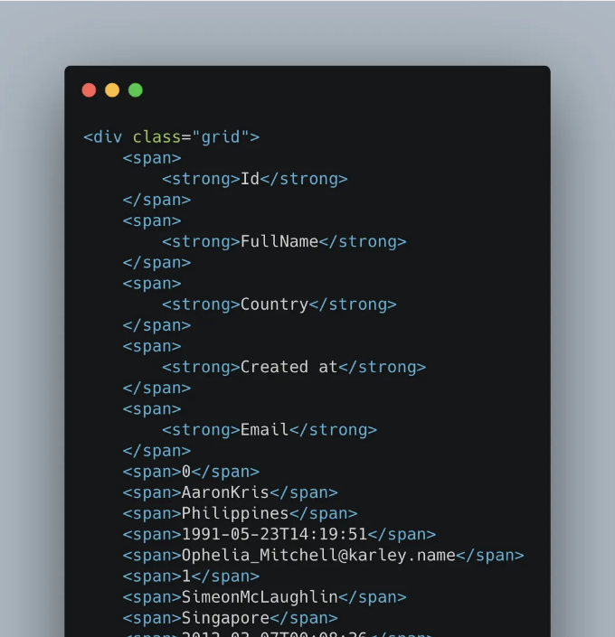
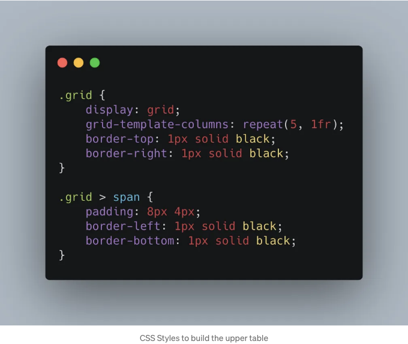
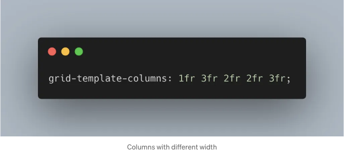
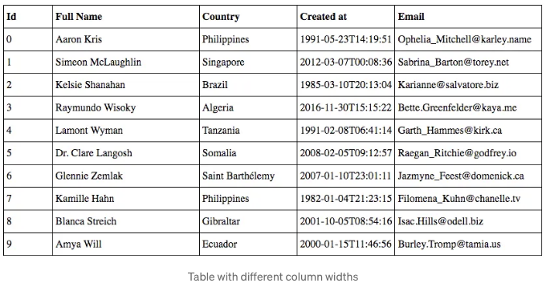
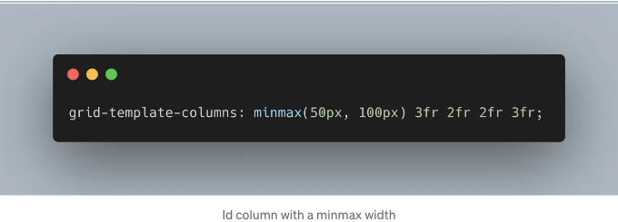
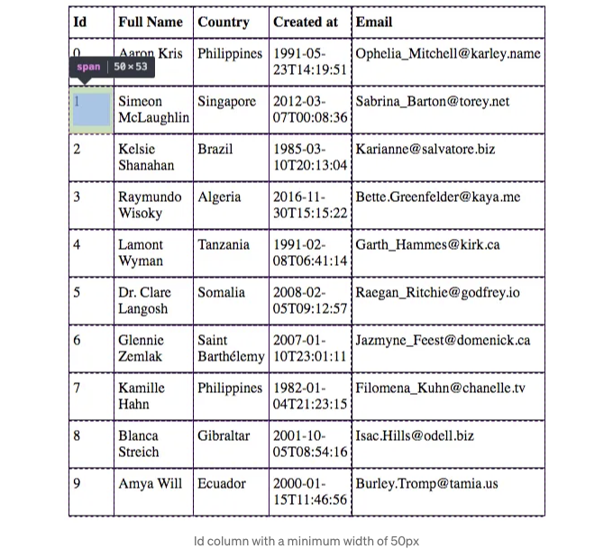
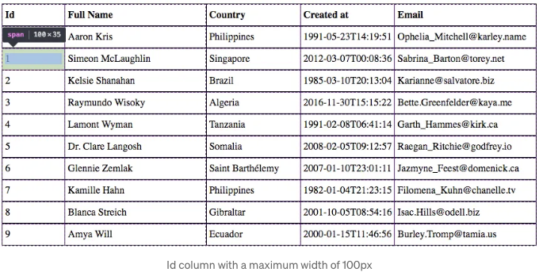

# HTML CSS로 반응형 테이블 만드는 방법

<!-- ui-log 수평형 -->

<ins class="adsbygoogle"
     style="display:block"
     data-ad-client="ca-pub-4877378276818686"
     data-ad-slot="9743150776"
     data-ad-format="auto"
     data-full-width-responsive="true"></ins>
<component is="script">
(adsbygoogle = window.adsbygoogle || []).push({});
</component>

이 글은 CSS Grid에 대한 통찰을 제공하고, 일상적인 작업에서 CSS Grid를 어떻게 활용하는지에 대한 예제를 제공하기 위한 것입니다.

그리드 레이아웃은 열과 행의 시스템을 사용하여 아름답고 간단한 레이아웃을 만들 수 있는 새로운 CSS 기능입니다. 웹 페이지의 디자인을 귀찮게하지 않고 만들 수 있게 해줍니다! 2017년 10월 이후로 모든 주요 브라우저에서 지원되고 있습니다.

Wes Bos가 제작한 이 멋진 강의를 보고 CSS Grid의 팬이 되었습니다!

Evodeck에서 일한 프로젝트 중 하나에서 그리드 레이아웃을 사용하여 데이터 테이블을 구현할 수 있는 기회를 보았고 시도해 보기로 결정했습니다. 개발 프로세스와 애플리케이션의 진행에 큰 영향을 미치지 않는 방식으로 변경하거나 롤백할 수 있는 작은 내용을 선택했습니다.

시각적인 목적으로, 가상의 사용자 데이터를 사용하여 작은 예제를 보여 드리겠습니다.

이 테이블의 CSS 코드는 몇 줄인가요?

<!-- ui-log 수평형 -->

<ins class="adsbygoogle"
     style="display:block"
     data-ad-client="ca-pub-4877378276818686"
     data-ad-slot="9743150776"
     data-ad-format="auto"
     data-full-width-responsive="true"></ins>
<component is="script">
(adsbygoogle = window.adsbygoogle || []).push({});
</component>

12줄입니다! 맞습니다. CSS에서 12줄의 코드만 있으면 되고 마법은 2번째와 3번째 줄에서 일어납니다. 여기서는 클래스가 grid인 HTML 요소가 내용을 그리드로 표시하고 각각의 5개 열이 사용 가능한 공간의 1fr로 설정되도록 지정했습니다! 😲 다른 설정은 필요 없으며, 이는 본질적으로 반응형입니다! 또한 CSS의 repeat() 함수를 사용했는데, 자세한 내용은 여기를 확인하십시오.

"1fr"이라는 마법 표현은 요소가 사용 가능한 공간의 일부분을 차지한다는 것을 의미합니다! 이를 통해 필요한만큼 많은 공간을 갖는 열을 만들고 고정 너비로 작업할 필요가 없어집니다! 😮

이제 다양한 너비의 열이 필요한 경우, 다음과 같이 지정하면 됩니다:

<!-- ui-log 수평형 -->

<ins class="adsbygoogle"
     style="display:block"
     data-ad-client="ca-pub-4877378276818686"
     data-ad-slot="9743150776"
     data-ad-format="auto"
     data-full-width-responsive="true"></ins>
<component is="script">
(adsbygoogle = window.adsbygoogle || []).push({});
</component>

여기서 말하는 바는 다음과 같습니다.

- "Id" 열은 사용 가능한 공간의 1fr을 차지해야 합니다.
- "Full Name"과 "Email" 열은 사용 가능한 공간의 3fr을 차지해야 합니다.
- "Country"와 "Created at" 열은 사용 가능한 공간의 2fr을 차지해야 합니다.

결과는 다음과 같습니다:

그리고 우리는 더 많은 것을 할 수 있습니다! 분수 대신 고정 너비로 작업하려면 minmax() 함수를 사용할 수도 있습니다. 예를 들어, 첫 번째 열의 너비를 최소 50px, 최대 100px로 고정하려면 코드는 다음과 같습니다:

그러면 최종 결과는 아래와 같습니다:

<!-- ui-log 수평형 -->

<ins class="adsbygoogle"
     style="display:block"
     data-ad-client="ca-pub-4877378276818686"
     data-ad-slot="9743150776"
     data-ad-format="auto"
     data-full-width-responsive="true"></ins>
<component is="script">
(adsbygoogle = window.adsbygoogle || []).push({});
</component>

<!-- ui-log 수평형 -->

<ins class="adsbygoogle"
     style="display:block"
     data-ad-client="ca-pub-4877378276818686"
     data-ad-slot="9743150776"
     data-ad-format="auto"
     data-full-width-responsive="true"></ins>
<component is="script">
(adsbygoogle = window.adsbygoogle || []).push({});
</component>

CSS Grid의 가장 일반적인 사용법은 grid-template-areas를 사용하여 레이아웃을 만드는 것이지만, 저는 테이블에도 매우 유용하다고 생각합니다!

요약하면, 저는 CSS Grid가 매우 유용하고 사용하기 쉽다고 생각하며, 미래가 있고 커뮤니티에서 잘 받아들여질 것이라고 생각합니다!

Grid를 Flexbox나 테이블보다 선택해야 하는 이유에 대한 세부 사항이나 논의에는 들어가지 않겠습니다. 단순히 Grid를 선택한 이유는 매우 쉽게 작업할 수 있고, 테이블보다 코드가 적게 들며, Flexbox보다 복잡하지 않으며, 무엇보다 Out-of-the-box에서 많은 기능을 제공하기 때문입니다!
