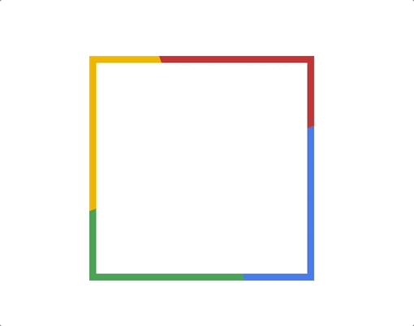
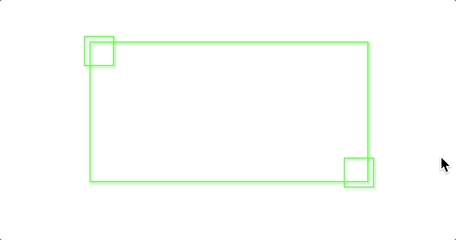

# linear-gradient를 활용한 여러가지 border 애니메이션 5가지

::: tip 목표
`linear-gradient`, `conic-gradient`,`hue-rotate` 등을 활용해 아래 5가지 border 애니메이션을 만드는 방법에 대해서 공유합니다.
단순 코드 공유가 아닌 결과물을 보고 애니메이션을 만들어가는 과정을 담아보려고 합니다.
:::

**1. 길이가 변하는 border 애니메이션**

**2. 움직이는 점선 border 애니메이션**

**3. 무지개 border 애니메이션**

**4. 빛나는 border 애니메이션**

**5. 색깔이 변하는 border 애니메이션**


<!-- ui-log 수평형 -->

<ins class="adsbygoogle"
     style="display:block"
     data-ad-client="ca-pub-4877378276818686"
     data-ad-slot="9743150776"
     data-ad-format="auto"
     data-full-width-responsive="true"></ins>
<component is="script">
(adsbygoogle = window.adsbygoogle || []).push({});
</component>

---

## 1. 길이가 변하는 border 애니메이션


첫 번째로 만들어볼 것은 마우스 오버 시 border 길이가 변하는 박스인데요.
좌측 상단과 우측 하단의 선의 길이가 변하는 것처럼 보이지만
아래 박스처럼 좌측 상단과 우측 하단의 사각형이 커졌다 작아졌다 하는 구조로 만들 수 있습니다.


여기서 적절한 위치의 border만 사용하면 원하는 결과를 얻을 수 있을 것 같습니다.
그리고 좌상단, 우하단 두 개의 사각형만 추가로 필요하므로 `::after`, `::before` 가상 요소만 사용하여 깔끔하게 작업할 수 있을 것 같습니다.

```css
.double_box {
  position: relative;
  border: 1px solid #0f0;
  width: 200px;
  height: 100px;
  cursor: pointer;

  &::before,
  &::after {
    content: "";
    position: absolute;
    width: 20px;
    height: 20px;
    transition: 0.2s ease-in-out;
  }

  &::before {
    top: -5px;
    left: -5px;
    border-top: 1px solid #0f0;
    border-left: 1px solid #0f0;
  }

  &::after {
    right: -5px;
    bottom: -5px;
    border-bottom: 1px solid #0f0;
    border-right: 1px solid #0f0;
  }

  &:hover::before,
  &:hover::after {
    width: calc(100% + 9px);
    height: calc(100% + 9px);
  }
}
```

<!-- ui-log 수평형 -->

<ins class="adsbygoogle"
     style="display:block"
     data-ad-client="ca-pub-4877378276818686"
     data-ad-slot="9743150776"
     data-ad-format="auto"
     data-full-width-responsive="true"></ins>
<component is="script">
(adsbygoogle = window.adsbygoogle || []).push({});
</component>

### 결과

`::before`, `::after` 가상 요소의 border와 사이즈를 변경해서 아래와 같은 길이가 변하는 border 애니메이션을 구현할 수 있습니다.

<iframe height="307.078125" style="width: 100%;" scrolling="no" title="Untitled" src="https://codepen.io/13akstjq/embed/yLEgPNe?default-tab=css%2Cresult" frameborder="no" loading="lazy" allowtransparency="true" allowfullscreen="true">
  See the Pen <a href="https://codepen.io/13akstjq/pen/yLEgPNe">
  Untitled</a> by 13akstjq (<a href="https://codepen.io/13akstjq">@13akstjq</a>)
  on <a href="https://codepen.io">CodePen</a>.
</iframe>

## 2. 움직이는 점선 애니메이션


두 번째로 만들어볼 것은 움직이는 점선 애니메이션인데요.
우선 점선 박스를 만들기 위해 border 속성 값인 dotted를 사용해 보겠습니다.

```css
border: 1px dotted #333;
```


하지만 border는 따로 animation을 제공하지 않기 때문에 움직이는 점선 애니메이션을 만들 수 없습니다.
그렇기 때문에 다른 방법으로 점선을 구현해야 합니다. 점선은 `linear-gradient` 로 아래와 같이 구현할 수 있습니다.

<!-- ui-log 수평형 -->

<ins class="adsbygoogle"
     style="display:block"
     data-ad-client="ca-pub-4877378276818686"
     data-ad-slot="9743150776"
     data-ad-format="auto"
     data-full-width-responsive="true"></ins>
<component is="script">
(adsbygoogle = window.adsbygoogle || []).push({});
</component>

```css
.dotted_box {
  background: linear-gradient(90deg, #333 50%, transparent 50%) 0 0 / 4px 1px repeat-x, /* 상 */ linear-gradient(90deg, #333 50%, transparent 50%) 0 100% / 4px 1px repeat-x,
    /* 하 */ linear-gradient(0, #333 50%, transparent 50%) 0 0 / 1px 4px repeat-y, /* 좌 */ linear-gradient(0, #333 50%, transparent 50%) 100% 0 / 1px 4px repeat-y; /* 우 */
}
```


점선 박스를 만들었으면 점선을 이동시켜서 움직이는 것처럼 애니메이션을 작성해야 합니다.
시계방향으로 회전하는 애니메이션을 만들고 싶다면 아래 애니메이션 \처럼 `background-position`을 각각 이동시켜주면 됩니다.

**시계 방향**

```css
@keyframes linearGradientMove {
  100% {
    /* 상  ,    하    ,   좌   ,  우    */
    background-position: 4px 0, -4px 100%, 0 -4px, 100% 4px;
  }
}
```

**반시계 방향**
반시계 방향이라면 아래와 같이 작성하면 됩니다.
복잡해보이지만 직접 작성해보면 어떻게 동작하는지 이해가 쉽게 됩니다.

```css
@keyframes linearGradientMove {
  100% {
    /* 상  ,    하    ,   좌   ,  우    */
    background-position: -4px 0, 4px 100%, 0 4px, 100% -4px;
  }
}
```

<!-- ui-log 수평형 -->

<ins class="adsbygoogle"
     style="display:block"
     data-ad-client="ca-pub-4877378276818686"
     data-ad-slot="9743150776"
     data-ad-format="auto"
     data-full-width-responsive="true"></ins>
<component is="script">
(adsbygoogle = window.adsbygoogle || []).push({});
</component>

### 결과

border 속성으로는 지원하지 않지만 `linear-gradient`로 아래와 같이 움직이는 점선 애니메이션을 구현할 수 있습니다.

<iframe height="300" style="width: 100%;" scrolling="no" title="Untitled" src="https://codepen.io/13akstjq/embed/zYaNPMR?default-tab=css%2Cresult" frameborder="no" loading="lazy" allowtransparency="true" allowfullscreen="true">
  See the Pen <a href="https://codepen.io/13akstjq/pen/zYaNPMR">
  Untitled</a> by 13akstjq (<a href="https://codepen.io/13akstjq">@13akstjq</a>)
  on <a href="https://codepen.io">CodePen</a>.
</iframe>

## 3. 무지개 border 애니메이션


세 번째로는 무지개 border 애니메이션을 구현해 보겠습니다.
가장 먼저 기본적인 css 속성으로 해결할 수 있는지 판단해 볼 텐데요.
위와 같은 스펙을 지원하는 css 속성은 없으니 다른 방법으로 만들어야겠다는 생각이 듭니다.
이번에도 테두리만 보이지만 사각형을 활용해 볼 수 있을 것 같습니다.

<!-- ui-log 수평형 -->

<ins class="adsbygoogle"
     style="display:block"
     data-ad-client="ca-pub-4877378276818686"
     data-ad-slot="9743150776"
     data-ad-format="auto"
     data-full-width-responsive="true"></ins>
<component is="script">
(adsbygoogle = window.adsbygoogle || []).push({});
</component>

```css
.rotated_box {
  &::before {
    content: "";
    position: absolute;
    left: 0%;
    top: 0%;
    width: 100%;
    height: 100%;
    background-repeat: no-repeat;
    background-size: 50% 50%;
    background-position: 0 0, 100% 0, 100% 100%, 0 100%;
    background-image: linear-gradient(#399953, #399953), linear-gradient(#fbb300, #fbb300), linear-gradient(#d53e33, #d53e33), linear-gradient(#377af5, #377af5);
    animation: rotate 3s linear infinite;
  }
}
```

<!-- ui-log 수평형 -->

<ins class="adsbygoogle"
     style="display:block"
     data-ad-client="ca-pub-4877378276818686"
     data-ad-slot="9743150776"
     data-ad-format="auto"
     data-full-width-responsive="true"></ins>
<component is="script">
(adsbygoogle = window.adsbygoogle || []).push({});
</component>


`linear-gradient` 활용해 `::before` 요소에 위와 같이 4개의 사각형을 만들어줍니다.
그리고 회전을 시켜주면 테두리가 비슷한 모습이 나올 것 같습니다.


회전을 시켜보니 위 영상처럼 빈 공간이 노출되는데요.
이 부분은 `::before`의 사이즈를 키워서 해결할 수 있습니다.

```css
.rotated_box {
  &::before {
    content: "";
    position: absolute;
    left: -50%;
    top: -50%;
    width: 200%; /* 2배 */
    height: 200%; /* 2배 */
    background-repeat: no-repeat;
    background-size: 50% 50%;
    background-position: 0 0, 100% 0, 100% 100%, 0 100%;
    background-image: linear-gradient(#399953, #399953), linear-gradient(#fbb300, #fbb300), linear-gradient(#d53e33, #d53e33), linear-gradient(#377af5, #377af5);
    animation: rotate 3s linear infinite;
  }
}
```


이런 형태까지 만들었으니 이제 `::after` 요소를 이용해서 내부 영역을 흰색으로 채워주면 됩니다.

### 결과

예시에서는 4개만 사용했지만 더 다양한 색깔로 나누어서도 구현이 가능할 것 같습니다.

<iframe height="300" style="width: 100%;" scrolling="no" title="Untitled" src="https://codepen.io/13akstjq/embed/KKeaZay?default-tab=css%2Cresult" frameborder="no" loading="lazy" allowtransparency="true" allowfullscreen="true">
  See the Pen <a href="https://codepen.io/13akstjq/pen/KKeaZay">
  Untitled</a> by 13akstjq (<a href="https://codepen.io/13akstjq">@13akstjq</a>)
  on <a href="https://codepen.io">CodePen</a>.
</iframe>

<!-- ui-log 수평형 -->

<ins class="adsbygoogle"
     style="display:block"
     data-ad-client="ca-pub-4877378276818686"
     data-ad-slot="9743150776"
     data-ad-format="auto"
     data-full-width-responsive="true"></ins>
<component is="script">
(adsbygoogle = window.adsbygoogle || []).push({});
</component>

## 4. 빛나는 border 애니메이션


다음으로 만들어 볼 것은 테두리가 빛나는 애니메이션입니다.
이 애니메이션 또한 기본 css 속성이 존재하지 않기 때문에 다른 방법으로 구현해야 하는데요.

이번엔 `linear-gradient`가 아니라 `conic-gradient`를 이용해서 구현해 보겠습니다.

`linear-gradient`가 직선 형태의 그라데이션이라면 `conic-gradient`는 중심점을 기준으로 원형으로 그라데이션을 그리는 속성입니다.

```css
.rotated_one_conic_box {
  &::before {
    content: "";
    position: absolute;
    left: -50%;
    top: -50%;
    width: 200%;
    height: 200%;
    background: conic-gradient(transparent, rgba(168, 239, 255, 1), transparent 30%);
  }
}
```


이제 이 `::before` 가상 요소를 무지개 애니메이션 때와 같이 회전시켜주고 `::after` 요소를 이용해 내부 컨텐츠를 채워주면 됩니다.

<!-- ui-log 수평형 -->

<ins class="adsbygoogle"
     style="display:block"
     data-ad-client="ca-pub-4877378276818686"
     data-ad-slot="9743150776"
     data-ad-format="auto"
     data-full-width-responsive="true"></ins>
<component is="script">
(adsbygoogle = window.adsbygoogle || []).push({});
</component>

### 결과

<iframe height="300" style="width: 100%;" scrolling="no" title="conic-box" src="https://codepen.io/13akstjq/embed/GRGrVZg?default-tab=css%2Cresult" frameborder="no" loading="lazy" allowtransparency="true" allowfullscreen="true">
  See the Pen <a href="https://codepen.io/13akstjq/pen/GRGrVZg">
  conic-box</a> by 13akstjq (<a href="https://codepen.io/13akstjq">@13akstjq</a>)
  on <a href="https://codepen.io">CodePen</a>.
</iframe>

## 5. 색깔이 변하는 border 애니메이션


색깔이 변하는 border 애니메이션은 그라데이션 border만 만들 수 있다면 쉽게 적용할 수 있습니다.
그라데이션 border 관련해서는 [재원님이 작성한 포스트](https://yobi.navercorp.com/UIDEV-Team3-Works/posts/238?referrerId=368655786)를 참고하였습니다.

```css
.rotated_gradient_box {
  width: 200px;
  height: 100px;
  margin: 7px auto 0;
  border-radius: 21px;
  border: 10px solid transparent;
  background-image: linear-gradient(#444, #444), linear-gradient(to left, #37a9fa, #5951f3);
  background-clip: content-box, border-box;
  background-origin: border-box;
}
```


이렇게 그라디언트 border를 적용 했으면 `hue-rotate` 속성과 애니메이션으로 색상을 변경해 주면 됩니다.
`hue-rotate`는 각도 값을 넣어주면 되며, 아래 사진과 같은 색상환에 따라서 색상이 노출됩니다.

<!-- ui-log 수평형 -->

<ins class="adsbygoogle"
     style="display:block"
     data-ad-client="ca-pub-4877378276818686"
     data-ad-slot="9743150776"
     data-ad-format="auto"
     data-full-width-responsive="true"></ins>
<component is="script">
(adsbygoogle = window.adsbygoogle || []).push({});
</component>

```css
hue-ratote(angle)
```


### 결과

<iframe height="300" style="width: 100%;" scrolling="no" title="Untitled" src="https://codepen.io/13akstjq/embed/MWXJNXX?default-tab=css%2Cresult" frameborder="no" loading="lazy" allowtransparency="true" allowfullscreen="true">
  See the Pen <a href="https://codepen.io/13akstjq/pen/MWXJNXX">
  Untitled</a> by 13akstjq (<a href="https://codepen.io/13akstjq">@13akstjq</a>)
  on <a href="https://codepen.io">CodePen</a>.
</iframe>

## 마치며

점점 인터렉티브한 웹사이트가 많아지면서 기존 속성들로 해결하기 어려운 경우들이 많이 있는데요.
그럴 때는 전혀 다른 용도로 사용되는 속성을 이용하거나, 도형, 마스크 등등 다양한 방법으로 구현해야 합니다. 스펙을 조정하는 방법도 있겠지만 다양한 아이디어로 스펙을 구현해 보는 것도 좋을 것 같습니다.
