# 웹 서비스 디자인 시스템 컬러 설계하는 방법

::: tip 💡이 포스트를 읽으면
:::

## 지속 가능한 시스템을 구축하기 위한 16가지 팁

[이 게시물은 그의 공식 링크에서 업데이트되었습니다.]

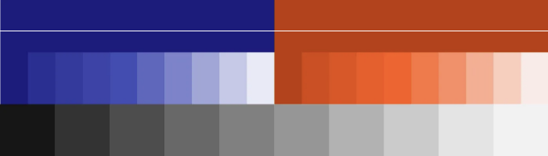

컬러는 내 전문 분야는 아니지만, 여기 시스템이 안정화되면서 핵심 팔레트, 색상 온도 및 색조 선택, 보조 팔레트, 그리고 접근성 있는 대비에 대한 문제를 해결하는 동안 배운 16가지 교훈이 있다.

<!-- ui-log 수평형 -->

<ins class="adsbygoogle"
     style="display:block"
     data-ad-client="ca-pub-4877378276818686"
     data-ad-slot="9743150776"
     data-ad-format="auto"
     data-full-width-responsive="true"></ins>
<component is="script">
(adsbygoogle = window.adsbygoogle || []).push({});
</component>

# 핵심 팔레트

여기서 말하는 것은 브랜드 컬러, 중립색 및 일반적으로 상호 작용하는 디지털 블루와 같은 모든 곳에서 사용되는 색상입니다.

## #1. 브랜드 컬러를 빨리 안정화하라

모든 조직은 핵심 브랜드 컬러가 하나, 둘 또는 그 이상일 수 있다. 그 빨강. 그 파랑. 그 주황. 이것들을 확정하라. 색상 변수 하나 또는 둘로 상당히 설정되어 있더라도, 계속해서 주요 색상을 변경하는 것만큼 디자인 시스템 팀이 그들의 역량을 향상시키지 못한다는 신호는 없다.

중요 사항: 주요 브랜드 컬러를 초기에 결정하라. 왜냐하면 그것들은 빠르게 널리 퍼져간다.

<!-- ui-log 수평형 -->

<ins class="adsbygoogle"
     style="display:block"
     data-ad-client="ca-pub-4877378276818686"
     data-ad-slot="9743150776"
     data-ad-format="auto"
     data-full-width-responsive="true"></ins>
<component is="script">
(adsbygoogle = window.adsbygoogle || []).push({});
</component>

## #2. 브랜드 참여 (브랜드 컬러 변경 시)

브랜드 블루가 조금 탁한가요? 살리고 싶은 유혹을 이겨내지 못하겠나요? "우리는 웹을 위해 브랜드 오렌지를 채도를 높였어요"라는 경박한 발언에 이어 브랜드가 "무슨 말이야?"라고 반응하는 것보다 이른 상호 협업에 독이 들어간다.

중요 사항: 브랜드 컬러는 브랜드 팀의 영역이다. 그래서 그들과 조정하고 필요한 경우 그들의 판단에 따르라.

<!-- ui-log 수평형 -->

<ins class="adsbygoogle"
     style="display:block"
     data-ad-client="ca-pub-4877378276818686"
     data-ad-slot="9743150776"
     data-ad-format="auto"
     data-full-width-responsive="true"></ins>
<component is="script">
(adsbygoogle = window.adsbygoogle || []).push({});
</component>

## #3. 중립색은 중립적이지 않게

어두운 짙은 회색부터 푹신한 연한 회색까지 중립색은 필수적인 UI 거푸집을 제공한다. 시스템에 중립색을 적재하면 몇 가지라도, 탁한 색상에 팀이 접근할 수 있는 위험이 있다. 또한 "와이어프레임처럼 보이는" 디자인으로 이어질 수 있다. 그리고 어두운 색상이나 밝은 색상 배경에서 충분한 접근성 있는 대비를 가진 어느 회색도 가지고 있지 않다.

중요 사항: 유용한 대비를 얻기 위해 몇 가지 연한 회색과 몇 가지 어두운 회색을 제공하라. 그러나 중간 회색을 피하는 것을 고려해라.

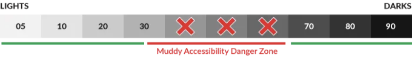

## #4. "디지털 블루"로 가라. 모두가 그렇게 한다.

내 지난 다섯 개의 디자인 시스템은 기본 버튼 및 링크 색상으로 채도가 높은 파란색을 선택했다. 링크는 항상 파란색이었고 아마도 최초의 브라우저 탄생 이후로였을지도 모른다. 이 "디지털" 블루는 링크 및 클릭 가능한 항목을 위한 유틸리티 색상으로 어떤 핵심 팔레트에나 필수적이다.

중요 사항: "디지털 블루"를 선택할 때 (그렇게 하게 될 때 ;) ) 접근성이 있는 색상을 선택하고 브랜드 자체의 파란색이나 빨간색, 주황색, 보라

색 또는 녹색과 충돌하지 않도록 확인하라.

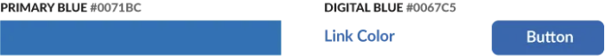

<!-- ui-log 수평형 -->

<ins class="adsbygoogle"
     style="display:block"
     data-ad-client="ca-pub-4877378276818686"
     data-ad-slot="9743150776"
     data-ad-format="auto"
     data-full-width-responsive="true"></ins>
<component is="script">
(adsbygoogle = window.adsbygoogle || []).push({});
</component>

# 색상의 색조와 채도

몇 가지 색상만 선택하고 끝낼 수는 없다, 맞나요? 시스템 사용자들은 종종 색상 선택을 범위별로 조정해야 하며 쉽게 재사용하고 경계를 알아야 한다.

## #5. 각 색상별로 색조와 채도 범위 쌓기

색상 팔레트 디스플레이 패턴은 웹보다 훨씬 오래되었다. 그럼에도 불구하고 나는 여전히 조밀하게 배열된 색조 스택을 좋아한다. 그것들은 그저... 아름답다. 최고의 스택은 단순히 색상뿐만 아니라 HEX 코드, 코드 변수 및 기타 지시자 (표면에 오버레이 된 유형 금지와 같은)를 결합하여 시각적으로 표현한다. 빠른 스캔만 필요하다.

중요 사항: 각 색상에 사용 가능한 색상을 스택으로 쌓고 중요한 세부 정보를 촘촘하게 포함하는 시각화로서 스택을 다루어라.

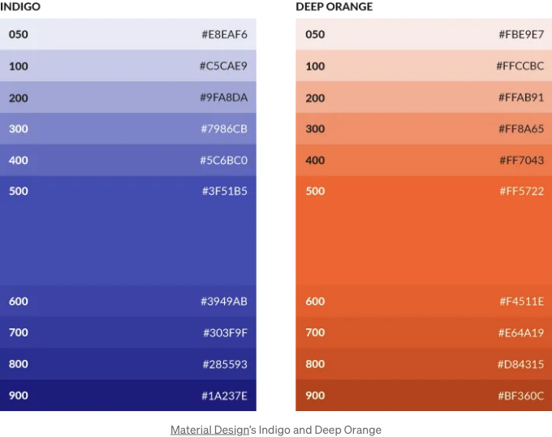

## #6. 밝기별로 색조와 채도에 이름 붙이기

우리 모두가 그렇게 해온 일이다. 시스템이 한 달 동안 안정되면, 중립 색상 $color-gray-1, $color-gray-2, ..., $color-gray-7은 안정적이다. 그런 다음, 순간, -1과 -2 사이에 끼워 넣을 새로운 색조가 생겼다. 그런 번호 체계는 별로다.

중요 사항: 색상 이름을 HSL의 밝기를 기준으로 0에서 100 사이로 스케일을 조정하라. 예: $color-gray-05 및 $color-gray-92와 같이. 이 스케일은 어두운 색상에서 밝은 색상으로 익숙한 범위를 반영하며 새로운 옵션을 삽입하고 나중에 사용되지 않을 때까지 $color-gray-93을 기억할 것이다.

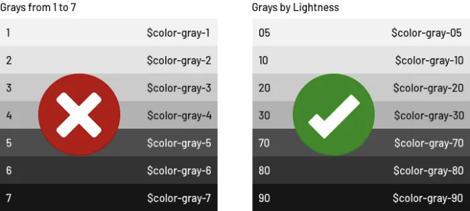

<!-- ui-log 수평형 -->

<ins class="adsbygoogle"
     style="display:block"
     data-ad-client="ca-pub-4877378276818686"
     data-ad-slot="9743150776"
     data-ad-format="auto"
     data-full-width-responsive="true"></ins>
<component is="script">
(adsbygoogle = window.adsbygoogle || []).push({});
</component>

## #7. 색조와 채도의 양 제한하기

좋은 시스템의 핵심은 끝없는 옵션 없이 선택의 폭, 일관된 미학을 제공하는 것이다. 대부분의 경우, 디자인 시스템은 무한한 선택을 제공할 필요가 없다. 제공하는 옵션이 많을수록 조화롭게 조합하고 응용 프로그램 간에 일관된 느낌을 유지하기가 더 어려워진다.

중요 사항: 손쉬운 다양성을 제공하고 지루한 다양성을 피하십시오. 시스템 사용자들에게 충분한 선택권을 부여하되, 하나의 옵션 이상은 제공하지만 몇 가지 의도적인 선택만을 허용하십시오.

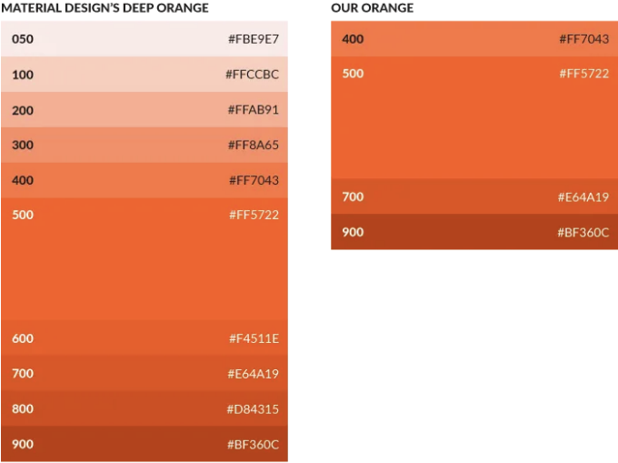

## #8. 변형 방법을 알려주라: 직접 선택 또는 기능적 선택

SASS 및 Stylus와 같은 현대적인 도구는 색상을 변형시키는 어둡게 만들기(darken) 및 밝게 만들기(lighten)와 같은 변형 함수를 제공한다. 이러한 편리한 도구들은 버튼을 호버하는 경우와 같이 색상을 세밀하게 대비시킬 수 있게 한다.

그러나 변형은 문제가 될 수 있다: 신중하게 설계된 기본 색상이 접근성이 떨어지는 대안으로 바뀔 수 있다(아래 참조), 페이지의 전반적인 팔레트가 흐릴 수 있다 또는 중간 밝기의 색상에 대한 "5% 시스템"이 중간 밝기의 색상에 대해 충분한 대비를 제공하지 못할 수 있다.

중요 사항: 시스템에서 색상 변형을 의도적으로 허용하거나 피하십시오. 이러한 실천을 지지하는 경우, 효과적으로 이러한 실천이 언제와 어떻게 이루어져야 하는지에 대한 예제를 제공하십시오. 예를 들어 중간 밝기의 경우 5-10%, 더 극단적인 경우 10-20%를 사용하십시오. 변형을 피해야 하는 경우, 간결하게 문서화하십시오.

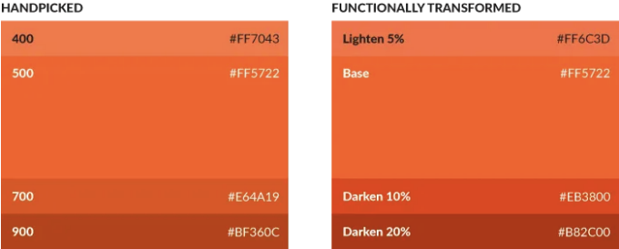

# 보조 팔레트

브랜드 색상과 그 변형을 넘어, 잘 고려된 색상 시스템은 다양한 목적을 위해 예약

된 더 넓은 다양한 색상을 배열한다.

## #9. 피드백 색상과 같은 의미 있는 세트 정의하기

대부분의 시스템은 오류를 위한 특정 빨간색, 성공을 위한 녹색, 경고를 위한 노란색 및 (가능한 경우 더 가벼운 하늘색) 정보 메시지를 위한 파란색을 예약한다. 피드백 색상은 다른 주요 구성 요소와 상호 작용하는 페이지 상단에 위치하거나 원하지 않는 상황의 결과로 나타난다. 시스템 지침이 없으면 이러한 메시지는 제품 코드에 내장되어 제품 팀이 문제를 빠르게 해결하고 이동하는 결과가 될 수 있다.

중요 사항: 조화롭게 맞물리는 색상을 보장하기 위해 피드백 색상 및 기타 관련 세트를 탐색하고 정의하십시오. 나중에 막바지에 밀어 넣지 않고 팀원들이 "그냥 구글에서 가져왔어"라고 기억하지 않게 하십시오.

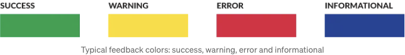

<!-- ui-log 수평형 -->

<ins class="adsbygoogle"
     style="display:block"
     data-ad-client="ca-pub-4877378276818686"
     data-ad-slot="9743150776"
     data-ad-format="auto"
     data-full-width-responsive="true"></ins>
<component is="script">
(adsbygoogle = window.adsbygoogle || []).push({});
</component>

## #10. 테마 다양성 설명하기

일부 시스템에서는 제품, 섹션 또는 브랜드별로 커스텀 색상을 사용한다. 이는 주요 브랜드 (예: 메리어트 인터내셔널)를 하위 브랜드 (코트야드 호텔, 리츠 칼튼 및 Moxy 호텔과 같은)와 관련시키는 결과일 수 있다. 또는 주제별 테마를 사용한다. 사용자가 완전한 통제를 가질 수도 있으며 그들이 할 수 있는 (모든 혼돈의) 범위를 설명해야 할 수도 있다.

중요 사항: 사용 가능한 테마의 범위를 간략하게 공개하고 특정 맥락에서 허용되는 테마 색상의 범위에 대한 경계를 설정하십시오.

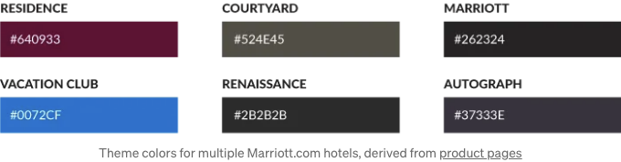

## #11. 테마 작동 방식 정의하기

"가져다 쓰라!"라고 말하는 것만으로 충분하지 않다. 테마 색상은 버튼 배경색, 활성 탭 배경색 또는 주요 내비게이션의 두꺼운 상단 테두리와 같은 UI에서 예측 가능한 강조 효과에 적용될 수 있다. 더 중요한 것은 테마 색상이 다른 요소를 변경하지 않도록 금지되어야 한다는 점이다. (긴 형태 유형 또는 링크 색상과 같이) 안 보이게 되는 링크 색상과 같은 특정 UI 요소를 제외할 때마다 더 중요하다.

중요 사항: 특정 UI 요소의 속성을 참조함으로써 테마가 작동하는 방식을 식별하십시오. 더 중요한 것은 대부분의 요소가 제한되어 있음을 명확히하십시오.

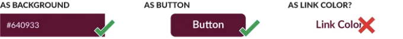

## #12. 먼지가 날리기 전까지 컬러 믹싱 가이드 피하기

내가 가장 좋아하는 디자인 시스템 도구 중 하나는 Google의 MDL 컬러 커스터마이저이다. 이 도구를 사용하면 사용자가 주요 및 보조 UI 색상을 효과적으로 결합할 수 있다. 매우 쉽고 결과가 매우 유용하다. 그러나 나와 함께 일하는 시스템 팀은 이러한 유형의 유연성을 제공하거나 해결해야 할 콤비네이터릭 도전을 해결하기 위해 충분한 시간과 주의를 기울이지 않거나 제공하고 싶어하지 않는다.

중요 사항: 핵심 시스템 가치가 아닌 경우 컬러 조합의 다양성을 해결하지 마십시오. 대부분의 경우, 시스템 사용자는 자신만의 조합을 짝짓거나 고려할 수 있는 조합마다 특별히 지정된 도구에서 이점을 얻을 것이다. 그들의 선택을 전파하는 데 도움을 주십시오.

# 대비 및 접근성

접근성 있는 색 대비를 해결하는 것은 처음부터 어떤 디지털 색상 시스템을 설정하는 핵심 실천 방식이어야 한다. 그러나 디자인은 동요할 수 있고, 팀은 때로는 패할 수 있다. 또는 일부 구성원은 접근성에 대해 알지 못할 수도 있다. 또는 그들은 그것을 우선하지 않을 수도 있다.

시스템 팀은 접근성 가치를 넓게 확산시키기 위해 접근성 실천 방법을 워크플로에 내재시켜야 한다.

## #13. 안전한 대비 비율을 식별하기

<!-- ui-log 수평형 -->

<ins class="adsbygoogle"
     style="display:block"
     data-ad-client="ca-pub-4877378276818686"
     data-ad-slot="9743150776"
     data-ad-format="auto"
     data-full-width-responsive="true"></ins>
<component is="script">
(adsbygoogle = window.adsbygoogle || []).push({});
</component>

AA 대비 준수는 표준이다. 그러나 원활한 경험을 위해 AAA 대비를 선택할 수 있다. 브랜드 요소 (예: 회색 버튼에 흰색 텍스트)를 포함한 모든 UI 요소에 대한 접근성 평가를 수행하십시오.

중요 사항: 목표 대비를 식별하고 팀이 접근성을 준수하도록 보장하십시오.

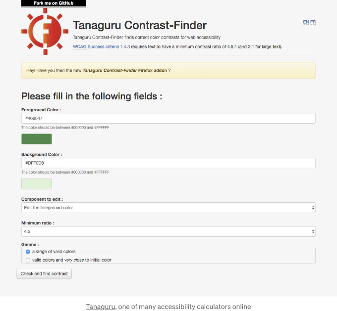

<!-- ui-log 수평형 -->

<ins class="adsbygoogle"
     style="display:block"
     data-ad-client="ca-pub-4877378276818686"
     data-ad-slot="9743150776"
     data-ad-format="auto"
     data-full-width-responsive="true"></ins>
<component is="script">
(adsbygoogle = window.adsbygoogle || []).push({});
</component>

## #14. 접근성 실패 후 처리 절차 구현하기

접근성 실패 후 처리 절차를 문서화하고 팀의 핵심 워크플로에 통합하십시오. 이는 색상이 일단 페이지에 렌더링되면 텍스트가 읽히지 않거나 너무 희미하거나 흐릿할 때 알림을 받을 수 있는 시스템을 구축하는 것을 의미한다.

중요 사항: 접근성은 다소 추상적이며 초보자가 처리하기 어려울 수 있다. 팀이 이러한 요구 사항을 실제 업무 흐름에 통합하도록 보장하십시오.

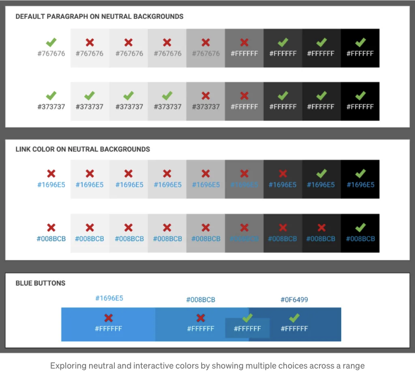

## #15. 확대 배율을 고려한 색상 평가

모든 시스템 색상을 200%의 확대 배율로 적절한 대비 비율이 있는지 확인하십시오. 이렇게 하면 팀이 더 높은 픽셀 밀도의 디스플레이를 사용하는 사용자를 포함하는 다양한 환경에서 제품의 접근성을 보다 잘 파악할 수 있다.

중요 사항: 확대 배율이 높아지면 접근성이 감소한다는 사실을 고려하여, 확대 배율을 고려한 색상 대비 평가를 포함한 테스트 계획을 개발하십시오.

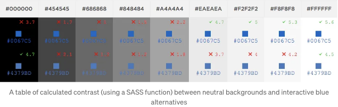

## #16. 컬러 블라인드 브라우저 지원

컬러 블라인드 사용자가 모든 사람이 보는 것과 같은 페이지를 볼 수 있도록 보장하십시오. 이는 대부분이 쉽게 깨닫지 못할 수 있다. 예를 들어 차트에 색상을 사용하는 경우 추가 설명을 제공할 수 있다.

중요 사항: 컬러 블라인드 사용자가 페이지를 정확하게 이해하고 조작할 수 있는지 확인하십시오. 페이지가 색상에 의존하는 경우 추가 설명을 제공하십시오.

<!-- ui-log 수평형 -->

<ins class="adsbygoogle"
     style="display:block"
     data-ad-client="ca-pub-4877378276818686"
     data-ad-slot="9743150776"
     data-ad-format="auto"
     data-full-width-responsive="true"></ins>
<component is="script">
(adsbygoogle = window.adsbygoogle || []).push({});
</component>

# 결론

색상은 디자인 시스템에서 사용자 경험의 핵심적인 요소이다. 올바르게 설계된 컬러 팔레트는 일관된 UI를 제공하고 사용자가 정보를 빠르게 이해할 수 있도록 돕는다. 디자인 시스템 팀은 브랜드 컬러를 안정화하고, 다양한 색조와 채도를 고려하며, 접근성을 고려하여 사용자에게 최상의 경험을 제공하기 위해 적절한 대비를 확인해야 한다. 이를 통해 디자인 시스템은 지속적이고 일관된 UI를 제공하여 제품의 성능을 향상시키는 역할을 할 수 있다.

::: tip 🎨 관련 참고 자료

- [Material Design: 색상 시스템](https://material.io/design/color/the-color-system.html)
- [Understanding Color](https://webaim.org/articles/contrast/)
- [색각 정보](https://www.colourblindawareness.org/)
  :::

---
