# VScode에 숨겨진 꿀팁 및 트릭 10가지

::: tip 💡이 포스팅을 읽으면
:::

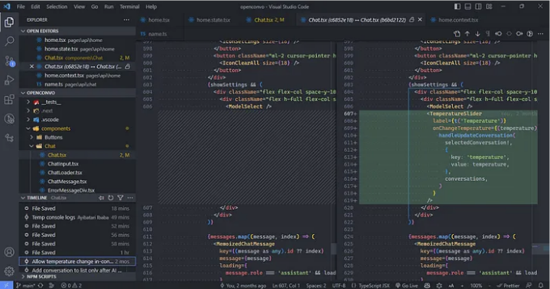

Visual Studio Code에서 OpenConvo를 열어보세요.

전 세계 개발자의 73%가 동일한 코드 편집기를 사용한다는 사실을 알고 계셨나요?

네, 2023년 스택 오버플로우 개발자 설문 결과에 따르면 다시 한 번 Visual Studio Code가 훨씬 많은 개발 환경에서 사용되었습니다.

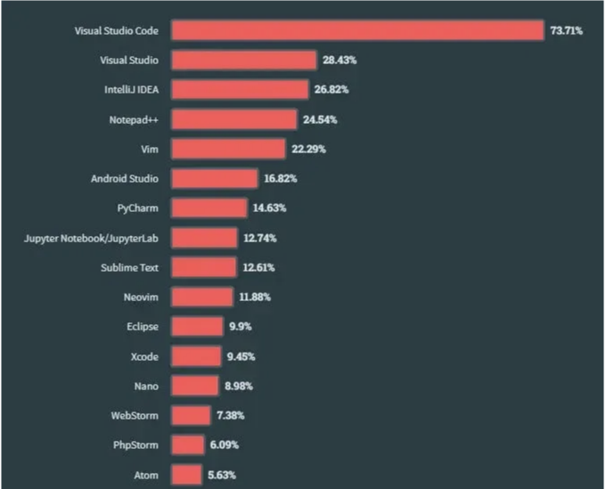

"비주얼 스튜디오 코드는 모든 개발자에게 선호되는 IDE로 남아 있으며, 전문 개발자보다 코딩을 배우는 사람들 사이에서 그 사용이 증가했습니다."

이 글에서는 로컬 소스 제어, 애니메이션 입력 및 빠른 라인 삭제 등으로 생산성을 향상시키는 몇 가지 매력적인 VS Code 기능을 소개합니다.
이제 이러한 기능을 사용하여 코딩 목표를 이전보다 빠르게 달성해 보세요.

<!-- ui-log 수평형 -->

<ins class="adsbygoogle"
     style="display:block"
     data-ad-client="ca-pub-4877378276818686"
     data-ad-slot="9743150776"
     data-ad-format="auto"
     data-full-width-responsive="true"></ins>
<component is="script">
(adsbygoogle = window.adsbygoogle || []).push({});
</component>

## 1. 타임라인 뷰: 로컬 소스 제어

타임라인 뷰를 통해 내장된 소스 제어를 얻을 수 있습니다.

우리 중 많은 사람들이 Git 및 기타 소스 제어 도구가 얼마나 유용한지 알고 있습니다. 이들은 파일 변경 사항을 쉽게 추적하고 필요할 때 이전 지점으로 되돌릴 수 있도록 도와줍니다.

따라서 VS Code의 타임라인 뷰는 파일과 관련된 중요한 이벤트의 자동으로 업데이트되는 타임라인을 제공합니다. 이 이벤트에는 Git 커밋, 파일 저장 및 테스트 실행과 같은 것들이 있습니다.

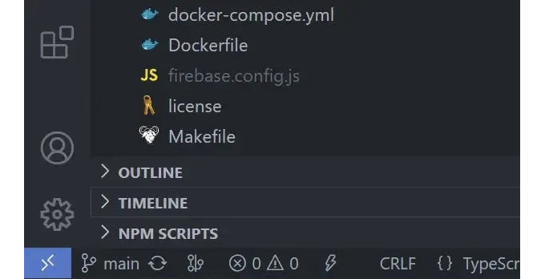

이 뷰를 확장하여 현재 파일과 관련된 이벤트 스냅샷 목록을 볼 수 있습니다. 여기에는 파일 저장뿐만 아니라 파일이 스테이지로 설정된 Git 커밋도 있습니다.

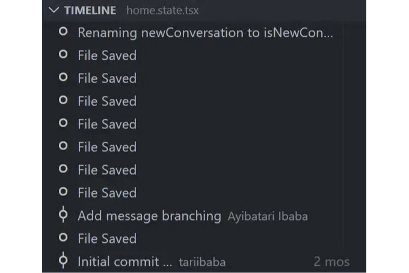

스냅샷 항목 위로 마우스를 올려보면 VS Code가 스냅샷을 찍은 날짜와 시간을 볼 수 있습니다.

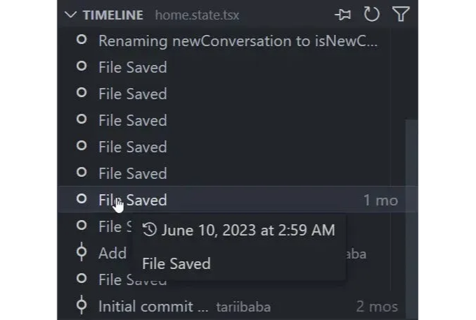

스냅샷 항목을 선택하여 해당 시점의 파일과 현재 파일 간의 변경 사항을 보여주는 diff 뷰를 볼 수 있습니다.

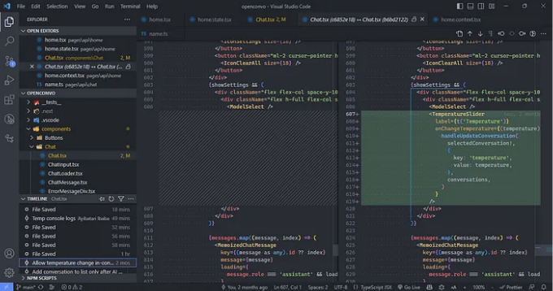

## 2. 자동 저장: 더 이상 Ctrl + S를 누를 필요 없음

이 단축키를 몇 번 사용했는지 계산할 수 있나요? 아마도 이제 무의식적으로 그것을 하고 있을 것입니다.

자동 저장 기능은 파일을 작업하는 동안 자동으로 저장하여 수동 저장이 필요하지 않도록합니다. 자동 저장을 사용하면 Ctrl + S로 인한 피로를 없애고 시간을 절약하며 항상 파일의 최신 변경 사항으로 작업할 확신을 얻을 수 있습니다.

그러나 완벽하지는 않으며, 장단점을 고려할 필요가 있습니다. 여기서 그것에 대해 종합적으로 다룹니다.

codingbeautydev.com

자동 저장되지 않음.

자동 저장 활성화됨 - 저장되지 않은 표시가 더 이상 표시되지 않습니다.

파일 > 자동 저장을 사용하여 기능을 쉽게 활성화할 수 있습니다.

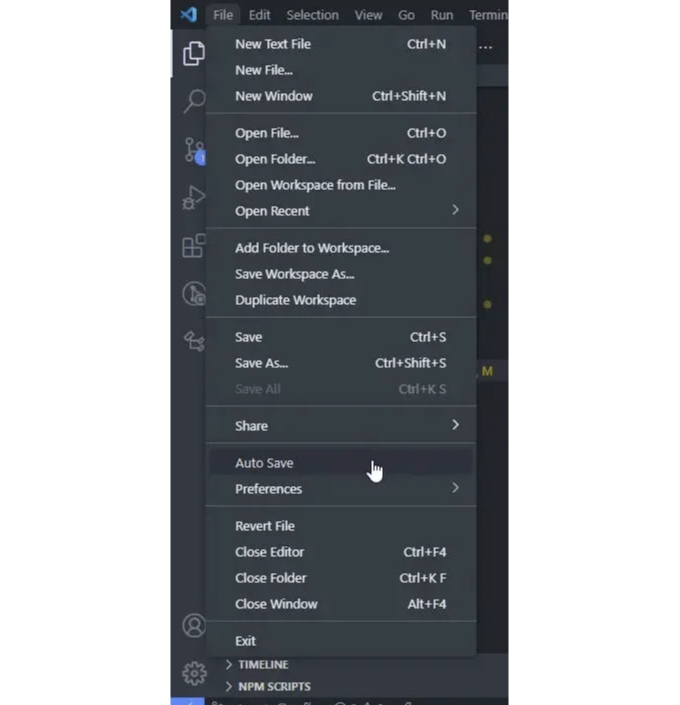

## 3. 명령 팔레트로 모든 작업 수행

VS Code에서 입력 이외의 거의 모든 작업은 "명령"입니다.

명령을 사용하면

편집기 내에서 작업을 수행할 수 있으며 파일 관련 명령, 탐색 명령, 편집 명령 및 터미널 명령이 포함됩니다. 각각은 편집 경험의 다른 측면을 향상시키기 위해 최적으로 설계되었습니다.

따라서 명령 팔레트를 사용하여 명령을 검색하고 해당 작업을 수행할 수 있습니다.

명령 팔레트를 열려면 다음 키보드 단축키를 사용하세요:

- Windows/Linux: Ctrl + Shift + P
- Mac: Shift + Command + P

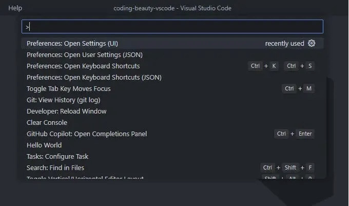

오른쪽의 키보드 단축키는 명령을 키보드로 더 빠르게 실행하는 더 빠른 방법입니다.

단축키보다 명령 팔레트의 주요 이점은 단축키가 없는 명령이 있거나 존재하는지 확실하지 않은 명령을 찾을 때입니다.

<!-- ui-log 수평형 -->

<ins class="adsbygoogle"
     style="display:block"
     data-ad-client="ca-pub-4877378276818686"
     data-ad-slot="9743150776"
     data-ad-format="auto"
     data-full-width-responsive="true"></ins>
<component is="script">
(adsbygoogle = window.adsbygoogle || []).push({});
</component>

## 4. 빠르게 파일로 이동

마우스는 너무 느립니다.

예, 탐색기 창에서 파일을 클릭할 수 있지만 훨씬 더 빠른 대안으로 프로젝트에서 특정 파일을 검색하고 열려면 Ctrl + P를 사용하세요.

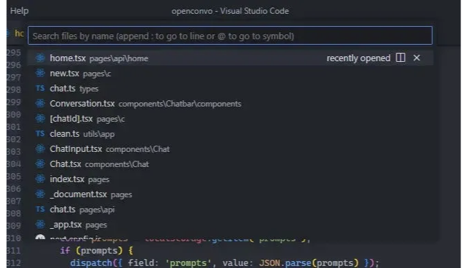

Ctrl 키를 누른 채로 Tab 키를 눌러 편집기 인스턴스에 현재 열려 있는 파일 목록을 순환할 수 있습니다.

이러한 열린 파일 사이를 빠르게 이동하려면 Alt + 왼쪽 및 Alt + 오른쪽을 사용할 수 있습니다.

마우스를 사용하는 것보다 파일에 빠르게 이동하는 더 빠른 방법입니다.

## 5. 빠르게 줄로 이동

스크롤하지 말고 점프하세요.

특정 라인 번호에서 오류를 만날 때 디버깅하는 동안 빠르게 라인으로 이동하는 것은 값비싼 일입니다. 이러한 라인으로 점프하여 해당 컨텍스트에서 코드를 검사하고 변수를 평가하고 문제를 해결할 수 있습니다.

이를 위해 Ctrl + G 키보드 단축키를 사용하세요.

## 6. 빠르게 줄 삭제

라인에 도착했으니, 그것을 삭제하려면 어떻게 하시겠습니까?

드래그하여 강조하고 Delete 키를 누르거나 모든 문자가 사라질 때까지 지칠 때까지 열심히 Backspace 키를 누르시겠습니까?

아니면 Ctrl + Shift + K 단축키를 사용하여 그것과 수십 개의 라인을 몇 초 안에 빠르게 삭제하시겠습니까?

<!-- ui-log 수평형 -->

<ins class="adsbygoogle"
     style="display:block"
     data-ad-client="ca-pub-4877378276818686"
     data-ad-slot="9743150776"
     data-ad-format="auto"
     data-full-width-responsive="true"></ins>
<component is="script">
(adsbygoogle = window.adsbygoogle || []).push({});
</component>

## 7. 부드러운 커서로 타이핑 즐기기

VS Code에는 커서가 움직일 때 애니메이션되는 부드러운 커서 기능이 있습니다. 이렇게 하면 MS Word와 같이 커서가 이동함에 따라 애니메이션이 표시되어 타이핑이 더 유동적이고 세련되게 느껴지며 코드 줄을 탐색하고 커서를 다른 지점에 놓을 때 더 부드럽고 자연스러운 느낌을 얻을 수 있습니다.

이를 활성화하려면 명령 팔레트에서 설정 UI를 열고 "smooth caret"을 검색하십시오.

Editor: Cursor Smooth Caret Animation 설정을 찾으십시오. 이 설정에는 3가지 가능한 옵션이 있습니다:

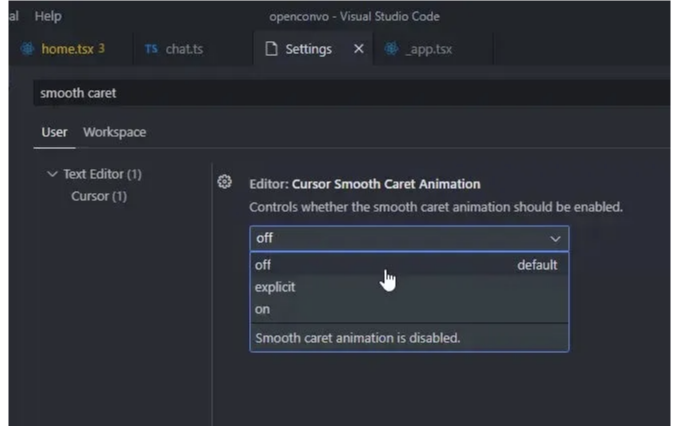

- off: 부드러운 커서 애니메이션 없음
- explicit: 코드 어딘가에 커서를 명시적으로 놓을 때만 커서를 애니메이트합니다.
- on: 입력하는 동안 포함하여 부드러운 커서 애니메이션이 항상 활성화됩니다.

전체 시각적 경험을 얻으려면 on으로 설정하세요.

## 8. 코드 빠르게 서식 지정

서식 지정은 코드를 구조화하고 일관된 방식으로 정리하여 코드 가독성을 향상시키는 것입니다.

수동으로 이 작업을 수행하고 있다면, 자동으로 서식을 지정할 수 있는 더 나은 방법이 있다는 것을 알아야 합니다.

네, 현재 파일의 언어에 따라 다양한 들여쓰기, 줄 길이, 중괄호 및 괄호 등의 규

칙을 사용하여 코드를 서식 지정하는 특정 "기본" 서식 지정자를 사용하여 코드를 자동으로 서식 지정할 수 있습니다.

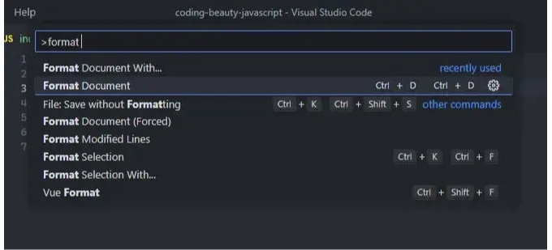

꽤 괜찮은 내장형 JS/TS 서식 지정자가 있지만 보다 견고한 솔루션을 원한다면 Prettier 확장을 권장합니다.

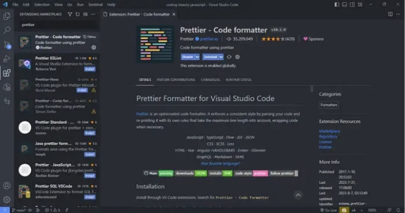

설치한 후에는 기본 서식 지정자로 설정하세요.

수동 대 자동 저장의 경우 서식 지정을 약간 더 쉽게 만들기 위해 활성화해야 할 기능이 있습니다:

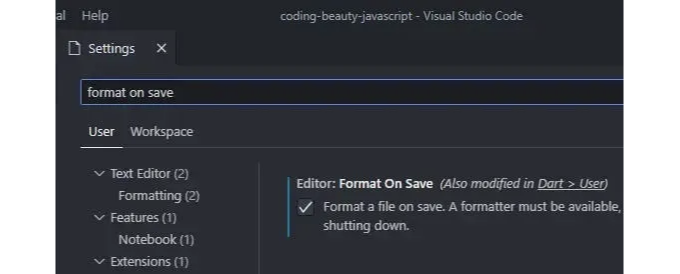

- Editor: Format On Save: "저장 시 파일 서식 지정. 서식 지정자가 있어야 하며 파일은 지연 후에 저장되지 않아야 하며 편집기는 종료 중이어야 합니다." 기본적으로 비활성화됩니다.

따라서 이 설정을 켜면 VS Code는 파일을 Ctrl + S로 저장할 때 현재 기본 서식 지정자로 코드를 자동으로 서식 지정합니다.

자동 저장할 때 Format On Save는 작동하지 않으며 때때로 서식 지정을 계속 수행해야 하는 번거로움이 있을 수 있습니다. 그리고 이것이 키보드 단축키입니다:

- Windows: Shift + Alt + F
- Mac: Shift + Option + F
- Linux: Ctrl + Shift + I

저는 Windows를 사용하고 기본 키보드 단축키가 좋아지지 않습니다. 자동 저장으로 인해 때때로 서식을 맞추게 되고, Shift + Alt + F가 일정 시간이 지나고는 고통스러워집니다.

그래서 Ctrl + D, Ctrl + D로 변경했습니다. 이 단축키는 누르기 쉽고 기억하기 쉬우며 충돌하는 키 바인딩이 없습니다. 당신도 동일하게 해보기를 권장합니다.

<!-- ui-log 수평형 -->

<ins class="adsbygoogle"
     style="display:block"
     data-ad-client="ca-pub-4877378276818686"
     data-ad-slot="9743150776"
     data-ad-format="auto"
     data-full-width-responsive="true"></ins>
<component is="script">
(adsbygoogle = window.adsbygoogle || []).push({});
</component>

## 9. 다중 커서 편집으로 시간 절약

내 초기 VS Code 시절 중의 하나의 재미있는 순간 중 하나인 다중 커서 편집을 사용하면 여러 위치에 여러 커서를 배치하고 동일한 텍스트를 여러 번 삭제하거나 삽입할 수 있습니다. 이렇게 하면 반복적인 작업이 효율적으로 처리되어 편집 시간이 단축되고 생산성이 향상됩니다.

물론 편집할 때 항상 하나의 커서가 있습니다. 더 많은 커서를 추가하려면 Alt + 클릭을 사용하세요.

Ctrl + Alt + Up 또는 Ctrl + Alt + Down으로 현재 라인 위나 아래에 커서를 쉽게 추가할 수도 있습니다.

이러한 단축키는 각각 Add Cursor Above 및 Add Cursor Below 명령을 실행합니다.

## 10. 빠르게 새 폴더/파일 생성

새 폴더와 파일을 생성하지 않는 심각한 프로젝트가 없습니다. 파일/폴더 생성을 가속화하는 방법이 있다면 시간을 절약할 수 있어 중요한 생산성 향상이 될 것입니다.

VS Code에서 새 파일과 새 폴더 버튼으로 새 파일 및 폴더를 만들고 있다면, 그 방법이 있습니다.

네, 이렇게 할 필요가 없습니다.

작은 버튼을 찾아 마우스를 이동시키는 대신에, 탐색기 패널을 두 번 클릭하여 새 파일을 만들 수 있다는 것을 알고 계셨나요?

새 폴더는 어떤가요? 폴더는 파일이 없는 경우에는 아무것도 아닙니다. 그리고 새 파일을 생성하는 동안 / 문자를 사용하여 하위 폴더 및 서브 폴더를 지정하고 해당 파일을 포함하는 새 폴더와 서브 폴더를 만들 수 있습니다.

utils 폴더는 index.js를 포함하도록 만들어졌습니다.

키보드 단축키를 사용하는 것이 더 효율적일 것입니다. 제가 한 것과 같습니다.

전 Atom 팬이었기 때문에 A 및 Shift + A 단축키를 빠르게 사용하여 새 파일 및 폴더를 만들었습니다.

그것은 VS Code로 이동할 때 일관된 단축키를 유지하면서 이러한 작업을 계속할 수 있도록 하기 위해 선택한 것입니다.

또한, 커스텀 단축키를 추가하는 것도 좋은 생각일 수 있습니다.

## 마치며

지금까지 VS Code를 활용하는 몇 가지 꿀팁과 트릭을 살펴보았습니다. 이러한 팁과 트릭을 사용하여 코드 편집을 더욱 즐겁게하고 생산성을 향상시킬 수 있습니다.
