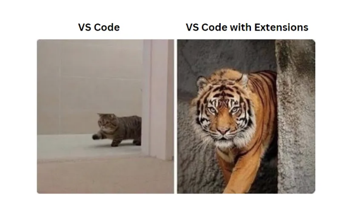

# 꼭 설치해야하는 VS Code 확장 프로그램 10가지

::: tip 💡이 포스트를 읽으면

:::

안녕하세요 여러분!! 모두 잘 지내고 계시길 바랍니다.

우리는 모두 코드 에디터를 선택할 때 주로 VS Code를 선택하는데요, 그 이유는 간단하고, 소형이며, 유연하며, 오픈 소스이며 설치가 쉽기 때문입니다. VS Code의 강점은 개발자들에게 제공하는 다양한 확장 프로그램에 있습니다.

VS Code 마켓플레이스에는 멋진 확장 프로그램들이 가득하며, 오늘은 웹 개발자로서 편리하고 빠른 개발을 위해 편집기에 반드시 설치해야 할 상위 10개의 확장 프로그램을 소개하겠습니다.

그러면 리스트를 자세히 살펴보겠습니다...

1. Prettier

우리 모두는 깔끔하지 않은 것을 좋아하지 않습니다. 코딩에서 코드가 잘 정렬되지 않으면 어떤 난잡함이라도 느껴집니다. 잘 정리되고 깔끔한 코드는 항상 인정받으며, 개발자의 눈에 좋아 보입니다. 이 확장 프로그램은 코드를 정렬하고 정렬하여 코드가 조밀하게 보이도록 도와줍니다. 파일을 저장할 때마다 코드를 서식 지정하도록 기본 설정을 변경할 수 있습니다.

<!-- ui-log 수평형 -->

<ins class="adsbygoogle"
     style="display:block"
     data-ad-client="ca-pub-4877378276818686"
     data-ad-slot="9743150776"
     data-ad-format="auto"
     data-full-width-responsive="true"></ins>
<component is="script">
(adsbygoogle = window.adsbygoogle || []).push({});
</component>

2. Auto Rename Tag

우리 모두가 이런 경험을 해본 적이 있습니다. HTML/XML 태그를 45번 줄에서 변경하고 해당 태그가 155번 줄에서 닫히는 경우, 해당 태그도 변경해야 합니다. 그러나 이 확장 프로그램은 그 일을 대신 처리해줍니다. 여는 태그나 닫는 태그 중 하나를 변경하면 해당하는 태그를 자동으로 변경해줍니다.

3. Auto Import

이 확장 프로그램은 TypeScript나 .tsx 파일용입니다. TypeScript를 사용하는 경우 이 확장 프로그램을 사용하여 import 문을 직접 작성할 필요가 없습니다.

<!-- ui-log 수평형 -->

<ins class="adsbygoogle"
     style="display:block"
     data-ad-client="ca-pub-4877378276818686"
     data-ad-slot="9743150776"
     data-ad-format="auto"
     data-full-width-responsive="true"></ins>
<component is="script">
(adsbygoogle = window.adsbygoogle || []).push({});
</component>

4. VS Code Icons

이 확장 프로그램은 프로젝트 폴더나 파일이 예쁘게 보이고 아이콘이 파일 또는 폴더 이름을 정당화하는 모든 개발자를 위한 것입니다. 내 프로젝트 폴더 구조를 보면 아이콘이 폴더 및 파일 이름을 정당화합니다.

5. CSS Peek

코드에서 함수나 변수 위에 마우스를 올리고 해당 구현을 확인하는 것을 보셨을 겁니다. 이 확장 프로그램은 CSS에 대해 동일한 작업을 수행합니다. HTML 코드에서 CSS ID나 클래스 이름 위에 마우스를 올리고 해당 클래스를 클릭하면 해당하는 CSS 파일로 이동합니다.

<!-- ui-log 수평형 -->

<ins class="adsbygoogle"
     style="display:block"
     data-ad-client="ca-pub-4877378276818686"
     data-ad-slot="9743150776"
     data-ad-format="auto"
     data-full-width-responsive="true"></ins>
<component is="script">
(adsbygoogle = window.adsbygoogle || []).push({});
</component>

6. Live Server

React나 Angular로 코드를 작성하는 경우 파일을 저장할 때 브라우저가 자동으로 다시로드됩니다. 그러나 단독 HTML 파일을 작업하는 경우에는 이런 일이 일어나지 않습니다. 파일을 저장하고 나면 IDE 자체에서 변경 사항을 표시합니다.

HTML 파일을 마우스 오른쪽 단추로 클릭하고 [Live server로 열기]를 선택하십시오.

7. ESLint

ESLint는 JavaScript 파일에서 발생할 수 있는 문제나 일반적인 문제를 식별하기 위한 코드 분석 도구입니다. 이것은 JavaScript 개발자들 사이에서 인기 있는 확장 프로그램 중 하나이며 개인적으로도 설치를 권장합니다. 이것은 당신이 더 나은 개발자가 되도록 도와줄 것입니다.

8. JavaScript (ES6) Code Snippets

종종 사용하는 코드 스니펫에 대한 단축키를 작성하여 이 문제에서 벗어날 수 있습니다. 스니펫이 트리거되면 텍스트가 대체되어 문서에 직접 삽입됩니다.

<!-- ui-log 수평형 -->

<ins class="adsbygoogle"
     style="display:block"
     data-ad-client="ca-pub-4877378276818686"
     data-ad-slot="9743150776"
     data-ad-format="auto"
     data-full-width-responsive="true"></ins>
<component is="script">
(adsbygoogle = window.adsbygoogle || []).push({});
</component>

9. Better Comments

주석은 코드의 중요한 부분입니다.

특히, 이 확장 프로그램이 주석을 더 아름답게 만들고 텍스트를 정당화하는 데 도움이 되는 경우에요.

10. Turbo Console Log

변수가 보유한 값을 확인해야 할 때마다 해당 변수에 대한 콘솔 문을 작성해야 하지만, 이제 이 확장 프로그램이 대신 처리해줄 겁니다.

이것이 상위 10개의 확장 프로그램 목록이었습니다. 이 포스트가 여러분의 코딩 여정에 도움이 되기를 바랍니다.

읽어 주셔서 감사합니다!!

즐거운 코딩하세요!!
