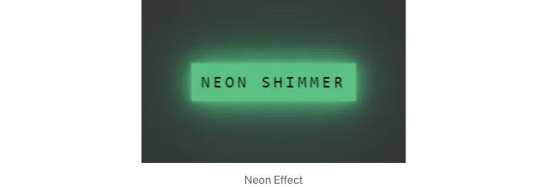

# HTML CSS로 네온사인 버튼 만드는 방법

::: tip 💡이 포스팅을 읽으면

:::

이 스토리에서는 환상적인 네온 효과를 가진 버튼을 만들어 보겠습니다.

시작해 봅시다!

# 기본 버튼 만들기

먼저 버튼을 준비합니다. 버튼은 div나 button 요소 모두 가능합니다. 다만, button 요소를 선택하면 기본 스타일을 재정의해야 합니다.

HTML 구조:

```html
<div class="neonButton">
  <div class="neonButton-content">네온</div>
</div>
```

CSS

```css
.neonButton {
  display: inline-block;
  padding: 12px 12px;
  font-size: 20px;
  width: fit-content;
  box-sizing: border-box;
  font-family: consolas;
  color: #03e9f4;
  text-transform: uppercase;
  background-color: transparent;
  transition: 0.5s;
  letter-spacing: 4px;
  border: none;
}
```

기본적으로 투명한 버튼을 정의했습니다. 네온 효과는 사이버펑크 스타일을 떠올리므로 Consolas와 같은 현대적인 폰트가 선택되었습니다.

HTML 및 CSS를 표준 HTML 파일로 복사하면 이미지와 비슷한 버튼이 나타납니다. 일반적인 네온 버튼입니다.

<!-- ui-log 수평형 -->

<ins class="adsbygoogle"
     style="display:block"
     data-ad-client="ca-pub-4877378276818686"
     data-ad-slot="9743150776"
     data-ad-format="auto"
     data-full-width-responsive="true"></ins>
<component is="script">
(adsbygoogle = window.adsbygoogle || []).push({});
</component>

# 네온 효과 추가하기

이제 버튼에 네온 효과를 얻기 위해 버튼에 호버 상태를 추가합니다.

```css
.neonShimmerButton:hover {
  background-color: #17c47c;
  color: #050801;
  box-shadow: 0 0 5px #17c47c, 0 0 25px #17c47c, 0 0 50px #17c47c, 0 0 200px #17c47c;
}
```

이제 이 버튼에 호버하면 네온 효과를 볼 수 있어야 합니다.



<!-- ui-log 수평형 -->

<ins class="adsbygoogle"
     style="display:block"
     data-ad-client="ca-pub-4877378276818686"
     data-ad-slot="9743150776"
     data-ad-format="auto"
     data-full-width-responsive="true"></ins>
<component is="script">
(adsbygoogle = window.adsbygoogle || []).push({});
</component>

이곳에서는 box-shadow를 사용하여 버튼 주변에 빛나는 효과를 만듭니다. 이는 버튼이 뒤에서 밝아지는 것처럼 버튼을 돋보이게 합니다.

# 사이버펑크 분위기

이제 네온 효과가 있지만 진정한 사이버펑크 느낌을 주기 위해 충분히 기술적으로 보이지 않을 수도 있습니다. 걱정하지 마세요. 저희는 깜박이는 효과로 더 선명하게 만들 것입니다. 색상 선언을 반복하지 않도록 CSS 변수를 사용할 것입니다.

# 깜박임 애니메이션

```css
.neonShimmerButton:hover {
  --neon-blink-color: #a4d3be;
  --neon-color: #17c47c;
  background-color: var(--neon-color);
  color: #050801;
  animation: blink 2s infinite linear;

  @keyframes blink {
    0%,
    100% {
      background-color: var(--neon-color);
      color: #050801;
      box-shadow: 0 0 5px var(--neon-color), 0 0 25px var(--neon-color), 0 0 50px var(--neon-color), 0 0 200px var(--neon-color);
    }
    50% {
      background-color: var(--neon-blink-color);
      color: #040701;
      box-shadow: 0 0 5px var(--neon-blink-color), 0 0 25px var(--neon-blink-color), 0 0 50px var(--neon-blink-color), 0 0 200px var(--neon-blink-color);
    }
  }
}
```

<!-- ui-log 수평형 -->

<ins class="adsbygoogle"
     style="display:block"
     data-ad-client="ca-pub-4877378276818686"
     data-ad-slot="9743150776"
     data-ad-format="auto"
     data-full-width-responsive="true"></ins>
<component is="script">
(adsbygoogle = window.adsbygoogle || []).push({});
</component>

이 추가로 버튼은 네온 빛

으로 깜박이면서 사이버펑크 영감을 받은 네온 깜박이는 버튼이 됩니다.

이렇게하면 네온 효과가 완료됩니다. 이 반짝이는 버튼은 사용자 인터페이스를 빛나게 만들어주어 사이버펑크 분위기를 더할 것입니다.


위와 같이 디지털 효과를 적용하여 버튼이 화려해졌습니다! box-shadow와 애니메이션 기술을 사용하여 사이버펑크 우주에 어울리는 네온 버튼을 만들었습니다. 이 테크노 로직을 사용하여 사용자 인터페이스를 화려하게 만들 준비가 되셨나요? 코드로 구현하고 그 빛나는 네온을 감상해 보세요!

# 다음 효과

다음에는 반짝이는 효과를 만들어보겠습니다. 현재는 피곤해서 못하겠네요. 하지만 아래는 효과의 미리보기입니다.


