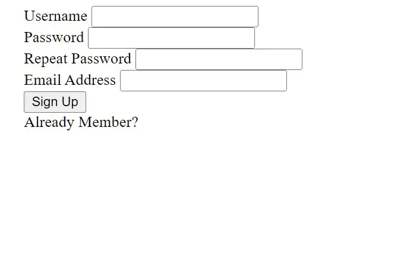
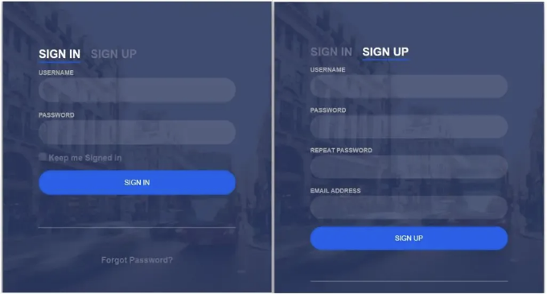

# HTML CSS로 로그인 회원가입 폼 만들기

프로그래머 여러분 안녕하세요! 이 튜토리얼에서는 HTML과 CSS로 로그인 및 회원가입 폼을 만드는 방법을 보여드리겠습니다. 이 프로젝트는 초보자 수준의 프로젝트이며 HTML 폼에 대한 기본적인 이해만 있으면 됩니다. 우리는 단계별로 프로젝트를 설명할 것이므로 개념이 없어도 걱정하지 마십시오. 이 프로젝트에서는 동일한 폼에서 등록 및 로그인할 수 있습니다. 두 개의 다른 버튼에 의해 제어됩니다. 로그인 버튼을 클릭하면 로그인 폼이 표시됩니다.

회원가입 버튼을 클릭하면 회원가입 폼이 열립니다. 이것은 HTML 체크박스 덕분에 가능합니다. 이름, 성, 이메일, 비밀번호 및 기타 정보를 등록 폼에 입력해야 합니다. 로그인 페이지에는 이메일 주소와 비밀번호만 입력하면 됩니다.

우리의 프로젝트를 빠르게 살펴보겠습니다.


팝업 로그인 폼을 보지 못했다면 아래 링크를 클릭하세요.

프로젝트에 대한 아이디어를 얻었을 것으로 기대합니다. 그러면 이제 소스 코드로 회원가입 및 로그인 폼 프로젝트를 시작해 봅시다. 먼저 HTML 코드를 사용하겠습니다.

## 단계1: HTML에서 로그인 및 회원가입 폼 만들기

```html
<!DOCTYPE html>
<html></html>
```

```html
<head>
  <link rel="stylesheet" href="style.css" />
  <title>Form</title>
</head>
<body>
  <div class="login-wrap">
    <div class="login-html">
      <input id="tab-1" type="radio" name="tab" class="sign-in" checked><label for="tab-1" class="tab">로그인</label>
      <input id="tab-2" type="radio" name="tab" class="sign-up"><label for="tab-2" class="tab">회원가입</label>
      <div class="login-form">
        <div class="sign-in-htm">
          <div class="group">
            <label for="user" class="label">사용자 이름</label>
            <input id="user" type="text" class="input">
          </div>
          <div class="group">
            <label for="pass" class="label">비밀번호</label>
            <input id="pass" type="password" class="input" data-type="password">
          </div>
          <div class="group">
            <input id="check" type="checkbox" class="check" checked>
            <label for="check"><span class="icon"></span> 로그인 상태 유지</label>
          </div>
          <div class="group">
            <input type="submit" class="button" value="로그인">
          </div>
          <div class="hr"></div>
          <div class="foot-lnk">
            <a href="#forgot">비밀번호를 잊으셨나요?</a>
          </div>
        </div>
        <div class="sign-up-htm">
          <div class="group">
            <label for="user" class="label">사용자 이름</label>
            <input id="user" type="text" class="input">
          </div>
          <div class="group">
            <label for="pass" class="label">비밀번호</label>
            <input id="pass" type="password" class="input" data-type="password">
          </div>
          <div class="group">
            <label for="pass" class="label">비밀번호 재입력</label>
            <input id="pass" type="password" class="input" data-type="password">
          </div>
          <div class="group">
            <label for="pass" class="label">이메일 주소</label>
            <input id="pass" type="text" class="input">
          </div>
          <div class="group">
            <input type="submit" class="button" value="회원가입">
          </div>
          <div class="hr"></div>
          <div class="foot-lnk">
            <label for="tab-1">이미 회원이신가요?</a>
          </div>
        </div>
      </div>
    </div>
  </div>
</body>
</html>
```

등록 및 로그인 폼에 대한 정보가 아래 섹션의 HTML 코드에 추가되었습니다. 아래에 나열된 코드는 복사하여 직접 HTML 파일에 추가됩니다.

- 먼저, signup 및 login 폼을 감싸는 "login-wrap" 클래스를 div 태그에 추가합니다.
- 이제 type이 "radio"인 입력 상자를 만들었으므로 라디오 버튼을 사용하여 회원가입 및 로그인 폼을 전환할 수 있습니다.
- 이제 로그인 폼을 만들어 보겠습니다. 이를 위해 사용자 이름을 요청하는 라벨을 디자인하고, 그 아래에 사용자 이름을 입력할 수 있는 텍스트 전용 입력 상자를 만듭니다.
- 이제 "비밀번호" 입력 상자를 만들고, "로그인 상태 유지"라는 체크박스 입력 상자를 만듭니다.
- 이제 <hr> 태그를 사용하여 수평 줄을 만들어 폼을 나눕니다.
- 그런 다음 앵커 태그를 사용하여 비밀번호를 잊었을 때를 위한 링크를 만듭니다.

이제 폼을 만들었으니 해당 폼을 살펴보겠습니다.


- 이제 회원가입 폼의 구조를 만들 것입니다. div 태그를 사용하여 회원가입 폼의 컨테이너를 만듭니다.
- 먼저 사용자 이름을 요청하는 라벨과 "텍스트" 유형의 사용자 이름 입력 상자를 만들 것입니다. 그런 다음 "비밀번호" 유형의 두 개의 입력 상자를 만듭니다.
- 사용자의 이메일 주소를 요청하는 라벨을 만들고, "이메일" 주소 유형의 입력 상자를 만듭니다.
- 사용자를 등록하는 버튼으로 사용할 입력 유형을 만들 것입니다. 사용자가 다른 웹 사이트에서 이미 등록한 경우, 로그인 페이지로 이동하는 링크도 만듭니다.

이제 만든 회원가입 폼을 살펴보겠습니다.

<!-- ui-log 수평형 -->

<ins class="adsbygoogle"
     style="display:block"
     data-ad-client="ca-pub-4877378276818686"
     data-ad-slot="9743150776"
     data-ad-format="auto"
     data-full-width-responsive="true"></ins>
<component is="script">
(adsbygoogle = window.adsbygoogle || []).push({});
</component>



이제 HTML 태그와 그 내용을 추가했으므로 CSS 코드를 추가하여 페이지를 더욱 매력적으로 만들어 보겠습니다. 웹 페이지를 스타일링하기 전에 HTML의 헤드 섹션에 외부 스타일링 링크를 추가해야 합니다.

```html
<link rel="stylesheet" href="styles.css" />
```

## 단계2: CSS 코드로 로그인 및 회원가입 폼 스타일링

```css
body {
  margin: 0;
  color: #6a6f8c;
  background: #c8c8c8;
  font: 600 16px/18px "Open Sans", sans-serif;
}
```

```css
*,
:after,
:before {
  box-sizing: border-box;
}
.clearfix:after,
.clearfix:before {
  content: "";
  display: table;
}
.clearfix:after {
  clear: both;
  display: block;
}
a {
  color: inherit;
  text-decoration: none;
}
.login-wrap {
  width: 100%;
  margin: auto;
  max-width: 525px;
  min-height: 670px;
  position: relative;
  background: url(https://raw.githubusercontent.com/khadkamhn/day-01-login-form/master/img/bg.jpg) no-repeat center;
  box-shadow: 0 12px 15px 0 rgba(0, 0, 0, 0.24), 0 17px 50px 0 rgba(0, 0, 0, 0.19);
}
.login-html {
  width: 100%;
  height: 100%;
  position: absolute;
  padding: 90px 70px 50px 70px;
  background: rgba(40, 57, 101, 0.9);
}
```

이제 CSS 코드를 포함한 글을 작성했으므로 단계별로 설명하겠습니다.

Step1: body 태그를 사용하여 웹 페이지의 여백과 색상, 배경, 폰트를 설정했습니다. "Open Sans"는 글꼴 패밀리입니다. 배경 색상은 "연한 회색"으로 설정했습니다. 폰트 크기도 "어두운 회색"으로 변경했습니다.

범용 선택자 (\*)를 사용하여 웹 페이지의 box-sizing을 "border-box"로 설정했습니다. 아이템 중 하나가 넘치면 clearfix 속성을 사용하여 자동으로 높이를 설정합니다.

```css
body {
  margin: 0;
  color: #6a6f8c;
  background: #c8c8c8;
  font: 600 16px/18px "Open Sans", sans-serif;
}
```

```css
*,
:after,
:before {
  box-sizing: border-box;
}
.clearfix:after,
.clearfix:before {
  content: "";
  display: table;
}
.clearfix:after {
  clear: both;
  display: block;
}
```

Step 2: (.login-wrap) 클래스를 사용하여 웹 페이지의 너비를 "100%"로 설정하고, 여백을 자동으로 조정하고, 최대 너비를 "525px"로, 최소 높이를 "670px"로 설정했습니다. 약간의 스타일을 추가하여 로그인 폼에 더 많은 매력을 더했습니다.

로그인 폼을 스타일링하기 위해 (.login-html) 클래스를 사용합니다. 너비는 "100%"로, 위치는 절대 위치이며, 추가 공간이 주어졌고, 로그인 폼의 배경은 어두운 파란색입니다.

```css
.login-wrap {
  width: 100%;
  margin: auto;
  max-width: 525px;
  min-height: 670px;
  position: relative;
  background: url(https://raw.githubusercontent.com/khadkamhn/day-01-login-form/master/img/bg.jpg) no-repeat center;
  box-shadow: 0 12px 15px 0 rgba(0, 0, 0, 0.24), 0 17px 50px 0 rgba(0, 0, 0, 0.19);
}
.login-html {
  width: 100%;
  height: 100%;
  position: absolute;
  padding: 90px 70px 50px 70px;
  background: rgba(40, 57, 101, 0.9);
}
```

Step3: (.sign-in-htm 및 .sign-up-htm) 파일을 사용하여 위로 올려보내고, 왼쪽으로 보내고, 오른쪽으로 보내고, 아래로 보냅니다. 회전 각도를 180도로 설정하고 추가된 변환 속성을 숨겼습니다. 라디오 버튼을 사용하여 회원가입 및 로그인 폼을 전환합니다. 이제 로그인 버튼을 스타일링합니다. 폰트 크기를 "22px"로, 오른

쪽 여백을 "15px"로, 커서를 "포인터"로, 하단 여백을 "5px"로 설정했습니다. 추가로 버튼에는 2px의 하단 테두리가 있습니다. 비슷한 방법으로 회원가입 폼을 스타일링합니다. 코드를 한 번 읽어보시면 이해가 쉬울 것입니다.

<!-- ui-log 수평형 -->

<ins class="adsbygoogle"
     style="display:block"
     data-ad-client="ca-pub-4877378276818686"
     data-ad-slot="9743150776"
     data-ad-format="auto"
     data-full-width-responsive="true"></ins>
<component is="script">
(adsbygoogle = window.adsbygoogle || []).push({});
</component>

```css
.login-html .tab {
  font-size: 22px;
  margin-right: 15px;
  cursor: pointer;
  padding-bottom: 5px;
  margin: 0 15px 10px 0;
  display: inline-block;
  border-bottom: 2px solid transparent;
}
.login-html .sign-in:checked + .tab,
.login-html .sign-up:checked + .tab {
  color: #fff;
  border-color: #1161ee;
  cursor: pointer;
}
.login-form {
  min-height: 345px;
  position: relative;
  perspective: 1000px;
  transform-style: preserve-3d;
}
.login-form .group {
  margin-bottom: 15px;
}
.login-form .group .label,
.login-form .group .input,
.login-form .group .button {
  width: 100%;
  color: #fff;
  display: block;
}
.login-form .group .input,
.login-form .group .button {
  border: none;
  padding: 15px 20px;
  border-radius: 25px;
  background: rgba(255, 255, 255, 0.1);
}
.login-form .group input[data-type="password"] {
  -webkit-text-security: circle;
}
.login-form .group .label {
  color: #aaa;
  font-size: 12px;
}
.login-form .group .button {
  background: #1161ee;
  cursor: pointer;
}
.login-form .group .button:hover {
  background: #1454c4;
  cursor: pointer;
}
.login-form .group label .icon {
  width: 15px;
  height: 15px;
  border-radius: 2px;
  position: relative;
  display: inline-block;
  background: rgba(255, 255, 255, 0.1);
}
.login-form .group label .icon:before,
.login-form .group label .icon:after {
  content: "";
  width: 10px;
  height: 2px;
  background: #fff;
  position: absolute;
  transition: all 0.2s ease-in-out 0s;
}
.login-form .group label .icon:before {
  left: 3px;
  width: 5px;
  bottom: 6px;
  transform: scale(0) rotate(0);
}
.login-form .group label .icon:after {
  top: 6px;
  right: 0;
  transform: scale(0) rotate(0);
}
```

Step4: 이제 "sign-in" 및 "sign-up" 폼을 선택하기 위해 체크된 속성을 사용합니다. 체크된 속성을 사용하여 회원가입 버튼을 선택하면 하단에 파란색 테두리가 표시되고, 로그인 버튼을 선택하면 로그인 폼이 표시됩니다.

```css
.login-form .group .check:checked + label {
  color: #fff;
}
.login-form .group .check:checked + label .icon {
  background: #1161ee;
}
.login-form .group .check:checked + label .icon:before {
  transform: scale(1) rotate(45deg);
}
.login-form .group .check:checked + label .icon:after {
  transform: scale(1) rotate(-45deg);
}
.login-html .sign-in:checked + .tab + .sign-up + .tab + .login-form .sign-in-htm {
  transform: rotate(0);
}
.login-html .sign-up:checked + .tab + .login-form .sign-up-htm {
  transform: rotate(0);
}
```

이제 우리의 팝업 로그인 폼을 스타일링했으므로 최종 결과를 살펴보겠습니다.

<!-- ui-log 수평형 -->

<ins class="adsbygoogle"
     style="display:block"
     data-ad-client="ca-pub-4877378276818686"
     data-ad-slot="9743150776"
     data-ad-format="auto"
     data-full-width-responsive="true"></ins>
<component is="script">
(adsbygoogle = window.adsbygoogle || []).push({});
</component>

# 최종 결과: HTML 및 CSS로 만든 로그인 및 회원가입 폼



프로젝트가 완료되었습니다. HTML과 CSS를 사용하여 로그인 및 회원가입 폼을 만들었습니다.
