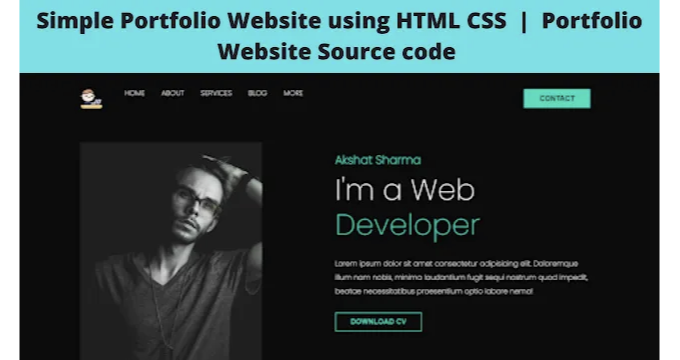

# HTML CSS로 포트폴리오 웹사이트 만들기

::: tip 💡이 포스팅을 읽으면
HTML과 CSS를 사용하여 포트폴리오 웹사이트를 만드는 방법에 대한 전체적인 코드와 설명을 제공합니다.
:::

오늘은 HTML과 CSS를 사용하여 시각적으로 매력적인 포트폴리오 웹사이트를 만들어 보겠습니다. 이 글에서는 포트폴리오 웹사이트를 HTML과 CSS를 사용하여 만드는 과정과 완성된 코드를 제공합니다.



# 포트폴리오 웹사이트란?

요즘은 누구나 웹사이트와 웹 애플리케이션을 필요로 합니다. 따라서 웹 개발자로 일하고자 한다면 많은 기회가 있습니다. 하지만 웹 개발자로 취직하기 위해서는 자신의 기술과 경험을 쇼케이스할 수 있는 좋은 포트폴리오 웹사이트가 필요합니다. 개발자 포트폴리오 웹사이트는 잠재적인 고용주에게 여러분의 기술, 경험, 그리고 참여한 프로젝트에 대한 관련 정보를 제공합니다. 이를 온라인 이력서로 생각할 수 있습니다.

<!-- ui-log 수평형 -->

<ins class="adsbygoogle"
     style="display:block"
     data-ad-client="ca-pub-4877378276818686"
     data-ad-slot="9743150776"
     data-ad-format="auto"
     data-full-width-responsive="true"></ins>
<component is="script">
(adsbygoogle = window.adsbygoogle || []).push({});
</component>

## 소스 코드와 함께 포트폴리오 웹사이트

그러므로, 이 포트폴리오 웹사이트를 만들 때 필요한 재료는 HTML과 CSS입니다. 여러분은 두 가지에 대한 기본 지식을 가지고 있다고 가정합니다. 실제로 이 포트폴리오 웹사이트를 배포하려면 뷰어가 원하는 페이지로 클릭하고 탐색할 수 있도록 백엔드 작업이 필요합니다.

하지만 오늘은 외관만 중요합니다, 즉, 프론트 엔드입니다! 심지어 JavaScript도 범위에서 제외됩니다. HTML과 CSS만으로 얼마나 훌륭한 웹사이트를 만들 수 있는지 알고 싶으시니까요 (또한 초보자 친화적이기 때문에입니다).

# 레시피로 들어가기

우리의 웹사이트의 밑거름, 즉 HTML 파일을 만들어 보겠습니다. HTML 파일을 만들고 'index.html'이라고 이름을 지었습니다. CSS도 함께 사용할 것이므로 동일한 폴더에 'styles.css'라는 파일을 만들었습니다. index.html에서 다음 코드를 입력해야 합니다.

# 포트폴리오 HTML 코드

```html
<!DOCTYPE html>
<html lang="en">
  <head>
    <meta http-equiv="X-UA-Compatible" content="IE=edge" />
    <meta name="viewport" content="width=device-width, initial-scale=1.0" />
    <link rel="stylesheet" href="./styles.css" />
    <link rel="preconnect" href="https://fonts.googleapis.com" />
    <link rel="preconnect" href="https://fonts.gstatic.com" crossorigin />
    <link rel="preconnect" href="https://fonts.googleapis.com" />
    <link rel="preconnect" href="https://fonts.gstatic.com" crossorigin />
    <link href="https://fonts.googleapis.com/css2?family=Lato:wght@100;400;700&family=Poppins:wght@200&display=swap" rel="stylesheet" />
    <link href="https://fonts.googleapis.com/css2?family=Poppins:wght@200&display=swap" rel="stylesheet" />
    <title>Portfolio</title>
  </head>
  <body></body>
</html>
```

VS Code를 사용하고 HTML 확장 기능이 설치되어 있다면 '!'를 입력하고 Enter를 누르면 됩니다. 그렇지 않다면 위의 코드를 복사하여 붙여넣으면 됩니다.

이 코드를 설명하는 것은 필요하지 않습니다. 브라우저에게 웹페이지를 실행하려고 한다는 것을 알려주는 것입니다. 또한 'styles.css'에 작성한 모든 CSS를 가져옵니다.

이제 우리가 만들고 있는 것을 살펴보십시오.


알고 있어요, 마스터피스죠? 그리고 아니요, 저는 사진 속의 잘생긴 남자가 아닙니다... 훨씬 더 멋있어요. 어쨌든 이제 위쪽만 보세요.


이것이 내비게이션 바입니다. 모든 웹사이트에 반드시 필요한 것입니다. 그러므로 먼저 이것을 만들어 보겠습니다. 코드를 `<body>` 태그의 안쪽에 작성해야 합니다.

<!-- ui-log 수평형 -->

<ins class="adsbygoogle"
     style="display:block"
     data-ad-client="ca-pub-4877378276818686"
     data-ad-slot="9743150776"
     data-ad-format="auto"
     data-full-width-responsive="true"></ins>
<component is="script">
(adsbygoogle = window.adsbygoogle || []).push({});
</component>

```html
<body>
   <header>
     <div class="container">
       <nav class="flex items-centre justify-between">
           <div class="left flex justfiy-right">
           <div class="logo">
             
           </div>
           <div>
             <a

 href="#">Home</a>
             <a href="#">About</a>
             <a href="#">Services</a>
             <a href="#">Blog</a></li>
             <a href="#">More</a>
           </div>
         </div>
         <div class="right">
           <button class="btn btn-primary">Contact</button>
         </div>
       </nav>
     </div>
   </header>
```

제가 사용한 로고는 웹사이트에서 다운로드했습니다. 걱정 마세요, 무료로 사용할 수 있습니다. 사실, 이 블로그에 사용된 모든 아이콘과 이미지는 다운로드한 것입니다. 이 아이콘과 사진이 웹사이트의 모양을 결정하는 데 큰 역할을 한다는 것은 부인할 수 없지만, 내 목표는 이러한 사진을 사이트에 어떻게 통합하는지를 가르치는 것이었으며 Photoshop에서 시간을 보내어 아름답고 '원래' 아이콘을 디자인하는 것이 아니었습니다. 웹사이트를 만들 때 언제든지 시각적으로 매력적인 이미지를 포함하는 것은 여러분의 책임입니다. 이 튜토리얼을 따르고 있다면 시간을 내서 고유한 로고를 만들어 보세요. 여기에서 만들거나 여기에서 다운로드할 수 있습니다. 제작자 입니다.

이것이 우리의 내비게이션 바의 형태입니다:


걱정 마세요. 정확히 광고한 것을 얻을 것입니다. 따라오세요. 이제 그 모델의 이미지와 표시할 텍스트를 넣겠습니다.

<!-- ui-log 수평형 -->

<ins class="adsbygoogle"
     style="display:block"
     data-ad-client="ca-pub-4877378276818686"
     data-ad-slot="9743150776"
     data-ad-format="auto"
     data-full-width-responsive="true"></ins>
<component is="script">
(adsbygoogle = window.adsbygoogle || []).push({});
</component>

```html
<div class="hero flex items-centre justify-between">
  <div class="left flex-1 justify-center">
    
  </div>
  <div class="right flex-1">
    <h6>Akshat Sharma</h6>
    <h1>
      I'm a Web<br />
      <span>Developer</span>
    </h1>
    <p>Lorem ipsum dolor sit amet consectetur adipisicing elit. Doloremque illum nam nobis, minima laudantium fugit sequi nostrum quod impedit, beatae necessitatibus praesentium optio labore nemo!</p>
    <div>
      <button class="btn btn-secondary">DOWNLOAD CV</button>
    </div>
  </div>
</div>
```

당신의 이름이 Akshat Sharma인 경우 (우리는 이름이 같아요), 반드시 `<h6>` 태그에 표시되는 이름을 변경하세요.

또한 Lorem Ipsum 텍스트를 더 적합한 내용으로 교체하세요. 실제로 표시되는 텍스트는 여러분의 바람대로 변경할 수 있습니다.


이제 아마도 CSS를 사용하고 싶어 하실 것입니다. 처음에는 스타일링을 나중에 남기기로 했지만, 개발자는 언제든지 자신의 웹사이트가 어떻게 보이는지를 알고 추가 변경을 수행할 수 있어야 합니다. 그러므로 CSS로 바로 이동하겠습니다!

한 가지 조언: 여러분의 CSS 파일은 계속해서 길어질 것입니다. 그래서 'styles.css'로 모든 클래스와 요소를 스타일링하고 'utilities.css'로 하나 이상의 요소에 대한 스타일을 정의하는 것이 좋습니다. 계속하면서 볼 것입니다.

```css
@import "utilities.css";
:root {
  --primary: rgb(29, 221, 189);
  --bgDark: rgb(12, 12, 12);
  --white: rgb(250, 250, 250);
  --secondary: rgb(0, 59, 50);
  --bgLight: rgb(190, 181, 181);
}
```

이것은 'styles.css'의 시작입니다. 'utilities.css'를 가져와서 거기에서 수행한 모든 스타일을 통합해야 합니다. 나중에 색상을 생각해 두고 변수를 선언했습니다.

': root'를 사용하여 해당 색상에 해당하는 변수를 선언했습니다. 이 색상은 RGB 값으로만 이해됩니다. 이 값은 기억하기 어렵습니다.

VS Code의 HTML CSS Support 확장 기능을 사용하여 색상을 쉽게 선택했습니다. 아주 멋지죠? 사용할 수 없는 경우 여기에서 색상의 RGB, HSV 또는 16진수 값을 가져올 수 있습니다.

<!-- ui-log 수평형 -->

<ins class="adsbygoogle"
     style="display:block"
     data-ad-client="ca-pub-4877378276818686"
     data-ad-slot="9743150776"
     data-ad-format="auto"
     data-full-width-responsive="true"></ins>
<component is="script">
(adsbygoogle = window.adsbygoogle || []).push({});
</component>

# 포트폴리오 CSS 코드

```css
* {
  padding: 0;
  margin: 0;
  box-sizing: border-box;
  -webkit-font-smoothing: antialiased;
}
header {
  background-color: var(--bgDark);
  clip-path: polygon(0 0, 100% 0, 100% 100%, 73% 94%, 0 100%);
}
header nav .left a {
  color: var(--white);
  text-decoration: none;
  margin-right: 2rem;
  text-transform: uppercase;
  transition: all 0.2s ease;
}
header nav .left a:hover {
  color: var(--primary);
}
header nav {
  padding: 2rem 0;
}
header nav .logo {
  margin-right: 3rem;
}
```

이것은 헤더와 내비게이션 바에 대한 CSS이며 코드는 'styles.css'에 들어갑니다. 그리고 이것이 결과물입니다:


검정색은 제가 가장 좋아하는 색상입니다! 배경을 어떻게 할지 모를 때 정말 생명을 불어넣어 줍니다. 이제 'hero' 클래스에 대한 CSS를

살펴보겠습니다.

```css
body{
font-family: 'Poppins', sans-serif;
}
.container{
max-width: 1152px;
padding: 0 15px;
margin: 0 auto;
}
.hero{
padding-top: 2rem;
padding-bottom: 3rem;
}
.hero .left img{
width: 400px;
}
.hero .right {
color: var(--white);
margin-top: -7rem;
}
.hero .right h6{
font-size: 1.6rem;
color: var(--primary);
margin-bottom: 0.5rem;
}
.hero .right h1{
font-size: 4rem;
font-weight: 100;
line-height: 1.2;
margin-bottom: 2rem;
}
.hero .right h1 span{
color: var(--primary);
}
.hero .right p{
line-height: 1.9;
margin-bottom: 2rem;
```

픽셀 값을 사용하는 것을 피하는 것을 주목했나요? 픽셀은 절대 단위입니다. 다른 값들을 변경해도 픽셀 값에는 영향이 없으며, 이는 꽤 구식입니다. 'em'과 'rem'은 그 부모 또는 루트 요소의 변경에 따라 값이 변경됩니다. 이것이 반응형이라는 것입니다. 여기서 차이점에 대해 더 알아보세요. 설명이 정말 좋습니다.

이제 버튼과 전체 정렬에 대해 작업하고 마술처럼 CSS를 입력합니다. 이건 우리가 CSS로 부르는 마술 주문입니다.

<!-- ui-log 수평형 -->

<ins class="adsbygoogle"
     style="display:block"
     data-ad-client="ca-pub-4877378276818686"
     data-ad-slot="9743150776"
     data-ad-format="auto"
     data-full-width-responsive="true"></ins>
<component is="script">
(adsbygoogle = window.adsbygoogle || []).push({});
</component>

```css
.flex {
  display: flex;
}
.items-centre {
  align-items: center;
}
.justify-between {
  justify-content: space-between;
}
.justify-center {
  justify-content: center;
}
.justify-right {
  justify-content: right;
}
.btn {
  padding: 0.6rem 2rem;
  font-size: 1rem;
  font-weight: 600;
  border: 2px solid transparent;
  outline: none;
  cursor: pointer;
  text-transform: uppercase;
  transition: all 0.2s ease;
}
.btn-primary {
  background-color: var(--primary);
  color: var(--secondary);
  margin-top: -15rem;
}
.btn-primary:hover {
  background: transparent;
  border-color: var(--primary);
  color: var(--primary);
}
.flex-1 {
  flex: 1;
}
.btn-secondary {
  background: transparent;
  color: var(--primary);
  border-color: var(--primary);
}
.btn-secondary:hover {
  background: var(--primary);
  color: var(--secondary);
}
```

결과물? 여기 있습니다!


```html
<section class="about">
  <div class="container flex items-centre">
    <div class="left flex-1 justify-right">
      
    </div>
    <div class="right flex-1">
      <h1>About <span>Me</span></h1>
      <h3>Hello! I'm Akshat Sharma.</h3>
      <p>
        Lorem ipsum dolor sit amet consectetur adipisicing elit. Atque adipisci distinctio obcaecati aliquid, quia tempora quis optio repudiandae officia earum? Lorem ipsum dolor sit amet consectetur,
        adipisicing elit.
      </p>
      <div class="socials">
        <a href="#"></a>
        <a href="#"></a>
        <a href="#"></a>
        <a href="#"></a>
      </div>
    </div>
  </div>
</section>
```

`'styles.css'`에 이 CSS 코드를 넣으세요. 여기에는 여백과 패딩을 개별적으로 다룹니다. 하지만 이미 이전에 정의한 클래스가 대부분의 레이아웃 작업을 처리했으므로 많은 작업을 할 필요가 없습니다.

웹사이트를 조금 반응형으로 만들려면 `:hover` 선택자를 많이 사용합니다. 모든 버튼과 소셜 미디어 아이콘에 사용했습니다. 커서를 올렸을 때 지정된 요소에 대해 발생하는 일을 정의합니다. 약간의 색상 전환만으로도 웹페이지에 생명을 불어넣을 수 있습니다.

<!-- ui-log 수평형 -->

<ins class="adsbygoogle"
     style="display:block"
     data-ad-client="ca-pub-4877378276818686"
     data-ad-slot="9743150776"
     data-ad-format="auto"
     data-full-width-responsive="true"></ins>
<component is="script">
(adsbygoogle = window.adsbygoogle || []).push({});
</component>

잘했어요! 이제 마지막 부분을 작업하겠습니다. 여러분의 이력서는 여러분의 기술과 성취의 진정한 기록이지만, 우리는 여러분의 서비스가 한눈에 보이도록 하고자 합니다.

'index.html'에 다른 섹션을 정의하고 다음과 같은 코드를 입력하세요.

```html
<section class="services">
  <div class="container">
    <h1 class="services-head">Services</h1>
    <p>All your digital needs... covered.</p>
    <div class="card-grid">
      <div class="card">
        
        <h2>Graphic Desgin</h2>
        <p>Lorem ipsum dolor sit amet consectetur, adipisicing elit. Nulla, debitis?</p>
      </div>
      <div class="card">
        
        <h2>Web Development</h2>
        <p>Lorem ipsum dolor sit amet consectetur, adipisicing elit. Nulla, debitis?</p>
      </div>
      <div class="card">
        
        <h2>Content Writing</h2>
        <p>Lorem ipsum dolor sit amet consectetur, adipisicing elit. Nulla, debitis?</p>
      </div>
    </div>
  </div>
</section>
```

안타깝게도, 볼드체는 아름답긴 하지만 너무 시끄럽고 사실, 우리의 개발 기술에는 불명예입니다. 정렬하고 스타일을 지정하여 조금은 세련된 모습으로 만들어 보겠습니다.

이제 Flexbox는 레이아웃을 다루는 데 훌륭한 도구이지만, CSS Grid Layout 또한 한 가지 추가 기능이 있습니다. 이 친구는 CSS Grid Layout 또는 간단히 Grid라고 부릅

니다.

사용법을 배우고 적용해보겠습니다.

```css
.card-grid {
  display: grid;
  grid-template-columns: repeat(auto-fit, minmax(350px, 1fr));
  gap: 1rem;
}
```

`grid-template-columns` 속성은 grid 컨테이너의 열 크기를 정의합니다. 이 경우, `repeat(auto-fit, minmax(350px, 1fr))`을 사용하여 열 크기를 자동으로 조절하고 최소 크기를 350px로 설정했습니다. 이것은 그리드 레이아웃이 브라우저 너비에 맞게 자동으로 조절되도록 합니다. 여기서 `1fr`은 남은 공간을 모두 채우는 단위입니다.

이제 `styles.css`에 이 CSS 코드를 추가하면 됩니다. 이것이 어떻게 작동하는지 보세요!


<!-- ui-log 수평형 -->

<ins class="adsbygoogle"
     style="display:block"
     data-ad-client="ca-pub-4877378276818686"
     data-ad-slot="9743150776"
     data-ad-format="auto"
     data-full-width-responsive="true"></ins>
<component is="script">
(adsbygoogle = window.adsbygoogle || []).push({});
</component>

마지막으로, 우리의 사이트를 마무리하기 위해 일련의 블로그 게시물을 추가하겠습니다. 원하는 만큼의 포스트를 추가할 수 있습니다.

```html
<section class="blogs">
  <div class="container">
    <h1 class="blogs-head">Latest from Blog</h1>
    <div class="card-grid">
      <div class="card">
        
        <h2>Travel Guide</h2>
        <p>Lorem ipsum dolor sit amet consectetur adipisicing elit. Nisi, cupiditate!</p>
      </div>
      <div class="card">
        
        <h2>Business Story</h2>
        <p>Lorem ipsum dolor sit amet consectetur adipisicing elit. Nisi, cupiditate!</p>
      </div>
      <div class="card">
        
        <h2>Tech Updates</h2>
        <p>Lorem ipsum dolor sit amet consectetur adipisicing elit. Nisi, cupiditate!</p>
      </div>
    </div>
  </div>
</section>
```

이제 'styles.css'에 다음 CSS 코드를 추가하세요.

```css
.blogs-head {
  text-align: center;
  margin-bottom: 2rem;
}
```

결과물을 보세요!

<!-- ui-log 수평형 -->

<ins class="adsbygoogle"
     style="display:block"
     data-ad-client="ca-pub-4877378276818686"
     data-ad-slot="9743150776"
     data-ad-format="auto"
     data-full-width-responsive="true"></ins>
<component is="script">
(adsbygoogle = window.adsbygoogle || []).push({});
</component>


이제, 우리는 포트폴리오 웹사이트를 만들었습니다. 만약 여러분이 배우고 성장하기 위해 이 웹사이트를 가져와 더 개선하고 싶다면 그것이 목적입니다. 이 웹사이트를 마음대로 가져와 자신만의 것으로 만들어보세요. 예를 들어, 프로젝트에 대한 더 많은 세부 정보를 제공하는 세부 페이지를 만들어 볼 수 있습니다. 또는 JavaScript를 추가하여 사용자와의 상호작용을 높일 수 있습니다. 선택은 여러분의 몫입니다. 계속해서 배우고, 성장하세요!

그럼, 즐겁게 코딩하세요! 🚀
