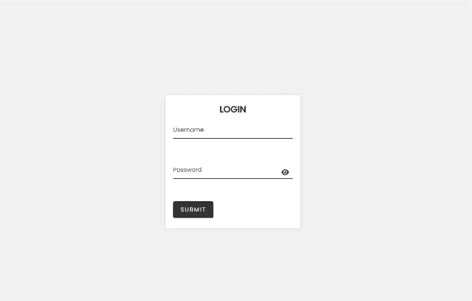

# HTML CSS로 로그인 페이지 비밀번호 눈 버튼 만들기



현재의 디지털 시대에서 대부분의 웹사이트와 애플리케이션은 사용자가 서비스에 접근하기 전에 로그인해야 합니다. 로그인 페이지는 사용자 인증이 필요한 모든 웹사이트와 애플리케이션의 기본 구성 요소입니다. 사용자는 일반적으로 계정에 액세스하기 위해 이메일 주소, 사용자 이름 및 비밀번호 조합을 입력합니다.

그러나 비밀번호 입력은 불편하고 오타가 발생할 수 있습니다. 이를 간소화하기 위해 개발자들은 비밀번호 가시성을 토글하는 눈 아이콘을 도입했습니다. 이 글에서는 HTML, CSS 및 JavaScript를 사용하여 비밀번호 눈 아이콘을 포함한 로그인 페이지를 구현하는 방법에 대해 설명하겠습니다.

## HTML:

HTML(하이퍼텍스트 마크업 언어)는 모든 웹 페이지의 기본입니다. 웹사이트에 비밀번호 눈 아이콘을 포함한 로그인 페이지를 만들려면 HTML 양식에 비밀번호 입력 필드와 눈 아이콘을 추가해야 합니다. 비밀번호 입력 필드는 JavaScript 코드에서 참조할 수 있는 ID를 가져야 합니다.

## CSS:

CSS(캐스케이딩 스타일 시트)는 HTML 페이지의 스타일 및 레이아웃을 정의합니다. 비밀번호 눈 아이콘을 추가하려면 아이콘을 스타일링하고 비밀번호 입력 필드에 추가할 CSS 클래스를 만들어야 합니다. 사용자가 아이콘을 클릭할 때 비밀번호 가시성이 토글되는 클래스를 만들 것입니다.

## JavaScript:

JavaScript는 웹 페이지를 인터랙티브하게 만드는 데 사용되는 프로그래밍 언어입니다. 로그인 페이지에서는 사용자가 눈 아이콘을 클릭할 때 비밀번호 가시성을 토글하기 위해 JavaScript를 사용할 것입니다. 또한 아이콘을 클릭하는 이벤트를 감지하는 이벤트 리스너를 추가할 것입니다.

<!-- ui-log 수평형 -->

<ins class="adsbygoogle"
     style="display:block"
     data-ad-client="ca-pub-4877378276818686"
     data-ad-slot="9743150776"
     data-ad-format="auto"
     data-full-width-responsive="true"></ins>
<component is="script">
(adsbygoogle = window.adsbygoogle || []).push({});
</component>

## 구현:

- 비밀번호 입력 필드와 눈 아이콘을 포함한 HTML 양식을 생성합니다.
- CSS를 사용하여 비밀번호 입력 필드와 눈 아이콘을 스타일링합니다.
- 사용자가 눈 아이콘을 클릭할 때 비밀번호 가시성을 토글하는 JavaScript를 사용합니다.
- 눈 아이콘에 클릭 이벤트를 감지하는 이벤트 리스너를 추가합니다.

## HTML 코드:

```html
<!DOCTYPE html>
<html lang="en">
  <head>
    <meta charset="UTF-8" />
    <meta name="viewport" content="width=device-width, initial-scale=1.0" />
    <meta http-equiv="X-UA-Compatible" content="ie=edge" />
    <title>Login Page</title>
    <link rel="stylesheet" href="style.css" />
    <link
      rel="stylesheet"
      href="https://cdnjs.cloudflare.com/ajax/libs/font-awesome/6.4.0/css/all.min.css"
      integrity="sha512-iecdLmaskl7CVkqkXNQ/ZH/XLlvWZOJyj7Yy7tcenmpD1ypASozpmT/E0iPtmFIB46ZmdtAc9eNBvH0H/ZpiBw=="
      crossorigin="anonymous"
      referrerpolicy="no-referrer"
    />
  </head>
  <body>
    <div class="container">
      <div class="login-box">
        <h2>Login</h2>
        <form action="" method="post">
          <div class="user-box">
            <input type="text" name="" required="" />
            <label>Username</label>
          </div>
          <div class="user-box">
            <input type="password" name="" id="password" required="" />
            <label>Password</label>
            <span class="password-toggle-icon"><i class="fas fa-eye"></i></span>
          </div>
          <a href="#">
            <span></span>
            <span></span>
            <span></span>
            <span></span>
            Submit
          </a>
        </form>
      </div>
    </div>
    <script src="script.js"></script>
  </body>
</html>
```

## CSS 코드:

```css
@import url("https://fonts.googleapis.com/css?family=Poppins:400,500&display=swap");

* {
  margin: 0;
  padding: 0;
  box-sizing: border-box;
  font-family: "Poppins", sans-serif;
}

body {
  height: 100vh;
  display: flex;
  justify-content: center;
  align-items: center;
  background-color: #f1f1f1;
}

.container {
  width: 100%;
  max-width: 400px;
  padding: 20px;
}

.login-box {
  background-color: #fff;
  padding: 20px;
  border-radius: 5px;
  box-shadow: 0 0 10px rgba(0, 0, 0, 0.1);
}

.login-box h2 {
  margin: 0 0 15px;
  padding: 0;
  color: #333;
  text-align: center;
  text-transform: uppercase;
}

.user-box {
  position: relative;
  margin-bottom: 30px;
}

.user-box input {
  width: 100%;
  padding: 10px 0;
  font-size: 16px;
  color: #333;
  margin-bottom: 30px;
  border: none;
  border-bottom: 2px solid #333;
  outline: none;
  background: transparent;
}

.user-box label {
  position: absolute;
  top: 0;
  left: 0;
  padding: 10px 0;
```
