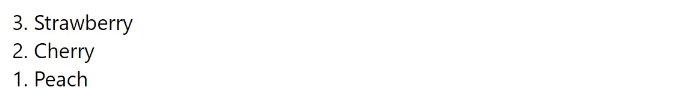
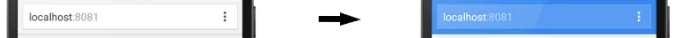
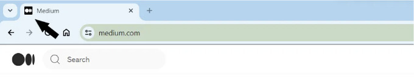
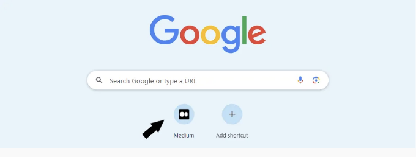

# 알아두면 유용한 HTML5 속성 15가지

::: tip 💡이 포스팅을 읽으면

:::


웹 개발의 세계는 지속적으로 혁신과 발전으로 가득 차 있으며, 이러한 발전 중 하나는 HTML5가 가져온 기능입니다. HTML5는 웹 페이지를 더욱 인상적이고 기능적으로 만들기 위한 일련의 속성을 제공합니다. 이러한 속성은 웹 개발자에게 더 많은 유연성, 성능 및 사용자 경험을 제공하도록 설계되었습니다. 이 글에서는 HTML5의 잘 알려지지 않은 15가지 유용한 속성을 살펴보겠습니다.

## 1. contenteditable

contenteditable 속성은 사용자가 요소의 내용을 편집할 수 있도록 합니다.

```js
<div contenteditable="true">이 텍스트는 편집 가능합니다.</div>
```


## 2. spellcheck

spellcheck 속성은 텍스트 입력 또는 텍스트 필드의 맞춤법 검사를 결정합니다. 이 속성은 브라우저가 사용자가 입력한 텍스트가 올바른지 확인하고 잘못된 스펠링 단어를 표시할 수 있도록 합니다.

```js
<p spellcheck="true" contenteditable="true">
  여기에 내용을 추가하세요.
</p>
```


<!-- ui-log 수평형 -->

<ins class="adsbygoogle"
     style="display:block"
     data-ad-client="ca-pub-4877378276818686"
     data-ad-slot="9743150776"
     data-ad-format="auto"
     data-full-width-responsive="true"></ins>
<component is="script">
(adsbygoogle = window.adsbygoogle || []).push({});
</component>

## 3. translate

translate 속성은 텍스트 조각이 번역되는지 여부를 나타내는 데 사용됩니다. 예를 들어, 로고, 회사 이름 또는 브랜드 이름 등입니다.

```js
<footer>
  <small>
    © 2024 <span translate="no">회사이름</span> All right reserved.
  </small>
</footer>
```


## 4. multiple

multiple 속성은 폼 요소에서 동시에 여러 옵션을 선택할 수 있도록 합니다. 일반적으로 `<select>` 및 `<input>` 태그와 함께 사용됩니다.

```js
<label for="cars">좋아하는 차량을 선택하세요:</label>
<select id="cars" name="cars" multiple>
    <option value="volvo">볼보</option>
    <option value="mercedes">메르세데스</option>
    <option value="peugeout">푸조</option>
    <option value="audi">아우디</option>
</select>
```


## 5. reversed

reversed 속성은 번호가 매겨진 목록에서 사용됩니다. 이 속성은 목록 항목의 순서를 반대로합니다. 일반적으로 `<ol>`(순서가 지정된 목록) 요소 내에서 사용됩니다.

```js
<ol reversed>
  <li>딸기</li>
  <li>체리</li>
  <li>복숭아</li>
</ol>
```



## 6. draggable

draggable 속성은 항목을 드래그할 수 있는지 여부를 결정합니다. 이 속성은 사용자가 마우스를 사용하여 항목을 끌어다 놓을 수 있도록 합니다.

```js
<p draggable="true">이것은 드래그 가능한 텍스트입니다.</p>
```

📌 draggable 속성은 부울이 아닌 열거형 속성입니다. HTML 명세에 따르면 이 속성을 사용할 때 "true" 또는 "false" 값을 명시적으로 지정해야 합니다.

<!-- ui-log 수평형 -->

<ins class="adsbygoogle"
     style="display:block"
     data-ad-client="ca-pub-4877378276818686"
     data-ad-slot="9743150776"
     data-ad-format="auto"
     data-full-width-responsive="true"></ins>
<component is="script">
(adsbygoogle = window.adsbygoogle || []).push({});
</component>

## 7. accesskey

accesskey 속성을 사용하면 키보드에서 특정 요소에 빠르게 액세스할 수 있습니다. 일반적으로 키보드의 특정 키 조합(일반적으로 [Alt] 키와 함께 사용되는 문자 또는 숫자)을 눌러 특정 요소에 빠르게 액세스할 수 있습니다.

```js
<a href="https://www.example.com" accesskey="c">연락처</a> - [Alt]+C로 액세스할 수 있습니다.
```


## 8. poster

poster 속성을 사용하면 비디오 플레이어가 로드될 비디오와 관련된 포스터 이미지를 지정할 수 있습니다. 포스터 이미지는 비디오 플레이어가 로드되는 동안 표시될 수 있으며 사용자에게 비디오의 미리보기를 제공합니다.

```js
<video width="380" height="240" poster="video_poster.jpg" controls>
  <source src="video.mp4" type="video/mp

4">
  <source src=" video.ogg" type="video/ogg">
  브라우저가 비디오 태그를 지원하지 않습니다.
</video>
```


## 9. onerror

onerror 속성은 외부 파일(예: 이미지 또는 기타 미디어 요소) 로드 중에 오류가 발생할 경우 트리거될 JavaScript 코드를 지정하는 데 사용됩니다.

```js


<script>
    function myFunction() {
      alert("이미지를 불러올 수 없습니다.");
    }
</script>
```

<!-- ui-log 수평형 -->

<ins class="adsbygoogle"
     style="display:block"
     data-ad-client="ca-pub-4877378276818686"
     data-ad-slot="9743150776"
     data-ad-format="auto"
     data-full-width-responsive="true"></ins>
<component is="script">
(adsbygoogle = window.adsbygoogle || []).push({});
</component>


## 10. theme-color

theme-color 속성은 웹 브라우저에 웹 페이지의 테마 색상을 지정합니다. 이 색상은 브라우저 인터페이스에 통합되어 사용자가 브라우저를 탐색하는 동안 특정 테마 색상을 제공합니다.

```js
<meta name="theme-color" content="#007bff">
```



## 11. favicon

favicon은 웹 사이트의 브라우저 탭이나 즐겨찾기에 나타나는 작은 아이콘입니다. 사용자가 웹 사이트 간에 쉽게 이동할 수 있도록 돕습니다.

```js
<link rel="icon" href="favicon.ico" type="image/x-icon">
```



## 12. touch-icons

touch-icons는 웹 사이트나 웹 애플리케이션의 홈 화면에 추가되는 바로 가기 아이콘입니다. 이 아이콘을 사용하면 사용자가 웹 사이트나 애플리케이션에 빠르게 액세스할 수 있습니다.

```js
<link rel="apple-touch-icon" sizes="180x180" href="/apple-touch-icon.png">
<link rel="icon" type="image/png" sizes="32x32" href="/favicon-32x32.png">
<link rel="icon" type="image/png" sizes="16x16" href="/favicon-16x16.png">
```



## 13. loading

loading 속성은 브라우저가 리소스를 로드하는 방법을 제어하는 데 사용됩니다. 이 속성은 페이지가 로드되거나 처리되는 동안 브라우저가 리소스를 로드하도록 지연하거나 우선순위를 지정할 수 있습니다. 이는 페이지 성능을 향상시키고 사용자 경험을 향상시키는 데 사용됩니다.

특히 ``, `<iframe>`, `<script>`, `<link rel=”stylesheet” href=”styles.css”>`와 같은 요소에서 사용됩니다.

```js
<!-- 예제 1: 이미지를 로드할 때 "lazy" 로딩을 사용하는 예제. -->


<!-- 예제 2: 이미지를 로드할 때 "eager" 로딩을 사용하는 예제. -->

```

🔸예제 1: loading="lazy" ➔ 이는 페이지가 로드될 때까지 이미지의 가시성을 지연시킵니다. 사용자가 이미지를 볼 수 있을 때만 로드됩니다. 이는 페이지 로딩 속도를 높이고 사용자 경험을 향상시킬 수 있습니다. 특히 페이지에 많은 큰 이미지가 있거나 사용자가 페이지를 스크롤할 때 유용합니다.

🔸예제 2: loading="eager" ➔ 이는 브라우저에 즉시 이미지를 처리하도록 지시합니다. 사용자는 즉시 이미지를 볼 수 있지만 페이지 로딩 시간이 증가할 수 있습니다. 특히 큰 이미지나 많은 이미지가 있는 페이지에서 유용합니다.

<!-- ui-log 수평형 -->

<ins class="adsbygoogle"
     style="display:block"
     data-ad-client="ca-pub-4877378276818686"
     data-ad-slot="9743150776"
     data-ad-format="auto"
     data-full-width-responsive="true"></ins>
<component is="script">
(adsbygoogle = window.adsbygoogle || []).push({});
</component>

## 14. async

async 속성은 브라우저에서 스크립트 파일을 다운로드하는 동안 HTML 콘텐츠 처리를 일시 중지하지 않습니다. 스크립트 파일이 준비되면 다운로드가 완료될 때 처리됩니다.

```js
<script src="example.js" async></script>
```

## 15. defer

defer 속성은 브라우저가 스크립트 파일을 다운로드하는 동안 HTML 콘텐츠 처리를 계속할 수 있도록 합니다. 스크립트 파일은 HTML 콘텐츠 처리 후에 실행됩니다. defer로 로드된 스크립트는 순차적으로 실행됩니다.

```js
<script src="example.js" defer></script>
```

# 결론

이렇게 HTML5가 제공하는 15가지 잘 알려지지 않은 유용한 기능에 대한 이 글은 웹 개발자의 더욱 효과적이고 효율적인 작업에 기여할 것입니다. 이러한 기능은 초보자 개발자에게 새로운 정보를 제공하고 경험있는 개발자들이 작업 흐름을 개선하는 데 도움이 될 것입니다. HTML

5가 제공하는 이러한 깊은 기능을 탐구함으로써 웹 애플리케이션은 더욱 강력하고 접근 가능하며 사용자 친화적으로 만들 수 있습니다.
