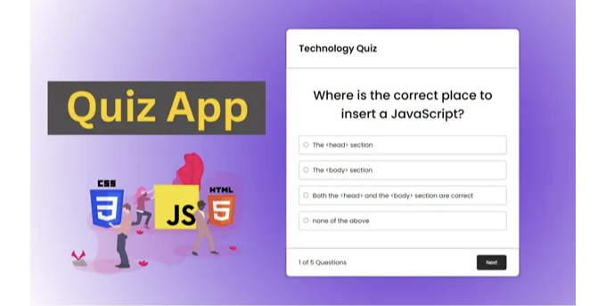

# HTML CSS로 퀴즈 앱 만들기

안녕하세요 여러분, 오늘은 HTML, CSS 및 JavaScript를 사용하여 퀴즈 앱을 만들어보겠습니다.
이 프로젝트는 HTML, CSS 및 JavaScript 를 활용하기에 좋은데요.
퀴즈앱을 만드는데는 많은 개발지식이 필요하지 않으니 쉽게 만들어보실 수 있답니다.

<!-- ui-log 수평형 -->

<ins class="adsbygoogle"
     style="display:block"
     data-ad-client="ca-pub-4877378276818686"
     data-ad-slot="9743150776"
     data-ad-format="auto"
     data-full-width-responsive="true"></ins>
<component is="script">
(adsbygoogle = window.adsbygoogle || []).push({});
</component>



# HTML CSS 및 JavaScript를 사용한 퀴즈 앱

퀴즈 앱을 만드는 첫 번째 단계는 HTML 구조를 설계하는 것인데요.
HTML(Hypertext Markup Language)은 웹 페이지의 뼈대를 정의하며 우리의 퀴즈 앱의 콘텐츠와 레이아웃을 잡아줍니다.
스케치를 하는 과정이라고 생각하시면 됩니다.

```html
<div class="quiz-container" id="quiz">
  <div class="quiz-header">
    <h2 class="header-txt">Technology Quiz</h2>
  </div>
  <div class="quiz-body">
    <h2 id="question">Question Text</h2>
    <ul>
      <li>
        <input type="radio" name="answer" id="a" class="answer" />
        <label for="a" id="a_text"> Questions </label>
      </li>
      <li>
        <input type="radio" name="answer" id="b" class="answer" />
        <label for="b" id="b_text"> Questions </label>
      </li>
      <li>
        <input type="radio" name="answer" id="c" class="answer" />
        <label for="c" id="c_text"> Questions </label>
      </li>
      <li>
        <input type="radio" name="answer" id="d" class="answer" />
        <label for="d" id="d_text"> Questions </label>
      </li>
    </ul>
  </div>
  <div class="quiz-footer">
    <div class="quiz-details"></div>
    <button type="button" id="btn">Submit</button>
  </div>
</div>
```

<!-- ui-log 수평형 -->

<ins class="adsbygoogle"
     style="display:block"
     data-ad-client="ca-pub-4877378276818686"
     data-ad-slot="9743150776"
     data-ad-format="auto"
     data-full-width-responsive="true"></ins>
<component is="script">
(adsbygoogle = window.adsbygoogle || []).push({});
</component>

HTML 구조를 설정한 후에는 CSS(Cascading Style Sheets)를 사용하여 퀴즈 앱의 스케치에 채색을 해주는 과정이라고 보시면 됩니다.

```css
@import url("https://fonts.googleapis.com/css2?family=Poppins:wght@400;500;600&family=Ruda:wght@400;600;700&display=swap");

* {
  padding: 0;
  margin: 0;
  box-sizing: border-box;
}

body {
  background: rgb(77, 14, 203);
  background: radial-gradient(circle, rgba(77, 14, 203, 1) 0%, rgba(255, 255, 255, 1) 100%);
  font-family: "poppins", sans-serif;
  display: flex;
  align-items: center;
  justify-content: center;
  height: 100vh;
  overflow: hidden;
}

.quiz-container {
  background: #fff;
  border-radius: 10px;
  box-shadow: 0 0 10px 2px rgba(100, 100, 100, 0.1);
  max-width: 600px;
  width: 100%;
}

.quiz-header {
  display: flex;
  align-items: center;
  justify-content: space-between;
  padding: 2rem 2rem;
  box-shadow: 0px 0px 5px rgba(0, 0, 0, 0.5);
  border-top-left-radius: 10px;
  border-top-right-radius: 10px;
}

.quiz-header h2 {
  font-size: 1.5rem;
}

.quiz-header p {
  background: #111;
  padding: 0.4rem 1rem;
  color: #fff;
  border-radius: 5px;
}

.quiz-body {
  padding: 2rem 2rem;
}

.quiz-body h2 {
  padding: 1rem 0;
  font-size: 2rem;
  font-weight: 500;
  text-align: center;
  margin: 0;
}

.quiz-body ul {
  list-style: none;
  padding: 0;
}

.quiz-body ul li {
  margin: 1rem 0;
  font-size: 1rem;
  border: 1px solid #aab7b8;
  padding: 0.7rem;
  border-radius: 5px;
  cursor: pointer;
}

.quiz-body ul li label {
  cursor: pointer;
  padding: 0 0.4rem;
}

.quiz-footer {
  display: flex;
  align-items: center;
  justify-content: space-between;
  padding: 1rem 2rem;
  box-shadow: 0px 0px 5px rgba(0, 0, 0, 0.5);
}

.quiz-footer button {
  padding: 0.6rem 1.5rem;
  outline: none;
  background: #111;
  border: 0;
  cursor: pointer;
  font-family: inherit;
  border-radius: 5px;
  color: #fff;
  opacity: 0.9;
  transition: 0.3s ease-in-out;
}

.quiz-body button {
  padding: 0.6rem 1rem;
  outline: none;
  background: #111;
  border: 0;
  cursor: pointer;
  font-family: inherit;
  border-radius: 5px;
  color: #fff;
  opacity: 0.9;
  transition: 0.3s ease-in-out;
  display: block;
  margin: 0 auto;
}

.quiz-footer button:hover {
  opacity: 1;
}
```

<!-- ui-log 수평형 -->

<ins class="adsbygoogle"
     style="display:block"
     data-ad-client="ca-pub-4877378276818686"
     data-ad-slot="9743150776"
     data-ad-format="auto"
     data-full-width-responsive="true"></ins>
<component is="script">
(adsbygoogle = window.adsbygoogle || []).push({});
</component>

퀴즈 앱을 만드는데는 JavaScript가 제일 중요합니다.
자바스크립트는 기능이 없는 그림을 움직일 수 있게 해주는 역할인데요.
사용자 상호작용, 질문 표시, 점수 추적 및 피드백 제공 기능을 개발해야합니다.

```js
"use strict";

const quizData = [
  {
    question: "Where is the correct place to insert a JavaScript?",
    a: "The <head> section",
    b: "The <body> section",
    c: "Both the <head> and the <body> section are correct",
    d: "none of the above",
    correct: "c",
  },

  {
    question: "Which language runs in a web browser?",
    a: "Java",
    b: "C",
    c: "Python",
    d: "JavaScript",
    correct: "d",
  },
  {
    question: "What does CSS stand for?",
    a: "Central Style Sheets",
    b: "Cascading Style Sheets",
    c: "Cascading Simple Sheets",
    d: "Cars SUVs Sailboats",
    correct: "b",
  },
  {
    question: "What does HTML stand for?",
    a: "Hypertext Markup Language",
    b: "Hypertext Markdown Language",
    c: "Hyperloop Machine Language",
    d: "Helicopters Terminals Motorboats Lamborginis",
    correct: "a",
  },
  {
    question: "What year was JavaScript launched?",
    a: "1996",
    b: "1995",
    c: "1994",
    d: "none of the above",
    correct: "b",
  },
];

const quiz = document.querySelector(".quiz-body");
const answerEl = document.querySelectorAll(".answer");
const questionEl = document.getElementById("question");
const footerEl = document.querySelector(".quiz-footer");
const quizDetailEl = document.querySelector(".quiz-details");
const liEl = document.querySelector("ul li");

const a_txt = document.getElementById("a_text");
const b_txt = document.getElementById("b_text");
const c_txt = document.getElementById("c_text");
const d_txt = document.getElementById("d_text");
const btnSubmit = document.getElementById("btn");

let currentQuiz = 0;
let score = 0;

loadQuiz();

function loadQuiz() {
  deselectAnswers();
  const currentQuizData = quizData[currentQuiz];
  questionEl.innerText = currentQuizData.question;
  a_txt.innerText = currentQuizData.a;
  b_txt.innerText = currentQuizData.b;
  c_txt.innerText = currentQuizData.c;
  d_txt.innerText = currentQuizData.d;
  quizDetailEl.innerHTML = `<p>${currentQuiz + 1} of ${quizData.length}</p>`;
}

// deselect
function deselectAnswers() {
  answerEl.forEach((answerEl) => {
    answerEl.checked = false;
  });
}

// get selected
function getSelected() {
  let answer;
  answerEl.forEach((answerEls) => {
    if (answerEls.checked) {
      answer = answerEls.id;
    }
  });
  return answer;
}

btnSubmit.addEventListener("click", function () {
  const answers = getSelected();

  if (answers) {
    if (answers === quizData[currentQuiz].correct) {
      score++;
    }
    nextQuestion();
  }
});

// next Slide
function nextQuestion() {
  currentQuiz++;

  if (currentQuiz < quizData.length) {
    loadQuiz();
  } else {
    quiz.innerHTML = `<h2>You answered ${score}/${quizData.length} question correctly</h2>
    <button type="button" onclick="location.reload()">Reload</button>
    `;
    footerEl.style.display = "none";
  }
}
```

<!-- ui-log 수평형 -->

<ins class="adsbygoogle"
     style="display:block"
     data-ad-client="ca-pub-4877378276818686"
     data-ad-slot="9743150776"
     data-ad-format="auto"
     data-full-width-responsive="true"></ins>
<component is="script">
(adsbygoogle = window.adsbygoogle || []).push({});
</component>

HTML, CSS 및 JavaScript를 사용하여 퀴즈 앱을 만드는 프로젝트의 전체 소스 코드를 공유했습니다.
