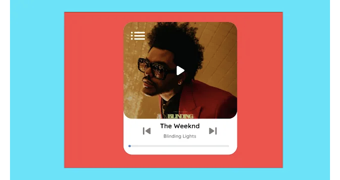
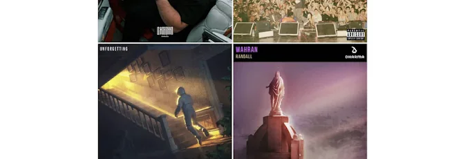

# HTML, CSS, JS를 활용한 음악 플레이어 만들기

이 글에서는 HTML, CSS 및 JavaScript를 사용하여 음악 플레이어와 재생 목록을 만드는 방법을 배웁니다.
음악, 재생, 일시 정지를 위한 썸네일이 있습니다. JavaScript를 사용하여 이전 및 다음 곡 기능을 구현할 수 있습니다.
또한 곡 타이머를 클릭하여 곡 타이밍을 건너뛸 수도 있습니다.



<!-- ui-log 수평형 -->

<ins class="adsbygoogle"
     style="display:block"
     data-ad-client="ca-pub-4877378276818686"
     data-ad-slot="9743150776"
     data-ad-format="auto"
     data-full-width-responsive="true"></ins>
<component is="script">
(adsbygoogle = window.adsbygoogle || []).push({});
</component>

# 음악 플레이어를 위한 HTML 코드

```html
<div class="player">
  <div class="player__header">
    <div class="player__img player__img--absolute slider">
      <button class="player__button player__button--absolute--nw playlist">
        
      </button>
      <button class="player__button player__button--absolute--center play">
        
        
      </button>
      <div class="slider__content">
        
        <!-- 재생목록 이미지들 -->
      </div>
    </div>
    <div class="player__controls">
      <button class="player__button back">
        
      </button>
      <p class="player__context slider__context">
        <strong class="slider__name"></strong>
        <span class="player__title slider__title"></span>
      </p>
      <button class="player__button next">
        
      </button>
      <div class="progres">
        <div class="progres__filled"></div>
      </div>
    </div>
  </div>
  <ul class="player__playlist list">
    <!-- 재생 목록 -->
  </ul>
</div>
```

음악 플레이어의 모든 HTML 코드가 여기에 있습니다. 이제 CSS 및 JavaScript 없이 출력을 볼 수 있습니다. 그런 다음 음악 플레이어를 위해 CSS 및 JavaScript를 작성하겠습니다.

CSS 및 JavaScript 없이 음악 플레이어의 HTML 코드 출력입니다.

<!-- ui-log 수평형 -->

<ins class="adsbygoogle"
     style="display:block"
     data-ad-client="ca-pub-4877378276818686"
     data-ad-slot="9743150776"
     data-ad-format="auto"
     data-full-width-responsive="true"></ins>
<component is="script">
(adsbygoogle = window.adsbygoogle || []).push({});
</component>




<!-- ui-log 수평형 -->

<ins class="adsbygoogle"
     style="display:block"
     data-ad-client="ca-pub-4877378276818686"
     data-ad-slot="9743150776"
     data-ad-format="auto"
     data-full-width-responsive="true"></ins>
<component is="script">
(adsbygoogle = window.adsbygoogle || []).push({});
</component>

# 음악 플레이어를 위한 CSS 코드

```css
@import url("https://fonts.googleapis.com/css2?family=Quicksand:wght@700&display=swap");
html {
  box-sizing: border-box;
  --parent-height: 20em;
  --duration: 1s;
  --duration-text-wrap: 12s 1.5s cubic-bezier(0.82, 0.82, 1, 1.01);
  --cubic-header: var(--duration) cubic-bezier(0.71, 0.21, 0.3, 0.95);
  --cubic-slider: var(--duration) cubic-bezier(0.4, 0, 0.2, 1);
  --cubic-play-list: 0.35s var(--duration) cubic-bezier(0, 0.85, 0.11, 1.64);
  --cubic-slider-context: cubic-bezier(1, -0.01, 1, 1.01);
}
html *,
html *::before,
html *::after {
  box-sizing: inherit;
  scrollbar-width: none;
}
body {
  margin: 0;
  height: 100vh;
  display: flex;
  user-select: none;
  align-items: center;
  justify-content: center;
  background-color: #e5e7e9;
  font-family: "Quicksand", sans-serif;
  -webkit-tap-highlight-color: transparent;
  transition: background-color var(--cubic-slider);
}
.img {
  width: 100%;
  flex-shrink: 0;
  display: block;
  object-fit: cover;
}
.list {
  margin: 0;
  padding: 0;
  list-style-type: none;
}
.flex {
  display: flex;
  align-items: center;
  justify-content: space-between;
}
.uppercase {
  text-transform: uppercase;
}
.player {
  width: 17.15em;
  display: flex;
  overflow: hidden;
  font-size: 1.22em;
  border-radius: 1.35em;
  flex-direction: column;
  background-color: white;
  height: var(--parent-height);
}
.player__header {
  z-index: 1;
  gap: 0 0.4em;
  width: 100%;
  display: flex;
  height: 5.85em;
  flex-shrink: 0;
  position: relative;
  align-items: flex-start;
  border-radius: inherit;
  justify-content: flex-end;
  background-color: white;
  padding: 0.95em 0.6em 0 1.2em;
  box-shadow: 0 2px 6px 1px #0000001f;
  transition: height var(--cubic-header), box-shadow var(--duration), padding var(--duration) ease-in-out;
}
.player__header.open-header {
  height: 100%;
  padding-left: 0;
  padding-right: 0;
  box-shadow: unset;
}
.player__img {
  width: 3.22em;
  height: 3.22em;
  border-radius: 1.32em;
}
.player__img--absolute {
  top: 1.4em;
  left: 1.2em;
  position: absolute;
}
.slider {
  flex-shrink: 0;
  overflow: hidden;
  transition: width var(--cubic-header), height var(--cubic-header), top var(--cubic-header), left var(--cubic-header);
}
.slider.open-slider {
  top: 0;
  left: 0;
  width: 100%;
  height: 14.6em;
}
.slider__content {
  display: flex;
  height: 100%;
  will-change: transform;
  transition: transform var(--cubic-slider);
}
.slider__img {
  filter: brightness(75%);
}
.slider__name,
.slider__title {
  overflow: hidden;
  white-space: nowrap;
}
.text-wrap {
  display: block;
  white-space: pre;
  width: fit-content;
  animation: text-wrap var(--duration-text-wrap) infinite;
}
@keyframes text-wrap {
  75% {
    transform: translate3d(-51.5%, 0, 0);
  }
  100% {
    transform: translate3d(-51.5%, 0, 0);
  }
}
.player__button {
  all: unset;
  z-index: 100;
  width: 2.5em;
  height: 2.5em;
  cursor: pointer;
}
.playlist {
  transform: scale(0);
  transition: transform calc(var(--duration) / 2);
}
.slider.open-slider .playlist {
  transform: scale(1);
  transition: transform var(--cubic-play-list);
}
.player__button--absolute--nw {
  top: 5.5%;
  left: 5.5%;
  position: absolute;
}
.player__button--absolute--center {
  top: 0;
  left: 0;
  right: 0;
  bottom: 0;
  margin: auto;
  position: absolute;
}
img[alt="pause-icon"] {
  display: none;
}
.player__controls {
  width: 77%;
  gap: 0.5em 0;
  display: flex;
  flex-wrap: wrap;
  align-items: center;
  will-change: contents;
  align-content: center;
  justify-content: center;
  transition: transform var(--cubic-header), width var(--cubic-header);
}
.player__controls.move {
  width: 88%;
  transform: translate3d(-1.1em, calc(var(--parent-height) - 153%), 0);
}
.player__context {
  margin: 0;
  width: 100%;
  display: flex;
  line-height: 1.8;
  flex-direction: column;
  justify-content: center;
  text-transform: capitalize;
}
.slider__context {
  width: 56.28%;
  cursor: pointer;
  text-align: center;
  padding-bottom: 0.2em;
  will-change: contents;
  transition: width var(--cubic-header);
  animation: calc(var(--duration) / 2) var(--cubic-slider-context);
}
@keyframes opacity {
  0% {
    opacity: 0;
  }
  90% {
    opacity: 1;
  }
}
.player__controls.move .slider__context {
  width: 49.48%;
}
.player__title {
  font-size: 0.7em;
  font-weight: bold;
  color: #00000086;
}
.progres {
  width: 90%;
  height: 0.25em;
  cursor: pointer;
  border-radius: 1em;
  touch-action: none;
  background-color: #e5e7ea;
  transition: width var(--cubic-header);
}
.player__controls.move .progres {
  width: 98%;
}
.progres__filled {
  width: 0%;
  height: 100%;
  display: flex;
  position: relative;
  align-items: center;
  border-radius: inherit;
  background-color: #78adfe;
}
.progres__filled::before {
  right: 0;
  width: 0.35em;
  content: " ";
  height: 0.35em;
  border-radius: 50%;
  position: absolute;
  background-color: #5781bd;
}
.player__playlist {
  height: 100%;
  overflow: auto;
  padding: 1.05em 0.9em 0 1.2em;
}
.player__playlist::-webkit-scrollbar {
  width: 0;
}
.player__song {
  /* gap: 0 .65em ; */
  display: flex;
  cursor: pointer;
  margin-bottom: 0.5em;
  padding-bottom: 0.7em;
  border-bottom: 0.1em solid #d8d8d859;
}
.player__song .player__context {
  line-height: 1.5;
  margin-left: 0.65em;
}
.player__song-name {
  font-size: 0.88em;
}
.player__song-time {
  font-size: 0.65em;
  font-weight: bold;
  color: #00000079;
  height: fit-content;
  align-self: flex-end;
}
.audio {
  display: none !important ;
}
```

여기 음악 플레이어의 CSS 코드가 있습니다.

CSS 및 JavaScript가 추가된 음악 플레이어의 최종 출력입니다.


# 음악 플레이어 및 재생 목록을 위한 JavaScript 코드

<!-- ui-log 수평형 -->

<ins class="adsbygoogle"
     style="display:block"
     data-ad-client="ca-pub-4877378276818686"
     data-ad-slot="9743150776"
     data-ad-format="auto"
     data-full-width-responsive="true"></ins>
<component is="script">
(adsbygoogle = window.adsbygoogle || []).push({});
</component>

```javascript
// Designed by: Mauricio Bucardo
// Original image: https://dribbble.com/shots/6957353-Music-Player-Widget
"use strict";
// add elemnts
const bgBody = ["#e5e7e9", "#ff4545", "#f8ded3", "#ffc382", "#f5eda6", "#ffcbdc", "#dcf3f3"];
const body = document.body;
const player = document.querySelector(".player");
const playerHeader = player.querySelector(".player__header");
const playerControls = player.querySelector(".player__controls");
const playerPlayList = player.querySelectorAll(".player__song");
const playerSongs = player.querySelectorAll(".audio");
const playButton = player.querySelector(".play");
const nextButton = player.querySelector(".next");
const backButton = player.querySelector(".back");
const playlistButton = player.querySelector(".playlist");
const slider = player.querySelector(".slider");
const sliderContext = player.querySelector(".slider__context");
const sliderName = sliderContext.querySelector(".slider__name");
const sliderTitle = sliderContext.querySelector(".slider__title");
const sliderContent = slider.querySelector(".slider__content");
const sliderContentLength = playerPlayList.length - 1;
const sliderWidth = 100;
let left = 0;
let count = 0;
let song = playerSongs[count];
let isPlay = false;
const pauseIcon = playButton.querySelector("img[alt = 'pause-icon']");
const playIcon = playButton.querySelector("img[alt = 'play-icon']");
const progres = player.querySelector(".progres");
const progresFilled = progres.querySelector(".progres__filled");
let isMove = false;
// creat functions
function openPlayer() {
  playerHeader.classList.add("open-header");
  playerControls.classList.add("move");
  slider.classList.add("open-slider");
}
function closePlayer() {
  playerHeader.classList.remove("open-header");
  playerControls.classList.remove("move");
  slider.classList.remove("open-slider");
}
function next(index) {
  count = index || count;
  if (count == sliderContentLength) {
    count = count;
    return;
  }
  left = (count + 1) * sliderWidth;
  left = Math.min(left, sliderContentLength * sliderWidth);
  sliderContent.style.transform = `translate3d(-${left}%, 0, 0)`;
  count++;
  run();
}
function back(index) {
  count = index || count;
  if (count == 0) {
    count = count;
    return;
  }
  left = (count - 1) * sliderWidth;
  left = Math.max(0, left);
  sliderContent.style.transform = `translate3d(-${left}%, 0, 0)`;
  count--;
  run();
}
function changeSliderContext() {
  sliderContext.style.animationName = "opacity";
  sliderName.textContent = playerPlayList[count].querySelector(".player__title").textContent;
  sliderTitle.textContent = playerPlayList[count].querySelector(".player__song-name").textContent;
  if (sliderName.textContent.length > 16) {
    const textWrap = document.createElement("span");
    textWrap.className = "text-wrap";
    textWrap.innerHTML = sliderName.textContent + " " + sliderName.textContent;
    sliderName.innerHTML = "";
    sliderName.append(textWrap);
  }
  if (sliderTitle.textContent.length >= 18) {
    const textWrap = document.createElement("span");
    textWrap.className = "text-wrap";
    textWrap.innerHTML = sliderTitle.textContent + " " + sliderTitle.textContent;
    sliderTitle.innerHTML = "";
    sliderTitle.append(textWrap);
  }
}
function changeBgBody() {
  body.style.backgroundColor = bgBody[count];
}
function selectSong() {
  song = playerSongs[count];
  for (const item of playerSongs) {
    if (item != song) {
      item.pause();
      item.currentTime = 0;
    }
  }
  if (isPlay) song.play();
}
function run() {
  changeSliderContext();
  changeBgBody();
  selectSong();
}
function playSong() {
  if (song.paused) {
    song.play();
    playIcon.style.display = "none";
    pauseIcon.style.display = "block";
  } else {
    song.pause();
    isPlay = false;
    playIcon.style.display = "";
    pauseIcon.style.display = "";
  }
}
function progresUpdate() {
  const progresFilledWidth = (this.currentTime / this.duration) * 100 + "%";
  progresFilled.style.width = progresFilledWidth;
  if (isPlay && this.duration == this.currentTime) {
    next();
  }
  if (count == sliderContentLength && song.currentTime == song.duration) {
    playIcon.style.display = "block";
    pauseIcon.style.display = "";
    isPlay = false;
  }
}
function scurb(e) {
  // If we use e.offsetX, we have trouble setting the song time, when the mousemove is running
  const currentTime = ((e.clientX - progres.getBoundingClientRect().left) / progres.offsetWidth) * song.duration;
  song.currentTime = currentTime;
}
function durationSongs() {
  let min = parseInt(this.duration / 60);
  if (min < 10) min = "0" + min;
  let sec = parseInt(this.duration % 60);
  if (sec < 10) sec = "0" + sec;
  const playerSongTime = `${min}:${sec}`;
  this.closest(".player__song").querySelector(".player__song-time").append(playerSongTime);
}
changeSliderContext();
// add events
sliderContext.addEventListener("click", openPlayer);
sliderContext.addEventListener("animationend", () => (sliderContext.style.animationName = ""));
playlistButton.addEventListener("click", closePlayer);
nextButton.addEventListener("click", () => {
  next(0);
});
backButton.addEventListener("click", () => {
  back(0);
});
playButton.addEventListener("click", () => {
  isPlay = true;
  playSong();
});
playerSongs.forEach((song) => {
  song.addEventListener("loadeddata", durationSongs);
  song.addEventListener("timeupdate", progresUpdate);
});
progres.addEventListener("pointerdown", (e) => {
  scurb(e);
  isMove = true;
});
document.addEventListener("pointermove", (e) => {
  if (isMove) {
    scurb(e);
    song.muted = true;
  }
});
document.addEventListener("pointerup", () => {
  isMove = false;
  song.muted = false;
});
playerPlayList.forEach((item, index) => {
  item.addEventListener("click", function () {
    if (index > count) {
      next(index - 1);
      return;
    }
    if (index < count) {
      back(index + 1);
      return;
    }
  });
});
```

여기 음악 플레이어 및 재생 목록의 JavaScript 코드가 있습니다.

# 음악 플레이어의 최종 출력


이제 HTML, CSS, JavaScript로 완성된 음악 플레이어를 확인할 수 있습니다. 음악 플레이어를 사용하여 음악을 즐기시길 바랍니다.

HTML, CSS, JavaScript를 사용하여 간단한 음악 플레이어에 대한 자주 묻는 질문 (FAQ)

<!-- ui-log 수평형 -->

<ins class="adsbygoogle"
     style="display:block"
     data-ad-client="ca-pub-4877378276818686"
     data-ad-slot="9743150776"
     data-ad-format="auto"
     data-full-width-responsive="true"></ins>
<component is="script">
(adsbygoogle = window.adsbygoogle || []).push({});
</component>

# 이 음악 플레이어에서 음악 파일을 첨부해야 하나요, 아니면 온라인 음악으로 작동하나요?

네, 여기에 음악 파일을 추가하고 HTML 코드의 src 속성에 연결할 수 있으며 잘 작동합니다. 또한 온라인 오디오 URL과 연결할 수 있습니다. 현재 이 코드는 온라인 오디오 URL과 작동합니다.

# 이 음악 플레이어 프로젝트에서 어떤 프로그래밍 언어를 사용했나요?

우리는 음악 플레이어의 구조를 만들기 위해 HTML 코드를 사용하고, 플레이어에 스타일을 적용하기 위해 CSS 코드를 사용하며, JavaScript를 사용하여 음악을 제어합니다.
