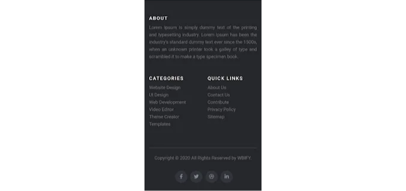

# HTML CSS로 푸터 만들기 (소스코드 포함)

::: tip 💡이 글을 읽으면
HTML과 CSS를 사용하여 간단한 푸터를 만드는 방법과 프로젝트 소개, 소스코드를 제공합니다.
:::

<!-- ui-log 수평형 -->

<ins class="adsbygoogle"
     style="display:block"
     data-ad-client="ca-pub-4877378276818686"
     data-ad-slot="9743150776"
     data-ad-format="auto"
     data-full-width-responsive="true"></ins>
<component is="script">
(adsbygoogle = window.adsbygoogle || []).push({});
</component>

이 글에서는 HTML과 CSS를 사용하여 간단한 푸터를 만들어봅니다. 이 푸터에는 회사 소개 텍스트, 중요 링크, 웹사이트의 중요 페이지 및 소셜 미디어 아이콘이 포함됩니다. 그러니 HTML과 CSS를 사용하여 만들어 보겠습니다.

웹 개발자라면 아마도 여러분의 웹사이트에 푸터를 디자인한 적이 있을 것입니다. 혹은 다른 웹페이지의 푸터를 접했을 것입니다. 푸터란 무엇일까요? 보통 웹페이지의 맨 아래에 위치하며 회사에 대한 간단한 정보와 빠른 링크, 소셜 미디어 링크 등이 담겨 있습니다.

하지만 이 작은 공간이 끝나는 부분에서 중요한 역할을 합니다. 우리가 어떤 웹페이지나 관련 자료의 끝에 도달하면 무엇을 할까요? 그것을 종료하지만 푸터는 우리가 다시 그 자료로 돌아갈 수 있도록 해줍니다. 페이지의 맨 위로 스크롤할 필요 없이 링크를 클릭하여 해당 페이지로 이동할 수 있습니다.

<!-- ui-log 수평형 -->

<ins class="adsbygoogle"
     style="display:block"
     data-ad-client="ca-pub-4877378276818686"
     data-ad-slot="9743150776"
     data-ad-format="auto"
     data-full-width-responsive="true"></ins>
<component is="script">
(adsbygoogle = window.adsbygoogle || []).push({});
</component>

이와 비슷한 기능을 우리가 직접 디자인해 보겠습니다.


프로젝트 미리보기에서 어떻게 구성되어 있는지 확인할 수 있습니다. 당신이 보고 계시는 것처럼, 모든 것이 단일 컨테이너에 구성되어 있습니다.
우리 프로젝트의 특징은 다음과 같습니다.

- 3개의 다른 열이 있고, 그 아래에 수평선이 있으며, 그 아래에 저작권 메시지와 소셜 링크가 있습니다. 이것은 어떤 푸터의 기본 구조입니다. 더 많은 상호 작용을 원한다면 이를 구축하고 편의에 맞게 편집하세요.
- 우리의 푸터는 반응형입니다. 그래서 반응형 사이드에서 어떻게 보이는지도 함께 첨부했습니다.

<!-- ui-log 수평형 -->

<ins class="adsbygoogle"
     style="display:block"
     data-ad-client="ca-pub-4877378276818686"
     data-ad-slot="9743150776"
     data-ad-format="auto"
     data-full-width-responsive="true"></ins>
<component is="script">
(adsbygoogle = window.adsbygoogle || []).push({});
</component>



# HTML 푸터 소스 코드:

HTML 파일의 구조를 처음부터 추가하지 않겠습니다. 우리가 디자인하는 브라우저의 주요 부분인 body 부분만 붙여넣겠습니다.

HTML 섹션에는 다음과 같은 부분이 있습니다.

- 먼저, 푸터가 있으며, 이는 코멘트 섹션의 다른 부분을 모두 포함할 것입니다.
- 그런 다음 세 개의 열이 있고, 수평선 아래에 있는 것은 저작권 메시지와 소셜 링크입니다.

아래 코드를 확인하고 HTML에서 실행해보세요.

<!-- ui-log 수평형 -->

<ins class="adsbygoogle"
     style="display:block"
     data-ad-client="ca-pub-4877378276818686"
     data-ad-slot="9743150776"
     data-ad-format="auto"
     data-full-width-responsive="true"></ins>
<component is="script">
(adsbygoogle = window.adsbygoogle || []).push({});
</component>

```html
<!DOCTYPE html>
<html>
  <head>
    <title>HTML CSS로 푸터 만들기</title>
    <meta name="viewport" content="width=device-width, initial-scale=1.0" />
    <link
      rel="stylesheet"
      href="https://stackpath.bootstrapcdn.com/bootstrap/4.1.3/css/bootstrap.min.css"
      integrity="sha384-MCw98/SFnGE8fJT3GXwEOngsV7Zt27NXFoaoApmYm81iuXoPkFOJwJ8ERdknLPMO"
      crossorigin="anonymous"
    />
    <link
      rel="stylesheet"
      href="https://cdnjs.cloudflare.com/ajax/libs/font-awesome/5.15.1/css/all.min.css"
      integrity="sha512-+4zCK9k+qNFUR5X+cKL9EIR+ZOhtIloNl9GIKS57V1MyNsYpYcUrUeQc9vNfzsWfV28IaLL3i96P9sdNyeRssA=="
      crossorigin="anonymous"
    />
    <link rel="stylesheet" href="style.css" />
  </head>
  <body>
    <footer class="site-footer">
      <div class="container">
        <div class="row">
          <div class="col-sm-12 col-md-6">
            <h6>About</h6>
            <p class="text-justify">
              Lorem Ipsum is simply dummy text of the printing and typesetting industry. Lorem Ipsum has been the industry's standard dummy text ever since the 1500s, when an unknown printer took a
              galley of type and scrambled it to make a type specimen book.
            </p>
          </div>
          <div class="col-6 col-md-3">
            <h6>Categories</h6>
            <ul class="footer-links ">
              <li><a href="#">Website Design</a></li>
              <li><a href="#">UI Design</a></li>
              <li><a href="#">Web Development</a></li>
              <li><a href="#">Video Editor</a></li>
              <li><a href="#">Theme Creator</a></li>
              <li><a href="#">Templates</a></li>
            </ul>
          </div>
          <div class="col-6 col-md-3">
            <h6>Quick Links</h6>
            <ul class="footer-links">
              <li><a href="#">About Us</a></li>
              <li><a href="#">Contact Us</a></li>
              <li><a href="#">Contribute</a></li>
              <li><a href="#">Privacy Policy</a></li>
              <li><a href="#">Sitemap</a></li>
            </ul>
          </div>
        </div>
        <hr class="small" />
      </div>
      <div class="container">
        <div class="row">
          <div class="col-md-8 col-sm-6 col-12">
            <p class="copyright-text">
              Copyright © 2020 All Rights Reserved by
              <a href="#"><span class="logo">WBIFY.</span></a>
            </p>
          </div>
          <div class="col-md-4 col-sm-6 col-12">
            <ul class="social-icons">
              <li>
                <a class="facebook" href="#"><i class="fab fa-facebook-f"></i></a>
              </li>
              <li>
                <a class="twitter" href="#"><i class="fab fa-twitter"></i></a>
              </li>
              <li>
                <a class="dribbble" href="#"><i class="fab fa-dribbble"></i></a>
              </li>
              <li>
                <a class="linkedin" href="#"><i class="fab fa-linkedin-in"></i></a>
              </li>
            </ul>
          </div>
        </div>
      </div>
    </footer>
    <script src="https://code.jquery.com/jquery-3.3.1.slim.min.js" integrity="sha384-q8i/X+965DzO0rT7abK41JStQIAqVgRVzpbzo5smXKp4YfRvH+8abtTE1Pi6jizo" crossorigin="anonymous"></script>
    <script
      src="https://cdnjs.cloudflare.com/ajax/libs/popper.js/1.14.3/umd/popper.min.js"
      integrity="sha384-ZMP7rVo3mIykV+2+9J3UJ46jBk0WLaUAdn689aCwoqbBJiSnjAK/l8WvCWPIPm49"
      crossorigin="anonymous"
    ></script>
    <script
      src="https://stackpath.bootstrapcdn.com/bootstrap/4.1.3/js/bootstrap.min.js"
      integrity="sha384-ChfqqxuZUCnJSK3+MXmPNIyE6ZbWh2IMqE241rYiqJxyMiZ6OW/JmZQ5stwEULTy"
      crossorigin="anonymous"
    ></script>
  </body>
</html>
```

<!-- ui-log 수평형 -->

<ins class="adsbygoogle"
     style="display:block"
     data-ad-client="ca-pub-4877378276818686"
     data-ad-slot="9743150776"
     data-ad-format="auto"
     data-full-width-responsive="true"></ins>
<component is="script">
(adsbygoogle = window.adsbygoogle || []).push({});
</component>

# CSS 푸터 소스 코드:

CSS를 사용하여 컨테이너를 디자인하고 중앙으로 가져와서 텍스트 영역의 너비를 설정하고 헤딩 뒤에 배치하고 두 버튼을 디자인하고 초기에 숨깁니다.

아래 코드를 추가하여 HTML 파일의 절반을 완성하고 마법을 보세요.

<!-- ui-log 수평형 -->

<ins class="adsbygoogle"
     style="display:block"
     data-ad-client="ca-pub-4877378276818686"
     data-ad-slot="9743150776"
     data-ad-format="auto"
     data-full-width-responsive="true"></ins>
<component is="script">
(adsbygoogle = window.adsbygoogle || []).push({});
</component>

```css
@import url("https://fonts.googleapis.com/css2?family=Poppins:wght@200;300;400;500;600;700;800;900&display=swap");
* {
  margin: 0;
  padding: 0;
  box-sizing: border-box;
}
body {
  font-family: "Poppins", sans-serif;
  min-height: 100vh;
  display: block;
  align-items: center;
  justify-content: center;
}
.site-footer {
  background-color: #26272b;
  padding: 45px 0 20px;
  font-size: 15px;
  line-height: 24px;
  color: #737373;
  box-shadow: 0 10px 20px rgba(0, 0, 0, 0.5);
}
.site-footer hr {
  border-top-color: #bbb;
  opacity: 0.5;
}
.site-footer hr.small {
  margin: 20px 0;
}
.site-footer h6 {
  color: #fff;
  font-size: 16px;
  text-transform: uppercase;
  margin-top: 5px;
  letter-spacing: 2px;
}
.site-footer a {
  color: #737373;
}
.site-footer a:hover {
  color: #fff;
  text-decoration: none;
}
.footer-links {
  padding-left: 0;
  list-style: none;
}
.footer-links li {
  display: block;
}
.footer-links a {
  color: #737373;
}
.footer-links a:active,
.footer-links a:focus,
.footer-links a:hover {
  color: #fff;
  text-decoration: none;
}
.site-footer .social-icons {
  text-align: right;
}
.site-footer .social-icons a {
  width: 40px;
  height: 40px;
  line-height: 40px;
  margin-left: 6px;
  margin-right: 0;
  border-radius: 100%;
  background-color: #33353d;
}
.copyright-text {
  margin: 0;
}
@media (max-width: 991px) {
  .site-footer [class^="col-"] {
    margin-bottom: 30px;
  }
}
@media (max-width: 767px) {
  .site-footer {
    padding-bottom: 0;
  }
  .site-footer .copyright-text,
  .site-footer .social-icons {
    text-align: center;
  }
}
.social-icons {
  padding-left: 0;
  margin-bottom: 0;
  list-style: none;
}
.social-icons li {
  display: inline-block;
  margin-bottom: 4px;
}
.social-icons a {
  background-color: #eceeef;
  color: #818a91;
  font-size: 16px;
  display: inline-block;
  line-height: 44px;
  width: 44px;
  height: 44px;
  text-align: center;
  margin-right: 8px;
  border-radius: 100%;
  -webkit-transition: all 0.2s linear;
  -o-transition: all 0.2s linear;
  transition: all 0.2s linear;
}
.logo {
  color: #eb6857;
}
.social-icons a:active,
.social-icons a:focus,
.social-icons a:hover {
  color: #fff;
  background-color: #29aafe;
}
.social-icons a.facebook:hover {
  background-color: #3b5998;
}
.social-icons a.twitter:hover {
  background-color: #00aced;
}
.social-icons a.linkedin:hover {
  background-color: #007bb6;
}
.social-icons a.dribbble:hover {
  background-color: #ea4c89;
}
```

이 블로그를 통해 HTML과 CSS를 사용하여 간단한 푸터를 만드는 방법을 배웠습니다.
