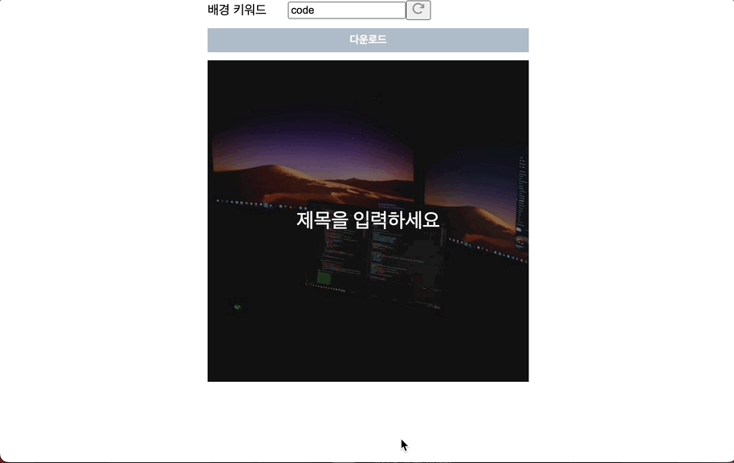

# html2canvas로 html 요소 캡쳐해서 이미지로 다운로드 받기

::: tip 💡이 포스팅을 읽으면
html2canvas를 이용해 특정 html 태그를 캡쳐해서 이미지로 다운로드 받을 수 있는 방법에 대해서 알 수 있습니다.
:::

## 1. html2canvas 설치

<component is="script" src="https://pagead2.googlesyndication.com/pagead/js/adsbygoogle.js?client=ca-pub-4877378276818686" crossorigin="anonymous" async></component>

<!-- ui-log 수평형 -->

<ins class="adsbygoogle"
     style="display:block"
     data-ad-client="ca-pub-4877378276818686"
     data-ad-slot="9743150776"
     data-ad-format="auto"
     data-full-width-responsive="true"></ins>
<component is="script">
(adsbygoogle = window.adsbygoogle || []).push({});
</component>

```bash
npm i html2canvas
```

### canvas로 변환하는 함수

```tsx
import html2canvas from "html2canvas";

// canvas로 변환하는 함수
const download = () => {
  window.scrollTo(0, 0);
  const thumbnail: any = document.querySelector("#thumbnail");
  /*
    allowTaint : cors 이미지
    useCORS : cors 이미지
    */
  html2canvas(thumbnail, { allowTaint: true, useCORS: true }).then(function (canvas) {
    console.log;
    saveAs(canvas.toDataURL(), "thumbnail_img.jpg");
    // document.body.appendChild(canvas);
  });
};
```

<component is="script" src="https://pagead2.googlesyndication.com/pagead/js/adsbygoogle.js?client=ca-pub-4877378276818686" crossorigin="anonymous" async></component>

<!-- ui-log 수평형 -->

<ins class="adsbygoogle"
     style="display:block"
     data-ad-client="ca-pub-4877378276818686"
     data-ad-slot="9743150776"
     data-ad-format="auto"
     data-full-width-responsive="true"></ins>
<component is="script">
(adsbygoogle = window.adsbygoogle || []).push({});
</component>

### 다운로드 받는 함수

```tsx
// 변환된 canvas를 이미지로 다운로드 받는 함수
const saveAs = (uri: any, filename: string) => {
  var link = document.createElement("a");
  if (typeof link.download === "string") {
    link.href = uri;
    link.download = filename;

    //Firefox requires the link to be in the body
    document.body.appendChild(link);

    //simulate click
    link.click();

    //remove the link when done
    document.body.removeChild(link);
  } else {
    window.open(uri);
  }
};
```

## 결과 화면

위와 같이 작성해서 버튼 클릭 이벤트에 연결하면 아래처럼 다운로드 버튼 클릭시 특정 html요소를 이미지로 만들어 다운로드 받을 수 있습니다.

<component is="script" src="https://pagead2.googlesyndication.com/pagead/js/adsbygoogle.js?client=ca-pub-4877378276818686" crossorigin="anonymous" async></component>

<!-- ui-log 수평형 -->

<ins class="adsbygoogle"
     style="display:block"
     data-ad-client="ca-pub-4877378276818686"
     data-ad-slot="9743150776"
     data-ad-format="auto"
     data-full-width-responsive="true"></ins>
<component is="script">
(adsbygoogle = window.adsbygoogle || []).push({});
</component>



파일의 이름도 지정할 수 있고, 특정 요소르 이미지로 다운로드 받을 수 있으니 다양하게 활용할 수 있을 것 같다.
