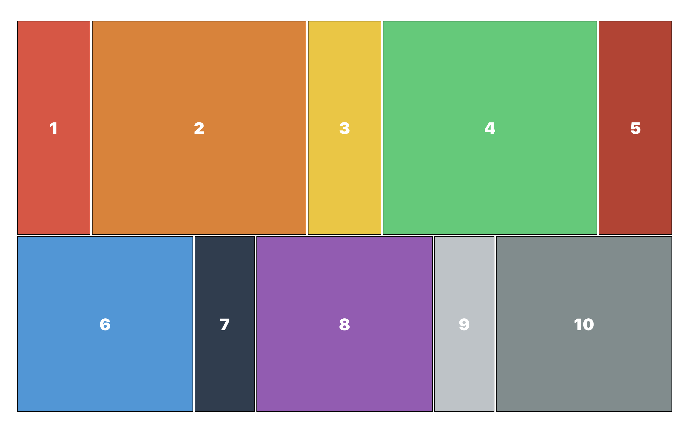
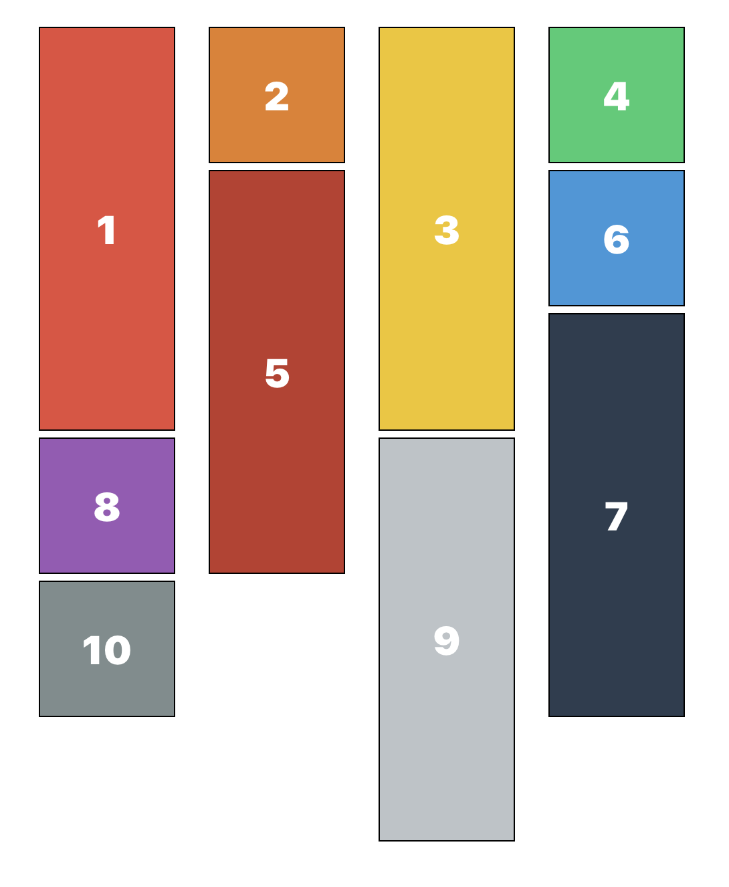
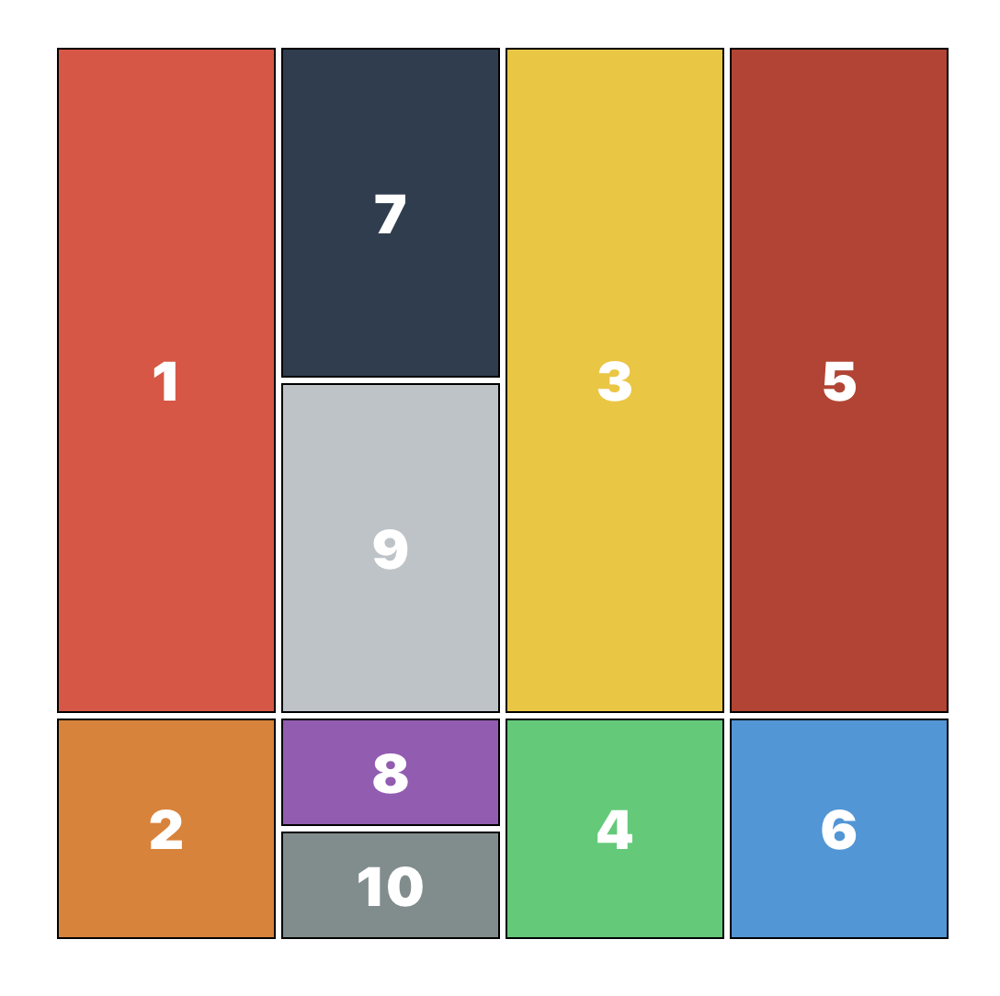

# egjs react-grid로 Masonry레이아웃 만드는 방법

::: tip 💡이 포스팅을 읽으면
Masonry 레이아웃을 쉽게 구현할 수 있습니다.
:::



<component is="script" src="https://pagead2.googlesyndication.com/pagead/js/adsbygoogle.js?client=ca-pub-4877378276818686" crossorigin="anonymous" async></component>

<!-- ui-log 수평형 -->

<ins class="adsbygoogle"
     style="display:block"
     data-ad-client="ca-pub-4877378276818686"
     data-ad-slot="9743150776"
     data-ad-format="auto"
     data-full-width-responsive="true"></ins>
<component is="script">
(adsbygoogle = window.adsbygoogle || []).push({});
</component>




이런 형태의 레이아웃을 구성해야하면 grid를 통해서 만들거나
여러개의 flex 구조로 만들 수 있는데요. 이러한 방식으로 만드는 것은 어려울 뿐만 아니라
아이템의 순서를 나열하는 과정에서 문제가 발생하는데요.

[@egjs/react-grid](https://www.npmjs.com/package/@egjs/react-grid) **라이브러리로 쉽게 Masonry 레이아웃을 구현하는 방법에 대해서 공유합니다.**

## @egjs/react-grid 설치

```bash
npm i @egjs/react-grid
```

## 적용

### 1. Masonry 레이아웃

리액트 라이브러리이기 때문에 리액트에 적용해보겠습니다.

아래 컴포넌트를 그대로 사용하시면 됩니다.

<component is="script" src="https://pagead2.googlesyndication.com/pagead/js/adsbygoogle.js?client=ca-pub-4877378276818686" crossorigin="anonymous" async></component>

<!-- ui-log 수평형 -->

<ins class="adsbygoogle"
     style="display:block"
     data-ad-client="ca-pub-4877378276818686"
     data-ad-slot="9743150776"
     data-ad-format="auto"
     data-full-width-responsive="true"></ins>
<component is="script">
(adsbygoogle = window.adsbygoogle || []).push({});
</component>

```tsx
import React from "react";
import { MasonryGrid } from "@egjs/react-grid";
import style from "./Masonry.module.scss";

const Masonry = () => {
  return (
    <MasonryGrid className="container" gap={5} defaultDirection={"end"} align={"justify"}>
      <div className={style.item}>1</div>
      <div className={style.item}>2</div>
      <div className={style.item}>3</div>
      <div className={style.item}>4</div>
      <div className={style.item}>5</div>
      <div className={style.item}>6</div>
      <div className={style.item}>7</div>
      <div className={style.item}>8</div>
      <div className={style.item}>9</div>
      <div className={style.item}>10</div>
    </MasonryGrid>
  );
};

export default Masonry;
```

```scss
.item {
  width: 100px;
  height: 100px;
  color: #fff;
  font-weight: 900;
  font-size: 30px;
  border: 1px solid #000;
  display: flex;
  justify-content: center;
  align-items: center;

  &:nth-child(2n + 1) {
    height: 300px;
  }

  $colorList: #e74c3c, #e67e22, #f1c40f, #2ecc71, #c0392b, #3498db, #2c3e50, #9b59b6, #bdc3c7, #7f8c8d, #2980b9;

  @for $i from 1 to 11 {
    &:nth-child(#{$i}) {
      background: nth($colorList, $i);
    }
  }
}
```

**위 컴포넌트를 렌더링하면 아래와 같이 Masonry 레이아웃을 매우 쉽게 만들 수 있습니다.**

<component is="script" src="https://pagead2.googlesyndication.com/pagead/js/adsbygoogle.js?client=ca-pub-4877378276818686" crossorigin="anonymous" async></component>

<!-- ui-log 수평형 -->

<ins class="adsbygoogle"
     style="display:block"
     data-ad-client="ca-pub-4877378276818686"
     data-ad-slot="9743150776"
     data-ad-format="auto"
     data-full-width-responsive="true"></ins>
<component is="script">
(adsbygoogle = window.adsbygoogle || []).push({});
</component>


### 2. justifiedGrid 레이아웃

@egjs/react-grid에는 다른 그리드 레이아웃들도 있는데요.

JustifiedGrid를 import 해서 사용해줍니다.

```tsx
import React from "react";
import { JustifiedGrid } from "@egjs/react-grid";
import style from "./Masonry.module.scss";

const Masonry = () => {
  return (
    <JustifiedGrid className="container" gap={5} defaultDirection={"end"} align={"justify"}>
      <div className={style.item}>1</div>
      <div className={style.item}>2</div>
      <div className={style.item}>3</div>
      <div className={style.item}>4</div>
      <div className={style.item}>5</div>
      <div className={style.item}>6</div>
      <div className={style.item}>7</div>
      <div className={style.item}>8</div>
      <div className={style.item}>9</div>
      <div className={style.item}>10</div>
    </JustifiedGrid>
  );
};

export default Masonry;
```

아래와 같은 결과를 보실 수 있습니다.


### 3. PackingGrid 레이아웃

JustifiedGrid 레이아웃을 적용한 방법과 동일하게
PackingGrid를 import 해서 컴포넌트로 사용해줍니다.

<component is="script" src="https://pagead2.googlesyndication.com/pagead/js/adsbygoogle.js?client=ca-pub-4877378276818686" crossorigin="anonymous" async></component>

<!-- ui-log 수평형 -->

<ins class="adsbygoogle"
     style="display:block"
     data-ad-client="ca-pub-4877378276818686"
     data-ad-slot="9743150776"
     data-ad-format="auto"
     data-full-width-responsive="true"></ins>
<component is="script">
(adsbygoogle = window.adsbygoogle || []).push({});
</component>

```tsx
import React from "react";
import { PackingGrid } from "@egjs/react-grid";
import style from "./Masonry.module.scss";

const Masonry = () => {
  return (
    <PackingGrid className="container" gap={5} defaultDirection={"end"} align={"justify"}>
      <div className={style.item}>1</div>
      <div className={style.item}>2</div>
      <div className={style.item}>3</div>
      <div className={style.item}>4</div>
      <div className={style.item}>5</div>
      <div className={style.item}>6</div>
      <div className={style.item}>7</div>
      <div className={style.item}>8</div>
      <div className={style.item}>9</div>
      <div className={style.item}>10</div>
    </PackingGrid>
  );
};

export default Masonry;
```

아래와 같은 특정 영역에 요소들을 배열한 레이아웃을 구현할 수 있습니다.


---

## 마무리

css로 직접 구현하는 것도 좋지만 있는 라이브러리들을 직접 사용하는게 효율적인 경우에는 굳이 만들 필요가 없어 보입니다.
