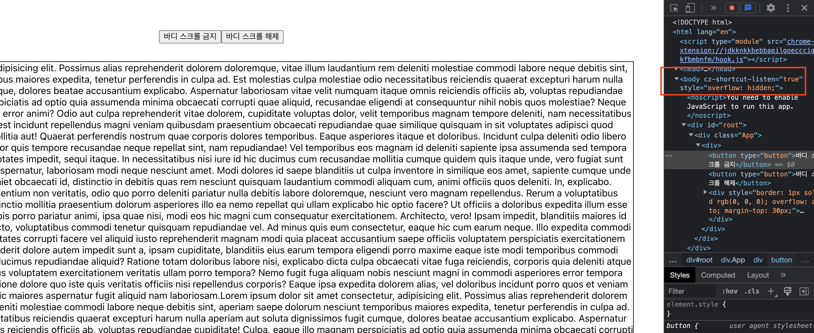

# [CSS] 모달 오픈시 Body 스크롤 막는 방법

::: tip 💡이 포스팅을 읽으면
모달 오픈시에 body의 스크롤을 막는 방법에 대해서 알 수 있습니다.
:::

서비스 개발을 하다보면 Body의 스크롤을 막아야하는 경우가 있는데요.
예를 들어 모달을 오픈했을 때 모달의 백그라운드가 스크롤이 발생하지 않도록 막아야 하는 경우가 있습니다.


이렇게 특정 상황에서 모달의 스크롤을 막는 방법에 대해서 정리하겠습니다.

<br>

## body-scroll-lock

### 설치

```bash
yarn add body-scroll-lock
```

<component is="script" src="https://pagead2.googlesyndication.com/pagead/js/adsbygoogle.js?client=ca-pub-4877378276818686" crossorigin="anonymous" async></component>

<!-- ui-log 수평형 -->

<ins class="adsbygoogle"
     style="display:block"
     data-ad-client="ca-pub-4877378276818686"
     data-ad-slot="9743150776"
     data-ad-format="auto"
     data-full-width-responsive="true"></ins>
<component is="script">
(adsbygoogle = window.adsbygoogle || []).push({});
</component>

타입 스크립트 사용시 아래 명령어도 실행

```bash
@types/body-scroll-lock
```

<br>

## 코드

body-scroll-lock은 아래와 같이 사용할 수 있는데요.
disableBodyScroll에는 target Element를 넣어주어야합니다.
targetElement는 모달, 네비게이션과 같이 스크롤을 해야하는 요소를 넣어주면 됩니다.
아래 예시에서는 버튼을 타겟 엘리먼트로 잡았지만,
**스크롤을 막지 않아야하는 모달 같은 요소를 넣어주면 됩니다.**

아래 예시는 리액트를 사용했기 때문에 useRef를 사용해서 ref를 생성해주고
disableBodyScroll에 useRef.current 로 target Element 를 지정해주었습니다.

```tsx
import React, { useRef } from "react";
import { disableBodyScroll, clearAllBodyScrollLocks } from "body-scroll-lock";

const BodyScrollLock = () => {
  const blockButton = useRef<any>(null);
  return (
    <div>
      <button
        ref={blockButton}
        type="button"
        onClick={() => {
          disableBodyScroll(blockButton.current);
        }}
      >
        바디 스크롤 금지
      </button>
      <button
        type="button"
        onClick={() => {
          clearAllBodyScrollLocks();
        }}
      >
        바디 스크롤 해제
      </button>
      <div style={{ border: "1px solid #000", overflow: "auto", marginTop: 30 }}>긴 텍스트</div>
    </div>
  );
};

export default BodyScrollLock;
```

<component is="script" src="https://pagead2.googlesyndication.com/pagead/js/adsbygoogle.js?client=ca-pub-4877378276818686" crossorigin="anonymous" async></component>

<!-- ui-log 수평형 -->

<ins class="adsbygoogle"
     style="display:block"
     data-ad-client="ca-pub-4877378276818686"
     data-ad-slot="9743150776"
     data-ad-format="auto"
     data-full-width-responsive="true"></ins>
<component is="script">
(adsbygoogle = window.adsbygoogle || []).push({});
</component>

위와 같이 작성하면 '바디스크롤 금지' 버튼 클릭시 body에 overflow: hidden 속성이 추가된 것을 보실 수 있습니다.



<br>
<br>


<br>

## body에 직접 overflow: hidden을 추가하는 방식

바디 스크롤을 막는 방법이 body에 overflow:hidden 속성을 주는 방식이기 때문에
body-scroll-lock을 사용하는 대신에 직접 body요소에 overflow: hidden을 부여하는 방식으로 해결할 수 있습니다.

body에 직접 style을 적용하는 방식은 아래와 같이 할 수 있습니다.

<component is="script" src="https://pagead2.googlesyndication.com/pagead/js/adsbygoogle.js?client=ca-pub-4877378276818686" crossorigin="anonymous" async></component>

<!-- ui-log 수평형 -->

<ins class="adsbygoogle"
     style="display:block"
     data-ad-client="ca-pub-4877378276818686"
     data-ad-slot="9743150776"
     data-ad-format="auto"
     data-full-width-responsive="true"></ins>
<component is="script">
(adsbygoogle = window.adsbygoogle || []).push({});
</component>

```tsx
import React, { useRef } from "react";
import { disableBodyScroll, enableBodyScroll, clearAllBodyScrollLocks } from "body-scroll-lock";

const BodyScrollLock = () => {
  const refModal = useRef<any>(null);
  return (
    <div>
      <button
        type="button"
        onClick={() => {
          const body = document.getElementsByTagName("body");
          body[0].style.overflow = "hidden";
        }}
      >
        바디 스크롤 금지
      </button>
      <button
        type="button"
        onClick={() => {
          const body = document.getElementsByTagName("body");
          body[0].style.overflow = "auto";
        }}
      >
        바디 스크롤 해제
      </button>
      <div style={{ border: "1px solid #000", overflow: "auto", marginTop: 30 }}>긴 텍스트</div>
    </div>
  );
};

export default BodyScrollLock;
```
