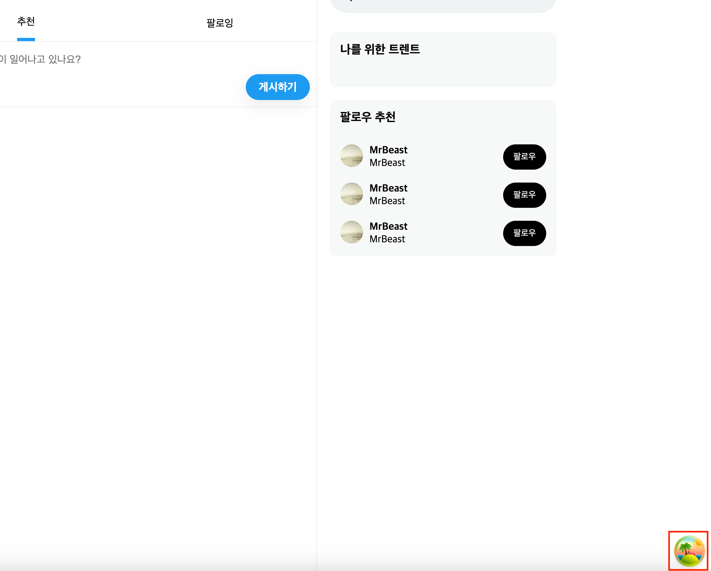
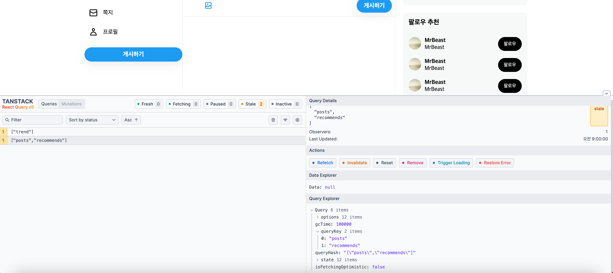

# Tanstack Query(react-query)로 서버 데이터 가져오는 방법

::: tip 💡이 포스팅을 읽으면

:::

React-Query의 버전 5는 Tanstack Query로 이름이 바뀌었는데, 사용방법이 간단하니 오늘은 그 내용에 대해서 알아보겠습니다.

## 0. tanstack query 설치

```bash
$ npm i @tanstack/react-query
$ pnpm add @tanstack/react-query
$ yarn add @tanstack/react-query
```

설치를 완료했다면 reactquery Provider를 만들어줘야하는데요.

`RQProvider.tsx`

```tsx
"use client";

import { QueryClient, QueryClientProvider } from "@tanstack/react-query";
import { ReactQueryDevtools } from "@tanstack/react-query-devtools";
import { ReactNode, useState } from "react";

export default function RQProvider({ children }: { children: ReactNode }) {
  const [client] = useState(
    new QueryClient({
      defaultOptions: {
        queries: {
          refetchOnWindowFocus: false, // 다른 윈도우 탭 갔다 오면 다시 데이터를 가져오겠다
          retryOnMount: true, // 리액트에 컴포넌트가 언마운트 되었다가 다시 마운트 되면 데이터를 가져온다
          refetchOnReconnect: true, // 인터넷 연결이 끊겼다가 다시 연결되는 순간 가져온다
          retry: false, // 실패시 몇번 더 가져올 것인가, false 를 하면 에러페이지 보여줌
        },
      },
    })
  );

  return (
    <QueryClientProvider client={client}>
      {children}
      <ReactQueryDevtools initialIsOpen={false} />
    </QueryClientProvider>
  );
}
```

`ReactQueryDevtools`는 브라우저에서 react-query로 가져온 데이터들을 쉽게 보고 관리할 수 있는 데브툴인데요. 개발할 때는 이걸 추가해놓고 보시는 것이 좋습니다. devtool관련해서는 따로 게시글을 작성하도록 하고 이번 글에서는 데이터를 fetch하는 부분까지만 작성하겠습니다.





## 1. QueryClient 생성

```tsx
{...중략}
import { HydrationBoundary, QueryClient, dehydrate } from "@tanstack/react-query"; // 1. 필요한 모듈 import

export default async function Home() {
  const queryClient = new QueryClient(); // 2. queryClient 생성

  await queryClient.prefetchQuery({ queryKey: ["posts", "recommends"], queryFn: getPostRecommends }); // 3. 데이터 prefetch
  await queryClient.prefetchQuery({ queryKey: ["posts", "following"], queryFn: getFollowingPosts });

  const dehydratedState = dehydrate(queryClient); // 4. queryClient dehydrated
  return (
    <>
      <HydrationBoundary state={dehydratedState}> {/* 5. 하이드레이션 바운더리 설정 */}
        <div className={cx("tab_wrap")}>
          <div className={cx("tab_inner")}>
            <h2 className={cx("page_title")}>홈</h2>
            <Tab />
          </div>
        </div>
        <PostForm></PostForm>
        <HomePosts />
      </HydrationBoundary>
    </>
  );
}
```

위 코드는 QueryClient를 생성하는 전체 코드입니다. 주석에 tanstack query에 필요한 내용들을 적어두었는데 아래에 다시 한번 정리해두겠습니다.

## 1. 필요한 모듈 import

```tsx
import { HydrationBoundary, QueryClient, dehydrate } from "@tanstack/react-query"; // 1. 필요한 모듈 import
```

@tanstack/react-query에서는 데이터를 fetch해오는 곳과 사용하는 곳 이렇게 두가지로 나뉜다고 보시면 됩니다.
서버 컴포넌트에서는 데이터를 fetch해오는데, 이 때 필요한 모듈은 세개가 있습니다.

- QueryClient : QueryClient를 생성하는 함수
- dehydrate: QueryClient에서 prefetch 한 state를 dehydrate해주는 함수
- HydrationBoundary: QueryClient에서 prefetch 한 state들을 어디서 사용할지 바운더리를 정해주는 함수

## 2. 데이터 prefetch

```tsx
const queryClient = new QueryClient(); // 2. queryClient 생성

await queryClient.prefetchQuery({ queryKey: ["posts", "recommends"], queryFn: getPostRecommends }); // 3. 데이터 prefetch
await queryClient.prefetchQuery({ queryKey: ["posts", "following"], queryFn: getFollowingPosts });

const dehydratedState = dehydrate(queryClient); // 4. queryClient dehydrated
```

그 다음에는 `new QueryClient()` 를 통해서 queryClient를 생성해줍니다.
생성한 queryClient의 prefetchQuery함수를 통해 데이터를 미리 불러올 수 있는데요.

prefetchQuery에서는 `queryKey` 객체와 `queryFn`를 필요로 합니다.
`queryKey`는 데이터를 페칭하는데 필요한 키값이라고 보시면 됩니다. 이 코드로 예를 들자면, queryKey가 ["posts", "recommends"]이므로 포스트, 추천 즉 추천포스트들을 불러오는 키라고 보시면 됩니다. 이 키를 설정하는 것은 개발자가 정할 수 있습니다. 그렇다면 `["posts", "following"]`는 팔로잉한 사람들의 포스트를 불러오는 것이겠죠?

그 다음 queryFn는 이 때 데이터를 fetch하는 함수를 넣어주는 것입니다. `getPostRecommends` 함수는 아래와 같이 추천 포스트를 가져오는 함수입니다. 여기서는 실제 백엔드가 없기 때문에 msw를 이용해 목업 데이터를 리턴해주고 있는데요.

<!-- ui-log 수평형 -->

<ins class="adsbygoogle"
     style="display:block"
     data-ad-client="ca-pub-4877378276818686"
     data-ad-slot="9743150776"
     data-ad-format="auto"
     data-full-width-responsive="true"></ins>
<component is="script">
(adsbygoogle = window.adsbygoogle || []).push({});
</component>

```tsx
export async function getPostRecommends() {
  const res = await fetch(`http://localhost:9090/api/postRecommends`, {
    next: {
      tags: ["posts", "recommends"],
    },
    cache: "no-cache",
  });

  return res.json();
}
```

`msw handler`

```tsx
  http.get("/api/postRecommends", ({ request }) => {
    const url = new URL(request.url);
    const cursor = parseInt(url.searchParams.get("cursor") as string) || 0;
    return HttpResponse.json([
      {
        postId: cursor + 1,
        User: User[0],
        content: `${cursor + 1} Z.com is so marvelous. I'm gonna buy that.`,
        Images: [{ imageId: 1, link: faker.image.urlLoremFlickr() }],
        createdAt: generateDate(),
      },
      {
        postId: cursor + 2,
        User: User[0],
        content: `${cursor + 2} Z.com is so marvelous. I'm gonna buy that.`,
        Images: [
          { imageId: 1, link: faker.image.urlLoremFlickr() },
          { imageId: 2, link: faker.image.urlLoremFlickr() },
        ],
        createdAt: generateDate(),
      },
      {
        postId: cursor + 3,
        User: User[0],
        content: `${cursor + 3} Z.com is so marvelous. I'm gonna buy that.`,
        Images: [],
        createdAt: generateDate(),
      },
      {
        postId: cursor + 4,
        User: User[0],
        content: `${cursor + 4} Z.com is so marvelous. I'm gonna buy that.`,
        Images: [
          { imageId: 1, link: faker.image.urlLoremFlickr() },
          { imageId: 2, link: faker.image.urlLoremFlickr() },
          { imageId: 3, link: faker.image.urlLoremFlickr() },
          { imageId: 4, link: faker.image.urlLoremFlickr() },
        ],
        createdAt: generateDate(),
      },
      {
        postId: cursor + 5,
        User: User[0],
        content: `${cursor + 5} Z.com is so marvelous. I'm gonna buy that.`,
        Images: [
          { imageId: 1, link: faker.image.urlLoremFlickr() },
          { imageId: 2, link: faker.image.urlLoremFlickr() },
          { imageId: 3, link: faker.image.urlLoremFlickr() },
        ],
        createdAt: generateDate(),
      },
    ]);
  }),
```

## 3. hydration boundary 지정하기

tanstack query를 통해서 가져온 데이터는 모든 컴포넌트에서 사용할 수 있는 것이 아닌데요.
그 범위를 지정해줘야 합니다.

```tsx
	{...중략}
  const dehydratedState = dehydrate(queryClient); // 4. queryClient dehydrated
  return (
    <>
      <HydrationBoundary state={dehydratedState}> {/* 5. 하이드레이션 바운더리 설정 */}
        <div className={cx("tab_wrap")}>
          <div className={cx("tab_inner")}>
            <h2 className={cx("page_title")}>홈</h2>
            <Tab />
          </div>
        </div>
        <PostForm></PostForm>
        <HomePosts />
      </HydrationBoundary>
    </>
  );
}
```

위 코드에서는 홈 컴포넌트에서 `<HomePosts/>` 하위에서 추천 포스트와 팔로잉 포스트 컴포넌트를 사용하기 때문에 바운더리를 넓게 지정했는데요. 이 바운더리는 개발자가 원하는 범위를 지정할 수 있습니다.

여기까지 작성하면 서버 컴포넌트에서 데이터를 미리 페칭하는 과정까지는 완료가 되었습니다.

<!-- ui-log 수평형 -->

<ins class="adsbygoogle"
     style="display:block"
     data-ad-client="ca-pub-4877378276818686"
     data-ad-slot="9743150776"
     data-ad-format="auto"
     data-full-width-responsive="true"></ins>
<component is="script">
(adsbygoogle = window.adsbygoogle || []).push({});
</component>

## 4. fetch한 데이터 사용하기

react-query를 통해 fetch한 데이터를 사용할 차례인데요.

```tsx
"use client";

import { getPostRecommends } from "@/app/_lib/getPostRecommends";
import { useQuery } from "@tanstack/react-query"; // use Query import
import Post from "../Post";
import { IPost } from "../PostArticle";
import { Fragment } from "react";

export default function PostRecommends() {
  const { data } = useQuery<IPost[]>({ queryKey: ["posts", "recommends"], queryFn: getPostRecommends, staleTime: 60000, gcTime: 100000 });
  return (
    <Fragment>
      {data?.map((v) => (
        <Post key={v.postId} post={v} />
      ))}
    </Fragment>
  );
}
```

위 컴포넌트에서 query에 있는 데이터를 사용하는 곳인데요.
useQuery에서도 동일하게 queryKey와 queryFn을 필요로 하는데요. 위에서 서버 컴포넌트에서 작성했던 queryKey와 queryFn과 동일 한 값을 넣어주시면 됩니다.

이렇게 한 뒤에 리턴 값에서 data를 꺼내 사용하면 tanstack query를 사용해서 데이터를 가져오는 작업이 완료됩니다.

위 코드에 있는 것처럼 staleTime과 gcTime, 그리고 isLoading, isFetching과 같이 여러 state를 지정하고 가져올 수 있는데요.
이 내용에 대해서는 다음에 따로 작성하도록 하겠습니다.
