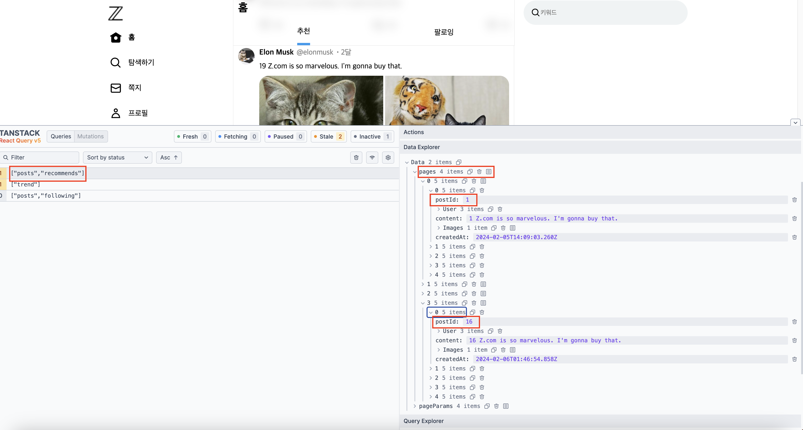

# Tanstack ReactQuery로 무한스크롤 구현하기(react-intersection-observer)


무한 스크롤을 구현하는 방법에는 많은 것들이 있지만 요즘 방법은 react-intersection-observer를 사용해서 브라우저에 특정 요소가 보여지고 있는지 옵저버를 통해 새로운 데이터를 불러오는 방식을 지향하고 있습니다.

tanstack react query에서는 react-intersection-observer와 함께 사용하면 매우 쉽게 무한 스크롤을 구현할 수 있는 방법을 제공하고 있는데요. 오늘은 그 방법에 대해서 알아보려고 합니다.

아래 코드들은 [Tanstack Query(react-query)로 서버 데이터 가져오는 방법]()에 나와있는 코드를 기준으로 설명하고 있으니 참고 부탁드립니다.

## 1. prefetchInfiniteQuery로 변경

무한 스크롤 구현을 위해서 기존에 사용하던 prefetchQuery를 prefetchInfiniteQuery로 변경해줍니다. prefetchInfiniteQuery는 prefetchQuery와 다르게 initialPageParam을 필요로 하는데요. initialPageParam은 무한스크롤을 불러올 데이터의 첫번째 아이디라고 생각하시면 됩니다.

```tsx
export default async function Home() {
  const queryClient = new QueryClient();

  // 무한 스크롤 구현을 위해 prefetchQuery -> prefetchInfiniteQuery로 변경
  await queryClient.prefetchInfiniteQuery({
    queryKey: ["posts", "recommends"],
    queryFn: getPostRecommends,
    initialPageParam: 0,
  });

  await queryClient.prefetchQuery({ queryKey: ["posts", "following"], queryFn: getFollowingPosts });

  const dehydratedState = dehydrate(queryClient);
  return (
    <>
      <HydrationBoundary state={dehydratedState}>
        <div className={cx("tab_wrap")}>
          <div className={cx("tab_inner")}>
            <h2 className={cx("page_title")}>홈</h2>
            <Tab />
          </div>
        </div>
        <PostForm></PostForm>
        <HomePosts />
      </HydrationBoundary>
    </>
  );
}
```

<!-- ui-log 수평형 -->

<ins class="adsbygoogle"
     style="display:block"
     data-ad-client="ca-pub-4877378276818686"
     data-ad-slot="9743150776"
     data-ad-format="auto"
     data-full-width-responsive="true"></ins>
<component is="script">
(adsbygoogle = window.adsbygoogle || []).push({});
</component>

## 2. useInfiniteQuery 적용

기존에 사용하던 useQuery도 useInfiniteQuery로 교체해줍니다.
이 때는 prefetchInfiniteQuery와 동일하게 initialPageParam가 필요하고 추가로 다음 스크롤할 아이디를 가져오는 getNextPageParam 함수도 필요로 하는데요. getNextPageParam에서는 lastPage를 props로 받고 있는 함수이기 때문에 저는 lastPage의 마지막 데이터의 postId를 다음 페이지를 불러올 param으로 지정해줬습니다.

```tsx
"use client";

import { InfiniteData, useInfiniteQuery, useQuery } from "@tanstack/react-query";

export default function PostRecommends() {
  const { data, fetchNextPage } = useInfiniteQuery<IPost[], Object, InfiniteData<IPost[]>, [_1: string, _2: string], number>({
    queryKey: ["posts", "recommends"],
    queryFn: getPostRecommends,
    initialPageParam: 0,
    getNextPageParam: (lastPage) => lastPage?.at(-1)?.postId, // 다음 스크롤해올 데이터의 아이디

    staleTime: 60000,
    gcTime: 100000,
  });

  return <Fragment>{data?.pages.map((page) => page.map((v) => <Post key={v.postId} post={v} />))}</Fragment>;
}
```

위와 같이 작성하면, 아래처럼 데이터를 불러오게 됩니다.

1. postId가 1,2,3,4,5인 데이터 fetch
2. 다음 스크롤 시 postId가 6,7,8,9,10인 데이터 fetch
   ... 이후 반복

하지만 이런 방식으로 작업을 하려면 백엔드코드도 수정해주어야 하는데요.

getNextPageParam의 값은 queryFn의 인자로 들어가게 되는데요.
그래서 아래처럼 getPostRecommends 함수의 props에서 pageParam으로 다음에 불러올 param을 접근할 수 있습니다.

```tsx
export async function getPostRecommends({ pageParam }: { pageParam: number }) {
  const res = await fetch(`http://localhost:9090/api/postRecommends?cursor=${pageParam}`, {
    next: {
      tags: ["posts", "recommends"],
    },
    cache: "no-cache",
  });

  return res.json();
}
```

위와 같이 api함수를 작성했다면 목업 데이터도 수정해주어야하는데요.
(저는 백엔드를 따로 두고 있지 않고 테스트를 위해 msw 목업 서버를 만들었습니다. 목업 서버 만드는 방법이 궁금하신 분들은 [이 글]() 참고해보세요.)

아래 코드를 보시면 new URL로 request의 url을 가져와 searchParams을 통해 cursor값을 가져온 것을 보실 수 있습니다.

```tsx
 http.get("/api/postRecommends", ({ request }) => {
    const url = new URL(request.url);
    const cursor = parseInt(url.searchParams.get("cursor") as string) || 0;

    return HttpResponse.json([
      {
        postId: cursor + 1,
        User: User[0],
        content: `${cursor + 1} Z.com is so marvelous. I'm gonna buy that.`,
        Images: [{ imageId: 1, link: faker.image.urlLoremFlickr() }],
        createdAt: generateDate(),
      },
      {
        postId: cursor + 2,
        User: User[0],
        content: `${cursor + 2} Z.com is so marvelous. I'm gonna buy that.`,
        Images: [
          { imageId: 1, link: faker.image.urlLoremFlickr() },
          { imageId: 2, link: faker.image.urlLoremFlickr() },
        ],
        createdAt: generateDate(),
      },
      {
        postId: cursor + 3,
        User: User[0],
        content: `${cursor + 3} Z.com is so marvelous. I'm gonna buy that.`,
        Images: [],
        createdAt: generateDate(),
      },
      {
        postId: cursor + 4,
        User: User[0],
        content: `${cursor + 4} Z.com is so marvelous. I'm gonna buy that.`,
        Images: [
          { imageId: 1, link: faker.image.urlLoremFlickr() },
          { imageId: 2, link: faker.image.urlLoremFlickr() },
          { imageId: 3, link: faker.image.urlLoremFlickr() },
          { imageId: 4, link: faker.image.urlLoremFlickr() },
        ],
        createdAt: generateDate(),
      },
      {
        postId: cursor + 5,
        User: User[0],
        content: `${cursor + 5} Z.com is so marvelous. I'm gonna buy that.`,
        Images: [
          { imageId: 1, link: faker.image.urlLoremFlickr() },
          { imageId: 2, link: faker.image.urlLoremFlickr() },
          { imageId: 3, link: faker.image.urlLoremFlickr() },
        ],
        createdAt: generateDate(),
      },
    ]);
  }),
```

여기까지 하면 무한 스크롤을 할 준비를 마친 것인데요.

<!-- ui-log 수평형 -->

<ins class="adsbygoogle"
     style="display:block"
     data-ad-client="ca-pub-4877378276818686"
     data-ad-slot="9743150776"
     data-ad-format="auto"
     data-full-width-responsive="true"></ins>
<component is="script">
(adsbygoogle = window.adsbygoogle || []).push({});
</component>

## 3. react-intersection-observer로 무한스크롤 적용

이제 페이지 하단까지 스크롤을 했을 때 fetchNextPage를 호출하기 위해 react-intersection-observer를 사용할 차례입니다.

react-intersection-observer를 사용하면 브라우저에 특정 요소가 보이는지를 판단할 수 있는데요.
페이지 최 하단에 임의의 요소를 추가해 해당 요소가 보이게 되면 페이지 끝가지 스크롤했다는 의미로 이 때 fetchNextPage를 호출하는 방식으로 진행하려고 합니다.

```tsx
"use client";

import { getPostRecommends } from "@/app/_lib/getPostRecommends";
import { InfiniteData, useInfiniteQuery, useQuery } from "@tanstack/react-query";
import Post from "../Post";
import { IPost } from "../PostArticle";
import { Fragment, useEffect } from "react";
import { useInView } from "react-intersection-observer";

export default function PostRecommends() {
  const { ref, inView } = useInView({ threshold: 0, delay: 0 });
  const { data, fetchNextPage } = useInfiniteQuery<IPost[], Object, InfiniteData<IPost[]>, [_1: string, _2: string], number>({
    queryKey: ["posts", "recommends"],
    queryFn: getPostRecommends,
    initialPageParam: 0,
    getNextPageParam: (lastPage) => lastPage?.at(-1)?.postId,

    staleTime: 60000,
    gcTime: 100000,
  });

  console.log(data);

  useEffect(() => {
    if (inView) {
      fetchNextPage();
      console.log(inView);
    }
  }, [inView]);

  return (
    <Fragment>
      {data?.pages.map((page) => page.map((v) => <Post key={v.postId} post={v} />))}
      <div ref={ref} style={{ height: "50px" }}></div>
    </Fragment>
  );
}
```

`useInView` 에서는 ref, inView를 꺼낼 수 있는데요.

```tsx
const { ref, inView } = useInView({ threshold: 0, delay: 0 });
```

ref는 브라우저에 보이는지를 판단하고 싶은 요소에 넣어줍니다.

```tsx
<Fragment>
  {data?.pages.map((page) => page.map((v) => <Post key={v.postId} post={v} />))}
  <div ref={ref} style={{ height: "50px" }}></div>
</Fragment>
```

<!-- ui-log 수평형 -->

<ins class="adsbygoogle"
     style="display:block"
     data-ad-client="ca-pub-4877378276818686"
     data-ad-slot="9743150776"
     data-ad-format="auto"
     data-full-width-responsive="true"></ins>
<component is="script">
(adsbygoogle = window.adsbygoogle || []).push({});
</component>

`inView`는 ref 요소가 브라우저에 보이는지를 판단하는 훅 변수입니다.
아래 코드가 useInView가 true가 되었을 때 fetchNextPage 함수를 호출하는 부분입니다.
useEffect는 참조하는 변수가 변경되었을 때를 캐치할 수 있는데요. 이 점을 활용해 다음 페이지를 불러오고 있습니다. useEffect에 대해서 궁금하신 분들은 [이 글]()을 참고해보세요.

```tsx
useEffect(() => {
  if (inView) {
    fetchNextPage();
  }
}, [inView]);
```

## 결과

위와 같이 작성하면 아래 영상처럼 스크롤이 끝까지 될 때마다 새로운 데이터를 불러오는 것을 보실 수 있습니다.


tanstack react query를 사용하고 있다면 devtool을 통해서 페이지 데이터를 아래 사진처럼 더 쉽게 확인할 수 있다는 장점도 있습니다.


