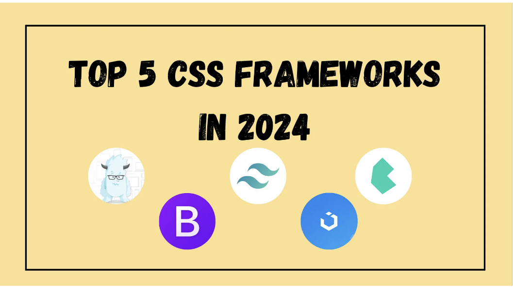
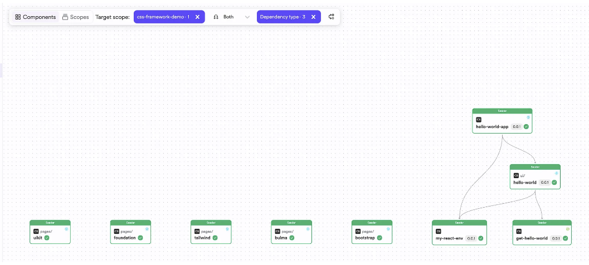
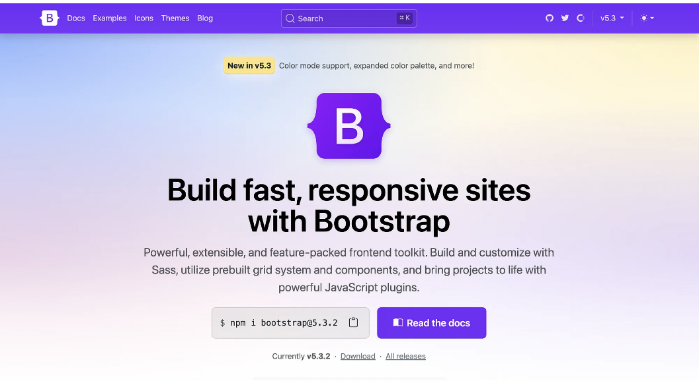
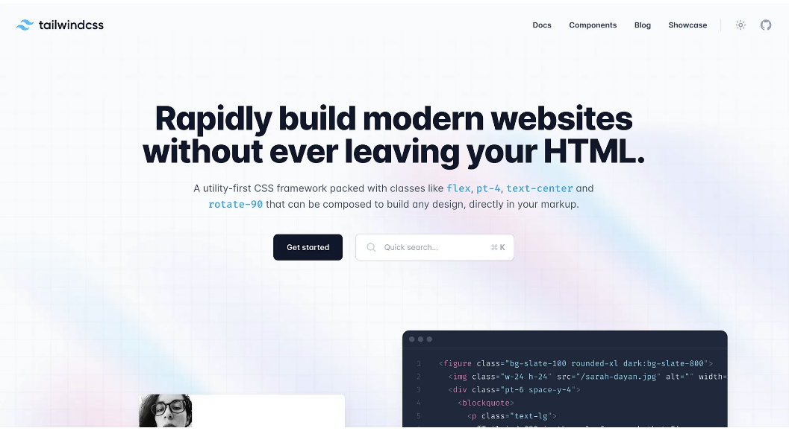
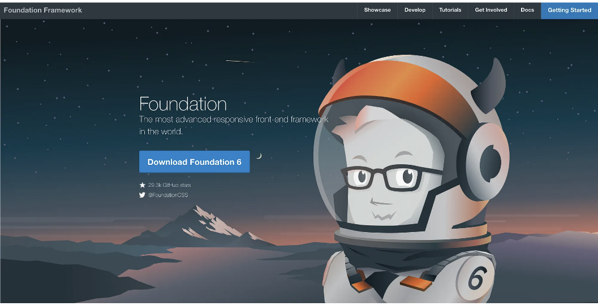
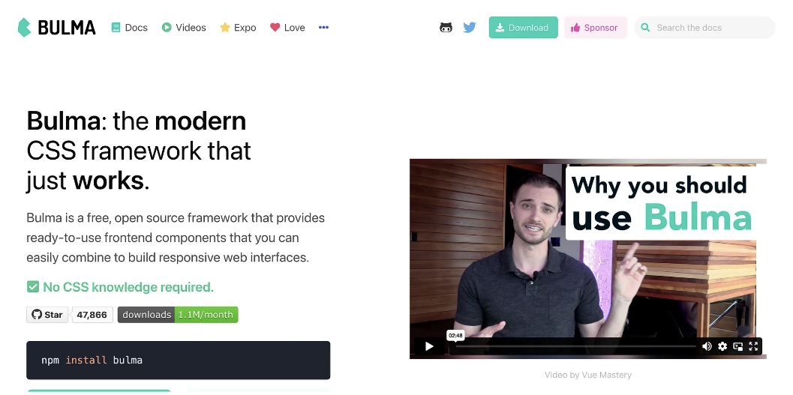
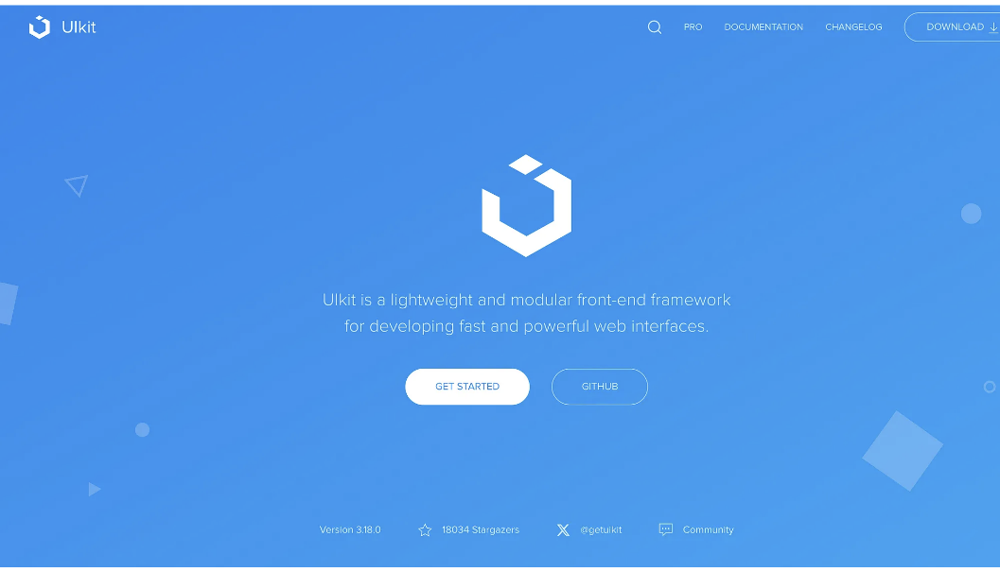

# 2024년 가장 인기있는 CSS 프레임워크 5가지



프로젝트에 적합한 CSS 프레임워크를 선택하는 것은 매우 중요합니다.
새로운 UI 컴포넌트를 만드는데 전체적인 작업 속도를 좌우합니다.
빠르게 서비스를 내는 것이 중요한 요즘 CSS프레임워크를 어떻게 선정하느냐는 굉장히 중요해졌습니다.

따라서 사용하기 쉬운 UI 요소를 제공할 수 있는 CSS 프레임워크가 필요합니다.

그래서 이 글에서는 2024년에 프론트엔드 개발자들에게 가장 인기 많은 CSS 프레임워크를 살펴보겠습니다.



<!-- ui-log 수평형 -->

<ins class="adsbygoogle"
     style="display:block"
     data-ad-client="ca-pub-4877378276818686"
     data-ad-slot="9743150776"
     data-ad-format="auto"
     data-full-width-responsive="true"></ins>
<component is="script">
(adsbygoogle = window.adsbygoogle || []).push({});
</component>

## Bootstrap



Bootstrap은 모바일을 먼저 고려한 CSS 프레임워크로, 멋진 디자인과 반응형 웹 인터페이스를 구축할 수 있게 합니다.

- 반응형 그리드 시스템
- 내장된 컴포넌트 (내비게이션 바, 카드, 모달)
- 빠른 스타일링을 위한 유틸리티 클래스
- 향상된 기능을 위한 JavaScript 플러그인
- 활발한 커뮤니티와 방대한 문서화

<!-- ui-log 수평형 -->

<ins class="adsbygoogle"
     style="display:block"
     data-ad-client="ca-pub-4877378276818686"
     data-ad-slot="9743150776"
     data-ad-format="auto"
     data-full-width-responsive="true"></ins>
<component is="script">
(adsbygoogle = window.adsbygoogle || []).push({});
</component>

```jsx
import ButtonGroup from "react-bootstrap/ButtonGroup";
import Dropdown from "react-bootstrap/Dropdown";
import DropdownButton from "react-bootstrap/DropdownButton";
import "./bootstrap.css";

export function Bootstrap() {
  return (
    <div className="button">
      {["Primary", "success", "danger"].map((variant) => (
        <DropdownButton as={ButtonGroup} key={variant} id={`dropdown-variants-${variant}`} variant={variant.toLowerCase()} title={variant}>
          <Dropdown.Item eventKey="1">Action</Dropdown.Item>
          <Dropdown.Item eventKey="2">Another action</Dropdown.Item>
          <Dropdown.Item eventKey="3" active>
            Active Item
          </Dropdown.Item>
          <Dropdown.Divider />
          <Dropdown.Item eventKey="4">Separated link</Dropdown.Item>
        </DropdownButton>
      ))}
      <br />
      <Dropdown>
        <Dropdown.Toggle variant="success" id="dropdown-basic">
          Dropdown Button
        </Dropdown.Toggle>
        <Dropdown.Menu>
          <Dropdown.Item href="#/action-1">Action</Dropdown.Item>
          <Dropdown.Item href="#/action-2">Another action</Dropdown.Item>
          <Dropdown.Item href="#/action-3">Something else</Dropdown.Item>
        </Dropdown.Menu>
      </Dropdown>
    </div>
  );
}
```

## Tailwind CSS



<!-- ui-log 수평형 -->

<ins class="adsbygoogle"
     style="display:block"
     data-ad-client="ca-pub-4877378276818686"
     data-ad-slot="9743150776"
     data-ad-format="auto"
     data-full-width-responsive="true"></ins>
<component is="script">
(adsbygoogle = window.adsbygoogle || []).push({});
</component>

Tailwind CSS는 유틸리티 우선 CSS 프레임워크로, 사용자 정의 디자인을 구축하기 위해서 모든 스타일들을 클래스로 지원하고 있습니다.
클래스명이 너무 길어져서 가독성이 떨어지긴 하지만 가장 빠르게 UI를 만들 수 있다는 장점은 있습니다.

- 스타일링을 위한 유틸리티 우선 접근 방식
- 구성 파일을 통한 높은 사용자 정의 가능성
- 미리 구축된 컴포넌트 없이 유틸리티 클래스로 스타일 생성
- 미디어 쿼리를 통한 반응형 디자인
- 제품 빌드를 최적화하기 위한 PurgеCSS 통합
- JIT (Just-In-Time) 모드를 통한 빠른 개발

```jsx
export function Tailwind() {
  return <section className="relative z-10 overflow-hidden bg-white py-20 dark:bg-dark lg:py-[120px]">{/* Your Tailwind styled components */}</section>;
}
```

<!-- ui-log 수평형 -->

<ins class="adsbygoogle"
     style="display:block"
     data-ad-client="ca-pub-4877378276818686"
     data-ad-slot="9743150776"
     data-ad-format="auto"
     data-full-width-responsive="true"></ins>
<component is="script">
(adsbygoogle = window.adsbygoogle || []).push({});
</component>

## Foundation



Foundation은 오픈 소스 반응형 프론트엔드 프레임워크로, 어떤 기기에서도 작동하는 멋진 반응형 웹사이트, 앱 및 이메일을 간단하게 만듭니다.

- 유연한 반응형 그리드 시스템
- 사용자 정의가 용이한 모듈화 아키텍처
- 스타일링을 위한 Sass 전처리기
- 내장된 컴포넌트 및 반응형 내비게이션
- 플렉스박스 및 블록 그리드 지원
- 접근성 기능

```jsx
import { Menu, MenuItem } from "react-foundation";

export function Foundation() {
  return <Menu style={{ marginLeft: "34px" }}>{/* Foundation styled menu */}</Menu>;
}
```

<!-- ui-log 수평형 -->

<ins class="adsbygoogle"
     style="display:block"
     data-ad-client="ca-pub-4877378276818686"
     data-ad-slot="9743150776"
     data-ad-format="auto"
     data-full-width-responsive="true"></ins>
<component is="script">
(adsbygoogle = window.adsbygoogle || []).push({});
</component>

## Bulma



Bulma는 간결함, 반응 형 및 사용자가 쉽게 커스텀할 수 있는 가벼운 CSS 프레임워크입니다.

- 플렉스박스를 기반으로 한 현대적인 CSS 프레임워크
- 사용하기 쉽고 직관적인 구문
- JavaScript 의존성 없음
- 내장된 수정자로 반응 형 디자인
- 내비게이션 바, 모달 및 탭과 같은 컴포넌트
- Sass를 통한 확장성

<!-- ui-log 수평형 -->

<ins class="adsbygoogle"
     style="display:block"
     data-ad-client="ca-pub-4877378276818686"
     data-ad-slot="9743150776"
     data-ad-format="auto"
     data-full-width-responsive="true"></ins>
<component is="script">
(adsbygoogle = window.adsbygoogle || []).push({});
</component>

```jsx
export function Bulma() {
  return <div>{/* Bulma styled pagination */}</div>;
}
```

## UIKit



UIKit은 웹 애플리케이션의 사용자 인터페이스를 구축하기 위한 오픈 소스 프레임워크입니다.

- 모듈식 및 가벼운 프레임워크
- 반응형 그리드 시스템
- 사전 설계된 컴포넌트 (내비게이션 바, 슬라이더, 모달)
- 플렉스박스 기반 레이아웃
- 애니메이션 및 전환 효과
- 사용자 정의 및 테마 지원

```jsx
export function Uikit() {
  return <div className="uk-flex uk-flex-center uk-margin-top">{/* UIKit styled button */}</div>;
}
```

<!-- ui-log 수평형 -->

<ins class="adsbygoogle"
     style="display:block"
     data-ad-client="ca-pub-4877378276818686"
     data-ad-slot="9743150776"
     data-ad-format="auto"
     data-full-width-responsive="true"></ins>
<component is="script">
(adsbygoogle = window.adsbygoogle || []).push({});
</component>

# 마무리

이외에도 다양한 CSS 프레임워크가 있지만, 프로젝트에 적합한 것을 선택하는 것이 중요합니다.

이를 통해 프로젝트에 적합한 CSS 프레임워크를 선택하세요!
