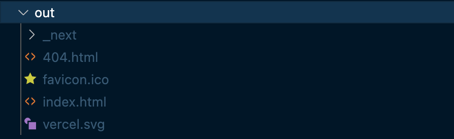
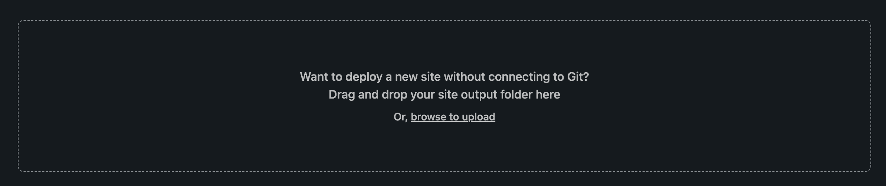
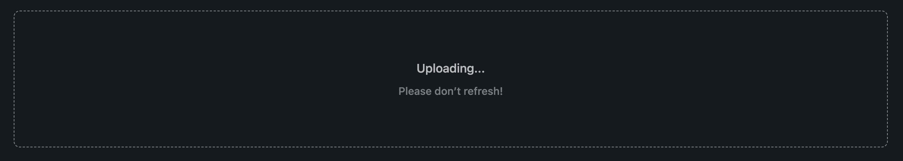
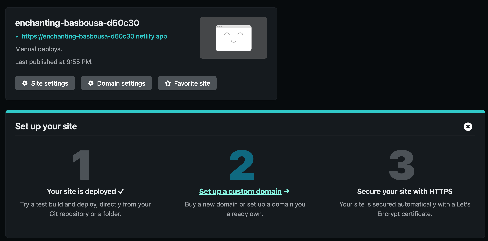
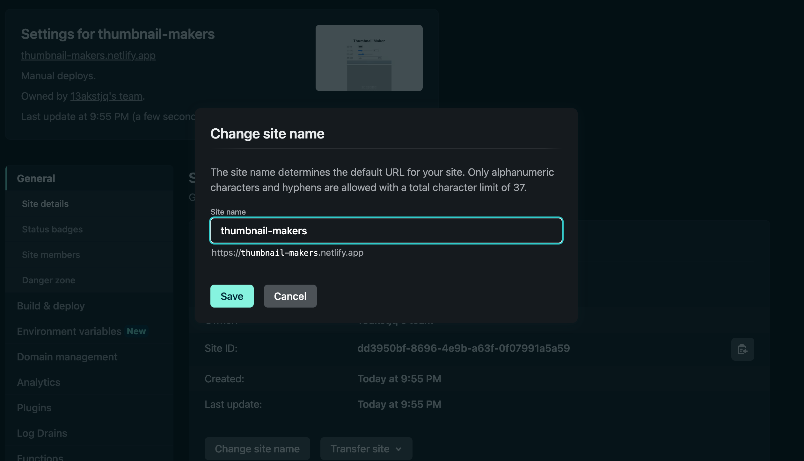
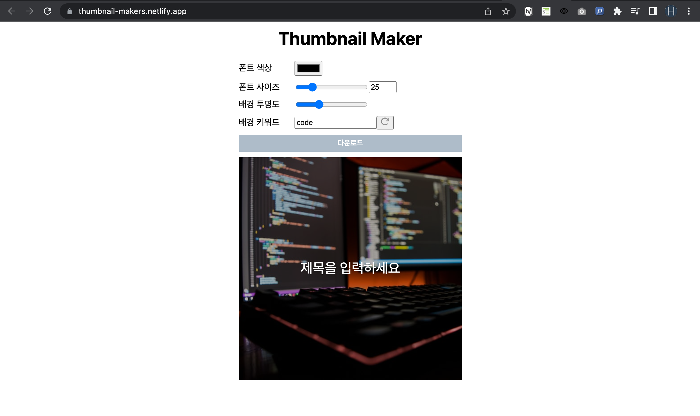

# Nextjs Static HTML 사이트 배포하는 방법

::: tip 목표
웹사이트를 만들다보면 DB를 사용하지 않는 정적 웹 사이트를 만드는 경우가 있는데요.
Nextjs를 활용해 정적 웹사이트 배포하는 방법에 대해서 소개합니다.
정적 웹 사이트 배포는 Netlify를 통해서 진행합니다.
:::

### scripts 변경

Nextjs 저장소의 package.json에 있는 build 명령어를 아래와 같이 바꿔줍니다.

```js
"scripts": {
  "build": "next build && next export"
}
```

### build

아래 명령어로 프로젝트를 빌드해줍니다.

```bash
yarn build
```

### 정적 사이트 출력물

next export 명령어로 인해 `out/` 디렉토리가 생기고 하위에 아래와 같은 파일들이 생긴 것을 보실 수 있습니다.



### Netlify 배포

이 out 폴더를 그대로 배포할건데요. 저는 [Netlify](https://www.netlify.com/)를 이용해서 정적 html 사이트를 배포할겁니다.

사이트를 방문해주시고 로그인 해주시면 아래와 같이 드래그앤드롭으로 폴더를 업로드 할 수 있는 영역이 보이는데요.



업로드를 해줍니다.



업로드를 완료하면 아래와 같이 static html 사이트가 배포되었는데요.
기본적으로 설정되어있는 사이트 url은 복잡하게 되어있으니 원하는 url로 변경해줍니다.





### 사이트 접속

나와있는 url로 접속하면 내가 만든 정적 웹 사이트가 배포된 것을 보실 수 있습니다. Netlify외에도 다양한 정적 웹 사이트 배포 서비스가 많이 있는데요. 앞으로 다른 서비스도 사용해보도록 하겠습니다.



위 사이트는 블로그 포스팅 썸네일을 조금 쉽게 만들 수 있도록 만들고 있는 사이트인데요. 배포를 위해서 구색만 맞춰놨는데 앞으로 조금씩 기능을 추가해보도록 하겠습니다.
