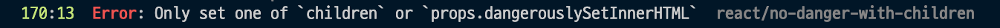

# Nextjs build 에러 해결 방법 (Only set one of children or props.dangerouslySetInnerHTML react/no-danger-with-children)

::: tip 목표

:::

```bash
yarn  build
```

위 명령어로 빌드를 했을 때 아래와 같이 빌드 에러가 발생하는 경우가 있는데요.



Only set one of children or props.dangerouslySetInnerHTML react/no-danger-with-children 이 에러는 dangerouslySetInnerHTML을 사용하는 요소는 한개의 children만 가져야된다는 에러입니다.

저는 아래와 같이 작성했었는데 이렇게 작성할 경우 `{}` 를 다른 자식으로 인식하기 때문에 발생했던 에러였습니다.

```tsx
<span dangerouslySetInnerHTML={{ __html: titleText }}>{}</span>
```

## 해결방법

아래와 같이 `{}`를 제거하고 다시 빌드를 하게 되면 에러가 해결됩니다.
`{}`외에도 ` `같은 공백으로도 빌들에러가 발생하게 되니 참고하시기 바랍니다.

```tsx
<span dangerouslySetInnerHTML={{ __html: titleText }}></span>
```
