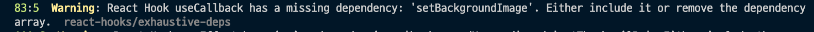

# React Hook useEffect has missing dependencies 해결 방법

::: tip 목표
React 사용시 무조건 만나게 되는 Warning인 react-hooks/exhaustive-deps warning 해결 방법에 대해서 정리합니다.
:::

<component is="script" src="https://pagead2.googlesyndication.com/pagead/js/adsbygoogle.js?client=ca-pub-4877378276818686" crossorigin="anonymous" async></component>

<!-- ui-log 수평형 -->

<ins class="adsbygoogle"
     style="display:block"
     data-ad-client="ca-pub-4877378276818686"
     data-ad-slot="9743150776"
     data-ad-format="auto"
     data-full-width-responsive="true"></ins>
<component is="script">
(adsbygoogle = window.adsbygoogle || []).push({});
</component>



react-hooks/exhaustive-deps는 React 훅을 사용할 때 그 중에서도 useEffect를 사용할 때 주로 발생하는데요.

보통 이런 식으로 경고 메세지를 띄워줍니다.

```bash
React Hook useEffect has missing dependencies: '' and ''. Either include them or remove the dependency array.
```

## 해결 방법

react-hooks/exhaustive-deps 해결 방법은 useEffect에서 사용되는 state를 useEffect의 배열 []에 넣어주면 됩니다.

예를 들어 아래와 같이 작업이 되어있을 때는 경고메세지가 뜨는데요.

```tsx
useEffect(() => {
  getThumbnailBg(backgroundKeyword);
}, []);
```

useEffect에서 사용중인 State인 `backgroundKeyword` 를 `[]`에 넣어주게 되면 경고를 발생시키지 않는 것을 확인할 수 있습니다.

```tsx
useEffect(() => {
  getThumbnailBg(backgroundKeyword);
}, [backgroundKeyword]);
```

정리해보면, useEffect를 사용할 때는 useEffect내에서 사용되는 State를 []에 넣어주면 됩니다. 이런 경고가 발생하는 이유는 useEffect내부에서 사용되는 State의 변경이 감지되었을 때를 대비하기 위함이라고 생각하시면 될 것 같습니다.
