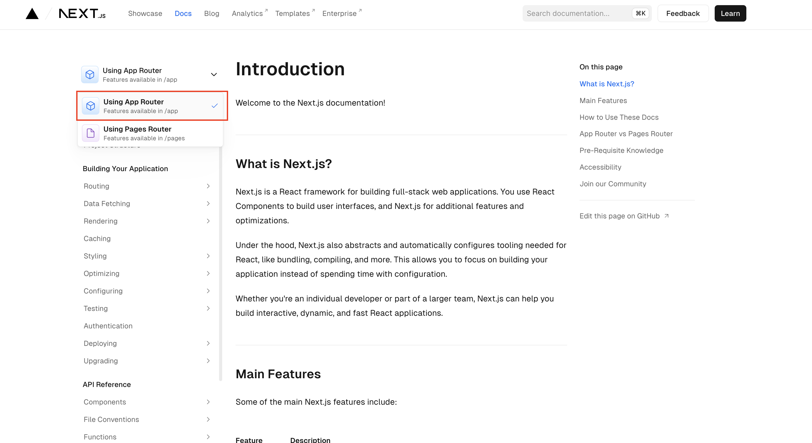
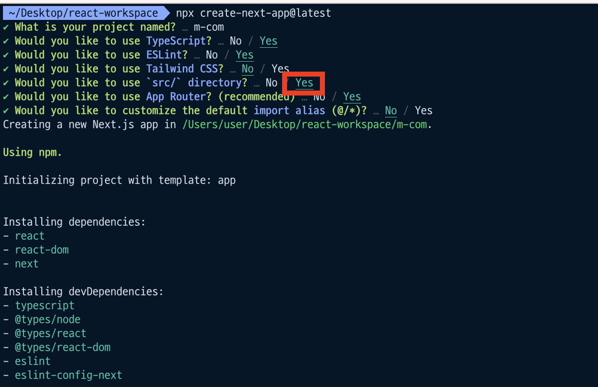
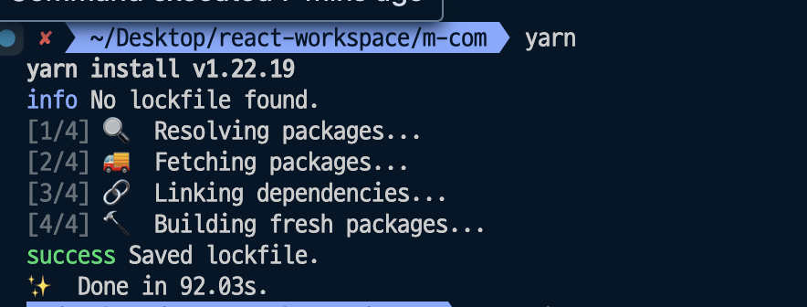
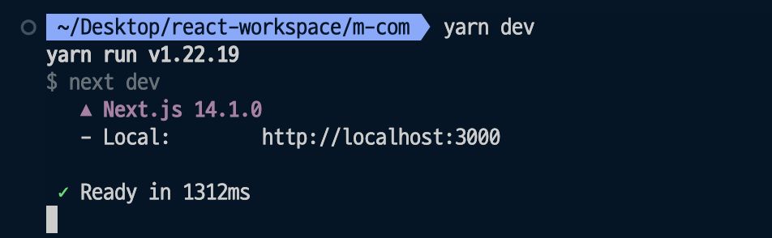
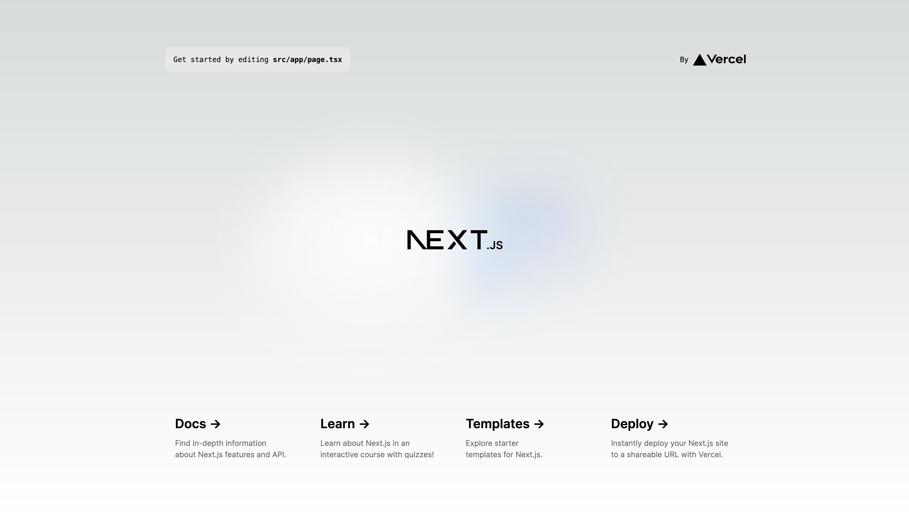

# Nextjs 14 App Router 프로젝트 초기 세팅 방법

::: tip 💡이 포스팅을 읽으면

:::

Nextjs 14 버전이 안정화 버전으로 자리잡으면서 Page Router 대신 App Router를 보다 적극적으로 쓸 수 있을 것 같아서 App Router를 이용한 클론 코딩을 해보려고 합니다.

기술 스택으로는 Nextjs(App Router) + React Query + React Context + MSW를 사용할 예정입니다.

MSW는 백엔드 까지 만들 수는 없으니 가짜 목업 데이터를 위해서 사용하려고 합니다.

저는 Nextjs의 App Router 를 사용할 예정이기 때문에 [Nextjs 공식 문서](https://nextjs.org/docs)에서 아래 사진처럼 App Router 기반으로 작업을 하겠습니다.



<!-- ui-log 수평형 -->

<ins class="adsbygoogle"
     style="display:block"
     data-ad-client="ca-pub-4877378276818686"
     data-ad-slot="9743150776"
     data-ad-format="auto"
     data-full-width-responsive="true"></ins>
<component is="script">
(adsbygoogle = window.adsbygoogle || []).push({});
</component>

## 저장소 셋팅

Nextjs 의 앱라우터를 사용하기 위해서는 node 버전이 18.170 이상이어야 합니다.

node 버전을 손쉽게 변경하는 방법에 대해서는 제가 정리한 [이글](https://ui-log.github.io/docs/Setting/2024-02-10-nvm-%E1%84%89%E1%85%A1%E1%84%8B%E1%85%AD%E1%86%BC%E1%84%92%E1%85%A2%E1%84%89%E1%85%A5-node-%E1%84%87%E1%85%A5%E1%84%8C%E1%85%A5%E1%86%AB-%E1%84%89%E1%85%B1%E1%86%B8%E1%84%80%E1%85%A6-%E1%84%87%E1%85%A1%E1%84%81%E1%85%AE%E1%84%82%E1%85%B3%E1%86%AB-%E1%84%87%E1%85%A1%E1%86%BC%E1%84%87%E1%85%A5%E1%86%B8/)에서 확인해보세요!

아래 명령어를 입력하면 기본 셋팅이 완료된 nextjs 프로젝트를 만들 수 있습니다.

```bash
npx create-next-app@latest
```

<!-- ui-log 수평형 -->

<ins class="adsbygoogle"
     style="display:block"
     data-ad-client="ca-pub-4877378276818686"
     data-ad-slot="9743150776"
     data-ad-format="auto"
     data-full-width-responsive="true"></ins>
<component is="script">
(adsbygoogle = window.adsbygoogle || []).push({});
</component>

초기 셋팅을 직접 하고싶으시다면 비어있는 프로젝트에 아래 명령어들로 직접 next를 설치하실 수도 있습니다.

```bash
// yarn 사용시
yarn add next@latest react@latest react-dom@latest

// npm 사용시
npm install next@latest react@latest react-dom@latest
```

저는 nextjs 셋팅이 완료된 상태에서 시작할거기 때문에 npx 를 이용한 명령어로 설치하겠습니다.

설치하면 아래와 같이 nextjs 프로젝트 기본 정보들을 입력해주어야 하는데요.



저 항목들은 다 그대로 놔둬도 되지만 저는 src/ 디렉토리 하위에 개발 코드들을 작성하기 위해 `src/` 디렉토리 생성 메뉴만 제가 yes로 변경했습니다.

저장소 설치가 완료되면 에디터를 켜서 yarn 명령어로 필요한 패키지들 설치를 완료해줍니다.



<!-- ui-log 수평형 -->

<ins class="adsbygoogle"
     style="display:block"
     data-ad-client="ca-pub-4877378276818686"
     data-ad-slot="9743150776"
     data-ad-format="auto"
     data-full-width-responsive="true"></ins>
<component is="script">
(adsbygoogle = window.adsbygoogle || []).push({});
</component>

## 프로젝트 실행

yarn 명령어로 패키지 설치까지 완료했다면 아래 명령어를 통해서 프로젝트를 실행할 수 있습니다.

```bash
yarn dev
```



실행한 후에는 http://localhost:3000/ 에서 확인할 수 있습니다.



npx로 프로젝트를 생성했기 때문에 저희가 원치 않은 내용들이 들어가 있는데요. 이제 Nextjs 에서 기본적으로 작성해준 내용들은 제거하고 제가 원하는 코드를 작성하면 됩니다.

다음 글에서는 nextjs App Router에서 라우팅을 하는 기본적인 방법에 대해서 알아보도록 하겠습니다.
