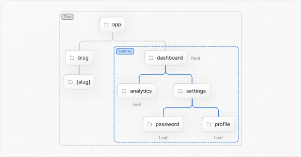
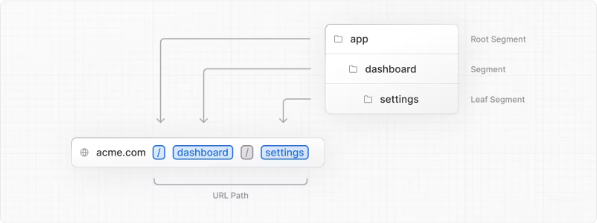
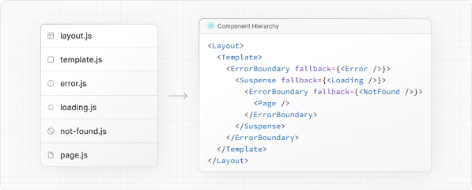
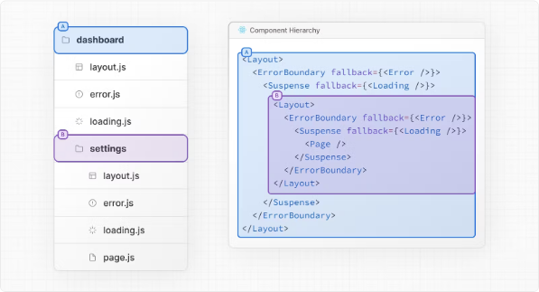
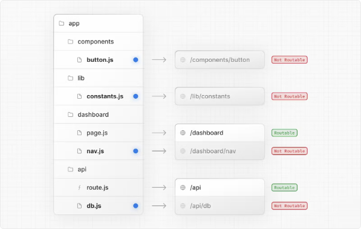

# Nextjs AppRouter 라우팅 기초 정리

::: tip 💡이 포스팅을 읽으면

:::

# 라우팅 기본 사항

> 계속하기 전에 라우팅 기본 사항을 이해하면 도움이 됩니다.

모든 애플리케이션의 뼈대는 라우팅입니다. 이 페이지에서는 웹의 라우팅에 대한 기본 개념과 Next.js에서 라우팅을 처리하는 방법을 소개합니다.

## 용어

먼저, 문서 전반에 사용되는 이 용어를 볼 수 있습니다. 간단한 참고 사항입니다:

- Tree: 계층 구조를 시각화하기 위한 관습입니다. 예를 들어, 부모 및 자식 컴포넌트가 있는 컴포넌트 트리, 폴더 구조 등이 있습니다.
- Subtree: 새로운 루트(첫 번째)에서 시작하여 잎(마지막)에 도달하는 트리의 일부입니다.
- Root: 트리 또는 서브트리의 첫 번째 노드, 예를 들어 루트 레이아웃입니다.
- Leaf: 자식이 없는 서브트리의 노드, 예를 들어 URL 경로의 마지막 세그먼트입니다.

- URL Segment: 슬래시로 구분된 URL 경로의 일부입니다.
- URL Path: 도메인 이후에 오는 URL의 일부입니다 (세그먼트로 구성됨).

## 앱 라우터

버전 13에서 Next.js는 새로운 React Server Components를 기반으로 한 App Router를 도입했습니다. 이 라우터는 공유된 레이아웃, 중첩 라우팅, 로딩 상태, 오류 처리 등을 지원합니다.

App Router는 새로운 app 디렉터리에서 작동합니다. app 디렉터리는 점진적인 채택을 허용하기 위해 pages 디렉터리와 함께 작동합니다. 이렇게 함으로써 애플리케이션의 일부 라우트를 새로운 동작으로 전환하면서 다른 라우트를 이전 동작을 위해 pages 디렉터리에 유지할 수 있습니다. 애플리케이션이 pages 디렉터리를 사용하는 경우 Pages Router 문서도 참조하십시오.

> 참고: App Router가 Pages Router보다 우선합니다. 디렉터리 간 라우트는 동일한 URL 경로로 해석되어 충돌을 방지하기 위해 빌드 시간 오류가 발생합니다.

기본적으로 app 내부의 컴포넌트는 React Server Components입니다. 이것은 성능 최적화이며 쉽게 채택할 수 있으며 Client Components도 사용할 수 있습니다.

<!-- ui-log 수평형 -->

<ins class="adsbygoogle"
     style="display:block"
     data-ad-client="ca-pub-4877378276818686"
     data-ad-slot="9743150776"
     data-ad-format="auto"
     data-full-width-responsive="true"></ins>
<component is="script">
(adsbygoogle = window.adsbygoogle || []).push({});
</component>

> 권장 사항: Server Components에 대해 처음이라면 Server 페이지를 확인하세요.

## 폴더 및 파일의 역할

Next.js는 파일 시스템 기반의 라우터를 사용합니다:

- 폴더는 경로를 정의하는 데 사용됩니다. 경로는 루트 폴더부터 마지막 잎 폴더에 포함된 page.js 파일까지의 파일 시스템 계층 구조를 따릅니다. 라우트 정의 참조.
- 파일은 경로 세그먼트에 표시되는 UI를 생성하는 데 사용됩니다. 특별한 파일 참조.

## 라우트 세그먼트

라우트의 각 폴더는 라우트 세그먼트를 나타냅니다. 각 라우트 세그먼트는 URL 경로에서 해당 세그먼트에 대응됩니다.

## 중첩 라우트

중첩 라우트를 생성하려면 서로 중첩된 폴더를 중첩하면 됩니다. 예를 들어, 새로운 /dashboard/settings 라우트를 만들려면 app 디렉터리에 두 개의 새 폴더를 중첩하면 됩니다.

/dashboard/settings 라우트는 세 개의 세그먼트로 구성됩니다:

- / (루트 세그먼트)
- dashboard (세그먼트)
- settings (잎 세그먼트)

## 파일 규칙

Next.js는 중첩된 라우트의 특정 동작을 위해 특별한 파일 세트를 제공합니다:

> 참고: 특별한 파일에는 .js, .jsx 또는 .tsx 파일 확장자를 사용할 수 있습니다.

## 컴포넌트 계층 구조

라우트 세그먼트의 특별한 파일에 정의된 React 컴포넌트는 특정 계층 구조로 렌더링됩니다:

- layout.js
- template.js
- error.js (React 오류 경계)
- loading.js (React suspense 경계)
- not-found.js (React 오류 경계)
- page.js 또는 중첩된 layout.js

중첩된 라우트에서 세그먼트의 컴포넌트는 해당 부모 세그먼

트의 컴포넌트 안에 중첩됩니다.

<!-- ui-log 수평형 -->

<ins class="adsbygoogle"
     style="display:block"
     data-ad-client="ca-pub-4877378276818686"
     data-ad-slot="9743150776"
     data-ad-format="auto"
     data-full-width-responsive="true"></ins>
<component is="script">
(adsbygoogle = window.adsbygoogle || []).push({});
</component>

## 공존

특별한 파일 외에도 자신의 파일(예: 컴포넌트, 스타일, 테스트 등)을 app 디렉터리의 폴더 내에 공존시킬 수 있습니다. 이는 폴더가 경로를 정의하고, 페이지.js 또는 라우트.js에서 반환된 내용만 공개적으로 주소 지정 가능하기 때문입니다.

프로젝트 구성 및 공존에 대해 자세히 알아보세요.

## 고급 라우팅 패턴

App Router는 더 고급 라우팅 패턴을 구현하는 데 도움이 되는 규칙 세트도 제공합니다. 이러한 패턴에는 다음이 포함됩니다:

- 병렬 라우트: 동시에 두 개 이상의 페이지를 동일한 보기에 표시할 수 있게 합니다. 각각 독립적으로 탐색할 수 있습니다. 자체 하위 탐색이 있는 분할 보기에 사용할 수 있습니다. 예: 대시보드.
- 라우트 가로채기: 라우트를 가로채고 다른 라우트의 맥락에서 표시할 수 있습니다. 현재 페이지의 맥락을 유지해야 하는 경우 사용할 수 있습니다. 예: 하나의 작업을 편집하는 동안 모든 작업 보기 보기 또는 피드에서 사진 확대하기.

이러한 패턴은 더 풍부하고 복잡한 UI를 구축하는 데 도움이 되며, 과거에는 작은 팀 및 개별 개발자가 구현하기가 복잡했던 기능을 더 democrazing합니다.
