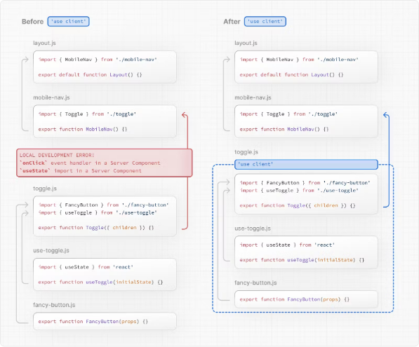

# Nextjs14의 클라이언트 컴포넌트 이해하기

# 클라이언트 컴포넌트

클라이언트 컴포넌트를 사용하면 클라이언트에서 요청 시 렌더링되는 대화형 UI를 작성할 수 있습니다. Next.js에서 클라이언트 렌더링은 옵트인 방식으로, 명시적으로 React가 클라이언트에서 어떤 컴포넌트를 렌더링해야 하는지 결정해야 합니다.

이 페이지에서는 클라이언트 컴포넌트가 어떻게 작동하는지, 언제 사용해야 하는지에 대해 알아보겠습니다.

## 클라이언트 렌더링의 장점

클라이언트에서 렌더링 작업을 수행하는 것에는 몇 가지 이점이 있습니다.

- 상호 작용성: 클라이언트 컴포넌트는 상태, 이펙트 및 이벤트 리스너를 사용할 수 있으므로 사용자에게 즉각적인 피드백을 제공하고 UI를 업데이트할 수 있습니다.
- 브라우저 API: 클라이언트 컴포넌트는 지리 위치 또는 로컬 저장소와 같은 브라우저 API에 액세스할 수 있으므로 특정 사용 사례를 위한 UI를 구축할 수 있습니다.

<!-- ui-log 수평형 -->

<ins class="adsbygoogle"
     style="display:block"
     data-ad-client="ca-pub-4877378276818686"
     data-ad-slot="9743150776"
     data-ad-format="auto"
     data-full-width-responsive="true"></ins>
<component is="script">
(adsbygoogle = window.adsbygoogle || []).push({});
</component>

## Next.js에서 클라이언트 컴포넌트 사용하기

클라이언트 컴포넌트를 사용하려면 파일의 상단에, import 문 위에 React의 "use client" 지시어를 추가하면 됩니다.

"use client"는 서버와 클라이언트 컴포넌트 모듈 사이의 경계를 선언하는 데 사용됩니다. 이는 파일에 "use client"를 정의하면 해당 파일을 포함한 다른 모든 모듈, 즉 하위 컴포넌트도 클라이언트 번들의 일부로 간주된다는 것을 의미합니다.

```typescript
import { useState } from "react";

export default function Counter() {
  const [count, setCount] = useState(0);

  return (
    <div>
      <p>You clicked {count} times</p>
      <button onClick={() => setCount(count + 1)}>Click me</button>
    </div>
  );
}
```

아래 다이어그램은 toggle.js에서 onClick 및 useState를 사용할 때 "use client" 지시어가 정의되지 않으면 오류가 발생하는 것을 보여줍니다. 기본적으로 이러한 API가 사용되는 서버에서 컴포넌트가 렌더링되기 때문입니다. toggle.js에 "use client" 지시어를 정의하면 React에게 컴포넌트와 해당 API를 사용할 클라이언트에서 렌더링할 것을 알려줄 수 있습니다.



> 여러 use client 진입 지점 정의하기:
> React 컴포넌트 트리에서 여러 "use client" 진입 지점을 정의할 수 있습니다. 이를 통해 애플리케이션을 여러 클라이언트 번들(또는 가지)로 분할할 수 있습니다. 그러나 클라이언트에서 렌더링할 컴포넌트마다 "use client"를 정의할 필요는 없습니다. 한 번 경계를 정의하면 모든 하위 컴포넌트와 모듈이 클라이언트 번들의 일부로 간주됩니다.

## 클라이언트 컴포넌트는 어떻게 렌더링되나요?

Next.js에서 클라이언트 컴포넌트는 전체 페이지 로드(애플리케이션을 처음 방문하거나 브라우저 새로 고침에 의한 페이지 다시로드)인 경우 또는 후속 탐색인 경우에 따라 다르게 렌더링됩니다.

### 전체 페이지 로드

초기 페이지 로드를 최적화하기 위해 Next.js는 클라이언트 및 서버 컴포넌트 모두에 대해 서버에서 정적 HTML 미리보기를 렌더링합니다. 이것은 사용자가 처음으로 애플리케이션을 방문할 때 페이지의 내용을 즉시 볼 수 있도록 하기 위한 것입니다. 클라이언트가 클라이언트 컴포넌트 JavaScript 번들을 다운로드, 구문 분석 및 실행하기 전에도 마찬가지입니다.

<!-- ui-log 수평형 -->

<ins class="adsbygoogle"
     style="display:block"
     data-ad-client="ca-pub-4877378276818686"
     data-ad-slot="9743150776"
     data-ad-format="auto"
     data-full-width-responsive="true"></ins>
<component is="script">
(adsbygoogle = window.adsbygoogle || []).push({});
</component>

서버에서:

- React는 서버 컴포넌트를 React 서버 컴포넌트 페이로드(RSC Payload)라는 특수한 데이터 형식으로 렌더링합니다. 이는 클라이언트 컴포넌트에 대한 참조를 포함합니다.
- Next.js는 RSC 페이로드와 클라이언트 컴포넌트 JavaScript 지침을 사용하여 서버에서 경로에 대한 HTML을 렌더링합니다.

그런 다음 클라이언트에서:

- HTML은 경로의 빠른 비대화형 초기 미리보기로 즉시 사용됩니다.
- React 서버 컴포넌트 페이로드가 사용되어 클라이언트 및 서버 컴포넌트 트리를 조정하고 DOM을 업데이트

합니다.

- JavaScript 지침이 사용되어 클라이언트 컴포넌트를 활성화시키고 UI를 상호작용적으로 만듭니다.

> hydration이란 무엇인가요?
> hydration은 DOM에 이벤트 리스너를 추가하여 정적 HTML을 상호 작용 가능하게 만드는 과정입니다. hydration은 hydrateRoot React API로 수행됩니다.

### 후속 탐색

후속 탐색에서 클라이언트 컴포넌트는 서버에서 렌더링된 HTML 없이 완전히 클라이언트에서 렌더링됩니다.

이는 클라이언트 컴포넌트 JavaScript 번들이 다운로드되고 구문 분석된 후 React가 RSC 페이로드를 사용하여 클라이언트와 서버 컴포넌트 트리를 조정하고 DOM을 업데이트합니다.

## 서버 환경으로 되돌아가기

가끔은 "use client" 경계를 선언한 후 서버 환경으로 돌아가야 할 수 있습니다. 예를 들어 클라이언트 번들 크기를 줄이거나 서버에서 데이터를 가져오거나 서버에서만 사용 가능한 API를 사용하려는 경우입니다.

Client 및 Server 컴포넌트와 Server Actions을 교차로 삽입하여 실제로 클라이언트 컴포넌트 내부에 중첩되어 있더라도 코드를 서버에 유지할 수 있습니다. 자세한 내용은 구성 패턴 페이지를 참조하십시오.
