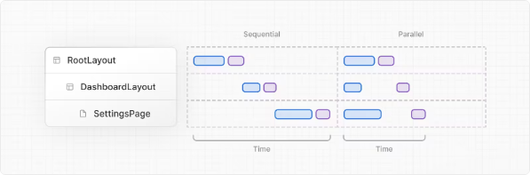
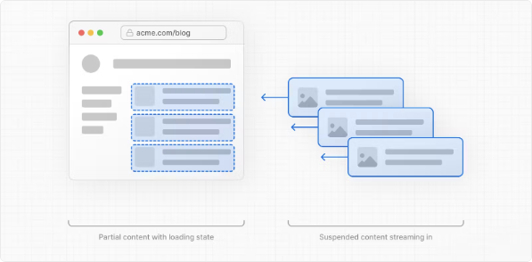

# Nextjs14의 서버컴포넌트 이해하기

::: tip 💡이 포스팅을 읽으면
Nextjs의 서버컴포넌트에 대해서 쉽게 이해하실 수 있습니다.
:::

# 서버 컴포넌트

React 서버 컴포넌트를 사용하면 서버에서 렌더링되고 선택적으로 캐시될 수 있는 UI를 작성할 수 있습니다. Next.js에서는 스트리밍 및 부분 렌더링을 가능하게 하기 위해 렌더링 작업이 경로 세그먼트로 나누어지며 세 가지 다른 서버 렌더링 전략이 있습니다.

- 정적 렌더링
- 동적 렌더링
- 스트리밍

## 서버 렌더링의 장점

서버에서 렌더링 작업을 수행하는 것에는 몇 가지 이점이 있습니다.

- **데이터 가져오기**: 서버 컴포넌트를 사용하면 데이터 가져오기를 서버로 이동하여 데이터 소스에 가깝게 할 수 있습니다. 이는 렌더링에 필요한 데이터를 가져오는 데 걸리는 시간을 줄이고 클라이언트가 수행해야 하는 요청 수를 줄여 성능을 향상시킬 수 있습니다.
- **보안**: 서버 컴포넌트를 사용하면 클라이언트에 민감한 데이터와 로직을 유지할 수 있습니다. 예를 들어 토큰 및 API 키를 노출시키지 않고 서버에 보관할 수 있습니다.
- **캐싱**: 서버에서 렌더링하면 결과를 캐시하고 다음 요청 및 사용자 전체에 걸쳐 재사용할 수 있습니다. 이는 각 요청마다 수행되는 렌더링 및 데이터 가져오기 양을 줄여 성능을 향상시키고 비용을 절감할 수 있습니다.
- **번들 크기**: 서버 컴포넌트를 사용하면 이전에 클라이언트 자바스크립트 번들 크기에 영향을 미쳤을 수 있는 큰 종속성을 서버에 유지할 수 있습니다. 이것은 클라이언트가 서버 컴포넌트를 위한 JavaScript를 다운로드, 구문 분석 및 실행할 필요가 없으므로 인터넷 속도가 느린 사용자나 성능이 낮은 기기를 사용하는 사용자에게 이점이 있습니다.
- **초기 페이지 로드 및 첫 번째 콘텐츠 표시 (FCP)**
  : 서버에서는 페이지를 렌더링하는 데 필요한 JavaScript를 다운로드, 구문 분석 및 실행하는 동안 대기하지 않고 사용자가 페이지를 즉시 볼 수 있도록 HTML을 생성할 수 있습니다.
- **검색 엔진 최적화 및 소셜 네트워크 공유 가능성**: 렌더링된 HTML을 검색 엔진 봇이 페이지를 인덱싱하고 소셜 네트워크 봇이 페이지에 대한 소셜 카드 미리보기를 생성하는 데 사용할 수 있습니다.
- **스트리밍**: 서버 컴포넌트를 사용하면 렌더링 작업을 청크로 분할하여 준비되는 대로 클라이언트로 스트리밍할 수 있습니다. 이를 통해 사용자는 서버에서 전체 페이지를 렌더링할 때까지 기다릴 필요 없이 페이지 일부를 먼저 볼 수 있습니다.

## Next.js에서 서버 컴포넌트 사용하기

기본적으로 Next.js는 서버 컴포넌트를 사용합니다. 이를 통해 추가 구성 없이 서버 렌더링을 자동으로 구현할 수 있으며 필요할 때 클라이언트 컴포넌트를 사용할 수 있습니다. 자세한 내용은 [클라이언트 컴포넌트]()에서 확인하실 수 있습니다.

## 서버 컴포넌트가 렌더링되는 방법은?

서버에서 Next.js는 렌더링을 조정하기 위해 React의 API를 사용합니다. 렌더링 작업은 다음과 같은 두 단계로 분할됩니다: 개별 경로 세그먼트 및 Suspense Boundaries.

각 청크는 다음과 같은 두 단계로 렌더링됩니다:

- React는 서버 컴포넌트를 특수한 데이터 형식인 React Server Component Payload (RSC Payload)로 렌더링합니다.
- Next.js는 RSC Payload와 클라이언트 컴포넌트 JavaScript 지시문을 사용하여 서버에서 HTML을 렌더링합니다.
  그런 다음 클라이언트에서:
- HTML은 페이지를 즉시 볼 수 있도록 서버 컴포넌트의 빠른 비대화형 미리보기로 사용됩니다. 이는 초기 페이지 로드에만 해당됩니다.
- React 서버 컴포넌트 페이로드는 클라이언트 및 서버 컴포넌트 트리를 조정하고 DOM을 업데이트하는 데 사용됩니다.
- JavaScript 지시문은 클라이언트 컴포넌트를 수화하고 애플리케이션을 상호 작용 가능하게 만드는 데 사용됩니다.
  > React 서버 컴포넌트 페이로드 (RSC)란 무엇인가요?
  > RSC 페이로드는 렌더링된 React 서버 컴포넌트 트리의 간결한 바이너리 표현입니다. 클라이언트의 React에서 DOM을 업데이트하는 데 사용됩니다. RSC 페이로드에는 다음이 포함됩니다:
- 서버 컴포넌트의 렌더링된 결과
- 클라이언트 컴포넌트가 렌더링될 위치에 대한 자리 표시자 및 그들의 JavaScript 파일에 대한 참조
- 서버 컴포넌트에서 클라이언트 컴포넌트로 전달된 모든 props

<!-- ui-log 수평형 -->

<ins class="adsbygoogle"
     style="display:block"
     data-ad-client="ca-pub-4877378276818686"
     data-ad-slot="9743150776"
     data-ad-format="auto"
     data-full-width-responsive="true"></ins>
<component is="script">
(adsbygoogle = window.adsbygoogle || []).push({});
</component>

## 서버 렌더링 전략

서버 렌더링에는 정적, 동적 및 스트리밍의 세 가지 하위 집합이 있습니다.

### 정적 렌더링 (기본값)

정적 렌더링에서는 경로가 빌드 시간에 렌더링되거나 데이터 재유효화 후에 백그라운드에서 렌더링됩니다. 결과는 캐시되어 콘텐츠 전송 네트워크 (CDN)로 푸시할 수 있습니다.
정적 렌더링은 사용자에게 개인화되지 않은 데이터가 있는 경로에 유용하며 빌드 시간에 알 수 있는 정적 블로그 글이나 제품 페이지와 같은 경우에 해당합니다.

### 동적 렌더링

동적 렌더링에서는 각 사용자에게 요청 시간에 경로가 렌더링됩니다.
동적 렌더링은 사용자에게 개인화된 데이터가 있는 경로 또는 요청 시간에만 알 수 있는 쿠키 또는 URL의 검색 매개변수와 같은 정보가 있는 경로에 유용합니다.

> 캐시된 데이터를 사용한 동적 라우트
> 대부분의 웹 사이트에서 라우트는 완전히 정적이거나 완전히 동적이 아닙니다. 예를 들어 캐시된 제품 데이터를 사용하고 일정 간격으로 재검증되는 동안 캐시되지 않은 개인화된 고객 데이터가 있는 전자 상거래 페이지가 있을 수 있습니다.
> Next.js에서는 캐시된 및 캐시되지 않은 데이터를 모두 사용하는 동적으로 렌더링되는 경로를 가질 수 있습니다. 이는 RSC 페이로드와 데이터가 별도로 캐시되기 때문에 동적 렌더링을 선택할 때 요청 시간에 모든 데이터를 가져오는 것의 성능적인 영향에 대해 걱정할 필요가 없음을 의미합니다.
> 전체 경로 캐시 및 데이터 캐시에 대해 자세히 알아보세요.

#### 동적 함수

동적 함수는 요청 시간에만 알 수 있는 정보를 기반으로 합니다. 예를 들어 사용자의 쿠키, 현재 요청 헤더 또는 URL의 검색 매개변수입니다. Next.js에서 이러한 동적 함수는 다음과 같습니다:

- cookies() 및 headers(): 서버 컴포넌트에서 이를 사용하면 전체 경로가 요청 시간에 동적으로 렌더링됩니다.
- searchParams: Pages 프롭을 사용하면 페이지가 요청 시간에 동적으로 렌더링됩니다.
  이러한 함수를 사용하면 전체 경로가 요청 시간에 동적으로 렌더링됩니다.

#### 동적 렌더링으로 전환

렌더링 중에 동적 함수 또는 캐시되지 않은 데이터 요청이 발견되면 Next.js는 전체 경로를 동적으로 렌더링하도록 전환합니다. 다음 표는 동적 함수와 데이터 캐싱이 경로를 정적으로 또는 동적으로 렌더링하는 데 어떻게 영향을 미치는지를 요약합니다:

| Dynamic Functions | Data Cached | Rendering Strategy   |
| ----------------- | ----------- | -------------------- |
| No                | Cached      | Statically Rendered  |
| Yes               | Cached      | Dynamically Rendered |
| No                | Not Cached  | Dynamically Rendered |
| Yes               | Not Cached  | Dynamically Rendered |

위 표에서 경로가 완전히 정적으로 렌더링되려면 모든 데이터가 캐시되어야 합니다. 그러나 동적으로 렌더링되는 경로는 캐시된 및 캐시되지 않은 데이터 가져오기를 모두 사용할 수 있습니다. 이는 RSC 페이로드와 데이터가 별도로 캐시되기 때문에 요청 시간에 모든 데이터를 가져오는 것의 성능에 대해 걱정할 필요가 없음을 의미합니다. 개발자로서 정적 및 동적 렌더링 중에서 선택할 필요는 없으며 Next.js가 사용되는 기능과 API에 따라 각 경로에 대해 자동으로 최적의 렌더링 전략을 선택합니다. 대신 특정 데이터를 캐시하거나 재검증하는 시점을 선택하고 UI의 일부를 스트리밍할지 여부를 선택할 수 있습니다.

<!-- ui-log 수평형 -->

<ins class="adsbygoogle"
     style="display:block"
     data-ad-client="ca-pub-4877378276818686"
     data-ad-slot="9743150776"
     data-ad-format="auto"
     data-full-width-responsive="true"></ins>
<component is="script">
(adsbygoogle = window.adsbygoogle || []).push({});
</component>

### 스트리밍

스트리밍을 사용하면 서버에서 UI를 점진적으로 렌더링할 수 있습니다. 작업은 청크로 분할되어 준비되는 대로 클라이언트로 스트리밍되어 사용자가 전체 콘텐츠 렌더링이 완료될 때까지 기다리지 않고도 페이지의 일부를 볼 수 있습니다.

스트리밍은 Next.js App Router에 기본으로 내장되어 있습니다. 이는 초기 페이지 로드 성능 및 전체 경로를 렌더링하는 데 블록되는 느린 데이터 가져오기에 따라 UI를 개선하는 데 도움이 됩니다. 예를 들어 제품 페이지의 리뷰입니다.
로딩.js 및 React Suspense를 사용하여 경로 세그먼트를 스트리밍할 수 있습니다.

자세한 내용은 [로딩 UI]() 및 [스트리밍 섹션]()을 참조하세요.
