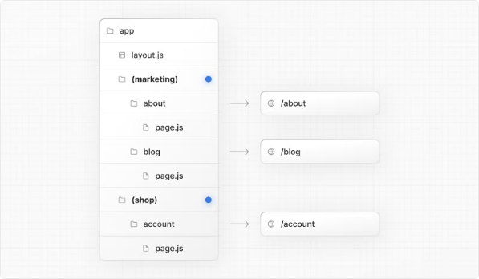
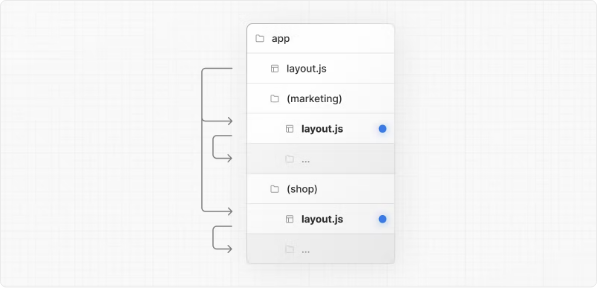
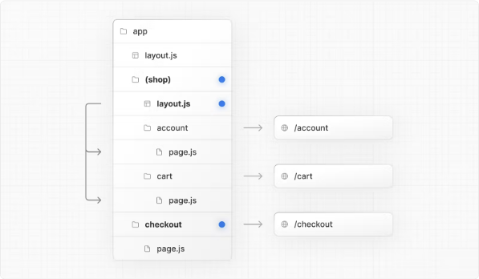
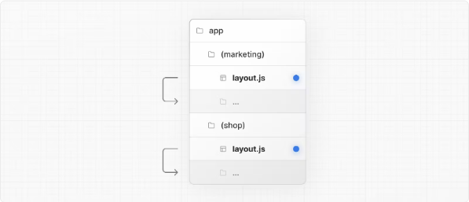

# Nextjs에서 라우터 폴더들 그룹으로 묶는 방법 (Route groups)

앱 디렉토리에서 중첩된 폴더는 일반적으로 URL 경로에 매핑됩니다. 그러나 특정 폴더를 라우트 그룹으로 표시하여 해당 폴더가 라우트의 URL 경로에 포함되지 않도록 할 수 있습니다.

이를 통해 URL 경로 구조에 영향을 주지 않고도 라우트 세그먼트와 프로젝트 파일을 논리적 그룹으로 구성할 수 있습니다.

라우트 그룹은 다음과 같은 경우에 유용합니다:

- 라우트를 그룹화하여 사이트 섹션, 의도 또는 팀별로 구성합니다.
- 동일한 라우트 세그먼트 수준에서 중첩된 레이아웃을 활성화합니다.
  - 동일한 세그먼트 내에서 여러 중첩된 레이아웃 생성(여러 루트 레이아웃 포함)
  - 공통 세그먼트의 일부 라우트에 레이아웃 추가

## 규칙

폴더의 이름을 괄호로 둘러싸면(폴더이름) 라우트 그룹을 생성할 수 있습니다.

## 예시

### URL 경로에 영향을 주지 않고 라우트 구성

URL에 영향을 주지 않고 라우트를 구성하려면 관련된 라우트를 그룹화하여 유지하세요. 괄호 안의 폴더는 URL에서 제외됩니다(예: (marketing) 또는 (shop)).

<!-- ui-log 수평형 -->

<ins class="adsbygoogle"
     style="display:block"
     data-ad-client="ca-pub-4877378276818686"
     data-ad-slot="9743150776"
     data-ad-format="auto"
     data-full-width-responsive="true"></ins>
<component is="script">
(adsbygoogle = window.adsbygoogle || []).push({});
</component>

(마케팅) 및 (쇼핑) 내부의 라우트는 동일한 URL 계층 구조를 공유하지만 각 그룹 내에 layout.js 파일을 추가하여 각 그룹에 대해 다른 레이아웃을 만들 수 있습니다.

### 특정 세그먼트를 레이아웃에 포함

특정 라우트를 레이아웃에 포함하려면 새로운 라우트 그룹(예: (쇼핑))을 만들고 해당 그룹(예: 계정 및 장바구니)에 동일한 레이아웃을 공유하는 라우트를 이동합니다. 그룹 외부의 라우트는 레이아웃을 공유하지 않습니다(예: 결제).

### 다중 루트 레이아웃 생성

다중 루트 레이아웃을 생성하려면 최상위 layout.js 파일을 제거하고 각 라우트 그룹 내에 layout.js 파일을 추가하세요. 이것은 완전히 다른 UI 또는 경험을 가진 섹션으로 애플리케이션을 분할하는 데 유용합니다. `<html>` 및 `<body>` 태그를 각 루트 레이아웃에 추가해야 합니다.

위의 예에서 (마케팅) 및 (쇼핑) 모두 자체 루트 레이아웃을 갖습니다.

::: tip

- 라우트 그룹의 이름 짓는 것은 조직을 위한 특별한 의미가 없습니다. URL 경로에 영향을 주지 않습니다.
- 라우트 그룹을 포함하는 라우트는 다른 라우트와 동일한 URL 경로로 해석되지 않아야 합니다. 예를 들어, 라우트 그룹이 URL 구조에 영향을 주지 않기 때문에 (marketing)/about/page.js 및 (shop)/about/page.js는 모두 /about으로 해석되어 오류가 발생합니다.
- 최상위 layout.js 파일 없이 여러 루트 레이아웃을 사용하는 경우, 홈 페이지.js 파일은 라우트 그룹 중 하나에 정의되어야 합니다. 예를 들어: app/(marketing)/page.js.
- 여러 루트 레이아웃을 거쳐 이동하는 경우 전체 페이지가 다시로드됩니다(클라이언트 측 탐색과 달리). 예를 들어, app/(쇼핑)/layout.js를 사용하는 /cart에서 app/(마케팅)/layout.js를 사용하는 /blog로 이동하면 전체 페이지가 다시로드됩니다. 이는 여러 루트 레이아웃에만 해당됩니다.
  :::
