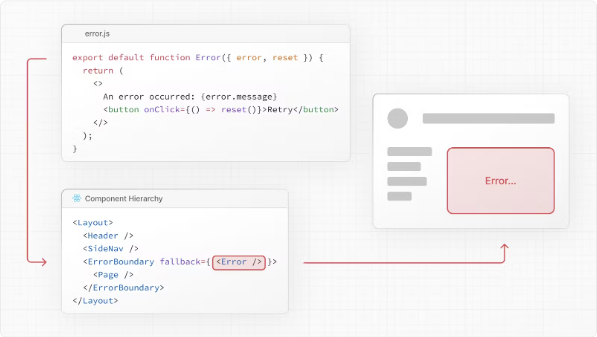
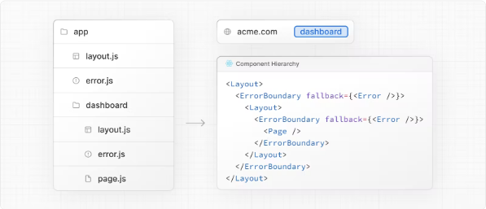

# 1.Nextjs의 에러 처리 방법

Nextjs의 에러 처리 방법을 알아보기 전에 기존에 React에서는 에러처리를 어떻게 했는지 간단히 알아보고 넘어가겠습니다.

1. **try-catch 블록 사용**: JavaScript에서와 마찬가지로 try-catch 블록을 사용하여 특정 코드 영역에서 발생하는 에러를 캐치할 수 있습니다. 하지만 React에서는 이 방법이 주로 사용되지 않습니다. 대부분의 경우 이 방법은 비동기 코드나 라이프사이클 메서드에서 사용됩니다.

   ```jsx
   try {
     // 예외가 발생할 수 있는 코드
   } catch (error) {
     // 에러 핸들링
   }
   ```

2. **Error Boundary 사용**: React 16부터 도입된 개념으로, 컴포넌트 트리의 하위 컴포넌트에서 발생한 에러를 캐치하여 전체 애플리케이션이 멈추는 것을 방지합니다. Error Boundary는 componentDidCatch 라이프사이클 메서드를 사용하여 에러를 처리합니다.

   ```jsx
   class ErrorBoundary extends React.Component {
     constructor(props) {
       super(props);
       this.state = { hasError: false };
     }

     componentDidCatch(error, info) {
       this.setState({ hasError: true });
       // 에러 로깅 등의 추가 작업 가능
     }

     render() {
       if (this.state.hasError) {
         // 대체 UI 표시
         return <h1>에러가 발생했습니다.</h1>;
       }
       return this.props.children;
     }
   }
   ```

   Error Boundary를 사용하기 위해서는 해당 컴포넌트를 에러가 발생할 수 있는 컴포넌트의 상위 계층에 배치해야 합니다.

3. **componentDidCatch 메서드**: 클래스형 컴포넌트에서 componentDidCatch 라이프사이클 메서드를 사용하여 하위 컴포넌트에서 발생한 에러를 캐치하고 처리할 수 있습니다.

   ```jsx
   class MyComponent extends React.Component {
     constructor(props) {
       super(props);
       this.state = { error: null, errorInfo: null };
     }

     componentDidCatch(error, errorInfo) {
       this.setState({ error: error, errorInfo: errorInfo });
       // 에러 로깅 등의 추가 작업 가능
     }

     render() {
       if (this.state.errorInfo) {
         // 에러 UI 표시
         return (
           <div>
             <h2>에러가 발생했습니다.</h2>
             <details style={{ whiteSpace: "pre-wrap" }}>
               {this.state.error && this.state.error.toString()}
               <br />
               {this.state.errorInfo.componentStack}
             </details>
           </div>
         );
       }
       return this.props.children;
     }
   }
   ```

4. **React Error Overlay 사용**: 개발 환경에서는 React Error Overlay를 사용하여 에러 메시지를 개발자에게 표시합니다. 이것은 개발 환경에서만 동작하며, 프로덕션 환경에서는 무시됩니다.

   React 16부터, 개발 모드에서 React 애플리케이션을 실행할 때, 브라우저에 오류가 발생하면 React Error Overlay가 화면에 나타납니다. 이를 통해 개발자는 에러를 쉽게 파악하고 디버깅할 수 있습니다.

이러한 방법들로 지금까지는 React에서 error handling을 해왔는데요. 그럼 이제 Nextjs에서는 어떻게 에러처리를 하는지 알아보겠습니다.

<!-- ui-log 수평형 -->

<ins class="adsbygoogle"
     style="display:block"
     data-ad-client="ca-pub-4877378276818686"
     data-ad-slot="9743150776"
     data-ad-format="auto"
     data-full-width-responsive="true"></ins>
<component is="script">
(adsbygoogle = window.adsbygoogle || []).push({});
</component>

# 2.Nextjs 에러 핸들링

에러 처리를 위한 error.js 파일 규칙을 사용하면 중첩된 경로에서 예상치 못한 런타임 오류를 쉽게 처리할 수 있습니다.

- 자동으로 라우트 세그먼트 및 해당 중첩된 자식을 래핑하는 React 에러 바운더리를 생성합니다.
- 파일 시스템 계층 구조를 사용하여 특정 세그먼트에 맞는 에러 UI를 생성합니다.
- 영향을 받은 세그먼트에 대한 에러를 격리하면서 애플리케이션의 나머지 부분은 작동합니다.
- 전체 페이지 새로고침 없이 오류에서 복구할 수 있는 기능을 추가합니다.

Nextjs에서는 파일을 생성하는 것 만으로도 에러처리를 쉽게 할 수 있습니다.
route 세그먼트 내에 error.js 파일을 추가하고 React 컴포넌트를 내보내어 에러 UI를 만듭니다:


```typescript
"use client"; // Error components must be Client Components

import { useEffect } from "react";

export default function Error({ error, reset }: { error: Error & { digest?: string }; reset: () => void }) {
  useEffect(() => {
    // 오류를 오류 보고 서비스에 기록합니다.
    console.error(error);
  }, [error]);

  return (
    <div>
      <h2>오류가 발생했습니다!</h2>
      <button
        onClick={
          // 세그먼트를 다시 렌더링하여 오류를 복구하려고 시도합니다.
          () => reset()
        }
      >
        다시 시도
      </button>
    </div>
  );
}
```

### error.js 동작 방식



- error.js는 자동으로 React 에러 바운더리를 생성합니다. 이 경계는 중첩된 자식 세그먼트 또는 page.js 컴포넌트를 래핑합니다.
- error.js 파일에서 내보낸 React 컴포넌트는 대체 컴포넌트로 사용됩니다.
- 에러 경계 내에서 에러가 발생하면 에러가 포함되고, 만들어두었던 error.js가 렌더링됩니다.
- 대체 에러 컴포넌트가 활성화되면, 에러 경계 위의 레이아웃은 상태를 유지하고 상호 작용을 유지하며, 에러 컴포넌트는 에러에서 복구할 수 있는 기능을 표시할 수 있습니다.

즉 에러가 난 컴포넌트만 에러 처리를 할 수 있고 나머지 컴포넌트들은 정상적으로 보여진다는 것이죠.

### 에러에서 복구하기

오류의 원인은 때로 일시적일 수 있습니다. 이러한 경우에는 단순히 다시 시도하면 문제가 해결될 수 있습니다.

에러 컴포넌트는 `reset()` 함수를 사용하여 사용자에게 오류에서 복구를 시도하도록 요청할 수 있습니다. 이 함수를 실행하면 Error 경계의 내용을 다시 렌더링하려고 시도합니다. 성공하면 대체 에러 컴포넌트가 다시 렌더링 결과로 대체됩니다.

```typescript
"use client";

export default function Error({ error, reset }: { error: Error & { digest?: string }; reset: () => void }) {
  return (
    <div>
      <h2>오류가 발생했습니다!</h2>
      <button onClick={() => reset()}>다시 시도</button>
    </div>
  );
}
```

### 중첩된 경로

<!-- ui-log 수평형 -->

<ins class="adsbygoogle"
     style="display:block"
     data-ad-client="ca-pub-4877378276818686"
     data-ad-slot="9743150776"
     data-ad-format="auto"
     data-full-width-responsive="true"></ins>
<component is="script">
(adsbygoogle = window.adsbygoogle || []).push({});
</component>

특수 파일을 통해 생성된 React 컴포넌트는 특정 중첩된 계층 구조에서 렌더링됩니다.

예를 들어, 두 개의 세그먼트를 포함하는 중첩된 경로는 다음과 같이 간소화된 컴포넌트 계층 구조에서 렌더링됩니다:



중첩된 컴포넌트 계층 구조는 중첩된 경로 전체에서 error.js 파일의 동작에 영향을 미칩니다:

- 오류는 가장 가까운 상위 오류 경계까지 전파됩니다. 이는 error.js 파일이 모든 중첩된 자식 세그먼트에 대해 오류를 처리한다는 것을 의미합니다. 서로 다른 수준의 디렉터리에 error.js 파일을 배치하면 정확히 어느 곳에서 에러가 발생했는지 더 정확하게 판단할 수 있습니다.
- 오류 경계는 동일한 세그먼트의 layout.js 컴포넌트에서 발생한 오류를 처리하지 않습니다. 오류 경계가 해당 layout 컴포넌트의 내부에 중첩되기 때문입니다.

### 레이아웃에서의 오류 처리

error.js 경계는 동일한 세그먼트의 layout.js 또는 template.js 컴포넌트에서 발생한 오류를 잡지 않습니다. 이러한 의도적인 계층 구조를 유지하면 오류가 발생할 때 중요한 UI(예: 내비게이션)가 유지되고 기능이 유지됩니다.

특정 레이아웃이나 템플릿 내에서 오류를 처리하려면 레이아웃의 부모 세그먼트에 error.js 파일을 배치하세요.

루트 레이아웃이나 템플릿에서 오류를 처리하려면 루트 디렉토리에 있는 error.js의 변형인 global-error.js를 사용하세요.

### 루트

레이아웃에서의 오류 처리

루트 app/error.js 경계는 루트 app/layout.js 또는 app/template.js 컴포넌트에서 발생한 오류를 잡지 않습니다.

이러한 루트 컴포넌트에서 오류를 처리하려면 루트 디렉토리에 있는 error.js의 변형인 app/global-error.js를 사용하세요.

루트 error.js와 달리 global-error.js 오류 경계는 전체 애플리케이션을 래핑하며, 그 대체 컴포넌트가 활성화될 때 루트 레이아웃을 대체합니다. 따라서 이 경계는 global-error.js가 자체 `<html>` 및 `<body>` 태그를 정의해야 한다는 점을 기억해야 합니다.

global-error.js는 가장 정교한 에러 UI가 아니며 전체 애플리케이션에 대한 "모든 에러 처리"로 간주할 수 있습니다. 루트 컴포넌트는 일반적으로 덜 동적이므로 다른 error.js 경계가 대부분의 오류를 잡을 것입니다.

global-error.js가 정의되어 있더라도 루트 error.js를 정의하는 것이 좋습니다. 루트 레이아웃에는 전역으로 공유되는 UI 및 브랜딩이 포함되므로 대체 에러 컴포넌트가 루트 레이아웃 내에서 렌더링됩니다.

```typescript
"use client";

export default function GlobalError({ error, reset }: { error: Error & { digest?: string }; reset: () => void }) {
  return (
    <html>
      <body>
        <h2>오류가 발생했습니다!</h2>
        <button onClick={() => reset()}>다시 시도</button>
      </body>
    </html>
  );
}
```

<!-- ui-log 수평형 -->

<ins class="adsbygoogle"
     style="display:block"
     data-ad-client="ca-pub-4877378276818686"
     data-ad-slot="9743150776"
     data-ad-format="auto"
     data-full-width-responsive="true"></ins>
<component is="script">
(adsbygoogle = window.adsbygoogle || []).push({});
</component>

### 서버 오류 처리

서버 컴포넌트 내에서 오류가 발생하면 Next.js는 (프로덕션에서는 민감한 오류 정보가 제거된) Error 객체를 가장 가까운 error.js 파일로 오류 prop으로 전달합니다.

#### 민감한 오류 정보 보호

프로덕션에서는 클라이언트로 전달된 Error 객체는 일반적인 메시지와 digest 속성만 포함합니다.

이것은 오류에 포함된 잠재적으로 민감한 세부 정보가 클라이언트에 노출되는 것을 방지하기 위한 보안 조치입니다.

message 속성에는 오류에 대한 일반적인 메시지가 포함되고 digest 속성에는 오류의 자동으로 생성된 해시가 포함되어 서버 측 로그에서 해당하는 오류를 찾을 수 있습니다.

개발 중에는 클라이언트로 전달된 Error 객체에 오류의 메시지가 포함되어 디버깅이 더 쉽습니다.
