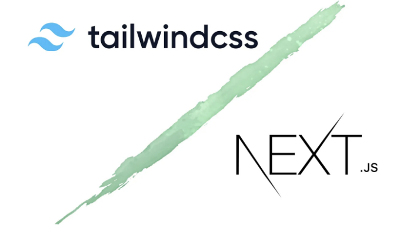

# Next.js + Tailwind CSS로 웹사이트 만드는 방법



CSS를 길게 쓰는 것에 지친 적이 있거나 클래스 이름 충돌에 고민했거나 스타일링 접근 방식을 더 간소화하고 싶은 적이 많이 있는데요.
Tailwind CSS는 HTML을 떠나지 않고도 현대적인 웹사이트를 빠르게 구축할 수 있는 유틸리티 기반 CSS 프레임워크입니다.
최근에 Next.js를 사용해서 프로젝트를 진행할 때 Tailwind를 적극 활용하여 인라인 클래스 CSS로 더욱 빠르고 마법같은 웹사이트를 만드는 방법을 배웠습니다.
이 글에서는 Next.js + Tailwind CSS 를 어떻게 사용하는지 자세히 알아보고, 스타일링 작업을 극적으로 단순화할 수 있는 방법을 알아보려고 합니다.

<!-- ui-log 수평형 -->

<ins class="adsbygoogle"
     style="display:block"
     data-ad-client="ca-pub-4877378276818686"
     data-ad-slot="9743150776"
     data-ad-format="auto"
     data-full-width-responsive="true"></ins>
<component is="script">
(adsbygoogle = window.adsbygoogle || []).push({});
</component>

# 설치 및 설정: 간편하게

1. Next.js 프로젝트 생성하기
   먼저 새로운 Next.js 프로젝트를 생성합니다. 이미 Next.js 프로젝트가 없다면, Create Next App을 사용하여 시작하세요.

```js
npx create-next-app@latest my-project --typescript --eslint

cd my-project
```

일반적으로 create-next-app@latest 명령어로 Next.js 프로젝트를 설치하는 중에 Tailwind CSS를 프로젝트 설정과 함께 자동으로 설치할 지 여부를 물어봅니다. 우리는 Tailwind 프레임워크를 Next.js 설치와 함께 자동으로 설치하기 위해 'Yes'를 선택합니다.

2. Tailwind CSS 및 일부 의존성 설치하기
   Next.js 프로젝트를 설정한 후에 Tailwind CSS와 일부 의존성을 설치합니다. 그 다음으로, Tailwind를 초기화하여 tailwind.config.js 및 postcss.config.js 파일을 생성합니다.

```js
npm install -D tailwindcss postcss autoprefixer

npx tailwindcss init -p
```

3. 템플릿 경로 제공 및 테마 추가하여 Tailwind 구성하기
   tailwind.config.js 파일을 사용하여 Tailwind를 구성하여 프로젝트에서 사용할 템플릿 파일 경로를 추가합니다. 우리는 테마를 선언하여 Tailwind의 테마를 사용자 정의할 수 있습니다. 색상 팔레트, 글꼴 패밀리, 이미지, 간격 유틸리티 및 기타 스타일링 기능을 추가할 수 있습니다. 원하는대로 추가적인 Tailwind 플러그인을 설치하고 구성 파일에 추가할 수 있습니다.

```js
import type { Config } from "tailwindcss";

const config: Config = {
  content: ["./pages/**/*.{js,ts,jsx,tsx,mdx}", "./components/**/*.{js,ts,jsx,tsx,mdx}", "./app/**/*.{js,ts,jsx,tsx,mdx}"],
  theme: {
    extend: {
      backgroundImage: {
        "gradient-radial": "radial-gradient(var(--tw-gradient-stops))",
        "gradient-conic": "conic-gradient(from 180deg at 50% 50%, var(--tw-gradient-stops))",
      },
    },
  },
  plugins: [],
};
export default config;
```

<!-- ui-log 수평형 -->

<ins class="adsbygoogle"
     style="display:block"
     data-ad-client="ca-pub-4877378276818686"
     data-ad-slot="9743150776"
     data-ad-format="auto"
     data-full-width-responsive="true"></ins>
<component is="script">
(adsbygoogle = window.adsbygoogle || []).push({});
</component>

tailwind.config.js 파일은 Tailwind CSS의 핵심 구성 허브입니다. 이것은 자체 변경 사항을 지정할 수 있는 JavaScript 객체를 제공하여 테마 사용자 정의, 유틸리티 클래스 확장, 프로덕션 빌드 중 불필요한 CSS 삭제 등의 여러 기능을 변경할 수 있습니다.

기본 구성 파일을 생성함으로써 Tailwind CSS의 여러 기능을 변경할 수 있습니다. 테마 사용자 정의, 유틸리티 클래스 확장, 필요 없는 CSS 삭제 등의 많은 기능을 변경할 수 있습니다.

4. 글로벌 스타일 시트에 Tailwind 포함하기
   styles/globals.css에 다음을 추가하세요.

```js
@tailwind base;
@tailwind components;
@tailwind utilities;
```

Next.js 프로젝트에서 Tailwind CSS 스타일을 사용하려면 마지막으로 페이지/\_app.js 파일에 스타일을 가져와야 합니다.

```js
// pages/_app.js
import "../styles/global.css";

function MyApp({ Component, pageProps }) {
  return <Component {...pageProps} />;
}

export default MyApp;
```

이러한 단계를 거치면 Tailwind CSS가 Next.js 프로젝트에 성공적으로 통합되어 구성되고, 컴포넌트를 스타일링하는 데 유틸리티 클래스를 활용할 수 있게 됩니다.

# Tailwind CSS의 기본 개념 이해

## 유틸리티-퍼스트 접근 방식

Tailwind CSS는 사전 정의된 유틸리티 클래스를 사용하여 스타일을 직접 HTML 요소에 적용하는 유틸리티-퍼스트 접근 방식을 따릅니다. 이 접근 방식은 사용자 정의 CSS 스타일을 작성할 필요가 없으며 다양한 스타일링 요구 사

항을 커버하는 방대한 배열의 유틸리티 클래스를 제공합니다.

<!-- ui-log 수평형 -->

<ins class="adsbygoogle"
     style="display:block"
     data-ad-client="ca-pub-4877378276818686"
     data-ad-slot="9743150776"
     data-ad-format="auto"
     data-full-width-responsive="true"></ins>
<component is="script">
(adsbygoogle = window.adsbygoogle || []).push({});
</component>

## Next.js의 기본 구조:

Next.js 프로젝트에서는 Tailwind CSS 클래스를 JSX 요소에 직접 적용할 수 있습니다. 다음은 Tailwind CSS 클래스를 사용하여 버튼을 스타일하는 간단한 예제입니다.

```js
export default function Page() {
  return <h1 className="text-3xl font-bold underline">Hello, Next.js!</h1>;
}
```

이 코드는 "Hello, Next.js!" 텍스트를 가진 `<h1>` 요소를 렌더링하는 간단한 React 컴포넌트를 정의하고, CSS 클래스를 사용하여 시각적 스타일을 적용합니다.

Tailwind 클래스 분석:

- text-3xl: 글꼴 크기를 매우 크게 설정합니다(일반적으로 24px 이상).
- font-bold: 강조를 위해 텍스트를 굵게 만듭니다.
- underline: 텍스트 아래에 밑줄을 추가합니다.

Tailwind는 기본적으로 여러 줄의 CSS 클래스 대신 코드를 한 줄로 캡슐화합니다. Tailwind는 구성 요소가 서로 분리되어 있는 현대적인 컴포넌트 기반 프레임워크의 코드에서 유용합니다. 코드가 너무 길거나 리팩터링이 필요한 경우에도 더 이상 일일이 여러 파일을 찾아보지 않아도 됩니다. 인라인 CSS이지만 키워드가 훌륭하고 빠르게 작업을 수행할 수 있습니다.

또한, Tailwind는 디자인을 위한 "시스템"을 제공하여 임의의 값과 함께 진행해야 하는 길게 찾아야 하는 것들을 찾지 않고도 색상, 글꼴, 그림자 등에 대해 내장된 잘 고려된 값을 사용할 수 있습니다. 이를 통해 보다 빠르고 "조화롭게 맞는" 것을 빠르게 만들어낼 수 있습니다.

<!-- ui-log 수평형 -->

<ins class="adsbygoogle"
     style="display:block"
     data-ad-client="ca-pub-4877378276818686"
     data-ad-slot="9743150776"
     data-ad-format="auto"
     data-full-width-responsive="true"></ins>
<component is="script">
(adsbygoogle = window.adsbygoogle || []).push({});
</component>

## Tailwind가 빠르게 작업하는 몇 가지 더 예제:

## 1. 텍스트와 버튼 스타일링:

이러한 구성 요소에서는 텍스트와 버튼을 스타일링하기 위해 Tailwind CSS 클래스를 직접 HTML 요소에 적용합니다. StyledText 구성 요소에서는 텍스트를 파란색으로 (text-blue-500) 스타일링하고 굵은 글꼴 (font-bold)을 적용합니다. 버튼 구성 요소는 일반 상태에서 파란색 배경 (bg-blue-500)을 가진 버튼을 생성하여 (hover:bg-blue-700) 호버 시 더 어두운 음영으로 변경합니다. 버튼 내부 텍스트는 흰색 (text-white)이며 패딩 (py-2 및 px-4)과 둥근 모서리 (rounded)를 가집니다.

```js
// components/StyledText.js
const StyledText = () => {
  return <p className="text-blue-500 font-bold">안녕하세요, Tailwind!</p>;
};

// components/Button.js
const Button = () => {
  return <button className="bg-blue-500 hover:bg-blue-700 text-white font-bold py-2 px-4 rounded">클릭하세요</button>;
};
```

## 2. 반응형 디자인:

이 구성 요소는 Tailwind CSS를 사용한 반응형 디자인을 보여줍니다. lg:flex 클래스는 화면 크기가 큰 경우에만 (lg:) 플렉스 박스 레이아웃을 적용하여 두 자식 div를 수평으로 정렬합니다. lg:justify-between 클래스는 div 사이에 콘텐츠를 정렬하여 여백을 만듭니다. 추가로, lg:w-1/2 클래스는 화면 크기가 큰 경우 각 div의 너비를 부모 컨테이너의 절반으로 설정하여 반응형 레이아웃을 보장합니다.

<!-- ui-log 수평형 -->

<ins class="adsbygoogle"
     style="display:block"
     data-ad-client="ca-pub-4877378276818686"
     data-ad-slot="9743150776"
     data-ad-format="auto"
     data-full-width-responsive="true"></ins>
<component is="script">
(adsbygoogle = window.adsbygoogle || []).push({});
</component>

```js
// components/ResponsiveLayout.js
const ResponsiveLayout = () => {
  return (
    <div className="lg:flex lg:justify-between">
      <div className="lg:w-1/2">왼쪽 콘텐츠</div>
      <div className="lg:w-1/2">오른쪽 콘텐츠</div>
    </div>
  );
};
```

## 3. 카드 생성하기:

이 구성 요소는 카드 UI 요소를 나타냅니다. bg-white, shadow-md, p-6 및 rounded-lg 클래스는 각각 카드의 배경색, 그림자, 패딩 및 둥근 모서리를 정의합니다. 카드 내부에는 제목과 특정 글꼴 스타일 및 여백이 있는 단락이 있습니다.

```js
// components/Card.js
const Card = () => {
  return (
    <div className="bg-white shadow-md p-6 rounded-lg">
      <h2 className="text-xl font-semibold">카드 제목</h2>
      <p className="text-gray-600 mt-2">이것은 간단한 카드 컴포넌트입니다.</p>
    </div>
  );
};
```

## 4. 네비게이션 바 구성하기:

이 구성 요소는 Tailwind CSS를 사용하여 네비게이션 바를 구축하는 방법을 보여줍니다. bg-gray-800, p-4, max-w-7xl, mx-auto, flex 및 justify-between 클래스는 네비게이션 바의 배경색, 패딩, 최대 너비, 가운데 정

렬 및 정렬을 스타일링합니다. 내부에는 제목과 특정 색상 및 호버 효과가 있는 네비게이션 링크 목록이 있습니다.

<!-- ui-log 수평형 -->

<ins class="adsbygoogle"
     style="display:block"
     data-ad-client="ca-pub-4877378276818686"
     data-ad-slot="9743150776"
     data-ad-format="auto"
     data-full-width-responsive="true"></ins>
<component is="script">
(adsbygoogle = window.adsbygoogle || []).push({});
</component>

```js
// components/NavBar.js
const NavBar = () => {
  return (
    <nav className="bg-gray-800 p-4">
      <div className="max-w-7xl mx-auto flex justify-between items-center">
        <div>
          <h1 className="text-white font-bold text-xl">내 웹사이트</h1>
        </div>
        <ul className="flex space-x-4">
          <li>
            <a href="#" className="text-white hover:text-gray-300">
              홈
            </a>
          </li>
          <li>
            <a href="#" className="text-white hover:text-gray-300">
              소개
            </a>
          </li>
          <li>
            <a href="#" className="text-white hover:text-gray-300">
              연락처
            </a>
          </li>
        </ul>
      </div>
    </nav>
  );
};
```

# Tailwind CSS와 전통적인 CSS 비교

## 간소화된 스타일링:

사용자 정의 클래스나 셀렉터를 사용하여 스타일을 정의하는 전통적인 CSS와 비교하여, Tailwind CSS는 일반적인 스타일링 작업에 대한 사전 정의된 유틸리티 클래스를 제공함으로써 보다 간소화된 접근 방식을 제공합니다. 간단한 예제를 사용하여 두 접근 방식을 비교해 보겠습니다.

```js
/* 전통적인 CSS */
.button {
  background-color: #3498db;
  color: #ffffff;
  padding: 10px 20px;
  border-radius: 5px;
}

/* Tailwind CSS */
<button className="bg-blue-500 text-white py-2 px-4 rounded">
  클릭하세요
</button>
```

<!-- ui-log 수평형 -->

<ins class="adsbygoogle"
     style="display:block"
     data-ad-client="ca-pub-4877378276818686"
     data-ad-slot="9743150776"
     data-ad-format="auto"
     data-full-width-responsive="true"></ins>
<component is="script">
(adsbygoogle = window.adsbygoogle || []).push({});
</component>

보시다시피, Tailwind CSS는 버튼 요소에 직접 유틸리티 클래스를 적용하여 사용자 정의 CSS 규칙을 작성할 필요성을 제거하며 더 깨끗하고 간결한 코드를 제공합니다.

Tailwind의 유틸리티-퍼스트 접근 방식은 전통적인 CSS에 비해 다음과 같은 여러 가지 이점을 제공합니다:

- 보일러플레이트 감소: 긴 CSS 규칙을 작성하거나 클래스 이름 충돌을 관리할 필요가 없습니다.
- 빠른 프로토타이핑: CSS 세부 사항에 갇히지 않고 스타일을 빠르게 실험할 수 있습니다.
- 직관적인 네이밍: 클래스 이름이 명확하고 자명하여 코드 유지 관리를 쉽게합니다.
- 반응형 내장: 대부분의 유틸리티에 대해 반응형 변형이 제공되어 스타일이 다른 화면 크기에 맞춰 적응됩니다.
- 커뮤니티 생태계: 다양한 플러그인 및 확장으로 Tailwind의 기능이 확장됩니다.

# Next.js 이외의 Tailwind 활용

Tailwind는 Next.js에서 빛을 발하지만 이 프레임워크에 제한되지는 않습니다. 다른 React 프레임워크, 순수 JavaScript, 또는 백엔드 응용 프로그램(조금의 조정이 필요할 수 있음)에서도 사용할 수 있습니다. Tailwind의 핵심 철학인 유틸리티 클래스는 다른 환경에서도 일관되게 유지되어 다양한 스타일링 솔루션으로 활용할 수 있습니다.
