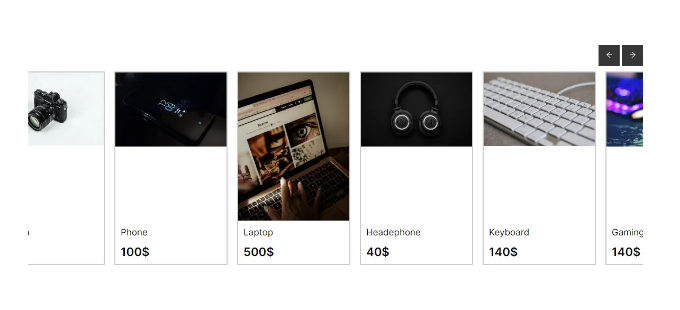

# Next.js에서 HTML 및 CSS를 사용하여 슬라이더 만드는 방법



이 글에서는 React, Next.js 및 CSS를 사용하여 슬라이더를 만드는 과정을 소개합니다.
이 슬라이더는 사용자가 왼쪽 및 오른쪽 탐색 버튼을 사용하여 트렌드 제품 컬렉션을 스크롤할 수 있게 합니다.

<!-- ui-log 수평형 -->

<ins class="adsbygoogle"
     style="display:block"
     data-ad-client="ca-pub-4877378276818686"
     data-ad-slot="9743150776"
     data-ad-format="auto"
     data-full-width-responsive="true"></ins>
<component is="script">
(adsbygoogle = window.adsbygoogle || []).push({});
</component>

## 단계 1: 프로젝트 설정하기

먼저, 컴퓨터에 Node.js가 설치되어 있는지 확인하세요.
설치되어 있지 않은 경우 공식 Node.js 웹사이트에서 다운로드할 수 있습니다.

- 다음 명령어를 사용하여 새로운 Next.js 앱을 만듭니다:

```js
npx create-next-app@latest
```

## 단계 2: 트렌드 제품 슬라이더 구축하기

이제 트렌드 제품 슬라이더를 구축하는 데 필요한 컴포넌트 및 스타일을 생성해 봅시다.

- 프로젝트 디렉토리 내에 components라는 새 디렉토리를 만듭니다.
- components 디렉토리 내에 TrendingSlider.js 파일을 생성하고 다음 코드를 추가하세요:

<!-- ui-log 수평형 -->

<ins class="adsbygoogle"
     style="display:block"
     data-ad-client="ca-pub-4877378276818686"
     data-ad-slot="9743150776"
     data-ad-format="auto"
     data-full-width-responsive="true"></ins>
<component is="script">
(adsbygoogle = window.adsbygoogle || []).push({});
</component>

```js
"use client"; // for nextjs 13.4 user
import Link from "next/link";
import React from "react";
import { AiOutlineArrowRight, AiOutlineArrowLeft } from "react-icons/ai";
import "./TrendingSlider.css";

const TrendingSlider = () => {
  const filteredItems = [
    {
      id: 1,
      img: "https://images.pexels.com/photos/90946/pexels-photo-90946.jpeg?auto=compress&cs=tinysrgb&w=600",
      description: "카메라",
      price: 200,
    },
    {
      id: 2,
      img: "https://images.pexels.com/photos/404280/pexels-photo-404280.jpeg?auto=compress&cs=tinysrgb&w=600",
      description: "휴대폰",
      price: 100,
    },
    {
      id: 3,
      img: "https://images.pexels.com/photos/12753820/pexels-photo-12753820.jpeg?auto=compress&cs=tinysrgb&w=600",
      description: "노트북",
      price: 500,
    },
    {
      id: 4,
      img: "https://images.pexels.com/photos/1649771/pexels-photo-1649771.jpeg?auto=compress&cs=tinysrgb&w=600",
      description: "헤드폰",
      price: 40,
    },
    {
      id: 5,
      img: "https://images.pexels.com/photos/163117/keyboard-white-computer-keyboard-desktop-163117.jpeg?auto=compress&cs=tinysrgb&w=600",
      description: "키보드",
      price: 140,
    },
    {
      id: 6,
      img: "https://images.pexels.com/photos/2115256/pexels-photo-2115256.jpeg?auto=compress&cs=tinysrgb&w=600",
      description: "게이밍 마우스",
      price: 140,
    },
  ];

  const slideLeft = () => {
    let slider = document.getElementById("slider");
    slider.scrollLeft = slider.scrollLeft - 235;
  };

  const slideRight = () => {
    let slider = document.getElementById("slider");
    slider.scrollLeft = slider.scrollLeft + 235;
  };
  return (
    <>
      <div className="trending">
        <div className="container">
          <div className="title-btns">
            <h3></h3>
            <div className="btns">
              <button title="왼쪽으로 스크롤" onClick={slideLeft}>
                <AiOutlineArrowLeft />
              </button>
              <button title="오른쪽으로 스크롤" onClick={slideRight}>
                <AiOutlineArrowRight />
              </button>
            </div>
          </div>
          <div className="row-container" id="slider">
            {filteredItems.map((item) => (
              <div key={item.id} className="row-item">
                <Link href={`/`} className="link">
                  <div className="item-header">
                    
                  </div>
                  <div className="item-description">
                    <p>{item.description}</p>
                    <p className="item-price">{item.price}$</p>
                  </div>
                </Link>
              </div>
            ))}
          </div>
        </div>
      </div>
    </>
  );
};
export default TrendingSlider;
```

<!-- ui-log 수평형 -->

<ins class="adsbygoogle"
     style="display:block"
     data-ad-client="ca-pub-4877378276818686"
     data-ad-slot="9743150776"
     data-ad-format="auto"
     data-full-width-responsive="true"></ins>
<component is="script">
(adsbygoogle = window.adsbygoogle || []).push({});
</component>

- 이제 components 디렉토리에 TrendingSlider.css 파일을 만들고 다음 CSS 코드를 추가하세요:

```css
@import url("https://fonts.googleapis.com/css2?family=Blinker:wght@200;400;600;700&display=swap");

* {
  margin: 0;
  padding: 0;
  box-sizing: border-box;
  scroll-behavior: smooth;
}

body {
  font-family: "Blinker", sans-serif;
  position: relative;
}

html {
  font-size: 62.5%;
}

/* global */
.container {
  max-width: 1200px;
  margin: 0 auto;
  padding: 0 19px;
  height: 100%;
  display: flex;
  flex-direction: column;
  justify-content: center;
}

.row-item {
  outline: 2px solid rgba(0, 0, 0, 0.205);
  cursor: pointer;
  transition: all 0.15s ease-in;
}

.row-item:hover {
  outline: 2px solid rgba(0, 0, 0, 0.6);
}

.trending {
  height: 100vh;
}

.item-header img {
  width: 21rem;
}

.item-description {
  font-size: 1.7rem;
  padding: 1rem;
}

.trending h3 {
  font-size: 2.6rem;
  font-weight: 600;
  margin-bottom: 4.2rem !important;
}

.row-container {
  display: flex;
  gap: 2.2rem;
  overflow-x: scroll;
  overflow-y: hidden;
  white-space: nowrap;
  scroll-behavior: smooth;
  position: relative;
  padding: 1rem 0.6rem;
}

/* Chrome, Safari 및 Opera용 스크롤바 숨기기 */
.row-container::-webkit-scrollbar {
  display: none;

  /* IE, Edge 및 Firefox용 스크롤바 숨기기 */
  -ms-overflow-style: none;
  scrollbar-width: none;
}

.title-btns {
  display: flex;
  justify-content: space-between;
}

.btns button {
  color: white;
  background-color: #373737;
  padding: 1rem;
  font-size: 1.5rem;
  border: none;
  height: 4rem;
  width: 4rem;
  cursor: pointer;
  transition: all 0.1s ease-in;
}

.btns {
  display: flex;
  gap: 0.4rem;
}

.btns button:hover {
  background-color: black;
}
.item-price {
  font-weight: 600;
  font-size: 2.2rem;
  margin-top: 1.4rem;
}
.link {
  text-decoration: none;
  color: black;
  height: 100%;
  display: flex;
  flex-direction: column;
  justify-content: space-between;
}
```

<!-- ui-log 수평형 -->

<ins class="adsbygoogle"
     style="display:block"
     data-ad-client="ca-pub-4877378276818686"
     data-ad-slot="9743150776"
     data-ad-format="auto"
     data-full-width-responsive="true"></ins>
<component is="script">
(adsbygoogle = window.adsbygoogle || []).push({});
</component>

## 단계 3: TrendingSlider 컴포넌트 통합하기

- 프로젝트 디렉토리에 page.js 파일을 생성하고 다음 코드를 추가하세요:

```js
import React from "react";
import TrendingSlider from "../components/TrendingSlider";

const Home = () => {
  return (
    <div>
      <TrendingSlider />
    </div>
  );
};

export default Home;
```

## 단계 4: 어플리케이션 실행하기

개발 서버를 시작하려면 터미널에서 다음 명령을 실행하세요:

```js
npm run dev
```

트렌드 제품 슬라이더가 작동하는 것을 확인하려면 웹 브라우저에서 http://localhost:3000을 접근하세요.

## 결론

이 글에서는 React, Next.js 및 CSS를 사용하여 트렌드 제품 슬라이더를 만드는 방법에 대해 배웠습니다. 사용자가 네비게이션 버튼을 사용하여 제품을 탐색할 수 있는 반응형 슬라이더를 만들었습니다. 이러한 종류의 UI 구성 요소는 웹사이트의 사용자 경험을 향상시키고 더 많은 상호 작용성을 부여할 수 있습니다. 프로젝트 요구 사항에 따라 스타일을 더 맞춤화하고 기능을 추가할 수 있습니다.
