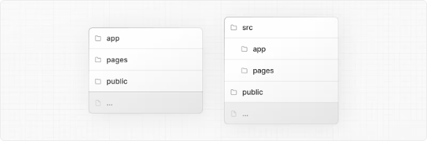

# Next.js 페이지 라우터 프로젝트 저장소 구조

::: tip 💡 이 포스트를 읽으면
Next.js 애플리케이션의 프로젝트 구조에 대한 개요를 얻을 수 있습니다.
:::

<!-- ui-log 수평형 -->

<ins class="adsbygoogle"
     style="display:block"
     data-ad-client="ca-pub-4877378276818686"
     data-ad-slot="9743150776"
     data-ad-format="auto"
     data-full-width-responsive="true"></ins>
<component is="script">
(adsbygoogle = window.adsbygoogle || []).push({});
</component>

## 상위 수준 폴더

상위 수준 폴더는 애플리케이션의 코드 및 정적 자산을 구성하는 데 사용됩니다.

| 폴더   | 설명                          |
| ------ | ----------------------------- |
| app    | 앱 라우터                     |
| pages  | 페이지 라우터                 |
| public | 제공되는 정적 에셋            |
| src    | 선택적 애플리케이션 소스 폴더 |

## 상위 수준 파일

상위 수준 파일은 애플리케이션을 구성하고, 종속성을 관리하고, 미들웨어를 실행하고, 모니터링 도구를 통합하며, 환경 변수를 정의하는 데 사용됩니다.

| 파일 또는 폴더     | 설명                                  |
| ------------------ | ------------------------------------- |
| Next.js            | Next.js                               |
| next.config.js     | Next.js의 설정 파일                   |
| package.json       | 프로젝트 종속성 및 스크립트           |
| instrumentation.ts | OpenTelemetry 및 Instrumentation 파일 |
| middleware.ts      | Next.js 요청 미들웨어                 |
| .env               | 환경 변수                             |
| .env.local         | 로컬 환경 변수                        |
| .env.production    | 프로덕션 환경 변수                    |
| .env.development   | 개발 환경 변수                        |
| .eslintrc.json     | ESLint의 설정 파일                    |
| .gitignore         | Git에서 무시할 파일 및 폴더           |
| next-env.d.ts      | Next.js의 TypeScript 선언 파일        |
| tsconfig.json      | TypeScript의 설정 파일                |
| jsconfig.json      | JavaScript의 설정 파일                |

<!-- ui-log 수평형 -->

<ins class="adsbygoogle"
     style="display:block"
     data-ad-client="ca-pub-4877378276818686"
     data-ad-slot="9743150776"
     data-ad-format="auto"
     data-full-width-responsive="true"></ins>
<component is="script">
(adsbygoogle = window.adsbygoogle || []).push({});
</component>

## 앱 라우팅 규칙

다음 파일 규칙은 앱 라우터에서 경로를 정의하고 메타데이터를 처리하는 데 사용됩니다.

### 라우팅 파일

| 폴더         | 파일 확장자   | 설명                     |
| ------------ | ------------- | ------------------------ |
| layout       | .js .jsx .tsx | 레이아웃                 |
| page         | .js .jsx .tsx | 페이지                   |
| loading      | .js .jsx .tsx | 로딩 UI                  |
| not-found    | .js .jsx .tsx | 찾을 수 없음 UI          |
| error        | .js .jsx .tsx | 에러 UI                  |
| global-error | .js .jsx .tsx | 전역 에러 UI             |
| route        | .js .ts       | API 엔드포인트           |
| template     | .js .jsx .tsx | 다시 렌더링되는 레이아웃 |
| default      | .js .jsx .tsx | 병렬 라우트 후행 페이지  |

### 중첩된 경로

| 폴더          | 라우트 세그먼트        |
| ------------- | ---------------------- |
| folder        | 라우트 세그먼트        |
| folder/folder | 중첩된 라우트 세그먼트 |

### 동적 경로

| 폴더          | 라우트 세그먼트 타입                        |
| ------------- | ------------------------------------------- |
| [folder]      | 동적 라우트 세그먼트                        |
| [...folder]   | 모든 경우를 포함하는 라우트 세그먼트        |
| [[...folder]] | 선택적 모든 경우를 포함하는 라우트 세그먼트 |

<!-- ui-log 수평형 -->

<ins class="adsbygoogle"
     style="display:block"
     data-ad-client="ca-pub-4877378276818686"
     data-ad-slot="9743150776"
     data-ad-format="auto"
     data-full-width-responsive="true"></ins>
<component is="script">
(adsbygoogle = window.adsbygoogle || []).push({});
</component>

### 경로 그룹 및 비공개 폴더

| (folder) | 라우팅에 영향을 미치지 않고 라우트를 그룹화합니다. |
| \_folder | 라우팅에서 폴더와 모든 하위 세그먼트를 라우팅에서 제외합니다. |

### 병렬 및 가로채기된 경로

| @folder | 이름이 지정된 슬롯 |
| (.)folder | 동일 레벨에서 가로채기 |
| (..)folder | 한 단계 위에서 가로채기 |
| (..)(..)folder | 두 단계 위에서 가로채기 |
| (...)folder | 루트에서부터 가로채기 |

### 메타데이터 파일 규칙

#### 앱 아이콘

| 파일 또는 폴더 | 파일 확장자               | 설명                  |
| -------------- | ------------------------- | --------------------- |
| favicon        | .ico                      | 파비콘 파일           |
| icon           | .ico .jpg .jpeg .png .svg | 앱 아이콘 파일        |
| icon           | .js .ts .tsx              | 생성된 앱 아이콘      |
| apple-icon     | .jpg .jpeg .png           | 애플 앱 아이콘 파일   |
| apple-icon     | .js .ts .tsx              | 생성된 애플 앱 아이콘 |

#### 오픈 그래프 및 트위터 이미지

| 파일 또는 폴더  | 파일 확장자          | 설명                      |
| --------------- | -------------------- | ------------------------- |
| opengraph-image | .jpg .jpeg .png .gif | 오픈 그래프 이미지 파일   |
| opengraph-image | .js .ts .tsx         | 생성된 오픈 그래프 이미지 |
| twitter-image   | .jpg .jpeg .png .gif | 트위터 이미지 파일        |
| twitter-image   | .js .ts .tsx         | 생성된 트위터 이미지      |

<!-- ui-log 수평형 -->

<ins class="adsbygoogle"
     style="display:block"
     data-ad-client="ca-pub-4877378276818686"
     data-ad-slot="9743150776"
     data-ad-format="auto"
     data-full-width-responsive="true"></ins>
<component is="script">
(adsbygoogle = window.adsbygoogle || []).push({});
</component>

#### SEO

| 파일 또는 폴더 | 파일 확장자 | 설명             |
| -------------- | ----------- | ---------------- |
| sitemap        | .xml        | 사이트맵 파일    |
| sitemap        | .js .ts     | 생성된 사이트맵  |
| robots         | .txt        | 로봇 파일        |
| robots         | .js .ts     | 생성된 로봇 파일 |

## 페이지 라우팅 규칙

다음 파일 규칙은 페이지 라우터에서 경로를 정의하는 데 사용됩니다.

### 특별 파일

| 파일 또는 폴더 | 파일 확장자   | 설명                    |
| -------------- | ------------- | ----------------------- |
| \_app          | .js .jsx .tsx | 사용자 정의 앱          |
| \_document     | .js .jsx .tsx | 사용자 정의 문서        |
| \_error        | .js .jsx .tsx | 사용자 정의 에러 페이지 |
| 404            | .js .jsx .tsx | 404 에러 페이지         |
| 500            | .js .jsx .tsx | 500 에러 페이지         |

### 경로

| 파일 또는 폴더 | 파일 확장자   | 설명          |
| -------------- | ------------- | ------------- |
| index          | .js .jsx .tsx | 홈 페이지     |
| folder/index   | .js .jsx .tsx | 중첩된 페이지 |
| index          | .js .jsx .tsx | 홈 페이지     |
| file           | .js .jsx .tsx | 중첩된 페이지 |

<!-- ui-log 수평형 -->

<ins class="adsbygoogle"
     style="display:block"
     data-ad-client="ca-pub-4877378276818686"
     data-ad-slot="9743150776"
     data-ad-format="auto"
     data-full-width-responsive="true"></ins>
<component is="script">
(adsbygoogle = window.adsbygoogle || []).push({});
</component>

### 동적 경로

| 파일 또는 폴더      | 파일 확장자   | 설명                                        |
| ------------------- | ------------- | ------------------------------------------- |
| [folder]/index      | .js .jsx .tsx | 동적 라우트 세그먼트                        |
| [...folder]/index   | .js .jsx .tsx | 모든 경우를 포함하는 라우트 세그먼트        |
| [[...folder]]/index | .js .jsx .tsx | 선택적 모든 경우를 포함하는 라우트 세그먼트 |
| [file]              | .js .jsx .tsx | 동적 라우트 세그먼트                        |
| [...file]           | .js .jsx .tsx | 모든 경우를 포함하는 라우트 세그먼트        |
| [[...file]]         | .js .jsx .tsx | 선택적 모든 경우를 포함하는 라우트 세그먼트 |
