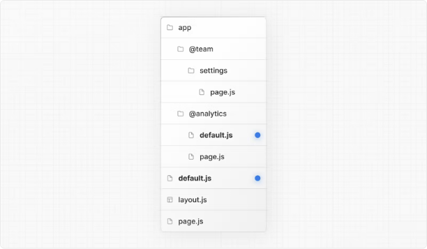

# Nextjs 14 default.js 파일이란

default.js 파일은 Next.js가 전체 페이지 로드 후 슬롯의 활성 상태를 복구하지 못할 때 Parallel Routes 내에서 대체 내용을 렌더링하는 데 사용됩니다.

소프트 네비게이션 중에 Next.js는 각 슬롯의 활성 상태(하위 페이지)를 추적합니다. 그러나 하드 네비게이션(전체 페이지 로드)의 경우, Next.js는 활성 상태를 복구할 수 없습니다. 이 경우 현재 URL과 일치하지 않는 하위 페이지를 위해 default.js 파일을 렌더링할 수 있습니다.

다음 폴더 구조를 참조하십시오. @team 슬롯에는 설정 페이지가 있지만 @analytics에는 없습니다.

<!-- ui-log 수평형 -->

<ins class="adsbygoogle"
      style="display:block"
      data-ad-client="ca-pub-4877378276818686"
      data-ad-slot="9743150776"
      data-ad-format="auto"
      data-full-width-responsive="true"></ins>
<component is="script">
(adsbygoogle = window.adsbygoogle || []).push({});
</component>

/dashboard/settings으로 이동할 때, @team 슬롯은 설정 페이지를 렌더링하면서 @analytics 슬롯의 현재 활성 페이지를 유지합니다.

새로고침 시, Next.js는 @analytics용 default.js를 렌더링합니다. default.js가 없는 경우, 대신 404가 렌더링됩니다.

추가로, children이 암시적 슬롯인 경우에도 Next.js가 부모 페이지의 활성 상태를 복구할 수 없을 때 children을 대체할 default.js 파일을 만들어야 합니다.

<!-- ui-log 수평형 -->

<ins class="adsbygoogle"
      style="display:block"
      data-ad-client="ca-pub-4877378276818686"
      data-ad-slot="9743150776"
      data-ad-format="auto"
      data-full-width-responsive="true"></ins>
<component is="script">
(adsbygoogle = window.adsbygoogle || []).push({});
</component>

## 속성

### params (옵션)

루트 세그먼트에서 슬롯의 하위 페이지까지의 동적 경로 매개변수를 포함하는 객체입니다. 예를 들어:

| Example                                  | URL        | params                            |
| ---------------------------------------- | ---------- | --------------------------------- |
| app/@sidebar/[artist]/default.js         | /zack      | { artist: 'zack' }                |
| app/@sidebar/[artist]/[album]/default.js | /zack/next | { artist: 'zack', album: 'next' } |

<!-- ui-log 수평형 -->

<ins class="adsbygoogle"
      style="display:block"
      data-ad-client="ca-pub-4877378276818686"
      data-ad-slot="9743150776"
      data-ad-format="auto"
      data-full-width-responsive="true"></ins>
<component is="script">
(adsbygoogle = window.adsbygoogle || []).push({});
</component>
