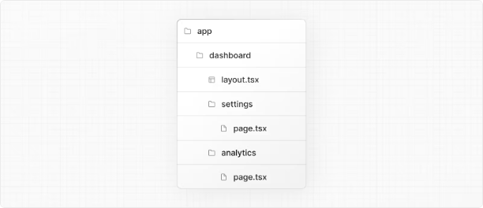

# Nextjs 14 - 레이아웃 공유를 위한 layout.js 정리

레이아웃은 경로 간에 공유되는 UI입니다.

```typescript
export default function DashboardLayout({ children }: { children: React.ReactNode }) {
  return <section>{children}</section>;
}
```

루트 레이아웃은 루트 앱 디렉터리에서 가장 상위에 있는 레이아웃입니다. 이것은 `html` 및 `body` 태그 및 전역적으로 공유되는 다른 UI를 정의하는 데 사용됩니다.

<!-- ui-log 수평형 -->

<ins class="adsbygoogle"
      style="display:block"
      data-ad-client="ca-pub-4877378276818686"
      data-ad-slot="9743150776"
      data-ad-format="auto"
      data-full-width-responsive="true"></ins>
<component is="script">
(adsbygoogle = window.adsbygoogle || []).push({});
</component>

```typescript
export default function RootLayout({ children }: { children: React.ReactNode }) {
  return (
    <html lang="en">
      <body>{children}</body>
    </html>
  );
}
```

## 프롭스

### children (필수)

레이아웃 컴포넌트는 children 프롭을 받아들이고 사용해야 합니다. 렌더링 중에 children은 레이아웃이 감싸는 경로 세그먼트로 채워집니다. 이들은 주로 자식 레이아웃 (있는 경우) 또는 페이지의 컴포넌트일 것입니다만, 해당 시에는 로딩 또는 오류와 같은 다른 특별한 파일인 경우도 있습니다.

<!-- ui-log 수평형 -->

<ins class="adsbygoogle"
      style="display:block"
      data-ad-client="ca-pub-4877378276818686"
      data-ad-slot="9743150776"
      data-ad-format="auto"
      data-full-width-responsive="true"></ins>
<component is="script">
(adsbygoogle = window.adsbygoogle || []).push({});
</component>

### params (optional)

루트 세그먼트에서 레이아웃까지의 동적 경로 매개변수 객체입니다.

| 예시                              | URL            | `params`                  |
| --------------------------------- | -------------- | ------------------------- |
| `app/dashboard/[team]/layout.js`  | `/dashboard/1` | `{ team: '1' }`           |
| `app/shop/[tag]/[item]/layout.js` | `/shop/1/2`    | `{ tag: '1', item: '2' }` |
| `app/blog/[...slug]/layout.js`    | `/blog/1/2`    | `{ slug: ['1', '2'] }`    |

예시:

<!-- ui-log 수평형 -->

<ins class="adsbygoogle"
      style="display:block"
      data-ad-client="ca-pub-4877378276818686"
      data-ad-slot="9743150776"
      data-ad-format="auto"
      data-full-width-responsive="true"></ins>
<component is="script">
(adsbygoogle = window.adsbygoogle || []).push({});
</component>

```typescript
export default function ShopLayout({
  children,
  params,
}: {
  children: React.ReactNode;
  params: {
    tag: string;
    item: string;
  };
}) {
  // URL -> /shop/shoes/nike-air-max-97
  // `params` -> { tag: 'shoes', item: 'nike-air-max-97' }
  return <section>{children}</section>;
}
```

## 유용한 정보

### 레이아웃이 searchParams를 받지 않습니다

페이지와 달리 레이아웃 컴포넌트는 searchParams prop을 받지 않습니다. 이는 공유 레이아웃이 탐색 중에 다시 렌더링되지 않기 때문에 탐색 사이에 갱신되지 않은 searchParams가 발생할 수 있기 때문입니다.```

<!-- ui-log 수평형 -->

<ins class="adsbygoogle"
      style="display:block"
      data-ad-client="ca-pub-4877378276818686"
      data-ad-slot="9743150776"
      data-ad-format="auto"
      data-full-width-responsive="true"></ins>
<component is="script">
(adsbygoogle = window.adsbygoogle || []).push({});
</component>

클라이언트 측 내비게이션을 사용할 때 Next.js는 두 경로 간에 공통 레이아웃 아래의 페이지 부분만 자동으로 렌더링합니다.

예를 들어, 다음 디렉토리 구조에서 dashboard/layout.tsx는 /dashboard/settings와 /dashboard/analytics 모두에 대한 공통 레이아웃입니다:



/dashboard/settings에서 /dashboard/analytics로 이동할 때, /dashboard/analytics의 page.tsx는 서버에서 다시 렌더링되지만, 두 경로 사이에서 공유되는 대시보드/layout.tsx는 다시 렌더링되지 않습니다.

<!-- ui-log 수평형 -->

<ins class="adsbygoogle"
      style="display:block"
      data-ad-client="ca-pub-4877378276818686"
      data-ad-slot="9743150776"
      data-ad-format="auto"
      data-full-width-responsive="true"></ins>
<component is="script">
(adsbygoogle = window.adsbygoogle || []).push({});
</component>

이 성능 최적화를 통해 레이아웃을 공유하는 페이지 간의 탐색이 빨라지며, 페이지의 데이터 가져오기와 렌더링만 실행되므로 자체 데이터를 가져오는 공유 레이아웃을 포함할 수 있는 전체 경로 대신입니다.

대시보드/layout.tsx가 다시 렌더링되지 않기 때문에 레이아웃 서버 컴포넌트의 searchParams 속성은 탐색 후에 낡아질 수 있습니다.

- 대신 클라이언트 컴포넌트에서 Page searchParams 속성이나 최신 searchParams으로 클라이언트에서 다시 렌더링되는 useSearchParams 훅을 사용하세요.

### 루트 레이아웃

<!-- ui-log 수평형 -->

<ins class="adsbygoogle"
      style="display:block"
      data-ad-client="ca-pub-4877378276818686"
      data-ad-slot="9743150776"
      data-ad-format="auto"
      data-full-width-responsive="true"></ins>
<component is="script">
(adsbygoogle = window.adsbygoogle || []).push({});
</component>

- 앱 디렉토리에는 루트 앱/layout.js 파일이 포함되어 있어야 합니다.
- 루트 레이아웃은 `html` 및 `body` 태그를 정의해야 합니다.
  루트 레이아웃에는 수동으로 `head` 태그를 추가해서는 안 됩니다. 대신 Metadata API를 사용해야 합니다. Metadata API는 `head` 요소의 스트리밍 및 중복 처리와 같은 고급 요구 사항을 자동으로 처리합니다.
- 루트 레이아웃에는 수동으로 `head` 태그를 추가해서는 안 됩니다. 대신 Metadata API를 사용해야 합니다. Metadata API는 `head` 요소의 스트리밍 및 중복 처리와 같은 고급 요구 사항을 자동으로 처리합니다.
- 루트 레이아웃을 여러 개 생성하기 위해 route 그룹을 사용할 수 있습니다. 여러 개의 루트 레이아웃 간을 이동하면 전체 페이지 새로 고침이 발생합니다(클라이언트 측 탐색과는 달리). 예를 들어, app/(shop)/layout.js를 사용하는 /cart에서 app/(marketing)/layout.js를 사용하는 /blog로 이동하는 경우 전체 페이지 새로 고침이 발생합니다. 이는 여러 개의 루트 레이아웃에만 해당됩니다.
- 루트 레이아웃을 여러 개 생성하기 위해 route 그룹을 사용할 수 있습니다. 여러 개의 루트 레이아웃 간을 이동하면 전체 페이지 새로 고침이 발생합니다(클라이언트 측 탐색과는 달리). 예를 들어, app/(shop)/layout.js를 사용하는 /cart에서 app/(marketing)/layout.js를 사용하는 /blog로 이동하는 경우 전체 페이지 새로 고침이 발생합니다. 이는 여러 개의 루트 레이아웃에만 해당됩니다.

## 버전 이력

| Version   | Changes            |
| --------- | ------------------ |
| `v13.0.0` | `layout`가 도입됨. |

<!-- ui-log 수평형 -->

<ins class="adsbygoogle"
      style="display:block"
      data-ad-client="ca-pub-4877378276818686"
      data-ad-slot="9743150776"
      data-ad-format="auto"
      data-full-width-responsive="true"></ins>
<component is="script">
(adsbygoogle = window.adsbygoogle || []).push({});
</component>
