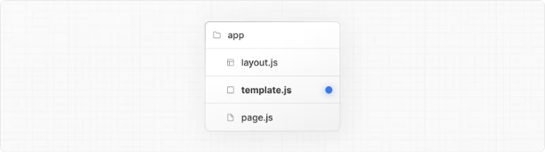

# Nextjs 14 template.js와 layout.js의 차이점

템플릿 파일은 레이아웃과 유사한데, 각 자식 레이아웃이나 페이지를 감싸준다는 점에서 비슷합니다. 레이아웃이 경로를 따라 지속되고 상태를 유지하는 반면, 템플릿은 내비게이션시마다 각 자식에 대해 새로운 인스턴스를 생성합니다.

```typescript
export default function Template({ children }: { children: React.ReactNode }) {
  return <div>{children}</div>;
}
```



<!-- ui-log 수평형 -->

<ins class="adsbygoogle"
      style="display:block"
      data-ad-client="ca-pub-4877378276818686"
      data-ad-slot="9743150776"
      data-ad-format="auto"
      data-full-width-responsive="true"></ins>
<component is="script">
(adsbygoogle = window.adsbygoogle || []).push({});
</component>

덜 일반적이지만, 템플릿을 레이아웃보다 선택할 수 있는 경우가 있습니다. 예를 들어 다음과 같은 기능이 있는 경우에 선택할 수 있습니다:

- useEffect(예: 페이지 뷰 로깅)나 useState(예: 페이지별 피드백 폼)에 의존하는 기능.
- 기본 프레임워크 동작을 변경해야 하는 경우. 예를 들어, 레이아웃 내의 Suspense Boundaries는 레이아웃이 로드될 때만 fallback을 표시하고 페이지를 전환할 때는 표시하지 않습니다. 반면 템플릿의 경우 네비게이션마다 fallback이 표시됩니다.

## Props

### children (필수)

<!-- ui-log 수평형 -->

<ins class="adsbygoogle"
      style="display:block"
      data-ad-client="ca-pub-4877378276818686"
      data-ad-slot="9743150776"
      data-ad-format="auto"
      data-full-width-responsive="true"></ins>
<component is="script">
(adsbygoogle = window.adsbygoogle || []).push({});
</component>

템플릿 컴포넌트는 children 속성을 받아들이고 사용해야 합니다. 템플릿은 레이아웃과 그 자식 요소 사이에 렌더링됩니다. 예를 들어:

```js
<Layout>
  {/* 템플릿에 고유한 키가 제공된다는 점에 유의하세요. */}
  <Template key={routeParam}>{children}</Template>
</Layout>
```

> 알아두면 좋은 사항:
> 기본적으로 템플릿은 서버 컴포넌트이지만 "use client" 지시문을 통해 클라이언트 컴포넌트로도 사용할 수 있습니다.
> 사용자가 템플릿을 공유하는 경로 간을 이동할 때 컴포넌트의 새 인스턴스가 장착되고 DOM 요소가 재생성되며 상태가 보존되지 않고 효과가 다시 동기화됩니다.

## 버전 히스토리

<!-- ui-log 수평형 -->

<ins class="adsbygoogle"
      style="display:block"
      data-ad-client="ca-pub-4877378276818686"
      data-ad-slot="9743150776"
      data-ad-format="auto"
      data-full-width-responsive="true"></ins>
<component is="script">
(adsbygoogle = window.adsbygoogle || []).push({});
</component>

| Version   | Changes                |
| --------- | ---------------------- |
| `v13.0.0` | `template` introduced. |

<!-- ui-log 수평형 -->

<ins class="adsbygoogle"
      style="display:block"
      data-ad-client="ca-pub-4877378276818686"
      data-ad-slot="9743150776"
      data-ad-format="auto"
      data-full-width-responsive="true"></ins>
<component is="script">
(adsbygoogle = window.adsbygoogle || []).push({});
</component>
